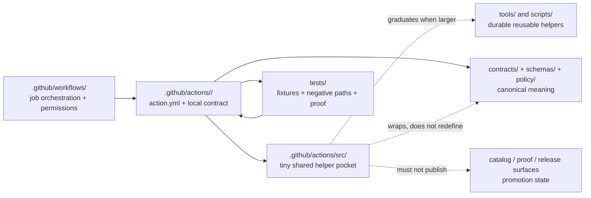

<!-- [KFM_META_BLOCK_V2]
doc_id: kfm://doc/TODO-NEEDS-UUID
title: .github/actions/src
type: standard
version: v1
status: draft
owners: @bartytime4life
created: TODO-VERIFY-CREATED-DATE
updated: 2026-04-27
policy_label: TODO-VERIFY-POLICY-LABEL
related: [../README.md, ../../README.md, ../../workflows/README.md, ../../watchers/README.md, ../../CODEOWNERS, ../../PULL_REQUEST_TEMPLATE.md, ../../../README.md, ../../../contracts/README.md, ../../../schemas/README.md, ../../../policy/README.md, ../../../tests/README.md, ../../../tools/README.md, ../../../scripts/README.md]
tags: [kfm, github, actions, shared-helpers, ci, control-plane]
notes: [Current public-main evidence describes `.github/actions/src/README.md` as placeholder-only. This revision defines the lane boundary for tiny shared local-action helpers. Created date, policy label, active-branch helper inventory, workflow callers, and lane-specific ownership remain NEEDS VERIFICATION.]
[/KFM_META_BLOCK_V2] -->

<a id="top"></a>

# `.github/actions/src`

Tiny shared helper surface for KFM repo-local GitHub Actions, kept subordinate to workflows, action contracts, policy, schemas, tests, tools, and release evidence.


> [!IMPORTANT]
> **Status:** experimental  
> **Owners:** `@bartytime4life` *(inherited from visible `.github/` control-plane ownership; lane-specific ownership still needs active-branch verification)*  
> **Path:** `.github/actions/src/README.md`  
> **Quick jumps:** [Scope](#scope) · [Repo fit](#repo-fit) · [Accepted inputs](#accepted-inputs) · [Exclusions](#exclusions) · [Directory tree](#directory-tree) · [Quickstart](#quickstart) · [Usage](#usage) · [Diagram](#diagram) · [Operating tables](#operating-tables) · [Task list](#task-list--definition-of-done) · [FAQ](#faq) · [Appendix](#appendix)

> [!WARNING]
> This directory is not a hidden second `tools/` tree. Put only tiny, generic, action-adjacent helpers here. If a helper owns policy meaning, schema meaning, release authority, source admission, durable business logic, or broad runtime behavior, it belongs somewhere else.

---

## Scope

`.github/actions/src/` is the **small shared-helper pocket** beneath KFM’s repo-local action seam.

Use it only when a helper is:

- too small and generic to justify a full tool lane;
- shared by more than one repo-local action under `.github/actions/`;
- safe to inspect in a few lines or a small module;
- free of canonical policy, schema, evidence, or release meaning;
- covered by a caller contract, smoke path, or test outside this directory.

Today’s role is narrow: help sibling local actions stay dry without hiding the meaning those actions are supposed to wrap.

[Back to top](#top)

---

## Repo fit

### Position in the control plane

| Direction | Surface | Relationship |
|---|---|---|
| Parent action lane | [`../README.md`](../README.md) | Defines repo-local actions, placeholder graduation rules, and action-level boundaries. |
| Parent gatehouse | [`../../README.md`](../../README.md) | Keeps `.github/` governance, review, and delivery responsibilities visible. |
| Workflow orchestration | [`../../workflows/README.md`](../../workflows/README.md) | Workflows call local actions; this directory must not own job orchestration or permissions. |
| Watcher adjacency | [`../../watchers/README.md`](../../watchers/README.md) | Watcher docs may point toward action or workflow seams, but watcher runtime does not live here. |
| Review ownership | [`../../CODEOWNERS`](../../CODEOWNERS) | Confirms the control-plane review route before changing helper behavior. |
| PR evidence contract | [`../../PULL_REQUEST_TEMPLATE.md`](../../PULL_REQUEST_TEMPLATE.md) | Action helper changes should include truth labels, validation evidence, rollout notes, and rollback notes. |
| Repo root posture | [`../../../README.md`](../../../README.md) | Keeps this lane aligned to KFM’s evidence-first, map-first, time-aware trust model. |
| Durable helpers | [`../../../tools/README.md`](../../../tools/README.md), [`../../../scripts/README.md`](../../../scripts/README.md) | Helpers graduate here when they become reusable outside local-action glue. |
| Canonical authority | [`../../../contracts/README.md`](../../../contracts/README.md), [`../../../schemas/README.md`](../../../schemas/README.md), [`../../../policy/README.md`](../../../policy/README.md) | Actions may validate or invoke these surfaces; `src/` must not redefine them. |
| Proof surfaces | [`../../../tests/README.md`](../../../tests/README.md) | Fixtures, negative paths, and non-regression proof belong in test lanes or action-local fixture lanes. |

### Sibling actions this lane may support

The parent `.github/actions/` surface currently names these action directories in public-main evidence:

- [`../metadata-validate/README.md`](../metadata-validate/README.md)
- [`../metadata-validate-v2/README.md`](../metadata-validate-v2/README.md)
- [`../opa-gate/README.md`](../opa-gate/README.md)
- [`../provenance-guard/README.md`](../provenance-guard/README.md)
- [`../sbom-produce-and-sign/README.md`](../sbom-produce-and-sign/README.md)

`src/` may support them. It does not own them.

[Back to top](#top)

---

## Accepted inputs

Accepted inputs are deliberately small.

| Input | Belongs here when… | Required posture |
|---|---|---|
| Tiny shared helper modules | Two or more sibling local actions need the same small behavior. | **INFERRED / PROPOSED** until active-branch callers are verified. |
| Action-adjacent shell/Python/JS snippets | The helper is only a wrapper around repo-owned truth elsewhere. | Must be dependency-light and readable. |
| Shared formatting helpers | They render small CI annotations, paths, or summaries without deciding policy. | Output shape must be tested somewhere outside this README. |
| Small wrapper templates | They reduce duplicated action boilerplate without hiding action contracts. | Template inputs and outputs must be explicit. |
| README and boundary docs | They clarify where helper code may and may not live. | Keep docs synchronized with caller behavior. |

### Input rules

1. Prefer action-local code unless sharing is real.
2. Prefer `tools/` or `scripts/` when logic is useful outside GitHub Actions.
3. Prefer `contracts/`, `schemas/`, and `policy/` for meaning.
4. Prefer `tests/` or action-local fixture paths for proof.
5. Keep helpers public-safe, deterministic, and fail-closed.
6. Treat live source calls, secrets, signing keys, and publish actions as out of scope.

[Back to top](#top)

---

## Exclusions

| Does **not** belong here | Put it here instead | Why |
|---|---|---|
| Directory-local action contracts | `../<action-name>/action.yml` | Action inputs, outputs, and runs model belong with the action. |
| Workflow YAML, job orchestration, permissions | [`../../workflows/README.md`](../../workflows/README.md) and workflow files | Workflows own job sequencing and permission posture. |
| Policy semantics, allow/deny reasons, obligations | [`../../../policy/README.md`](../../../policy/README.md) | Policy must stay reviewable outside action glue. |
| Canonical schema or contract definitions | [`../../../contracts/README.md`](../../../contracts/README.md), [`../../../schemas/README.md`](../../../schemas/README.md) | Contracts and schemas must not be redefined in helper code. |
| Large or reusable runtime logic | [`../../../tools/README.md`](../../../tools/README.md), [`../../../scripts/README.md`](../../../scripts/README.md) | Durable helpers need ordinary tests, docs, and language-native organization. |
| Fixtures and negative-path proof | [`../../../tests/README.md`](../../../tests/README.md) or action-local fixtures | Proof should be visible and reviewable, not buried in action internals. |
| Secrets, tokens, private keys, signing roots | GitHub environments or external secret management | This directory must never become secret custody. |
| Live source watchers or source admission | watcher, pipeline, or source-registry lanes | Source activation requires rights, cadence, policy, and receipt handling. |
| Direct publication or self-approval logic | governed release and promotion surfaces | KFM promotion is a governed state transition, not a helper shortcut. |
| Canonical evidence archives | governed data, catalog, proof, or release lanes | Helpers may inspect or summarize evidence; they do not become evidence truth. |

[Back to top](#top)

---

## Directory tree

### Current public-main evidence snapshot

```text
.github/actions/src/
└── README.md                  # placeholder-only in the adjacent public-main inventory
```

> [!NOTE]
> The active branch should be rechecked before merge. This README is written to replace placeholder posture with a boundary contract, not to claim helper files already exist.

### Target shape when a helper is justified

```text
.github/actions/src/
├── README.md
└── <small-shared-helper>.*    # only when shared, tiny, tested, and non-sovereign
```

### When the target shape is no longer enough

```text
tools/
└── <durable-helper-lane>/

scripts/
└── <operator-safe-entrypoint>.*

tests/
└── <helper-or-contract-proof>/
```

Use these stronger homes when the helper grows beyond thin action glue.

[Back to top](#top)

---

## Quickstart

Run these checks from the repository root before changing this directory.

```bash
# Confirm the active-branch inventory.
find .github/actions/src -maxdepth 3 -type f | sort

# Detect whether this lane still contains only documentation.
find .github/actions/src -type f ! -name README.md -print

# Find action callers that reference shared helpers.
grep -R "\.github/actions/src" -n \
  .github/actions .github/workflows tools scripts tests 2>/dev/null || true

# Find local actions that may need shared helper support.
find .github/actions -maxdepth 2 -name action.yml -print -exec wc -c {} \;

# Detect placeholder keeper text that should be replaced with real contracts.
grep -R "Placeholder file to keep this directory in version control." \
  .github/actions -n 2>/dev/null || true
```

> [!TIP]
> If the helper has no current caller, keep it out of `src/` until the caller contract is ready. A helper without a caller is usually either premature or belongs in `tools/` as a separately testable utility.

[Back to top](#top)

---

## Usage

### Decision rule

Use this lane only when all three checks pass.

| Check | Pass condition | If it fails |
|---|---|---|
| Shared | At least two sibling local actions need the same tiny helper. | Keep the code action-local. |
| Tiny | A reviewer can understand the helper quickly from source and tests. | Move to `tools/` or `scripts/`. |
| Non-sovereign | The helper wraps truth elsewhere instead of defining truth itself. | Move meaning to `contracts/`, `schemas/`, or `policy/`. |

### Illustrative local-action call pattern

This example is intentionally illustrative. It shows the allowed relationship: a sibling action may call a tiny shared helper, while the action contract remains in the action directory.

```yaml
# .github/actions/metadata-validate/action.yml
# Illustrative only — verify active-branch conventions before using.
name: metadata-validate
description: Validate declared metadata using repo-owned contracts and policy.

inputs:
  subject:
    description: Path to the declared metadata file or directory.
    required: true

runs:
  using: composite
  steps:
    - name: Normalize subject path
      shell: bash
      run: |
        set -euo pipefail
        . .github/actions/src/kfm-paths.sh
        kfm_normalize_path "${{ inputs.subject }}"
```

Allowed: the helper normalizes a path.

Not allowed: the helper decides what metadata means, rewrites schemas, stores policy, approves release, or silently publishes.

[Back to top](#top)

---

## Diagram



[Back to top](#top)

---

## Operating tables

### Responsibility boundaries

| Surface | Owns | Must not own |
|---|---|---|
| `.github/workflows/` | job orchestration, permissions, event triggers, artifact upload choreography | canonical policy or schema meaning |
| `.github/actions/<action>/` | action contract, input/output boundary, repeated step wrapper | durable domain logic or hidden publish authority |
| `.github/actions/src/` | tiny shared helpers for sibling actions | action contracts, policy, schemas, secrets, release decisions |
| `tools/` | reusable helper lanes with ordinary tests and docs | unreviewed release authority |
| `scripts/` | explicit local/operator entrypoints | long-lived services or hidden policy law |
| `contracts/` / `schemas/` | human-readable and machine-readable contract truth | workflow-specific glue |
| `policy/` | allow/deny behavior, reasons, obligations, fail-closed rules | action-local private copies |
| `tests/` | proof, fixtures, negative paths, non-regression coverage | canonical production state |

### Graduation triggers

| Trigger | Move toward | Why |
|---|---|---|
| Helper has one caller only | action-local source | Sharing is not proven. |
| Helper needs fixture suites | `tests/` plus action-local contract | Proof should stay visible. |
| Helper grows beyond thin glue | `tools/` or `scripts/` | Durable logic deserves ordinary review and tests. |
| Helper defines object fields or enums | `contracts/` / `schemas/` | Contract meaning must be canonical. |
| Helper decides allow/deny outcomes | `policy/` | Policy must be visible and testable. |
| Helper touches secrets or signing keys | environment / external secret management | Secret custody does not belong in source helpers. |
| Helper publishes or mutates release state | governed promotion/release lane | Publication is a reviewed state transition. |

[Back to top](#top)

---

## Task list / definition of done

A helper may land in `.github/actions/src/` only when:

- [ ] its current callers are named and linked;
- [ ] the helper is shared by more than one sibling action, or a short-lived exception is documented;
- [ ] the helper has one clear responsibility;
- [ ] no policy semantics are defined here;
- [ ] no schema or contract fields are defined here;
- [ ] no secrets, private keys, or token assumptions are embedded here;
- [ ] no network fetch or live source activation occurs by default;
- [ ] failure mode is loud, deterministic, and fail-closed;
- [ ] action-level inputs and outputs remain in the sibling action `action.yml`;
- [ ] fixtures or tests exist outside this helper file, or the PR explains why the helper is too small to need them yet;
- [ ] callers are updated in docs when behavior changes materially;
- [ ] any reusable growth path to `tools/` or `scripts/` is documented;
- [ ] rollback is simple: remove the helper import and return callers to action-local behavior.

[Back to top](#top)

---

## FAQ

### Why does this directory exist?

To avoid duplicating very small helper code across sibling local actions. It is a convenience seam, not a governance seam.

### Is this a normal source-code directory?

No. Treat it as action-adjacent glue. General source code belongs in normal repo lanes such as `tools/`, `scripts/`, packages, apps, or pipelines after the active repo conventions are verified.

### Can this directory contain tests?

Usually no. Put tests in `tests/`, or in a clearly documented action-local fixture path if the parent action convention supports it. Keep proof visible outside helper internals.

### Can helpers here call policy or schema validators?

Yes, but only as wrappers. The policy and schema meaning must live in `policy/`, `contracts/`, or `schemas/`.

### Can helpers here publish artifacts?

No. Helpers may prepare, inspect, summarize, or validate. Promotion and publication remain governed release transitions.

### What if `metadata-validate/` and `metadata-validate-v2/` both need the same helper?

That is an acceptable temporary use case if the migration reason is documented. The version split itself still needs verification and cleanup discipline.

[Back to top](#top)

---

## Appendix

<details>
<summary>Pre-merge review checklist</summary>

Before merging changes under `.github/actions/src/`, confirm:

- [ ] active branch inventory matches this README;
- [ ] relative links still resolve from `.github/actions/src/README.md`;
- [ ] parent `.github/actions/README.md` is still accurate;
- [ ] sibling action README files mention the helper only where actually used;
- [ ] workflow callers are verified before stronger-than-`PROPOSED` usage claims;
- [ ] `CODEOWNERS` still routes review for `.github/`;
- [ ] PR notes include validation evidence and rollback path;
- [ ] any helper that became durable was moved out of `src/`.

</details>

<details>
<summary>Truth labels used in this README</summary>

| Label | Meaning |
|---|---|
| **CONFIRMED** | Supported by visible repo evidence, adjacent checked-in documentation, or current-session inspection. |
| **INFERRED** | Conservative conclusion from visible structure and KFM doctrine, but not direct implementation proof. |
| **PROPOSED** | Recommended pattern or target behavior not yet proven in the active branch. |
| **UNKNOWN** | Not verifiable from the available evidence. |
| **NEEDS VERIFICATION** | Important enough to check before merge, release, or stronger claim. |

</details>

[Back to top](#top)
