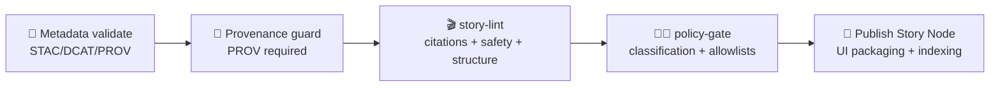

<a id="top"></a>

# 🎬✅ `story-lint` — Story Node Linter & Narrative Governance Gate (KFM)

[](#-what-this-action-does)


> `story-lint` is a **repo-local composite action** that validates **Story Nodes** as governed artifacts:
>
> - 🧾 **Evidence-backed** (citations required for factual claims)
> - 🧭 **Machine-ingestible** (stable IDs, predictable structure)
> - 🛡️ **Safe to publish** (sensitive location precision rules enforced)
> - 🔗 **Traceable** (links to STAC/DCAT/PROV + graph IDs, not vibes)
>
> 🧭 KFM order stays sacred: **ETL → Metadata (STAC/DCAT/PROV) → Graph → API → UI → Story Nodes → Focus Mode**  
> This linter protects the **Story Node stage** from becoming a “hand-wavy narrative lane.” ✅

---

## 🧾 Action metadata

| Field | Value |
|---|---|
| 🧩 Action name | `kfm/story-lint` |
| 🧱 Type | Composite Action |
| 📁 Folder | 📁 `.github/actions/story-lint/` |
| 📄 Action file | 📄 `.github/actions/story-lint/action.yml` *(expected)* |
| 📄 This doc | 📄 `.github/actions/story-lint/README.md` |
| ✅ Status | Active (spec + operating guide) |
| 🗓️ Last updated | **2026-01-10** |
| 🎯 Goal | Keep Story Nodes publishable, auditable, and safe |
| 🔐 Secrets needed | ❌ none (safe for fork PRs) |
| Default posture | 🧯 **Fail-closed** for `published/` |

---

## ⚡ Quick links

| Need | Go |
|---|---|
| 🧩 Actions hub | 📄 [`../README.md`](../README.md) |
| 🤖 Workflows hub | 📄 [`../../workflows/README.md`](../../workflows/README.md) |
| 🤝 Collaboration rules | 📄 [`../../README.md`](../../README.md) |
| 🛡️ Security policy | 📄 [`../../../SECURITY.md`](../../../SECURITY.md) |
| 🧾 Story Node template | 📄 `docs/templates/TEMPLATE__STORY_NODE_V3.md` |
| 🧠 Focus Mode rules | 📄 `/.github/README.md` + `docs/governance/` |
| ✅ Catalog QA | 📄 [`../catalog-qa/README.md`](../catalog-qa/README.md) |
| 🧾 Metadata validation | 📄 [`../metadata-validate/README.md`](../metadata-validate/README.md) |
| 🧬 Provenance enforcement | 📄 [`../provenance-guard/README.md`](../provenance-guard/README.md) |
| 🧑‍⚖️ Policy-as-code | 📄 [`../policy-gate/README.md`](../policy-gate/README.md) |

---

<details>
<summary><strong>📌 Table of contents</strong></summary>

- [🎯 What this action does](#-what-this-action-does)
- [🧭 Where it fits in the KFM pipeline](#-where-it-fits-in-the-kfm-pipeline)
- [📁 What counts as a Story Node](#-what-counts-as-a-story-node)
- [✅ What it checks](#-what-it-checks)
- [⚙️ Inputs](#️-inputs)
- [📤 Outputs](#-outputs)
- [📦 Report artifacts](#-report-artifacts)
- [🧪 Workflow usage](#-workflow-usage)
- [🧰 Local runs](#-local-runs)
- [🧯 Troubleshooting](#-troubleshooting)
- [🔐 Safety notes](#-safety-notes)
- [📚 Reference library](#-reference-library)

</details>

---

## 🎯 What this action does

`story-lint` runs a **fast, deterministic** validation pass over Story Node content.

It enforces:

- 📦 **Folder structure** (docs + web packaging)
- 🧾 **Front-matter shape** (required keys, stable IDs)
- ✅ **Evidence hard-gate** (citations required for facts)
- 🧠 **Fact vs interpretation separation**
- 🧭 **Sensitivity controls** (no exact locations in public stories unless explicitly permitted)
- 🔗 **Link hygiene** (prefer durable IDs over raw URLs)
- 🧩 **Cross-links** to KFM artifacts (STAC/DCAT/PROV IDs, graph IDs)

> [!IMPORTANT]
> This is not “content moderation.”  
> It is **governed publishing validation** so Story Mode remains trustworthy at Kansas scale. 🌾🧭

---

## 🧭 Where it fits in the KFM pipeline

Story Nodes sit near the end of the pipeline, so mistakes cascade into UI + Focus Mode.



Recommended enforcement:
- ✅ `draft/` → warnings allowed (configurable)
- ✅ `published/` → **fail-closed** (no missing citations, no sensitive leaks)

---

## 📁 What counts as a Story Node

KFM supports two related shapes:

### ✅ Governed (reviewable) story node
```text
📁 docs/
└─ 📁 reports/
   └─ 🎬📁 story_nodes/
      ├─ 📝📁 draft/
      │  └─ 🎞️📁 kansas_from_above/
      │     ├─ 📄 STORY_NODE.md
      │     ├─ ⚙️ config.json
      │     └─ 🖼️📁 assets/
      └─ ✅📁 published/
         └─ 🎞️📁 kansas_from_above/
            ├─ 📄 STORY_NODE.md
            ├─ ⚙️ config.json
            └─ 🖼️📁 assets/
```

### 📦 UI package (runtime story node)
```text
📁 web/
└─ 🎬📁 story_nodes/
   └─ 🎞️📁 kansas_from_above/
      ├─ ⚙️ config.json
      ├─ 📄 narrative.md
      └─ 🖼️📁 assets/
```

> [!TIP]
> The governed version (docs) is the **source of truth**.  
> The web package is **derived** / UI-ready.

---

## ✅ What it checks

> Each failure should be emitted with a **stable Rule ID** so CI failures stay searchable.

### 1) 📦 Structure & file hygiene
- `STORY_NODE_MISSING_MD`
- `STORY_NODE_MISSING_CONFIG_JSON`
- `STORY_NODE_UNEXPECTED_FILES` *(optional)*
- `STORY_NODE_ASSETS_TOO_LARGE` *(optional, budgets)*

### 2) 🧾 Front-matter schema & stable IDs
- `FRONT_MATTER_MISSING`
- `FRONT_MATTER_INVALID_YAML`
- `STORY_ID_INVALID` (expected: `story.kansas.<slug>` or your chosen profile)
- `TITLE_MISSING`
- `TIME_RANGE_INVALID`
- `PLACES_INVALID`
- `ENTITIES_INVALID`

### 3) 🧾 Evidence gates (facts must cite)
- `CLAIM_MISSING_EVIDENCE`
- `EVIDENCE_EMPTY`
- `EVIDENCE_UNSUPPORTED_REF`
- `EVIDENCE_NON_DURABLE_LINK` *(warn: raw URLs allowed but discouraged)*

Recommended evidence refs (durable):
- `stac:item: kfm.<...>`
- `stac:collection: kfm.<...>`
- `dcat:dataset: kfm.<...>`
- `prov:run: <run-id>`
- `graph:entity: kfm.entity.<...>`
- `archive: <call-number-or-citation>`

### 4) 🧠 Fact vs interpretation separation
- `FACT_INTERPRETATION_NOT_SEPARATED`
- `INTERPRETATION_MARKUP_MISSING`
- `AI_ASSIST_DISCLOSURE_MISSING` *(if ai_assist.used=true)*

### 5) 🛡️ Sensitive location protection (precision policy)
- `SENSITIVITY_MISSING`
- `PUBLIC_STORY_HAS_PRECISE_COORDS`
- `LOCATION_PRECISION_INVALID`
- `REDACTION_REQUIRED`

Heuristic checks (typical):
- detect decimal-degree coordinate patterns (e.g., `-97.12345, 38.12345`)
- detect “exact address” patterns in public stories *(optional, conservative)*

### 6) 🔗 Link & asset safety
- `LINK_DISALLOWED_SCHEME` (e.g., `file://`)
- `LINK_LOCALHOST` (e.g., `http://localhost`)
- `REMOTE_ASSET_NOT_ALLOWED` *(optional: enforce no remote assets in published)*

> [!IMPORTANT]
> Published Story Nodes should be able to render without pulling arbitrary remote content.

---

## ⚙️ Inputs

> Inputs are strings. Use `"true"` / `"false"`.

| Input | Required | Default | Meaning |
|---|---:|---|---|
| `mode` | ❌ | `pr` | `pr` \| `nightly` \| `promotion` (controls strictness) |
| `story_roots` | ❌ | `docs/reports/story_nodes` | Comma/newline-separated roots to scan |
| `draft_dir` | ❌ | `draft` | Draft folder name |
| `published_dir` | ❌ | `published` | Published folder name |
| `require_citations` | ❌ | `"true"` | Enforce evidence for factual claims |
| `fail_on_warn` | ❌ | `"true"` | Treat warnings as failures (recommended for promotion) |
| `allow_raw_urls` | ❌ | `"true"` | Allow raw URLs as evidence (warn recommended) |
| `disallow_remote_assets_published` | ❌ | `"true"` | Published stories must not reference remote assets |
| `public_precision_default` | ❌ | `county` | Default precision if missing (prefer fail-closed in promotion) |
| `report_dir` | ❌ | `out/story-lint` | Where to write reports |
| `max_files` | ❌ | `2000` | Safety cap |
| `dry_run` | ❌ | `"false"` | Report only; never fails |

> [!TIP]
> Keep PR lane light. Keep promotion lane strict.

---

## 📤 Outputs

| Output | Meaning |
|---|---|
| `ok` | `"true"` if passed (or `dry_run=true`) |
| `error_count` | Integer-like string |
| `warning_count` | Integer-like string |
| `report_json` | Path to JSON report |
| `report_md` | Path to Markdown summary |

---

## 📦 Report artifacts

Recommended output shape:

```text
📁 out/
└─ 🎬📁 story-lint/
   ├─ 🧾 story-lint.json
   ├─ 📄 story-lint.md
   └─ 📁 findings/
      ├─ 🧾 missing-evidence.csv
      ├─ 🛡️ sensitive-location.csv
      ├─ 🔗 link-hygiene.csv
      └─ 🧩 schema-issues.csv
```

Report rules:
- deterministic ordering (diffable)
- no secrets
- avoid printing sensitive coordinates (mask in reports)

---

## 🧪 Workflow usage

### ✅ Suggested PR gate workflow (path-filtered)

```yaml
name: Story Lint

on:
  pull_request:
    paths:
      - "docs/reports/story_nodes/**"
      - "web/story_nodes/**"
      - ".github/actions/story-lint/**"
  workflow_dispatch:

permissions:
  contents: read

jobs:
  story-lint:
    runs-on: ubuntu-latest
    timeout-minutes: 10

    steps:
      - uses: actions/checkout@v4

      - name: 🎬 Story Node lint
        uses: ./.github/actions/story-lint
        with:
          mode: pr
          story_roots: |
            docs/reports/story_nodes
          fail_on_warn: "false"

      - name: 📦 Upload report
        uses: actions/upload-artifact@v4
        if: always()
        with:
          name: story-lint-${{ github.sha }}
          path: out/story-lint/**
```

### 🚀 Promotion lane (strict + fail-closed)

```yaml
- name: 🎬 Story lint (promotion)
  uses: ./.github/actions/story-lint
  with:
    mode: promotion
    story_roots: |
      docs/reports/story_nodes/published
    require_citations: "true"
    disallow_remote_assets_published: "true"
    fail_on_warn: "true"
```

---

## 🧰 Local runs

Recommended pattern: this composite action should wrap a deterministic CLI (CI parity).

Example (spec CLI):

```bash
python3 tools/validation/story_lint/run_story_lint.py \
  --mode promotion \
  --roots docs/reports/story_nodes/published \
  --require-citations \
  --disallow-remote-assets-published \
  --out out/story-lint
```

> If the CLI doesn’t exist yet, this README is the spec for building it. ✅

---

## 🧯 Troubleshooting

### “Missing evidence”
- Confirm you used the Story Node template
- Add `claims:` entries with `evidence:` refs
- Prefer durable IDs (STAC/DCAT/PROV/graph IDs) over raw URLs

### “Public story has precise coords”
- Change `sensitivity.location_precision` to a public-safe granularity:
  - `county`, `region`, `bbox`, `h3_6`, etc.
- Remove exact lat/lon from public narrative text
- If precision is legitimately required, mark the story as non-public and route through governance

### “Fact vs interpretation not separated”
- Ensure factual claims live under `claims:`
- Interpretations should live under `interpretations:` (or clearly labeled sections)

### “Remote assets disallowed”
- Move assets into the story’s local `assets/` folder
- Avoid referencing external media directly for published stories

---

## 🔐 Safety notes

- ✅ Runs with `permissions: contents: read` (no secrets needed)
- ✅ Safe for forks (no deploy/publish behavior)
- 🚫 Must not fetch remote content (treat links as inert)
- 🛡️ Treat story content as potentially sensitive:
  - redact/mask coordinates in logs
  - avoid echoing full sensitive text in CI output

---

## 📚 Reference library

Story-lint is shaped by KFM’s cross-discipline requirements:
- provenance-first publishing
- governance and human-centered accountability
- cartographic / narrative integrity
- modeling discipline (don’t ship “false certainty” stories)

<details>
<summary><strong>📚 Project files that influence story-lint</strong></summary>

### 🧭 Canonical KFM direction
- 📄 `docs/specs/Kansas Frontier Matrix (KFM) – Comprehensive Technical Documentation.docx`
- 📄 `docs/specs/MARKDOWN_GUIDE_v13.md(.gdoc)`
- 📄 `docs/specs/Scientific Method _ Research _ Master Coder Protocol Documentation.pdf`
- 📄 `docs/specs/Latest Ideas.pdf`

### 🎨 Mapping + narrative ethics
- 📄 `docs/library/making-maps-a-visual-guide-to-map-design-for-gis.pdf`
- 📄 `docs/library/Mobile Mapping_ Space, Cartography and the Digital - 9789048535217.pdf`
- 📄 `docs/library/Introduction to Digital Humanism.pdf`

### 🗺️ GIS + data trust
- 📄 `docs/library/python-geospatial-analysis-cookbook.pdf`
- 📄 `docs/library/PostgreSQL Notes for Professionals - PostgreSQLNotesForProfessionals.pdf`

### 🧪 Modeling discipline (why “evidence-first” matters)
- 📄 `docs/library/Understanding Statistics & Experimental Design.pdf`
- 📄 `docs/library/Scientific Modeling and Simulation_ A Comprehensive NASA-Grade Guide.pdf`

</details>

---

<p align="right"><a href="#top">⬆️ Back to top</a></p>

