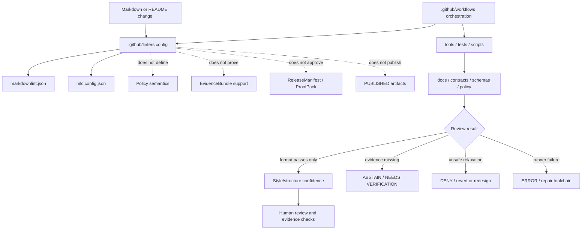

<!-- [KFM_META_BLOCK_V2]
doc_id: kfm://doc/TODO-assign-uuid
title: GitHub Linters Control Surface
type: standard
version: v1
status: draft
owners: @bartytime4life
created: 2026-04-26
updated: 2026-04-26
policy_label: TODO-confirm-public-or-restricted
related: [../README.md, ../workflows/README.md, ../CODEOWNERS, ./markdownlint.json, ./mlc.config.json, ../../README.md]
tags: [kfm, github, linters, markdown, governance]
notes: [doc_id needs document-registry assignment, policy_label needs classification review, owner is current CODEOWNERS fallback not branch-protection proof, workflow enforcement remains NEEDS VERIFICATION]
[/KFM_META_BLOCK_V2] -->

<a id="top"></a>

# GitHub Linters Control Surface

Markdown and documentation-lint configuration for KFM’s GitHub control surface, kept thin, reviewable, and subordinate to evidence, policy, tests, and release state.


**Quick jumps:** [Read first](#read-first) · [Scope](#scope) · [Repo fit](#repo-fit) · [Accepted inputs](#accepted-inputs) · [Exclusions](#exclusions) · [Directory tree](#directory-tree) · [Quickstart](#quickstart) · [Usage](#usage) · [Rule registry](#rule-registry) · [Diagram](#diagram) · [Validation](#validation) · [Definition of done](#definition-of-done) · [FAQ](#faq) · [Appendix](#appendix)

> [!IMPORTANT]
> This directory configures Markdown-facing checks. It does **not** prove documentation truth, CI enforcement, branch protection, policy compliance, publication readiness, or source authority. A passing linter means a file satisfied configured shape rules; it does not mean a KFM claim is supported.

| Field | Value |
| --- | --- |
| Status | `experimental` |
| Document status | `draft` |
| Intended path | `.github/linters/README.md` |
| Owners | `@bartytime4life` via current broad `.github/` CODEOWNERS fallback; branch/ruleset enforcement still `NEEDS VERIFICATION` |
| Current public-main signal | `README.md` target, `markdownlint.json`, and `mlc.config.json`; mounted-checkout parity still `NEEDS VERIFICATION` |
| Primary role | Directory README for GitHub-adjacent documentation-lint configuration |
| Evidence posture | `CONFIRMED` config inventory from public main · `PROPOSED` operating contract · `UNKNOWN` active enforcement and platform settings |
| Boundary | Linters may protect readability, structure, and low-risk hygiene; they must not become KFM doctrine, policy, source truth, schema authority, or release approval |

| This directory may do | This directory must not do |
| --- | --- |
| Hold small linter configuration files used by workflows, local review, or docs checks. | Store canonical schemas, policy semantics, source registries, proof objects, or release artifacts. |
| Explain why KFM allows selected Markdown exceptions. | Treat style compliance as evidence support or publication approval. |
| Help reviewers spot metadata, H1, duplicate-heading, hard-tab, and basic Markdown issues. | Weaken truth labels, cite-or-abstain behavior, fail-closed posture, or the governed lifecycle. |
| Point workflows toward configs. | Embed complex validation logic that belongs in `tools/`, `tests/`, `policy/`, `contracts/`, or `schemas/`. |

[Back to top](#top)

---

## Read first

KFM documentation is not decorative. It is part of the system’s trust posture. This linter directory exists to make documentation easier to review without flattening the difference between:

- **format checks** and evidence support
- **workflow orchestration** and policy authority
- **README shape** and implementation proof
- **Markdown exceptions** and unrestricted style drift

> [!WARNING]
> Do not describe a linter rule as “enforced” unless the active workflow, branch/ruleset settings, tool installation, and failure logs have been verified in the current repository context.

### Truth labels used here

| Label | Meaning in this README |
| --- | --- |
| `CONFIRMED` | Directly supported by current public-main file contents, current checkout evidence, or governing KFM doctrine. |
| `PROPOSED` | A recommended repo-native pattern not yet proven as active enforcement. |
| `UNKNOWN` | Not verified strongly enough to describe as current implementation or platform state. |
| `NEEDS VERIFICATION` | Must be checked against the mounted checkout, workflow logs, tool versions, or GitHub settings before relying on it. |

[Back to top](#top)

---

## Scope

`.github/linters/` is the GitHub-adjacent home for lightweight Markdown and documentation-lint configuration.

Its job is narrow:

1. Keep linter configuration visible at the GitHub control surface.
2. Preserve KFM’s documentation style without turning style rules into doctrine.
3. Explain why selected Markdown exceptions exist.
4. Give maintainers safe commands for inspecting and running lint checks.
5. Keep workflow YAML thin by pointing it to reusable tools and declared config.

### In scope

- Markdown linter configuration.
- Small supplemental Markdown/layout configuration.
- Rule rationale and change guidance.
- Local inspection commands.
- Links to adjacent workflow, tool, docs, tests, policy, schema, and contract surfaces.

### Out of scope

- Canonical KFM doctrine.
- Source authority.
- Policy meaning.
- Machine-readable contract/schema authority.
- Release approval.
- Proof object custody.
- Runtime behavior.
- Public publication decisions.

[Back to top](#top)

---

## Repo fit

**Path:** `.github/linters/README.md`  
**Role in repo:** directory README for GitHub-facing Markdown lint configuration and review guidance.

| Direction | Surface | Fit |
| --- | --- | --- |
| Upstream GitHub control surface | [`../README.md`](../README.md) | Explains `.github/` as contribution, review-routing, and CI orchestration support, not root truth. |
| Workflow adjacency | [`../workflows/README.md`](../workflows/README.md) | Describes GitHub Actions orchestration and the fail-closed workflow posture. |
| Ownership routing | [`../CODEOWNERS`](../CODEOWNERS) | Current broad owner fallback for `.github/` paths. |
| Root orientation | [`../../README.md`](../../README.md) | Defines KFM’s evidence-first, map-first, time-aware, governed posture. |
| Local config | [`./markdownlint.json`](./markdownlint.json) | Markdown rule baseline. |
| Local config | [`./mlc.config.json`](./mlc.config.json) | Supplemental Markdown/layout check baseline. |
| Tooling surface | [`../../tools/README.md`](../../tools/README.md) | Reusable validators and helpers belong in `tools/`, not in linter config. |
| Test surface | [`../../tests/README.md`](../../tests/README.md) | Linter fixtures and negative-path tests belong in tests if the repo has a fixture convention. |
| Policy surface | [`../../policy/README.md`](../../policy/README.md) | Policy meaning belongs in policy files and policy tests, not linter config. |
| Schema/contract surfaces | [`../../schemas/README.md`](../../schemas/README.md), [`../../contracts/README.md`](../../contracts/README.md) | Machine shape and interface meaning belong outside `.github/linters/`. |

> [!NOTE]
> Relative links should be rechecked from a mounted checkout before merge. Public-main evidence can guide this README, but the working branch is the review target.

[Back to top](#top)

---

## Accepted inputs

Use `.github/linters/` for small, declarative files that support documentation review.

| Input | Belongs here when… | Review burden |
| --- | --- | --- |
| Markdown linter config | It controls general Markdown lint behavior for repo docs. | Explain any disabled rule and why the exception is compatible with KFM documentation. |
| Supplemental Markdown/layout config | It checks simple structure expectations such as H1 presence or duplicate headings. | Keep rules understandable and fixture-backed where practical. |
| README for the linter lane | It documents the directory boundary, config inventory, and safe local commands. | Keep implementation claims bounded. |
| Minimal examples | They are tiny, non-sensitive, and only demonstrate linter behavior. | Prefer tests/fixtures if examples become substantive. |
| Rule-change notes | They explain why a rule was added, relaxed, or removed. | Link to affected docs, workflows, and tests where verified. |

Healthy linter configuration should make claims like:

- “This file should have an H1.”
- “Hard tabs are not allowed.”
- “Duplicate heading text should be avoided.”
- “Line length is not the right proxy for KFM readability.”
- “Inline HTML is permitted because KFM docs use meta blocks, callout-compatible markup, and collapsible GitHub sections.”

It should not make claims like:

- “This source is authoritative.”
- “This claim is supported.”
- “This policy allows publication.”
- “This release is approved.”
- “This AI answer is safe.”
- “This workflow is required by branch protection.”

[Back to top](#top)

---

## Exclusions

Do **not** put these in `.github/linters/`.

| Excluded item | Use instead | Why |
| --- | --- | --- |
| Canonical schemas or contract definitions | `../../schemas/` or `../../contracts/` after schema-home authority is verified | Prevents machine-contract drift. |
| Policy semantics, rights rules, or sensitivity decisions | `../../policy/` | Linters can check shape, not admissibility. |
| Reusable lint scripts or validators | `../../tools/` plus `../../tests/` | Keeps executable behavior testable and runnable outside workflow YAML. |
| Raw, work, quarantine, processed, catalog, triplet, or published data | Repo-approved `data/` lifecycle surfaces | Preserves KFM lifecycle boundaries. |
| Receipts, proofs, manifests, review records, release bundles, or correction notices | Repo-approved receipt/proof/release surfaces | Linter configs are not custody surfaces. |
| Secrets, tokens, private endpoints, or credentials | Repository/environment secrets and security docs | Prevents accidental public exposure. |
| Runtime API, UI, MapLibre, model, or vector-index code | `../../apps/`, `../../packages/`, `../../ui/`, or repo-native runtime homes | `.github/linters/` is documentation configuration only. |
| Broad style rewrites without evidence value | Documentation standards or review notes | Avoids style churn that obscures governance changes. |

> [!CAUTION]
> A linter relaxation that makes KFM metadata, headings, relative links, placeholder leakage, or trust-language drift harder to review should be treated as policy-significant until proven otherwise.

[Back to top](#top)

---

## Directory tree

Current expected linter lane shape:

```text
.github/linters/
├── README.md          # this file
├── markdownlint.json  # Markdown rule baseline
└── mlc.config.json    # supplemental Markdown/layout checks
```

### Current config snapshot

| File | Current role | Status |
| --- | --- | --- |
| `markdownlint.json` | Baseline Markdown lint rules. | `CONFIRMED public-main config` / enforcement `NEEDS VERIFICATION` |
| `mlc.config.json` | Supplemental Markdown/layout checks. | `CONFIRMED public-main config` / tool runner `NEEDS VERIFICATION` |
| `README.md` | Directory README. | `draft replacement` |

If this directory gains fixtures, examples, or generated reports, add them deliberately and update this tree in the same PR.

[Back to top](#top)

---

## Quickstart

Run from the repository root.

### 1. Inspect branch and linter inventory

```bash
git status --short
git branch --show-current || true

find .github/linters -maxdepth 2 -type f | sort

sed -n '1,260p' .github/linters/README.md 2>/dev/null || true
cat .github/linters/markdownlint.json 2>/dev/null || true
cat .github/linters/mlc.config.json 2>/dev/null || true
```

### 2. Locate workflow or tool callers

```bash
grep -RInE \
  'markdownlint|mlc\.config|\.github/linters|MD013|MD033|MD041' \
  .github tools tests scripts package.json pyproject.toml Makefile 2>/dev/null || true
```

### 3. Run Markdown lint only when a compatible runner is installed

```bash
if command -v markdownlint-cli2 >/dev/null 2>&1; then
  markdownlint-cli2 --config .github/linters/markdownlint.json "**/*.md"
elif command -v markdownlint >/dev/null 2>&1; then
  markdownlint --config .github/linters/markdownlint.json .
else
  echo "markdownlint runner not found; record as NEEDS VERIFICATION, not as pass/fail."
fi
```

### 4. Recheck KFM trust vocabulary after linter changes

```bash
grep -RInE \
  'KFM_META_BLOCK_V2|EvidenceBundle|EvidenceRef|DecisionEnvelope|ReleaseManifest|CatalogMatrix|run_receipt|ai_receipt|ABSTAIN|DENY|ERROR|ANSWER|RAW|WORK|QUARANTINE|PUBLISHED|cite-or-abstain|trust membrane|NEEDS VERIFICATION|UNKNOWN|PROPOSED|CONFIRMED' \
  README.md docs contracts schemas policy tests tools .github 2>/dev/null || true
```

> [!IMPORTANT]
> These commands inspect local files. They do not prove required status checks, branch protection, Actions permissions, deployment settings, owner enforcement, emitted artifacts, or runtime behavior.

[Back to top](#top)

---

## Usage

### Change pattern

1. **Inspect first.** Confirm the current branch, directory tree, and workflow callers.
2. **State the burden.** Decide whether the rule change affects readability only, metadata review, link stability, truth labels, release-adjacent documentation, or workflow behavior.
3. **Change the smallest surface.** Prefer one config edit plus one README rationale update.
4. **Validate locally.** Run available lint checks and record missing tools as `NEEDS VERIFICATION`.
5. **Check adjacent docs.** Update workflow docs, tests, fixtures, or tool docs only when the change affects them.
6. **Keep rollback simple.** A linter config change should normally roll back by reverting the PR.

### Review routing

| Change type | Review emphasis |
| --- | --- |
| Disable a Markdown rule | Why the disabled rule is incompatible with KFM docs and what guardrail replaces it. |
| Enable a stricter rule | Whether existing docs can pass without style-only churn or broken stable anchors. |
| Add supplemental rule | Whether the rule is clear, testable, and not duplicating policy or schema validation. |
| Change heading behavior | Whether anchors, duplicate headings, H1 expectations, and README conventions remain stable. |
| Change HTML allowance | Whether KFM meta blocks, GitHub callouts, `<details>`, and anchors still render correctly. |
| Change line-length behavior | Whether readability improves without making evidence-rich tables or badges unmaintainable. |
| Wire a workflow to these configs | Whether the workflow has least-privilege permissions, clear failure behavior, and no publication shortcut. |

[Back to top](#top)

---

## Rule registry

### `markdownlint.json`

```json
{ "default": true, "MD013": false, "MD033": false, "MD041": false }
```

| Rule | Setting | KFM rationale | Review note |
| --- | ---: | --- | --- |
| `default` | `true` | Start from the standard Markdown rule set. | Individual exceptions need rationale. |
| `MD013` line length | `false` | KFM docs often include badges, repo-fit rows, evidence labels, and path matrices where hard line length is a poor readability proxy. | Do not use this as permission for walls of text. Keep prose readable. |
| `MD033` inline HTML | `false` | KFM docs use HTML comments for meta blocks and may use anchors or `<details>` for GitHub readability. | Inline HTML should clarify structure, not decorate weak content. |
| `MD041` first line H1 | `false` | KFM Meta Block V2 and review comments may appear before the H1. | Supplemental checks should still require exactly one meaningful H1 where practical. |

### `mlc.config.json`

```json
{
  "no-hard-tabs": true,
  "no-trailing-punctuation-in-headings": false,
  "require-h1": true,
  "allow-duplicate-heading-text": false
}
```

| Rule | Setting | KFM rationale | Review note |
| --- | ---: | --- | --- |
| `no-hard-tabs` | `true` | Keeps Markdown predictable across GitHub rendering, diffs, and generated docs. | Tabs inside code examples may need separate tool behavior if applicable. |
| `no-trailing-punctuation-in-headings` | `false` | Some KFM headings may need question marks or punctuation for review prompts and FAQ entries. | Avoid noisy punctuation; use it only when useful. |
| `require-h1` | `true` | README-like docs need a clear title and one primary landing anchor. | Pair with manual review for one-H1 discipline. |
| `allow-duplicate-heading-text` | `false` | Duplicate headings create ambiguous anchors and weaker navigation. | Prefer specific headings such as `Validation matrix` instead of repeated `Status`. |

> [!TIP]
> A rule registry is not a loophole registry. Every exception should make the documentation more faithful, navigable, or reviewable.

[Back to top](#top)

---

## Diagram



[Back to top](#top)

---

## Validation

### What lint can support

| Check | What it can support | What it cannot prove |
| --- | --- | --- |
| H1 required | A doc has a visible primary title. | The title is correct or the doc is authoritative. |
| Duplicate headings blocked | Anchors are less ambiguous. | Links are valid or stable after a rewrite. |
| Hard tabs blocked | Diffs and rendering are cleaner. | The content is accurate. |
| Inline HTML allowed | KFM meta blocks and GitHub-native affordances can render. | HTML is semantically useful or accessible. |
| Line length relaxed | Evidence-rich docs can remain practical. | Long paragraphs are readable. |
| Workflow caller exists | A config may be used by automation. | The check is required, branch-protected, or passing in production. |

### Validation matrix for stronger claims

| Claim | Evidence needed before saying it |
| --- | --- |
| “Docs lint is active.” | Current workflow YAML, successful workflow run, tool install path, and branch/ruleset relationship. |
| “Docs lint is required.” | GitHub branch protection or ruleset evidence showing the status check requirement. |
| “This config is used by CI.” | Workflow or tool invocation that points to this config. |
| “This config blocks bad docs.” | Negative fixtures or failing examples plus workflow/tool logs. |
| “Metadata is validated.” | A meta-block validator, fixtures, and workflow/tool evidence. |
| “Links are validated.” | Link-check tool configuration, logs, and known exception handling. |

[Back to top](#top)

---

## Definition of done

A `.github/linters/` change is ready for review when all applicable checks are true:

- [ ] The change belongs in `.github/linters/` rather than `tools/`, `tests/`, `policy/`, `contracts/`, `schemas/`, `docs/`, or workflow YAML.
- [ ] The rule change has a short rationale in this README or a linked review note.
- [ ] The linter inventory in [Directory tree](#directory-tree) matches the current checkout.
- [ ] Relative links from this README have been checked from `.github/linters/`.
- [ ] The change does not weaken KFM Meta Block V2 visibility, one-H1 discipline, truth labels, or reviewability.
- [ ] Any disabled or relaxed rule has a compensating review expectation.
- [ ] Any stricter rule has been checked against existing docs to avoid broad style-only churn.
- [ ] Workflow enforcement claims are backed by workflow and platform evidence or labeled `NEEDS VERIFICATION`.
- [ ] No secrets, private endpoints, restricted source information, sensitive geometry, or unpublished lifecycle payloads are introduced.
- [ ] Rollback is clear: revert the config and README changes, then re-run the relevant checks.

[Back to top](#top)

---

## FAQ

### Does lint passing mean a KFM claim is supported?

No. Lint passing means the file satisfied configured Markdown checks. KFM claims still need evidence, source role, policy posture, review state, release state, and correction lineage where applicable.

### Why is `MD041` disabled if README docs still need an H1?

KFM docs may begin with `KFM_META_BLOCK_V2`, HTML comments, or review metadata before the visible title. The supplemental config still requires an H1.

### Why allow inline HTML?

KFM uses HTML comments for metadata and may use GitHub-friendly anchors or collapsible sections. Inline HTML should remain purposeful and reviewable.

### Should workflow YAML contain lint logic?

Only thin orchestration. Reusable lint logic belongs in tools and tests where it can run locally, be fixture-tested, and be reviewed outside workflow glue.

### Can this README claim branch protection or required checks?

No. Branch protection, required status checks, repository permissions, Actions settings, secret configuration, and environment approvals require platform evidence.

[Back to top](#top)

---

## Appendix

<details>
<summary>Safe rule-change review prompts</summary>

Use these prompts before changing linter behavior:

1. What problem does the current rule create for KFM documentation?
2. Is the problem readability, metadata placement, GitHub rendering, stable anchors, or evidence review?
3. Does changing the rule make unsupported claims easier to hide?
4. Does the change affect README-like docs, standard docs, generated reports, or machine-readable examples?
5. Does the change require fixtures or a negative test?
6. Does the docs-lint workflow actually call this config?
7. Could the same result be achieved by better document structure instead of a relaxed rule?
8. What is the rollback path?

</details>

<details>
<summary>Suggested mounted-checkout verification backlog</summary>

| Item | Why it matters | Status |
| --- | --- | ---: |
| Assign stable `doc_id` | Enables durable registry lookup. | `NEEDS VERIFICATION` |
| Confirm policy label | Public GitHub visibility is not the same as KFM policy classification. | `NEEDS VERIFICATION` |
| Confirm active linter runner | Config files are not enforcement by themselves. | `NEEDS VERIFICATION` |
| Confirm docs-lint workflow wiring | The public docs-lint workflow may be scaffold-only. | `NEEDS VERIFICATION` |
| Confirm required-check status | Required checks are platform settings, not README claims. | `NEEDS VERIFICATION` |
| Add negative fixtures if missing | Proves that lint rules fail bad examples. | `PROPOSED` |
| Confirm link checker behavior | Relative links and generated anchors need direct validation. | `NEEDS VERIFICATION` |
| Confirm placeholder leakage reporting | KFM docs intentionally use placeholders, but release-facing docs should not leak unresolved TODOs silently. | `NEEDS VERIFICATION` |

</details>

<details>
<summary>Minimal branch verification commands</summary>

```bash
git status --short
git branch --show-current || true

find .github -maxdepth 3 -type f | sort
find .github/linters -maxdepth 2 -type f | sort
find .github/workflows -maxdepth 1 -type f \( -name '*.yml' -o -name '*.yaml' \) -print | sort

sed -n '1,220p' .github/README.md 2>/dev/null || true
sed -n '1,220p' .github/workflows/README.md 2>/dev/null || true
sed -n '1,180p' .github/CODEOWNERS 2>/dev/null || true

cat .github/linters/markdownlint.json 2>/dev/null || true
cat .github/linters/mlc.config.json 2>/dev/null || true
```

</details>

[Back to top](#top)
