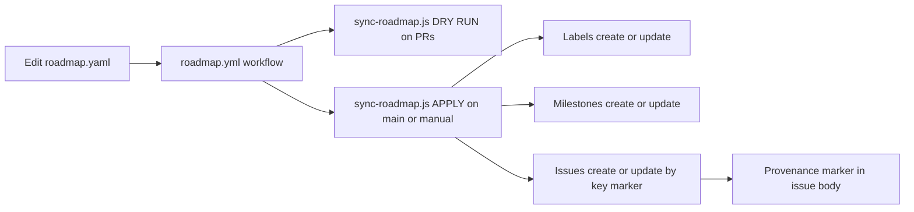

---

# 📍 Roadmap → GitHub Sync

This folder is the **single source of truth** for the project roadmap and the automation that syncs it to **GitHub labels, milestones, and issues**.

* `roadmap.yaml` — declarative roadmap (human-edited)
* Workflow **[`.github/workflows/roadmap.yml`](../workflows/roadmap.yml)** reads `roadmap.yaml` and calls
  **[`scripts/sync-roadmap.js`](../../scripts/sync-roadmap.js)** to apply changes.

> 🔒 **Pull requests** run in **DRY RUN** (no writes).
> 🚀 **Pushes to `main`** and **manual dispatch** (unless `dry_run=true`) **apply changes**.

---

## How it flows



<!-- END OF MERMAID -->

**Idempotent by design.** Each synced issue carries a hidden marker so re-runs safely update instead of duplicating:

```html
<!-- roadmap:key=<your-stable-key> -->
```

---

## Minimal, practical `roadmap.yaml`

```yaml
version: 1

labels:
  - name: area:web
    color: 1f6feb
    description: Web viewer and UI
  - name: area:data
    color: 0e8a16
    description: Data pipelines and STAC
  - name: type:feature
    color: fbca04
  - name: type:chore
    color: a7a7a7
  - name: priority:p1
    color: d73a4a
  - name: status:planned
    color: 8a2be2
  - name: status:doing
    color: 5319e7
  - name: status:done
    color: 0e8a16

milestones:
  - key: m25q4
    title: "2025 Q4"
    due_on: 2025-12-31
    state: open

epics:
  - key: epic-web-v1
    title: "Web Viewer v1"
    milestone: m25q4
    labels: [area:web, type:feature, priority:p1, status:planned]
    body: |
      Goals:
      - Time slider across layers
      - Schema-validated configs
      - Pages deploy CI

    issues:
      - key: web-config-schema
        title: "Schema: app.config.json and layers.json"
        labels: [area:web, type:chore, status:doing]
        assignees: [bartytime4life]
        body: |
          Validate app and layers configs against JSON Schema in CI.
          <!-- roadmap:key=web-config-schema -->

      - key: web-pages-deploy
        title: "Pages: Build and Deploy workflow"
        labels: [area:web, type:feature, status:planned]
        body: |
          Build _site and deploy via actions/deploy-pages@v4.
          <!-- roadmap:key=web-pages-deploy -->

issues:
  - key: stac-validate-ci
    title: "STAC validation workflow"
    milestone: m25q4
    labels: [area:data, type:chore, status:planned]
    body: |
      Validate catalog, collections, items with pystac and JSON sanity checks.
      <!-- roadmap:key=stac-validate-ci -->
```

---

## Strong suggestions (taxonomy & keys)

**Labels**

* `area:*` — domain (`area:web`, `area:data`, `area:ci`, `area:docs`)
* `type:*` — change class (`type:feature`, `type:bug`, `type:chore`, `type:refactor`)
* `priority:p{1..3}` — `p1` highest
* `status:*` — `planned`, `doing`, `blocked`, `done`
* Optional: `needs:review`, `good first issue`, `risk:*`

**Milestones**

* Timeboxed (`YYYY Q#`) or release-named (`vX.Y`).
* Use a stable `key` (e.g., `m25q4`) so renames don’t break sync.

**Keys**

* Treat `key` as immutable IDs. If you change it, the sync will create a **new** issue.

---

## Run it

### In CI (recommended)

Workflow **[`.github/workflows/roadmap.yml`](../workflows/roadmap.yml)**:

* **PRs** → DRY RUN, summary in logs.
* **Push to `main`** → apply changes.
* **Manual dispatch** → choose `dry_run: true|false`.

### Locally (advanced)

```bash
# from repo root
export GITHUB_TOKEN=ghp_xxx   # token with 'repo' scope
npm ci
DRY_RUN=true  node scripts/sync-roadmap.js    # simulate (no writes)
DRY_RUN=false node scripts/sync-roadmap.js    # apply (writes)
```

> In CI, `DRY_RUN` is set by the workflow based on event type.

---

## Validation & guardrails

1. **YAML sanity**

```bash
yamllint .github/roadmap/roadmap.yaml
```

2. **Schema check (optional but recommended)**
   Create `.github/roadmap/schema.json` (see starter below) and validate in CI:

```bash
python -m jsonschema -i .github/roadmap/roadmap.yaml .github/roadmap/schema.json
```

**Starter schema** (kept intentionally lightweight):

```json
{
  "$schema": "https://json-schema.org/draft/2020-12/schema",
  "type": "object",
  "required": ["version"],
  "properties": {
    "version": { "type": "integer", "minimum": 1 },
    "labels": {
      "type": "array",
      "items": {
        "type": "object",
        "required": ["name", "color"],
        "properties": {
          "name": { "type": "string", "minLength": 1 },
          "color": { "type": "string", "pattern": "^[0-9a-fA-F]{6}$" },
          "description": { "type": "string" }
        },
        "additionalProperties": false
      }
    },
    "milestones": {
      "type": "array",
      "items": {
        "type": "object",
        "required": ["key", "title"],
        "properties": {
          "key": { "type": "string", "minLength": 1 },
          "title": { "type": "string", "minLength": 1 },
          "due_on": { "type": "string", "format": "date" },
          "state": { "type": "string", "enum": ["open", "closed"] }
        },
        "additionalProperties": false
      }
    },
    "epics": { "type": "array" },
    "issues": { "type": "array" }
  },
  "additionalProperties": true
}
```

---

## Troubleshooting

* **Duplicate issues created**
  The old issue likely lacks the key marker. Add
  `<!-- roadmap:key=the-same-key -->` to its body and re-run, or close the duplicate.

* **Label color rejected**
  Must be 6-digit hex (no `#`). Example: `1f6feb`.

* **Assignee fails**
  Username must have access to the repo.

* **Dry run surprised you**
  On PRs, writes are always off. Push to `main` or run the workflow manually with `dry_run=false`.

---

## Security & provenance

* The workflow runs with **least-privilege** permissions (labels, issues, milestones only).
* **No writes on PRs** (fork safety).
* The sync adds a **provenance marker** to issue bodies; changes are fully auditable in git + workflow run logs.

---

## Folder map

```
.github/roadmap/
├── README.md                # (this file)
├── roadmap.yaml             # source of truth (edit me)
└── schema.json              # optional, for CI validation
```

---

## Changelog (for this folder)

* **2025-09-30**: Rebuilt README with flow diagram, schema starter, and stricter guardrails.
* **2025-09-28**: Clarified local run instructions and label alignment.
* **2025-09-23**: Initial roadmap sync docs.

---

Questions or improvements? Open an issue with `[roadmap]` in the title and link the workflow run URL.
