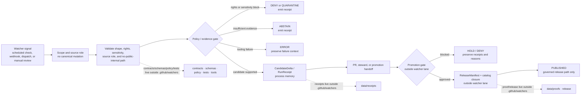

<!-- [KFM_META_BLOCK_V2]
doc_id: kfm://doc/TODO-watchers-readme-uuid
title: .github/watchers
type: standard
version: v1
status: draft
owners: NEEDS_VERIFICATION
created: NEEDS_VERIFICATION
updated: 2026-05-06
policy_label: NEEDS_VERIFICATION
related:
  - ../README.md
  - ../workflows/README.md
  - ../actions/README.md
  - ../CODEOWNERS
  - ../PULL_REQUEST_TEMPLATE.md
  - ../../README.md
  - ../../contracts/README.md
  - ../../schemas/README.md
  - ../../policy/README.md
  - ../../tests/README.md
  - ../../tools/validators/README.md
  - ../../data/receipts/README.md
  - ../../data/proofs/README.md
  - ../../release/README.md
tags: [kfm, github, watchers, automation, receipts, governance, review, source-intake]
notes:
  - "This revision is repo-evidence-aware for .github/watchers/README.md."
  - "The README path is confirmed on main; watcher runtime behavior, workflow callers, emitted receipts, proof packs, platform settings, and owner routing remain NEEDS_VERIFICATION."
  - "CODEOWNERS and PULL_REQUEST_TEMPLATE were present but empty in the inspected main-branch files; reviewer ownership and PR evidence prompts remain unresolved."
[/KFM_META_BLOCK_V2] -->

<a id="top"></a>

# `.github/watchers`

Documentation-only gatehouse lane for watcher proposals, source-change signals, and governed handoff expectations in KFM.

> [!NOTE]
> **Status:** `active` path / `draft` document  
> **Owners:** `NEEDS_VERIFICATION`  
> **Authority:** `CONFIRMED` README path / `PROPOSED` watcher doctrine / `UNKNOWN` runtime behavior  
> **Repo fit:** `.github/watchers/README.md` inside the `.github/` gatehouse root  
> **Review burden:** watcher language can affect source intake, automation expectations, receipts, proof handoff, publication safety, and release review. Verify workflow callers, platform settings, source registries, policy gates, tests, receipts, proof packs, and rollback paths before claiming implementation.


**Quick jumps:** [Scope](#scope) · [Repo fit](#repo-fit) · [Accepted inputs](#accepted-inputs) · [Exclusions](#exclusions) · [Evidence boundary](#evidence-boundary) · [Directory tree](#directory-tree) · [Watcher operating model](#watcher-operating-model) · [Quickstart](#quickstart) · [Usage](#usage) · [Diagram](#diagram) · [Review tables](#review-tables) · [Definition of done](#definition-of-done) · [Rollback](#rollback) · [FAQ](#faq) · [Appendix](#appendix)

> [!IMPORTANT]
> A watcher may observe, summarize, validate, and hand off a signal. A watcher must not decide truth, write canonical records, bypass policy, approve review, publish artifacts, or make uncited public claims.

---

## Scope

`.github/watchers/` documents KFM watcher boundaries.

A **watcher** is any scheduled, event-driven, webhook-driven, repository-dispatch, or manually triggered process that notices a possible change and prepares a governed handoff. Watchers are useful only when they remain small, deterministic, auditable, and subordinate to KFM’s evidence, policy, review, release, correction, and rollback rules.

This README has five jobs:

1. keep watcher language documentation-only unless implementation evidence proves otherwise;
2. make watcher handoff expectations reviewable before runtime code or workflow YAML depends on them;
3. prevent `.github/watchers/` from becoming a hidden source, schema, policy, receipt, proof, release, or runtime home;
4. help reviewers distinguish **signal detected** from **evidence resolved**, **candidate emitted**, **policy passed**, **release approved**, and **published**;
5. preserve finite negative outcomes instead of smoothing uncertainty into a plausible automation story.

### Current posture

| Claim | Status | Safe reading |
| --- | ---: | --- |
| `.github/watchers/README.md` exists on `main` | `CONFIRMED` | This document is the watcher lane entrypoint. |
| Watcher runtime code exists | `UNKNOWN` | No runtime watcher implementation is claimed by this README. |
| A workflow calls a watcher | `NEEDS_VERIFICATION` | Inspect workflow YAML and platform settings before claiming automation. |
| Watcher receipts are emitted | `UNKNOWN` | Receipts must be verified under governed receipt surfaces. |
| Watcher outputs can publish | `DENY` by default | Publication requires a separate governed promotion path. |
| Owners are configured | `NEEDS_VERIFICATION` | The inspected CODEOWNERS file did not establish owner routing. |

[Back to top](#top)

---

## Repo fit

`watchers/` is a child lane of `.github/`, the repository gatehouse. It is adjacent to workflow and action documentation, but it should not contain workflow YAML or action implementations.

| Relation | Path | Role | Current posture |
| --- | --- | --- | --- |
| This document | `./README.md` | watcher boundary, proposal, and handoff guide | `CONFIRMED` path |
| Parent gatehouse | [`../README.md`](../README.md) | `.github/` governance, review, workflow, action, security, and automation boundaries | `CONFIRMED` file |
| Workflow lane | [`../workflows/README.md`](../workflows/README.md) | GitHub Actions orchestration guide and observed workflow inventory | `CONFIRMED` file |
| Local action lane | [`../actions/README.md`](../actions/README.md) | repo-local action wrapper guidance | `CONFIRMED` file |
| Ownership routing | [`../CODEOWNERS`](../CODEOWNERS) | reviewer routing | present but ownership `NEEDS_VERIFICATION` |
| PR evidence prompts | [`../PULL_REQUEST_TEMPLATE.md`](../PULL_REQUEST_TEMPLATE.md) | contributor evidence and review checklist | present but content `NEEDS_VERIFICATION` |
| Root orientation | [`../../README.md`](../../README.md) | KFM identity, trust law, responsibility roots, and public posture | `CONFIRMED` file |
| Contract meaning | [`../../contracts/README.md`](../../contracts/README.md) | semantic object definitions and contract boundaries | `CONFIRMED` file |
| Machine shape | [`../../schemas/README.md`](../../schemas/README.md) | schema boundary and machine-contract shape | `CONFIRMED` file |
| Policy decisions | [`../../policy/README.md`](../../policy/README.md) | deny-by-default and release/runtime admissibility | `CONFIRMED` file |
| Validators | [`../../tools/validators/README.md`](../../tools/validators/README.md) | fail-closed checks and validator handoff | `CONFIRMED` file |
| Process memory | [`../../data/receipts/README.md`](../../data/receipts/README.md) | receipt-shaped audit and replay records | `CONFIRMED` file |
| Proof spine | [`../../data/proofs/README.md`](../../data/proofs/README.md) | proof objects and release-grade trust evidence | `CONFIRMED` file |
| Release coordination | [`../../release/README.md`](../../release/README.md) | release candidates, promotion decisions, rollback, and correction handoff | `CONFIRMED` file |

### Directory Rules basis

`.github/` belongs at repo root because it carries repo-wide governance and validation responsibility. A watcher lane belongs here only as GitHub-adjacent automation documentation and handoff guidance. Domain watcher details still belong under the proper responsibility roots: source registries, pipeline specs, policy, tests, receipts, proofs, and release surfaces.

[Back to top](#top)

---

## Accepted inputs

Use `.github/watchers/` for reviewer-facing watcher documentation only.

| Accepted material | Required posture |
| --- | --- |
| watcher doctrine notes | Preserve emit-only, review-first, fail-closed behavior. |
| watcher proposal checklists | Name source scope, trigger, owner surface, expected receipt, policy gate, tests, and rollback. |
| watcher inventory notes | Clearly date the checkout or platform evidence used. |
| signal taxonomy notes | Mark categories `PROPOSED` unless actual watcher code or workflow evidence exists. |
| handoff diagrams | Show candidate and receipt handoff without implying publication. |
| review rubrics | Keep contracts, schemas, policy, validators, receipts, proofs, release, and runtime distinct. |
| links to workflow/action callers | Link only checked-in files or mark as `NEEDS_VERIFICATION`. |
| failure-mode notes | Preserve `ABSTAIN`, `DENY`, `ERROR`, `QUARANTINE`, and `HOLD` as first-class states. |

[Back to top](#top)

---

## Exclusions

Keep these responsibilities out of `.github/watchers/`.

| Keep out | Why | Correct home |
| --- | --- | --- |
| workflow YAML | workflows orchestrate CI and platform triggers | [`../workflows/`](../workflows/) |
| repo-local action implementations | actions are executable wrappers | [`../actions/`](../actions/) |
| source adapters or runtime watcher code | runtime code needs source, rights, and test ownership | `connectors/`, `pipelines/`, `packages/`, or verified runtime roots |
| canonical `SourceDescriptor` records | source authority must stay in governed registries | `data/registry/` or verified registry home |
| contract definitions | object meaning belongs outside `.github` | [`../../contracts/`](../../contracts/) |
| JSON Schemas | machine validation belongs outside `.github` | [`../../schemas/`](../../schemas/) |
| policy bundles or deny rules | policy law must be executable and reviewable | [`../../policy/`](../../policy/) |
| validator implementation | watchers may call validators; they do not own them | [`../../tools/validators/`](../../tools/validators/) |
| test fixtures and regression tests | verification must stay in test roots | `fixtures/` and `tests/` |
| receipts and validation reports | process memory is an emitted artifact surface | [`../../data/receipts/`](../../data/receipts/) |
| proof packs and attestations | proof objects are release-grade trust surfaces | [`../../data/proofs/`](../../data/proofs/) |
| release manifests and rollback cards | publication is a governed state transition | [`../../release/`](../../release/) |
| secrets, tokens, webhook secrets, keys | secrets must never be committed here | GitHub secrets, environments, OIDC, or approved secret management |
| direct model output | generated language is not proof | governed API/runtime envelopes and released EvidenceBundles |

> [!CAUTION]
> Do not create a parallel watcher-specific schema, policy, receipt, proof, release, or source registry home in this directory.

[Back to top](#top)

---

## Evidence boundary

This README documents a lane contract. It does not prove watcher runtime behavior.

| Claim type | Evidence required before using the claim |
| --- | --- |
| “the watcher README exists” | current checkout or connector fetch of `.github/watchers/README.md` |
| “a watcher workflow exists” | checked-in workflow YAML or verified GitHub platform evidence |
| “a watcher action runs” | workflow caller, action implementation, and run logs |
| “a watcher watches a source” | source descriptor, trigger definition, source rights review, and runtime owner surface |
| “a watcher emitted a receipt” | receipt artifact under governed receipt storage |
| “a watcher created a candidate delta” | candidate record plus validation and policy handoff |
| “a watcher passed policy” | `PolicyDecision`, `DecisionEnvelope`, or validator report |
| “a watcher created proof” | proof pack or attestation under proof storage |
| “a watcher published” | `PromotionDecision`, `ReleaseManifest`, catalog closure, public artifact ref, and rollback target |
| “a watcher denied publication” | finite negative outcome with reason code and preserved audit trail |

### Observed adjacent workflow posture

The inspected workflow lane includes `baseline.yml`, `promote-and-reconcile.yml`, and `synthetic-release-dry-run.yml`. The watcher README should remain consistent with that lane’s current posture: workflows may validate, run dry-runs, upload receipts, and refuse publication, but they do not make release state true by themselves.

| Workflow-adjacent signal | Watcher implication |
| --- | --- |
| baseline validation checks are broad and trust-spine-oriented | watcher docs should require validators and source-ledger checks before runtime claims |
| promotion/reconciliation is dry-run and receipt-aware | watcher handoff should not skip promotion review |
| synthetic release dry-run reports publication refusal | watcher signals should default to “not published” until governed release approves |
| workflow YAML uses least-privilege `contents: read` | watcher workflows should start with read-only permissions unless a reviewed need exists |
| CODEOWNERS and PR template content require verification | watcher ownership and PR evidence prompts remain unresolved |

[Back to top](#top)

---

## Directory tree

### Confirmed minimum

```text
.github/
└── watchers/
    └── README.md
```

### Documentation-only additions that may be useful later

These are `PROPOSED` and should not be added unless they remain documentation-only and reviewers confirm the need.

```text
.github/
└── watchers/
    ├── README.md
    ├── proposal-checklist.md        # PROPOSED docs-only checklist
    ├── inventory-template.md        # PROPOSED docs-only current-branch inventory template
    └── failure-modes.md             # PROPOSED docs-only finite-outcome guide
```

### Verification command

Run from repository root:

```bash
find .github/watchers -maxdepth 3 -type f | sort
```

> [!WARNING]
> If this directory ever contains executable code, workflow YAML, source payloads, receipts, proofs, release manifests, or secrets, stop and re-evaluate placement against Directory Rules and `.github/` gatehouse boundaries.

[Back to top](#top)

---

## Watcher operating model

A KFM watcher should be designed as an **observe → classify → validate → emit → review** path.

It should not be designed as an **observe → mutate → publish** path.

| Step | Watcher responsibility | Must not do |
| --- | --- | --- |
| observe | detect source freshness, metadata drift, repository drift, or scheduled check result | claim source truth from a signal alone |
| classify | name source family, scope, source role, and risk class | infer rights, sensitivity, or release state |
| validate | run schema, source, policy-adjacent, and no-public-internal-path checks | silently continue when checks fail |
| emit | create or link a receipt, validation report, or candidate delta | store raw payloads or proof packs in `.github/watchers/` |
| review | hand off to PR, steward, policy, or promotion review | self-approve release |
| promote | outside watcher lane only | treat watcher success as publication |

### Proposed watcher signal classes

| Signal class | Example signal | Expected handoff |
| --- | --- | --- |
| source freshness | upstream metadata changed | source probe receipt or source refresh candidate |
| source rights drift | source terms, attribution, or access posture changed | policy/steward review candidate |
| schema drift | watcher output no longer matches schema | validation report and blocked candidate |
| repository drift | workflow, contract, schema, policy, or release surface changed | PR review note or dependency-register check |
| catalog drift | catalog refs no longer match release inventory | catalog validator report |
| receipt/proof drift | generated receipt or proof differs from tracked state | fail-closed reconciliation report |
| runtime trust drift | public response lacks finite outcome or citation support | runtime validator denial |
| publication drift | published alias diverges from release manifest | promotion/reconciliation hold |

All signal classes above are design guidance until a checked-in watcher implementation proves them.

[Back to top](#top)

---

## Quickstart

Run these checks from the repository root before editing watcher documentation or making watcher implementation claims.

```bash
# Confirm checkout context.
git status --short
git branch --show-current || true
git rev-parse --show-toplevel || true

# Inspect this lane.
find .github/watchers -maxdepth 3 -type f | sort
sed -n '1,280p' .github/watchers/README.md

# Inspect neighboring GitHub gatehouse surfaces.
sed -n '1,260p' .github/README.md 2>/dev/null || true
sed -n '1,260p' .github/workflows/README.md 2>/dev/null || true
sed -n '1,260p' .github/actions/README.md 2>/dev/null || true
sed -n '1,220p' .github/CODEOWNERS 2>/dev/null || true
sed -n '1,260p' .github/PULL_REQUEST_TEMPLATE.md 2>/dev/null || true

# Search for watcher callers and references.
grep -RInE 'watcher|watchers|SourceRefresh|SourceRefreshRecord|CandidateDelta|RunReceipt|probe receipt|source probe' \
  .github workflows tools scripts connectors pipelines pipeline_specs packages tests data release contracts schemas policy docs \
  2>/dev/null || true

# Inspect downstream trust surfaces before making runtime claims.
find contracts schemas policy tests fixtures tools data/receipts data/proofs release \
  -maxdepth 3 -type f 2>/dev/null | sort | sed -n '1,360p'
```

Before describing a watcher as implemented, verify all of the following:

- [ ] owning runtime surface exists;
- [ ] trigger or workflow caller exists;
- [ ] source descriptor or source registry entry exists;
- [ ] rights, sensitivity, source role, and cadence are documented;
- [ ] output contract and schema are real;
- [ ] validator and tests cover happy path and negative path;
- [ ] receipts or validation reports are emitted where claimed;
- [ ] proof packs are separate from receipts;
- [ ] release requires promotion decision and rollback target;
- [ ] platform settings, required checks, secrets, and environment approvals are inspected separately from YAML.

[Back to top](#top)

---

## Usage

### Reviewer questions

A watcher proposal should answer these questions before reviewers accept it:

1. What source, repo surface, or release surface is being watched?
2. What exact trigger starts the watcher?
3. What branch, source, geometry, time, and audience scope applies?
4. What stable identifier, digest, or `spec_hash` is computed?
5. What receipt, validation report, or candidate delta is emitted?
6. Which schema and contract define the output?
7. Which validator can reject it?
8. Which policy gate can deny, hold, restrict, or quarantine it?
9. Which tests prove replay, stale source, malformed output, denied source, and ambiguous evidence?
10. Which human review or promotion gate is required before public effect?
11. What rollback or correction path applies if the watcher emitted a bad signal?

### Minimal watcher proposal card

```yaml
watcher_proposal:
  truth_posture: PROPOSED
  name: TODO
  source_or_surface_watched: TODO
  runtime_owner_surface: TODO
  trigger:
    kind: scheduled | webhook | workflow_dispatch | repository_dispatch | manual | other
    cadence_or_event: TODO
  scope:
    geography: TODO
    time_basis: TODO
    source_role: TODO
    public_surface: none
  permissions:
    default: contents:read
    elevated_permissions: []
  emit_only: true
  writes_to_canonical_truth: false
  publishes_public_artifacts: false
  expected_outputs:
    receipts:
      - TODO
    validation_reports:
      - TODO
    candidate_deltas:
      - TODO
    proof_packs: []
  required_gates:
    - source_descriptor_verified
    - rights_checked
    - sensitivity_checked
    - schema_valid
    - policy_checked
    - no_public_internal_path
    - tests_passed
    - human_review_required
  finite_outcomes:
    allowed:
      - PASS
      - ABSTAIN
      - DENY
      - ERROR
      - QUARANTINE
      - HOLD
  rollback:
    rollback_target: TODO
    correction_path: TODO
  unresolved:
    - TODO
```

### Safe implementation note

When runtime implementation is needed, prefer a checked-in package, connector, pipeline, or tool root that already owns the source and lifecycle burden. Keep `.github/watchers/` as the documentation and review-handoff guide.

[Back to top](#top)

---

## Diagram



[Back to top](#top)

---

## Review tables

### Boundary matrix

| Boundary | Watcher may do | Watcher must not do |
| --- | --- | --- |
| source observation | check freshness, metadata, changed content, or source availability | treat source change as canonical truth |
| candidate handling | emit a candidate delta or review note | mutate canonical records directly |
| validation | invoke or require repo-owned validators | become the validator implementation home |
| policy | require policy evaluation or preserve policy result refs | define policy meaning in watcher docs |
| receipts | link or require receipt output | store receipts in `.github/watchers/` |
| proofs | require proof refs before release | create a proof pack from watcher prose |
| publication | hand off to release review | publish directly |
| AI/runtime | require released evidence and finite envelopes | send direct public model output or uncited generated claims |
| security | document trigger and permission expectations | store webhook secrets or tokens |

### Handoff artifacts

| Artifact | Role | Home |
| --- | --- | --- |
| `SourceDescriptor` | source identity, role, authority, rights, cadence, caveats | `contracts/`, `schemas/`, and verified source registry roots |
| `RunReceipt` | records a bounded watcher/probe/run event | `data/receipts/` or verified receipt home |
| `ValidationReport` | records schema, source, or domain validation | `data/receipts/`, validator reports, or verified output home |
| `PolicyDecision` / `DecisionEnvelope` | records allow, deny, abstain, hold, or obligation decision | `policy/`, receipts, or verified gate output home |
| `CandidateDelta` | describes proposed change without promotion | governed work, receipt, or review surface, not `.github/watchers/` |
| `PromotionDecision` | records release-gate decision | `release/` or verified promotion surface |
| `ReleaseManifest` | defines release state and artifact scope | `release/` |
| `RollbackCard` / rollback ref | names rollback target and correction route | `release/`, `docs/runbooks/`, or verified rollback surface |
| `CorrectionNotice` | records supersession, withdrawal, or correction | `release/`, correction surface, or verified governance home |

### Finite outcomes

| Outcome | Watcher context |
| --- | --- |
| `PASS` | check passed for the declared scope; still not publication |
| `ABSTAIN` | evidence or source support is incomplete, stale, ambiguous, or unresolved |
| `DENY` | rights, sensitivity, policy, release, or safety condition blocks the action |
| `ERROR` | tooling, schema, runtime, credential, network, or configuration failure |
| `QUARANTINE` | candidate is retained for review but blocked from promotion |
| `HOLD` | reviewer or steward action is required before continuing |

[Back to top](#top)

---

## Definition of done

A watcher-related PR is not done until each applicable item is satisfied or explicitly labeled `NEEDS_VERIFICATION`.

- [ ] `.github/watchers/` remains documentation-only.
- [ ] Active branch inventory was rechecked.
- [ ] `CODEOWNERS` and PR template reviewer burden were checked.
- [ ] Runtime owner surface is named and verified.
- [ ] Trigger and permissions are documented.
- [ ] Source family, source role, rights, sensitivity, cadence, and scope are documented.
- [ ] Contract and schema references are real.
- [ ] Policy gate is linked and fail-closed.
- [ ] Validators and tests cover replay, stale source, denied source, malformed output, ambiguous evidence, and runtime failure.
- [ ] Receipts are separated from proofs.
- [ ] Proof packs are separated from release manifests.
- [ ] Publication requires review, release state, and rollback target.
- [ ] Negative outcomes remain finite and visible.
- [ ] No secrets, credentials, or private tokens are stored in docs or committed files.
- [ ] No public surface reads `RAW`, `WORK`, `QUARANTINE`, unpublished candidates, or direct model output.
- [ ] Adjacent docs were updated when watcher behavior, workflow callers, validation, release, or review paths changed.

[Back to top](#top)

---

## Rollback

Documentation rollback is straightforward: revert the PR that changed this README and re-run repository validation.

Watcher implementation rollback is not the same thing. If a watcher emitted receipts, candidate deltas, validation reports, proof refs, release-significant artifacts, or public aliases, rollback must identify:

1. the watcher run or trigger;
2. the emitted receipt or validation report;
3. the candidate, release object, or public surface affected;
4. the policy decision or promotion decision involved;
5. the correction notice or rollback card;
6. the affected public artifact or alias, if any;
7. the reviewer who accepted the rollback or withdrawal.

> [!WARNING]
> Never delete audit artifacts to hide a bad watcher run. Preserve the receipt trail and mark the bad output superseded, withdrawn, denied, quarantined, or corrected through the governed correction path.

[Back to top](#top)

---

## FAQ

### Does this directory contain watcher code?

Not from this README alone. The README path is confirmed, but watcher runtime code, workflow callers, and emitted artifacts remain `NEEDS_VERIFICATION`.

### Can a watcher publish?

No. A watcher can prepare a signal, receipt, validation report, or candidate delta. Publication requires a separate governed release path with policy, review, release manifest, correction path, and rollback target.

### Can watcher docs define schemas or policy?

No. Watcher docs may link the relevant schema or policy home, but they must not create parallel schema or policy authority.

### Are watcher receipts proof packs?

No. Receipts preserve process memory. Proof packs and release manifests remain separate, stronger release-facing objects.

### What should happen when source rights are unclear?

Fail closed. Use `DENY`, `HOLD`, `ABSTAIN`, or `QUARANTINE`, depending on the surface and policy outcome.

### What should happen when a watcher uses AI?

The AI path must remain evidence-bounded and downstream of resolved, released, policy-safe evidence. A watcher must not feed direct model output into public release or present generated language as proof.

[Back to top](#top)

---

## Appendix

<details>
<summary><strong>Reviewer checklist for watcher claims</strong></summary>

| Claim | Reviewer question |
| --- | --- |
| “Watcher exists” | Where is the checked-in runtime owner surface? |
| “Watcher runs” | Which workflow, schedule, webhook, dispatch, or manual command proves it? |
| “Watcher is safe” | Which policy gate can deny it? |
| “Watcher emitted a receipt” | Where is the receipt or validation report? |
| “Watcher changed data” | Was the change candidate-only, processed, cataloged, or published? |
| “Watcher published” | Where are `PromotionDecision`, `ReleaseManifest`, catalog closure, and rollback target? |
| “Watcher uses AI” | Did EvidenceBundle resolution happen before generated text? |
| “Watcher is current” | Which branch, commit, platform setting, and timestamp were verified? |

</details>

<details>
<summary><strong>Open verification items</strong></summary>

- `doc_id`
- owner and CODEOWNERS coverage for `.github/watchers/`
- original creation date
- policy label
- full active-branch inventory under `.github/watchers/`
- current workflow callers and platform rulesets
- required checks, environment approvals, OIDC, secrets, and webhook posture
- watcher runtime source root, if any
- source registry home and `SourceDescriptor` schema paths
- watcher receipt schema and emitted examples
- active tests for watcher replay and negative paths
- promotion-gate and release-manifest wiring
- rollback-card and correction-notice wiring
- whether watcher language should be referenced from `.github/README.md`, `.github/workflows/README.md`, and PR templates after owner routing is populated

</details>

<details>
<summary><strong>Anti-patterns to reject</strong></summary>

- Watcher success treated as source truth.
- Watcher signal treated as release approval.
- Source rights inferred from source availability.
- Receipts stored in `.github/watchers/`.
- Proof packs copied into watcher docs.
- Policy decisions hidden in workflow YAML or action glue.
- Generated AI text treated as proof.
- Secrets committed as watcher configuration.
- Public aliases updated without rollback target.
- Failed watcher receipts deleted instead of preserved.

</details>

[Back to top](#top)
