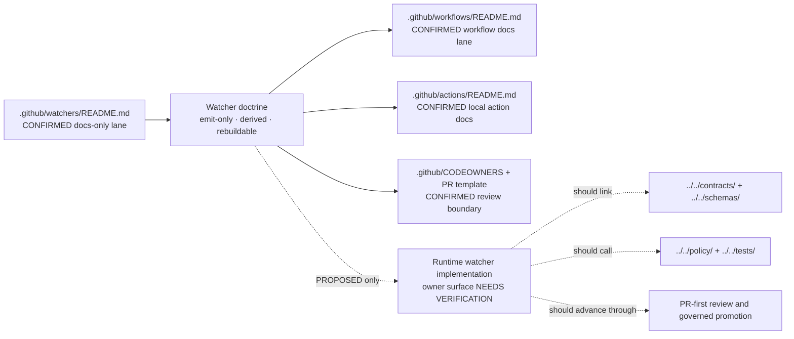

<!-- [KFM_META_BLOCK_V2]
doc_id: kfm://doc/NEEDS_VERIFICATION
title: .github/watchers
type: standard
version: v1
status: draft
owners: @bartytime4life
created: 2026-03-29
updated: 2026-04-03
policy_label: public
related:
  - .github/README.md
  - .github/workflows/README.md
  - .github/actions/README.md
  - .github/CODEOWNERS
  - .github/PULL_REQUEST_TEMPLATE.md
tags: [kfm, github, watchers, governance, ci]
notes: Current public main shows `.github/watchers/` as README-only; runtime watcher code, workflow YAML, and emitted proof objects remain UNKNOWN / NEEDS VERIFICATION.
[/KFM_META_BLOCK_V2] -->

<a id="top"></a>

# `.github/watchers`

Gatehouse documentation lane for emit-only watcher doctrine, current public inventory, and future runtime handoff in Kansas Frontier Matrix.

> **Status:** experimental  
> **Owners:** `@bartytime4life`  
> **Path:** `.github/watchers/README.md`  
> **Repo fit:** docs-only watcher lane inside the `.github` gatehouse; upstream from [../README.md](../README.md), [../workflows/README.md](../workflows/README.md), [../actions/README.md](../actions/README.md), [../CODEOWNERS](../CODEOWNERS), and [../PULL_REQUEST_TEMPLATE.md](../PULL_REQUEST_TEMPLATE.md); downstream into future watcher runtime, policy, contracts, tests, and release evidence.  
>       
> **Quick jump:** [Scope](#scope) · [Repo fit](#repo-fit) · [Accepted inputs](#accepted-inputs) · [Exclusions](#exclusions) · [Directory tree](#directory-tree) · [Quickstart](#quickstart) · [Usage](#usage) · [Diagram](#diagram) · [Tables](#tables) · [Task list](#task-list) · [FAQ](#faq) · [Appendix](#appendix)

> [!IMPORTANT]
> Current public `main` inspection confirms `.github/watchers/` contains `README.md` only. This directory is presently a **docs-only watcher lane**, not a proven runtime implementation surface.

> [!NOTE]
> Use these labels throughout this README: **CONFIRMED** = directly visible in the current public tree or checked-in Markdown, **INFERRED** = conservative conclusion from confirmed repo evidence, **PROPOSED** = doctrine-consistent but not yet proven as checked-in behavior, **UNKNOWN** = not verifiable from current public evidence, **NEEDS VERIFICATION** = placeholder to close before merge or release claims.

> [!CAUTION]
> Watcher doctrine may live here. Canonical policy meaning, contract truth, tests, runtime code, and publish authority must not silently migrate into this docs lane.

---

## Scope

`.github/watchers/` is the watcher-facing edge of KFM’s repo-side gatehouse.

Today, this directory does three useful jobs:

- preserves the **emit-only** watcher posture in a reviewable public place
- records what the current public tree actually proves
- prevents documentation from overclaiming watcher runtime maturity

It should **not** pretend that checked-in runtime jobs, adapters, or workflow YAML already exist when the current public tree does not show them.

### What this README is for

Use this file to keep three things clear:

1. what watcher doctrine requires
2. what public `main` currently proves
3. where future watcher implementation work must move once real code, tests, and workflow assets are checked in

### Current truth boundary

- **CONFIRMED:** `.github/watchers/README.md` exists
- **CONFIRMED:** the watcher lane sits under the `.github` gatehouse
- **CONFIRMED:** current public `main` shows this lane as documentation-only
- **PROPOSED:** future runtime watcher jobs, proof objects, and workflow orchestration
- **UNKNOWN:** any non-public workflow YAML, GitHub ruleset, deployment, or emitted runtime proof pack not visible in the checked-in public tree

---

## Repo fit

This README belongs to the same review and governance boundary as the rest of `.github/`.

### Upstream and adjacent anchors

| Relation | Path | Why it matters |
| --- | --- | --- |
| Parent gatehouse | [../README.md](../README.md) | Defines `.github/` as the repo-side gatehouse for review, automation, and watcher control |
| Workflow documentation lane | [../workflows/README.md](../workflows/README.md) | Holds workflow inventory doctrine; current public `main` is README-only there |
| Local action documentation lane | [../actions/README.md](../actions/README.md) | Shows the reusable repo-local action seam that future watcher orchestration may call |
| Review ownership | [../CODEOWNERS](../CODEOWNERS) | Makes `/.github/` review routing explicit |
| PR evidence template | [../PULL_REQUEST_TEMPLATE.md](../PULL_REQUEST_TEMPLATE.md) | Requires truth labels, evidence links, validation, rollout, and rollback structure |
| Root operating index | [../../README.md](../../README.md) | Anchors repo-wide posture and visible top-level directory logic |
| Future canonical downstream surfaces | [../../policy/](../../policy/), [../../contracts/](../../contracts/), [../../schemas/](../../schemas/), [../../tests/](../../tests/), [../../docs/](../../docs/), [../../pipelines/](../../pipelines/), [../../packages/](../../packages/) | Future watcher runtime and proof objects must live outside this docs lane |

### Boundary rule

This directory may describe:

- watcher doctrine
- current public inventory
- migration or handoff guidance
- review expectations for future watcher work

This directory must not become the sovereign home of:

- canonical policy logic
- canonical contracts or schemas
- runtime watcher code
- secret material
- autonomous publish authority
- long-lived evidence archives

---

## Accepted inputs

Use this directory for small, watcher-facing documentation artifacts only.

| What belongs here | Why |
| --- | --- |
| `README.md` | Directory contract and current public inventory |
| short watcher-lane notes | Keeps future implementation handoff reviewable |
| links to sibling `.github/` docs | Preserves gatehouse context for watcher changes |
| minimal illustrative examples | Clarifies emit-only and PR-first expectations without pretending runtime exists |
| migration notes | Records where real watcher code and proof objects must move once checked in |

---

## Exclusions

Keep these out of `.github/watchers/` unless there is a very narrow documentation reason.

| Keep out of this directory | Why | Put it here instead |
| --- | --- | --- |
| checked-in workflow YAML as the canonical watcher home | Job orchestration belongs in the workflow lane | [../workflows/](../workflows/) |
| repo-local action implementations | Action glue belongs in the action lane | [../actions/](../actions/) |
| canonical policy bundles or rule bodies | Policy meaning must stay reviewable outside prose | [../../policy/](../../policy/) |
| contract or schema truth | This README may reference proof objects, but must not own them | [../../contracts/](../../contracts/), [../../schemas/](../../schemas/) |
| runtime watcher code, adapters, schedulers | Current public `main` does not prove this directory as a runtime owner surface | future owner surface outside `.github/` (**NEEDS VERIFICATION**) |
| emitted artifacts or receipts | Evidence objects belong in governed runtime or release locations | governed data / release surfaces outside `.github/` |
| secrets, credentials, or publish keys | Docs lanes must never become secret stores | GitHub environments or external secret management |

---

## Directory tree

### Current public inventory

```text
.github/
  watchers/
    README.md
```

### Adjacent confirmed gatehouse surfaces

```text
.github/
  README.md
  CODEOWNERS
  PULL_REQUEST_TEMPLATE.md
  actions/
    README.md
    metadata-validate-v2/
    metadata-validate/
    opa-gate/
    provenance-guard/
    sbom-produce-and-sign/
  workflows/
    README.md
```

> [!NOTE]
> The current public tree supports a **docs-only** watcher lane. Any top-level `watchers/` runtime path, watcher runner, adapter module, or watcher-specific workflow YAML should be treated as **PROPOSED** or **NEEDS VERIFICATION** unless it is directly visible in the checked-in tree.

---

## Quickstart

### 1) Inspect the current watcher lane

```bash
ls -la .github/watchers
sed -n '1,220p' .github/watchers/README.md
```

### 2) Check the gatehouse surfaces that shape watcher review

```bash
sed -n '1,220p' .github/README.md
sed -n '1,220p' .github/workflows/README.md
sed -n '1,220p' .github/actions/README.md
sed -n '1,140p' .github/CODEOWNERS
sed -n '1,220p' .github/PULL_REQUEST_TEMPLATE.md
```

### 3) Before describing runtime watcher behavior

Confirm all three of these first:

1. the owning code surface is checked in and visible
2. policy / contract / test surfaces are linked
3. any workflow claim points to an actual checked-in YAML or to a clearly labeled proposal

> [!WARNING]
> Do not add commands for non-existent `watchers/` runtime paths, source adapters, or workflow YAMLs until they are actually present in the reviewed tree.

---

## Usage

### How to use this README today

Use this file as a **truth-preserving boundary document**.

It should:

- state watcher doctrine clearly
- keep current public tree claims narrow
- preserve emit-only and review-bearing posture
- point future runtime work toward the repo’s canonical policy, contract, schema, test, and release surfaces

### What this directory currently proves

Current public `main` supports these statements:

- KFM has a watcher lane under `.github/`
- that lane is currently documentation-only
- watcher changes belong inside the same PR-first, evidence-aware gatehouse as other trust-significant repo surfaces
- watcher doctrine is being framed as **derived**, **rebuildable**, **emit-only**, and **not self-publishing**

### What this directory does **not** currently prove

This README alone does **not** prove:

- a checked-in runtime under `watchers/`
- a current watcher workflow YAML on public `main`
- live source adapters for Mesonet, NWIS, HLS VI, KDHE, or USFWS
- signed watcher receipts, attestation bundles, or autonomous publication behavior

### What a review-ready watcher proposal must name

A credible watcher proposal should identify:

1. the owner surface for runtime code
2. the source family and scope window
3. the proof objects it will emit
4. the policy gate it must satisfy
5. the test or fixture surface that blocks regressions
6. the rollback or supersession path if a watcher emits a bad result

Illustrative example only:

```yaml
watcher_proposal:
  truth_posture: PROPOSED
  owner_surface: NEEDS VERIFICATION
  source_family: hydrology
  emit_only: true
  proof_objects:
    - run_receipt
    - policy_result
    - tests
    - rollback_note
  publish_authority: none
```

---

## Diagram



---

## Tables

### Current public-main posture

| Surface | Current visible state | Posture | Why it matters |
| --- | --- | --- | --- |
| `.github/watchers/README.md` | present | **CONFIRMED** | watcher lane exists in the checked-in public tree |
| `.github/watchers/` | `README.md` only | **CONFIRMED** | current public watcher lane is documentary, not a proven runtime |
| `.github/workflows/` | `README.md` only | **CONFIRMED** | keep watcher workflow claims conservative |
| `.github/actions/` | local action dirs plus docs | **CONFIRMED** | future watcher automation can reuse gatehouse actions without moving canonical logic here |
| `/.github/` ownership | covered by `@bartytime4life` | **CONFIRMED** | review routing exists for watcher-lane changes |
| exact rulesets / required checks / OIDC / environment approvals | not derivable from checked-in tree alone | **UNKNOWN** | repo state and platform state are not the same thing |

### Watcher claim map

| Claim | Current status | Where it must be proven |
| --- | --- | --- |
| emit-only watcher doctrine belongs in the gatehouse | **CONFIRMED** | this README and sibling `.github/` docs |
| runtime watcher code is checked in on public `main` | **UNKNOWN** | actual code inventory in a visible owner surface |
| watcher workflow YAML exists on public `main` | **UNKNOWN** | checked-in file under [../workflows/](../workflows/) |
| policy-backed proof objects exist | **PROPOSED** | canonical policy, contract, schema, test, and release surfaces |
| watcher lanes should remain PR-first and review-bearing | **CONFIRMED** doctrine / **PROPOSED** implementation | future workflows, policy gates, and receipts |

### Candidate thin-slice families

These are useful **PROPOSED** watcher families, not current public-runtime claims.

| Candidate lane | Representative sources | Why it fits a thin slice |
| --- | --- | --- |
| hydrology / soil moisture | Kansas Mesonet, USGS NWIS | aligns with KFM’s hydrology-first proof bias |
| vegetation change | HLS VI plus corroborating disturbance sources | clear temporal comparison burden and strong map value |
| air / atmospheric context | state or public air-quality feeds | compact change detection with obvious public relevance |
| refuge / stewardship notices | USFWS pages or similar authority notices | low-risk text or metadata change detection with a clear review path |

---

## Task list

- [ ] Keep `.github/watchers/` accurate as a docs-only lane until runtime watcher assets are actually checked in.
- [ ] Remove any remaining path drift that implies a checked-in top-level `watchers/` runtime without proof.
- [ ] When the first watcher workflow YAML lands, cross-link it here **and** in [../workflows/README.md](../workflows/README.md).
- [ ] When runtime watcher code lands, record the owning surface and update this README’s repo fit and exclusions.
- [ ] Link first real watcher proof objects only after receipts, policy results, and tests exist in-tree.
- [ ] Prefer one hydrology-first thin slice before broadening into a multi-source watcher wave.

### Definition of done

This README is in a healthy state when:

- current public inventory is accurate
- future implementation guidance is clearly labeled **PROPOSED**
- no path, command, or file name implies runtime existence without proof
- adjacent gatehouse links are valid
- watcher doctrine stays subordinate to canonical policy, contract, schema, and test surfaces

---

## FAQ

### Is `.github/watchers/` the runtime watcher directory?

No. Current public `main` shows `.github/watchers/` as `README.md` only.

### Can this README talk about watcher source families?

Yes, as long as they are clearly labeled as **PROPOSED** thin-slice candidates rather than current checked-in adapters.

### Where should canonical watcher policy and proof shapes live?

Outside this directory, in the repo’s canonical policy, contract, schema, test, and release surfaces.

### Why keep a watcher lane under `.github/` at all?

Because watcher behavior changes trust state. Even before runtime code is visible, the gatehouse is the right place to define emit-only, review-bearing, fail-closed expectations.

### What is the smallest credible next step?

A read-only, hydrology-first watcher thin slice that emits only review material, proof objects, and a PR-ready handoff without direct publish authority.

---

## Appendix

<details>
<summary>Proposed proof packet and working terms</summary>

### Proposed proof packet

A future runtime watcher implementation should not arrive as code alone.

| Object | Purpose | Status here |
| --- | --- | --- |
| watcher scope note | states source family, cadence, and claim class | **PROPOSED** |
| policy result | proves deny-by-default review passed or failed | **PROPOSED** |
| test / fixture links | show deterministic behavior and negative-path coverage | **PROPOSED** |
| `run_receipt` or equivalent | binds inputs, outputs, and audit linkage | **PROPOSED** |
| rollback / supersession note | explains what happens when a watcher emits a bad or stale result | **PROPOSED** |

### Working terms used here

- **docs-only lane** — a checked-in documentation surface with no proven runtime inventory behind it
- **emit-only** — a watcher may open a review path, but it may not publish directly
- **derived / rebuildable** — watcher outputs can be regenerated from upstream sources and config; they do not become sovereign truth
- **PR-first** — review and evidence come before merge or release-bearing trust change

Until those proof objects are checked in, keep this lane documentary and conservative.

</details>

[Back to top](#top)
