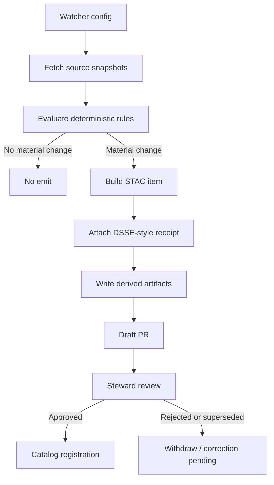
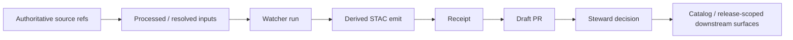

<!-- [KFM_META_BLOCK_V2]
doc_id: kfm://doc/NEEDS_VERIFICATION
title: Watchers
type: standard
version: v1
status: draft
owners: [NEEDS VERIFICATION]
created: 2026-03-29
updated: 2026-03-29
policy_label: public
related:
  - watchers/config/kansas_env_watchers.yaml
  - watchers/runners/watcher_runner.py
  - tests/test_watchers_thresholds.py
  - policy/watchers.rego
tags: [kfm, watchers, stac, dsse, provenance, derived]
notes: Source-bounded draft. No mounted repo checkout in this session; paths, owners, and adjacent links NEED VERIFICATION before merge.
[/KFM_META_BLOCK_V2] -->

# Watchers

Derived, fail-closed environmental change detectors that emit evidence-backed STAC items for steward review.

> [!IMPORTANT]
> **Truth posture:** PROPOSED  
> **Live tree status:** NEEDS VERIFICATION  
> **Boundary:** Watchers are **derived / rebuildable** monitoring surfaces. They do **not** become sovereign truth and do **not** bypass governed publication.

> [!IMPORTANT]
> **Emit-only rule:** Watchers MUST NOT publish directly to catalog, triplet, search, map, or release surfaces.  
> They may only write derived artifacts, attach evidence, and open a governed review path.

---

## Status / quick fit

**Status:** experimental  
**Owners:** NEEDS VERIFICATION  
**Path:** `watchers/`  
**Repo fit:** derived monitoring and evidence assembly between processed inputs and governed catalog publication


**Quick jumps:** [Scope](#scope) · [Repo fit](#repo-fit) · [Inputs](#accepted-inputs) · [Exclusions](#exclusions) · [Tree](#directory-tree) · [Quickstart](#quickstart) · [Usage](#usage) · [Flow](#flow) · [Rules](#rules) · [Tests](#tests) · [FAQ](#faq)

---

## Scope

`watchers/` contains thin, reviewable jobs that:

- poll trusted upstream sources on a schedule
- compute small, deterministic anomaly checks
- emit only when a **material** threshold is crossed
- persist evidence-first derived artifacts
- open a steward-reviewed promotion path instead of publishing directly

Current thin-slice scope in this draft:

- soil moisture deltas
- vegetation / NDVI shifts
- streamflow anomalies
- air quality escalations
- wildlife refuge permit / schedule changes

> [!NOTE]
> The source families listed in this draft describe the intended scaffold target set.  
> They should not be read as a claim that every adapter is live, production-verified, or branch-confirmed in the current tree.

---

## Repo fit

**Path:** `watchers/`

**Upstream**
- authoritative public source systems
- KFM processed or work-layer geospatial products
- policy and standards that define admissible evidence and publication posture

**Downstream**
- `data/derived/watchers/` artifact output
- governed catalog registration
- search, reports, maps, and other derived release-scoped views

**Adjacent**
- `policy/`
- `tests/`
- `docs/architecture/`
- `docs/governance/`
- `docs/standards/`

> [!NOTE]
> Source edge → RAW → WORK / QUARANTINE → PROCESSED → CATALOG / TRIPLET → PUBLISHED  
> Watchers operate on the **derived side** of this system and should not collapse authoritative and rebuildable layers.

---

## Accepted inputs

Watchers should accept only explicit, reviewable inputs such as:

- watcher config files
- source URLs or API endpoints
- pre-resolved COGs / rasters / previews
- processed summary statistics
- explicit site, county, HUC, or refuge identifiers
- prior observed values needed for bounded comparisons

Example source families in the current scaffold:

| Source | Use | Notes |
|---|---|---|
| Mesonet | county soil moisture deltas | current adapter is placeholder; NEEDS VERIFICATION |
| USGS NWIS | realtime discharge checks | thin adapter present |
| HLS VI | NDVI delta checks | expects pre-resolved COG paths |
| LANDFIRE Annual Disturbance | disturbance corroboration | currently config-driven placeholder |
| KDHE AQI | category escalation | current adapter is placeholder |
| USFWS refuge pages | permit/schedule drift | current adapter is placeholder |

---

## Exclusions

This directory is **not** the place for:

- canonical policy truth
- canonical schema or contract ownership
- sovereign publication logic
- long-lived service orchestration
- secret material or credentials
- direct client bypass around governance, evidence, or review
- silent auto-promotion into published surfaces

> [!CAUTION]
> Watchers must remain thin and inspectable. Durable law belongs in `policy/`, canonical contract truth belongs in `contracts/` or equivalent owning surfaces, and authoritative data remains upstream of this directory.

---

## Directory tree

> [!NOTE]
> The tree below is a scaffold target and NEEDS VERIFICATION against the live repository before merge.

```text
watchers/
  config/
    kansas_env_watchers.yaml
  runners/
    watcher_runner.py
  sources/
    hls.py
    kdhe.py
    mesonet.py
    nwis.py
    usfws.py
````

**Related**

```text
.github/workflows/
  watchers-kansas-env.yml

tests/
  test_watchers_thresholds.py

policy/
  watchers.rego
```

---

## Quickstart

### 1) Run locally

```bash
python watchers/runners/watcher_runner.py \
  --config watchers/config/kansas_env_watchers.yaml \
  --outdir data/derived/watchers
```

### 2) Inspect outputs

```bash
find data/derived/watchers -maxdepth 4 -type f
```

### 3) Run threshold tests

```bash
pytest tests/test_watchers_thresholds.py
```

> [!WARNING]
> The current scaffold includes placeholder adapters and mock config values. Replace them before treating outputs as operational evidence.

---

## Usage

### Config-driven execution

The runner reads a deterministic watcher spec and computes a `spec_hash` from normalized config JSON.

```yaml
rules:
  soil_moisture_jump:
    threshold: 0.03
  ndvi_shift_uncorroborated:
    threshold_pct: 0.15
  streamflow_anomaly:
    multiplier: 1.5
    daily_delta: 0.30
  aqi_escalation:
    min_category: Unhealthy
  refuge_schedule_shift:
    hours: 72
```

### Deterministic fingerprint (`spec_hash`)

`spec_hash` MUST be computed from a normalized, ordered representation of the watcher specification and the resolved inputs used for evaluation.

At minimum, the fingerprint should include:

* fully resolved watcher config
* rule names and threshold values
* resolved input identifiers or asset URIs
* upstream freshness markers when available (for example `ETag`, `Last-Modified`, or equivalent source timestamps)

The same inputs MUST produce the same `spec_hash`.

The following MUST NOT affect the fingerprint:

* local wall-clock timestamps
* unordered collection iteration
* temporary paths
* non-semantic serialization differences

### Emit behavior

A watcher should emit only when one or more configured rules trip. Each emit should:

1. compute a deterministic `spec_hash`
2. assemble evidence references and source metadata
3. produce a STAC item
4. wrap the result in a DSSE-style receipt
5. persist artifacts under a dated derived output path
6. enter steward review through a draft PR path

Promotion decisions MUST be made downstream by policy and steward review; emit creation alone conveys no publication authority.

### No-change behavior

If no rule trips, the run exits without emitting a derived artifact.

This is deliberate fail-closed behavior, not a missing feature.

---

## Flow



---

## Rules

Current threshold logic in the scaffold:

| Rule                        |                                                  Threshold | Intent                                                |
| --------------------------- | ---------------------------------------------------------: | ----------------------------------------------------- |
| `soil_moisture_jump`        |                                             `ΔVWC >= 0.03` | catch substantial day-over-day soil moisture movement |
| `ndvi_shift_uncorroborated` |         `NDVI % change >= 0.15` and no disturbance overlap | catch meaningful vegetation shifts                    |
| `streamflow_anomaly`        | `Q_now >= 1.5 * historic_median` or `day-over-day >= 0.30` | catch strong discharge anomalies                      |
| `aqi_escalation`            |                         escalation to `Unhealthy` or worse | catch category worsening                              |
| `refuge_schedule_shift`     |                                               `> 72 hours` | catch material schedule movement                      |

> [!NOTE]
> Several source adapters are placeholders in the current scaffold. Threshold semantics are present, but live-source correctness still NEEDS VERIFICATION.

---

## Artifact contract

Each emit directory should contain at least:

* `item.json`
* `receipt.json`

### Item vs receipt authority

`item.json` is the derived observation package intended for catalog-shaped downstream handling.

`receipt.json` is the execution, evidence, and integrity package for the watcher run.

Downstream systems may index or inspect the item, but admissibility and promotion decisions MUST evaluate the receipt, the attached evidence references, and policy outcomes rather than the item alone.

Expected derived output shape:

```text
data/derived/watchers/
  YYYY/MM/DD/
    emit-<timestamp>-<event_type>/
      item.json
      receipt.json
```

### STAC expectations

Minimal item fields in the scaffold include:

* `type`
* `stac_version`
* `id`
* `properties.spec_hash`
* `properties.event_type`
* source timestamps / counts where available
* `assets`
* `evidence_refs`
* `kfm:run_receipt`

### Receipt expectations

The current scaffold uses a **DSSE-style development stub**. This is suitable for local wiring and tests, but should be replaced with real signing before operational use.

Until real signing is in place, receipt handling should be treated as development-grade provenance scaffolding rather than an operational attestation boundary.

---

## Policy and governance

The related `policy/watchers.rego` gate is intended to enforce baseline admissibility:

* STAC item shape present
* non-empty `spec_hash`
* non-empty `event_type`
* receipt payload present
* at least one evidence reference

Missing evidence, empty fingerprints, malformed items, or incomplete receipts MUST block promotion and should be treated as fail-closed outcomes rather than soft warnings.

This surface is designed for:

* evidence-first review
* governance-mediated promotion
* fail-closed handling

It is **not** designed for autonomous publication.

---

## Diagram: trust boundary



---

## Tables

### Surface classification

| Surface                              | Classification             | Rebuildable | Publishable without review |
| ------------------------------------ | -------------------------- | ----------- | -------------------------- |
| upstream source record               | authoritative upstream     | no          | no                         |
| processed intermediate               | controlled internal        | sometimes   | no                         |
| watcher STAC emit                    | derived                    | yes         | no                         |
| search index derived from emit       | derived                    | yes         | no                         |
| published release incorporating emit | governed published surface | yes         | only after review          |

### Current implementation posture

| Component              | Posture              |
| ---------------------- | -------------------- |
| config schema          | PROPOSED             |
| runner                 | PROPOSED             |
| NWIS source adapter    | INFERRED             |
| HLS source adapter     | INFERRED             |
| Mesonet adapter        | PROPOSED placeholder |
| KDHE adapter           | PROPOSED placeholder |
| USFWS adapter          | PROPOSED placeholder |
| GitHub Action workflow | PROPOSED             |
| tests                  | PROPOSED             |
| Rego gate              | PROPOSED             |

---

## Task list

* [ ] Verify `watchers/` path exists
* [ ] Replace placeholder adapters
* [ ] Implement real historical baselines
* [ ] Replace DSSE stub with signing
* [ ] Add preview artifacts
* [ ] Add negative/boundary tests
* [ ] Document steward review lifecycle

---

## Tests

Current related test surface:

```text
tests/test_watchers_thresholds.py
```

Additional required test intent:

* deterministic `spec_hash` stability for identical inputs
* changed `spec_hash` on meaningful config or input change
* rejection of emits that lack receipt or evidence refs
* no dependence on local runtime ordering or wall-clock values

---

## FAQ

### Are watchers authoritative?

No. They are derived detectors layered downstream of authoritative sources.

### Why not publish automatically?

Because KFM publication is governance-mediated.

### What happens when no rule trips?

Nothing is emitted. This is expected fail-closed behavior.

---

## Verification notes

This README is grounded in the scaffold drafted in-session, but the following remain **NEEDS VERIFICATION** before merge:

* repo placement
* owners
* CI compatibility
* data subtree location

---

[Back to top](#watchers)

```
