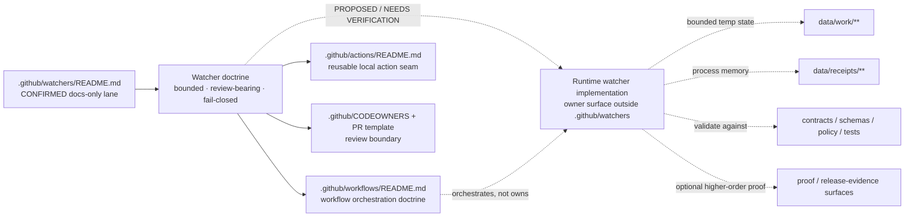

<!-- [KFM_META_BLOCK_V2]
doc_id: kfm://doc/NEEDS_VERIFICATION
title: .github/watchers
type: standard
version: v1
status: draft
owners: @bartytime4life
created: NEEDS_VERIFICATION
updated: 2026-04-26
policy_label: public
related: [.github/README.md, .github/workflows/README.md, .github/actions/README.md, .github/CODEOWNERS, .github/PULL_REQUEST_TEMPLATE.md, data/work/README.md, data/receipts/README.md, tools/validators/README.md, tools/attest/README.md]
tags: [kfm, github, watchers, governance, ci, receipts]
notes: [doc_id and created date require verification; current public main inspection supports .github/watchers as README-only; runtime watcher code and watcher-specific workflow YAML remain UNKNOWN / NEEDS VERIFICATION.]
[/KFM_META_BLOCK_V2] -->

<a id="top"></a>

# `.github/watchers`

Gatehouse documentation lane for watcher doctrine, orchestration boundaries, receipt-bearing review posture, and future runtime handoff in Kansas Frontier Matrix.

> [!IMPORTANT]
> **Impact block**
>
> | Field | Value |
> |---|---|
> | **Status** | `experimental` |
> | **Document status** | `draft` |
> | **Owners** | `@bartytime4life` |
> | **Path** | `.github/watchers/README.md` |
> | **Repo fit** | Docs-only watcher lane inside the `.github` gatehouse; upstream from [`.github`](../README.md), [workflows](../workflows/README.md), [actions](../actions/README.md), [CODEOWNERS](../CODEOWNERS), and the [pull request template](../PULL_REQUEST_TEMPLATE.md); downstream into future watcher runtime, policy, contracts, schemas, tests, receipts, proofs, and release evidence. |
> | **Quick jumps** | [Scope](#scope) · [Repo fit](#repo-fit) · [Accepted inputs](#accepted-inputs) · [Exclusions](#exclusions) · [Directory tree](#directory-tree) · [Quickstart](#quickstart) · [Usage](#usage) · [Diagram](#diagram) · [Operating tables](#operating-tables) · [Task list](#task-list-and-definition-of-done) · [FAQ](#faq) · [Appendix](#appendix) |
>
> 
> 
> 
> 
> 
> 

> [!NOTE]
> Use these labels throughout this README:
> **CONFIRMED** = directly visible in supplied repo Markdown or the current checked-in public tree;
> **INFERRED** = conservative conclusion from confirmed repo evidence and KFM doctrine;
> **PROPOSED** = doctrine-consistent but not yet proven as checked-in behavior;
> **UNKNOWN** = not verifiable from current public evidence;
> **NEEDS VERIFICATION** = placeholder to close before merge, release, or implementation claims.

> [!CAUTION]
> Watcher doctrine may live here. Canonical policy meaning, contract truth, schema truth, tests, runtime code, receipt storage, proof-pack storage, and publish authority must not silently migrate into this docs lane.

---

## Scope

`.github/watchers/` is the watcher-facing edge of KFM’s repo-side gatehouse.

Today, this directory does four useful jobs:

- preserves watcher doctrine in a reviewable public place
- records what the current public tree actually proves
- keeps watcher orchestration distinct from watcher implementation
- prevents documentation from overclaiming runtime maturity, publish authority, receipt state, or proof state

It should **not** pretend that checked-in watcher runtime jobs, source adapters, proof packs, or watcher-specific workflow YAML already exist when the reviewed tree does not show them.

### What this README is for

Use this file to keep five things clear:

1. what watcher doctrine requires
2. what public `main` currently proves
3. where watcher logic belongs once real code lands
4. how watcher workflows relate to this lane without collapsing boundaries
5. how receipts differ from proofs in watcher-bearing automation

### Current truth boundary

| Claim | Status | Maintainer reading |
|---|---:|---|
| `.github/watchers/README.md` exists | **CONFIRMED** | This lane is present as a documentation surface. |
| `.github/watchers/` is under the `.github` gatehouse | **CONFIRMED** | Watcher changes are governance-adjacent and review-bearing. |
| Current public `main` shows this lane as documentation-only | **CONFIRMED** | Do not describe this directory as runtime ownership. |
| Watcher behavior is expected to remain governed and review-bearing | **CONFIRMED doctrine** | Watchers may support review; they must not silently change trust state. |
| Watcher orchestration belongs in `.github/workflows/`, not here | **INFERRED** | Workflow files can orchestrate watcher checks; this README documents boundaries. |
| Future runtime watcher jobs, proof objects, and workflow implementations | **PROPOSED** | Mention as design direction only until branch evidence exists. |
| Non-public workflow YAML, GitHub rulesets, deployment, emitted proof packs | **UNKNOWN** | Platform state and private branch state need direct verification. |

### Core watcher doctrine captured here

Watcher behavior in KFM should remain:

- **bounded** — explicit source, cadence, scope window, and claim class
- **review-bearing** — visible to maintainers before trust-significant change
- **fail-closed** — validation or policy failure stops downstream side effects
- **receipt-emitting** — process memory is preserved when watcher runs occur
- **not self-publishing** — watchers do not become hidden release or publication lanes
- **rebuildable** — watcher outputs are derived from upstream sources and configuration, not sovereign truth

[Back to top](#top)

---

## Repo fit

**Path:** `.github/watchers/README.md`  
**Role:** README-like directory contract for watcher doctrine, current inventory, orchestration boundaries, and future handoff.

This README belongs to the same review and governance boundary as the rest of `.github/`.

### Upstream and adjacent anchors

| Relation | Path | Why it matters | Status |
|---|---|---|---:|
| Parent gatehouse | [../README.md](../README.md) | Defines `.github/` as the repo-side gatehouse for review, automation, and watcher control. | **CONFIRMED path** |
| Workflow orchestration | [../workflows/README.md](../workflows/README.md) | Holds workflow inventory and should own watcher scheduling or orchestration if watcher YAML lands. | **CONFIRMED path** |
| Local action seam | [../actions/README.md](../actions/README.md) | Reusable action glue belongs there, not in this docs lane. | **CONFIRMED path** |
| Review ownership | [../CODEOWNERS](../CODEOWNERS) | Routes watcher-lane changes through repo ownership rules. | **CONFIRMED path** |
| PR evidence intake | [../PULL_REQUEST_TEMPLATE.md](../PULL_REQUEST_TEMPLATE.md) | Keeps watcher changes tied to truth labels, evidence, validation, rollout, and rollback. | **CONFIRMED path** |
| Root operating index | [../../README.md](../../README.md) | Anchors repo-wide posture and top-level directory logic. | **CONFIRMED path** |
| Work surface | [../../data/work/README.md](../../data/work/README.md) | Temporary watcher state belongs in bounded work paths, not in `.github/watchers/`. | **CONFIRMED path / role needs branch verification** |
| Receipt surface | [../../data/receipts/README.md](../../data/receipts/README.md) | Watcher runs should emit governed process memory there, not under `.github/`. | **CONFIRMED path / role needs branch verification** |
| Validator surface | [../../tools/validators/README.md](../../tools/validators/README.md) | Watcher outputs should be contract-, schema-, linkage-, and policy-checkable outside prose. | **CONFIRMED path / command coverage needs verification** |
| Attestation surface | [../../tools/attest/README.md](../../tools/attest/README.md) | Proof-pack or attestation assembly is separate from watcher receipts. | **CONFIRMED path / implementation depth unknown** |
| Canonical downstream surfaces | [../../policy/](../../policy/), [../../contracts/](../../contracts/), [../../schemas/](../../schemas/), [../../tests/](../../tests/), [../../docs/](../../docs/), [../../packages/](../../packages/) | Future watcher runtime, contracts, schemas, tests, and proof objects must live outside this docs lane. | **CONFIRMED path family / details vary** |

### Boundary rule

This directory may describe:

- watcher doctrine
- current public inventory
- migration or handoff guidance
- orchestration boundaries
- receipt / proof distinctions
- review expectations for future watcher work

This directory must not become the sovereign home of:

- canonical policy logic
- canonical contracts or schemas
- runtime watcher code
- receipt storage
- proof-pack storage
- secret material
- autonomous publish authority
- long-lived evidence archives

### Watchers versus workflows

Keep the split explicit.

| Surface | Owns what |
|---|---|
| `.github/watchers/` | watcher doctrine, scope notes, handoff guidance, and review expectations |
| `.github/workflows/` | event triggers, scheduling, orchestration, validation order, artifact upload, and merge or promotion gates |
| `tools/`, `apps/`, `packages/`, or a future runtime owner surface | watcher logic, source handling, parsing, normalization, deterministic behavior |
| `data/work/` | bounded temporary working state |
| `data/receipts/` | governed process memory |
| proof / release-evidence surfaces | release-significant or review-significant trust objects |

That boundary keeps this lane documentary, not operational.

[Back to top](#top)

---

## Accepted inputs

Use this directory for small, watcher-facing documentation artifacts only.

| What belongs here | Why |
|---|---|
| `README.md` | Directory contract, current public inventory, and review expectations |
| short watcher-lane notes | Keeps future implementation handoff reviewable |
| links to sibling `.github/` docs | Preserves gatehouse context for watcher changes |
| minimal illustrative examples | Clarifies watcher posture without pretending runtime exists here |
| migration notes | Records where real watcher code, receipts, and proofs must move once checked in |
| doctrine notes on receipts vs proofs | Prevents watcher artifacts from being conflated |

[Back to top](#top)

---

## Exclusions

Keep these out of `.github/watchers/` unless there is a very narrow documentation reason.

| Keep out of this directory | Why | Put it here instead |
|---|---|---|
| checked-in workflow YAML as the canonical watcher home | job orchestration belongs in the workflow lane | [../workflows/](../workflows/) |
| repo-local action implementations | action glue belongs in the action lane | [../actions/](../actions/) |
| canonical policy bundles or rule bodies | policy meaning must stay reviewable outside prose | [../../policy/](../../policy/) |
| contract or schema truth | this README may reference them, but must not own them | [../../contracts/](../../contracts/), [../../schemas/](../../schemas/) |
| runtime watcher code, adapters, schedulers | current evidence does not prove this directory as a runtime owner surface | future owner surface outside `.github/` — **NEEDS VERIFICATION** |
| emitted receipts | receipts are governed process memory, not gatehouse docs | [../../data/receipts/](../../data/receipts/) |
| proof packs, attestations, release evidence | proofs are separate trust objects, not watcher-lane prose | governed proof / release surfaces outside `.github/` |
| working state or caches | temporary state belongs in bounded work paths | [../../data/work/](../../data/work/) |
| secrets, credentials, publish keys | docs lanes must never become secret stores | GitHub environments or external secret management |

[Back to top](#top)

---

## Directory tree

### Current target-lane inventory

```text
.github/
└── watchers/
    └── README.md
```

### Adjacent gatehouse surfaces to recheck on the active branch

```text
.github/
├── README.md
├── CODEOWNERS
├── PULL_REQUEST_TEMPLATE.md
├── actions/
│   └── README.md
└── workflows/
    ├── README.md
    ├── contracts.yml
    ├── docs-lint.yml
    ├── policy.yml
    ├── release-dry-run.yml
    ├── tests.yml
    └── verification-baseline.yml
```

> [!NOTE]
> This adjacent tree reflects the public-main inspection baseline used for this README. Re-run the quickstart commands on the working branch before claiming the same inventory in a PR.

### `PROPOSED` maturity direction

Do not grow `.github/watchers/` into a runtime tree. The healthy future shape is still small:

```text
.github/
└── watchers/
    └── README.md        # doctrine, boundary, current inventory, and handoff guidance only
```

Runtime watcher maturity should appear in the owning implementation, validation, receipt, and workflow surfaces instead:

```text
<runtime-owner>/          # NEEDS VERIFICATION
data/work/**             # bounded temporary state
data/receipts/**         # process memory
tools/validators/**      # validation
.github/workflows/**     # orchestration
data/proofs/**           # optional higher-order proof objects
```

[Back to top](#top)

---

## Quickstart

### 1) Inspect the current watcher lane

```bash
ls -la .github/watchers
sed -n '1,260p' .github/watchers/README.md
```

### 2) Check the gatehouse surfaces that shape watcher review

```bash
sed -n '1,260p' .github/README.md
sed -n '1,260p' .github/workflows/README.md
sed -n '1,220p' .github/actions/README.md
sed -n '1,180p' .github/CODEOWNERS
sed -n '1,260p' .github/PULL_REQUEST_TEMPLATE.md
```

### 3) Inventory workflow YAML without assuming watcher runtime

```bash
find .github/workflows -maxdepth 1 -type f \( -name '*.yml' -o -name '*.yaml' \) | sort
```

### 4) Before describing runtime watcher behavior

Confirm all of these first:

1. the owning code surface is checked in and visible
2. policy / contract / schema / test surfaces are linked
3. any workflow claim points to an actual checked-in YAML or to a clearly labeled proposal
4. any receipt claim points to `data/receipts/**`, not to ad hoc artifact storage
5. any proof claim stays separate from receipt claims

### 5) Before documenting watcher pathing

Inspect the expected governed surfaces:

```bash
ls -la data/work data/receipts tools/validators tools/attest 2>/dev/null || true
find data/receipts -maxdepth 3 -type f 2>/dev/null | sort | sed -n '1,160p'
find data/work -maxdepth 3 -type f 2>/dev/null | sort | sed -n '1,160p'
```

> [!WARNING]
> Do not add commands for non-existent runtime paths, source adapters, or watcher-specific workflow YAML until they are actually present in the reviewed tree.

[Back to top](#top)

---

## Usage

### How to use this README today

Use this file as a truth-preserving boundary document.

It should:

- state watcher doctrine clearly
- keep current public tree claims narrow
- preserve review-bearing and fail-closed posture
- point runtime work toward canonical policy, contract, schema, test, receipt, and proof surfaces
- prevent watchers from being described as hidden publish lanes

### What this directory currently proves

Current public `main` supports these statements:

- KFM has a watcher lane under `.github/`
- that lane is currently documentation-only
- watcher changes belong inside the same PR-first, evidence-aware gatehouse as other trust-significant repo surfaces
- watcher doctrine is being framed as derived, rebuildable, receipt-bearing, and not self-publishing
- watcher orchestration is adjacent to this lane rather than owned by it

### What this directory does not currently prove

This README alone does **not** prove:

- a checked-in runtime under a watcher owner surface
- a current watcher-specific workflow YAML on public `main`
- live source adapters for any specific external source family
- proof packs or attestation bundles built from watcher runs
- autonomous publication behavior
- exact runtime or release path owners outside the visible public tree

### What a review-ready watcher proposal must name

A credible watcher proposal should identify:

1. the owner surface for runtime code
2. the source family and scope window
3. the bounded work path it uses
4. the receipt path it emits into
5. the validator or contract surface it must satisfy
6. the policy gate it must satisfy
7. whether any proof object is assembled after validation
8. the rollback or supersession path if a watcher emits a bad result

Illustrative example only:

```yaml
watcher_proposal:
  truth_posture: PROPOSED
  owner_surface: NEEDS VERIFICATION
  source_family: hydrology
  emit_only: true
  work_path: data/work/watchers/<lane>
  receipt_path: data/receipts/<lane>
  proof_objects:
    - run_receipt
    - policy_result
    - contract_validation
    - optional_proof_pack
    - rollback_note
  publish_authority: none
```

### Receipt / proof separation for watchers

This distinction should remain explicit everywhere watcher automation is documented.

| Object | Meaning |
|---|---|
| Receipt | process memory of a watcher run, validation result, replay trace, or correction trace |
| Proof | higher-order trust object such as a proof pack, attestation, release-significant manifest, or EvidenceBundle |
| Summary | reviewer-facing convenience rendering, not sovereign truth |
| Work state | bounded temporary intermediate state |

A watcher may emit receipts on every run. It should not silently imply that every receipt is also a proof object.

### How watcher workflows should be described here

When this README references watcher workflows, describe them in governance terms, not implementation hype.

Good documentation language:

- scheduled or manual orchestration
- explicit source and work path
- receipt emission
- contract validation
- policy validation
- commit or artifact upload only on pass
- optional proof-pack build after validation

Bad documentation language:

- self-healing publish bot
- autonomous release agent
- always-sync background lane
- automatic truth updater

[Back to top](#top)

---

## Diagram



[Back to top](#top)

---

## Operating tables

### Current public-main posture

| Surface | Current visible state | Posture | Why it matters |
|---|---|---:|---|
| `.github/watchers/README.md` | present | **CONFIRMED** | watcher lane exists in the checked-in public tree |
| `.github/watchers/` | `README.md` only | **CONFIRMED** | current watcher lane is documentary, not a proven runtime |
| `.github/workflows/` | workflow README plus baseline scaffold workflows | **CONFIRMED / NEEDS VERIFICATION for active enforcement** | orchestration is adjacent, not owned here |
| watcher-specific workflow YAML | not confirmed by this README | **UNKNOWN / NEEDS VERIFICATION** | do not imply scheduled watcher behavior without checked-in YAML |
| `.github/actions/` | README-oriented action lane | **CONFIRMED / implementation depth unknown** | future watcher automation may reuse action glue without moving canonical logic here |
| `/.github/` ownership | covered by `@bartytime4life` fallback ownership | **CONFIRMED** | review routing exists for watcher-lane changes |
| exact rulesets / required checks / OIDC / environment approvals | not derivable from checked-in tree alone | **UNKNOWN** | repo state and platform state are not the same thing |

### Watcher claim map

| Claim | Current status | Where it must be proven |
|---|---|---|
| watcher doctrine belongs in the gatehouse | **CONFIRMED** | this README and sibling `.github/` docs |
| watcher orchestration belongs in workflows rather than here | **INFERRED** | `.github/workflows/` and checked-in YAML |
| runtime watcher code is checked in on public `main` | **UNKNOWN** | actual code inventory in a visible owner surface |
| watcher-specific workflow YAML exists on public `main` | **UNKNOWN** | checked-in file under [../workflows/](../workflows/) |
| watcher runs emit receipts into governed storage | **PROPOSED doctrine / NEEDS VERIFICATION implementation** | `data/receipts/` plus runtime code and workflows |
| watcher proofs are separate from receipts | **INFERRED** | proof / release-evidence surfaces and attestation tooling |
| watcher lanes should remain PR-first and review-bearing | **CONFIRMED doctrine / PROPOSED implementation** | future workflows, policy gates, and receipts |

### Candidate thin-slice families

These are useful **PROPOSED** watcher families, not current public-runtime claims.

| Candidate lane | Representative sources | Why it fits a thin slice |
|---|---|---|
| hydrology / soil moisture | Kansas Mesonet, USGS NWIS | aligns with KFM’s hydrology-first proof bias |
| incremental STAC closure | STAC catalogs or collections with bounded freshness checks | natural fit for receipt-bearing incremental observation |
| vegetation change | HLS VI plus corroborating disturbance sources | clear temporal comparison burden and strong map value |
| air / atmospheric context | state or public air-quality feeds | compact change detection with obvious public relevance |
| stewardship notices | USFWS pages or similar authority notices | lower-risk text or metadata change detection with a clear review path |

[Back to top](#top)

---

## Task list and definition of done

- [ ] Keep `.github/watchers/` accurate as a docs-only lane until runtime watcher assets are actually checked in.
- [ ] Keep watcher doctrine aligned with [../workflows/README.md](../workflows/README.md) so orchestration and implementation boundaries do not drift.
- [ ] Remove any path drift that implies a checked-in top-level watcher runtime without proof.
- [ ] When the first watcher-specific workflow YAML lands, cross-link it here and in [../workflows/README.md](../workflows/README.md).
- [ ] When runtime watcher code lands, record the owning surface and update this README’s repo fit and exclusions.
- [ ] When receipts land, document their governed home under `data/receipts/**` rather than treating them as generic CI artifacts.
- [ ] Link first real watcher proof objects only after receipts, contract validation, policy results, and tests exist in-tree.
- [ ] Prefer one bounded hydrology- or STAC-first thin slice before broadening into a multi-source watcher wave.

### Definition of done

This README is healthy when:

- current public inventory is accurate
- future implementation guidance is clearly labeled **PROPOSED**
- no path, command, or file name implies runtime existence without proof
- watcher logic, orchestration, work state, receipts, and proofs are clearly separated
- adjacent gatehouse links are valid
- watcher doctrine stays subordinate to canonical policy, contract, schema, and test surfaces
- active-branch workflow and action inventory has been rechecked before any stronger enforcement claim

[Back to top](#top)

---

## FAQ

### Is `.github/watchers/` the runtime watcher directory?

No. Current public `main` shows `.github/watchers/` as `README.md` only.

### Can this README talk about watcher source families?

Yes, as long as they are clearly labeled as **PROPOSED** thin-slice candidates rather than current checked-in adapters.

### Where should watcher receipts live?

Not here. Receipts are governed process memory and should live under `data/receipts/**`.

### Where should watcher proof packs or attestations live?

Not here. They belong in the appropriate governed proof or release-evidence surfaces.

### Why keep a watcher lane under `.github/` at all?

Because watcher behavior changes trust state. Even before runtime code is visible, the gatehouse is the right place to define review-bearing, fail-closed, non-self-publishing expectations.

### What is the smallest credible next step?

A read-only, bounded watcher thin slice whose workflow orchestrates a single source family, uses `data/work/**` for temporary state, emits receipts to `data/receipts/**`, validates them, and stops before autonomous publication.

[Back to top](#top)

---

## Appendix

<details>
<summary>Proposed watcher packet and working terms</summary>

### Proposed watcher packet

A future runtime watcher implementation should not arrive as code alone.

| Object | Purpose | Status here |
|---|---|---:|
| watcher scope note | states source family, cadence, and claim class | **PROPOSED** |
| contract validation result | proves machine-shape expectations passed or failed | **PROPOSED** |
| policy result | proves deny-by-default review passed or failed | **PROPOSED** |
| test / fixture links | show deterministic behavior and negative-path coverage | **PROPOSED** |
| `run_receipt` or equivalent | binds inputs, outputs, and audit linkage as process memory | **PROPOSED** |
| optional proof pack | higher-order trust object assembled after sufficient validation | **PROPOSED** |
| rollback / supersession note | explains what happens when a watcher emits a bad or stale result | **PROPOSED** |

### Working terms used here

- **docs-only lane** — a checked-in documentation surface with no proven runtime inventory behind it
- **review-bearing** — a watcher may open a governed review path, but does not silently change trust state
- **receipt-emitting** — watcher runs preserve process memory suitable for replay, correction, and audit
- **derived / rebuildable** — watcher outputs can be regenerated from upstream sources and config; they do not become sovereign truth
- **PR-first** — review and evidence come before merge or release-bearing trust change

Until those proof objects are checked in, keep this lane documentary and conservative.

</details>

[Back to top](#top)
