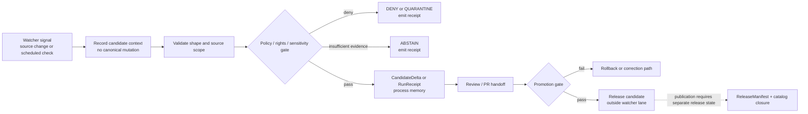

<!-- [KFM_META_BLOCK_V2]
doc_id: kfm://doc/TODO-watchers-readme-uuid
title: .github/watchers
type: standard
version: v1
status: draft
owners: TODO: owner not verified
created: TODO: YYYY-MM-DD
updated: TODO: YYYY-MM-DD
policy_label: TODO: public|internal
related:
  - ../README.md
  - ../workflows/README.md
  - ../actions/README.md
  - ../CODEOWNERS
  - ../PULL_REQUEST_TEMPLATE.md
  - ../../data/receipts/README.md
  - ../../data/proofs/README.md
  - ../../contracts/README.md
  - ../../schemas/README.md
  - ../../policy/README.md
  - ../../tests/README.md
  - ../../tools/validators/README.md
tags: [kfm, github, watchers, automation, receipts, governance, review]
notes:
  - "This README defines the watcher documentation and handoff boundary."
  - "Runtime watcher code, workflow YAML, emitted receipts, proof packs, source adapters, and platform rulesets require active-checkout verification."
  - "Placeholders must be resolved from repository history, CODEOWNERS, and current branch evidence before marking this document stable."
[/KFM_META_BLOCK_V2] -->

<a id="top"></a>

# `.github/watchers`

Documentation lane for watcher doctrine, emit-only automation boundaries, and review-ready handoff expectations in KFM.

> [!NOTE]
> **Status:** `draft`  
> **Owners:** `TODO: owner not verified`  
> **Authority:** `PROPOSED`  
> **Repo fit:** `.github/watchers/README.md`  
> **Review burden:** Watcher docs affect automation, source intake, receipts, and publication trust; changes should be reviewed by `.github/` owners plus the relevant source, policy, and validation maintainers.


**Quick jumps:** [Scope](#scope) · [Repo fit](#repo-fit) · [Accepted inputs](#accepted-inputs) · [Exclusions](#exclusions) · [Evidence boundary](#evidence-boundary) · [Directory tree](#directory-tree) · [Quickstart](#quickstart) · [Usage](#usage) · [Watcher flow](#watcher-flow) · [Review tables](#review-tables) · [Definition of done](#definition-of-done) · [Rollback](#rollback) · [Appendix](#appendix)

> [!IMPORTANT]
> Watchers may observe, summarize, and hand off signals. They do **not** decide truth, write canonical records, bypass policy, publish artifacts, or make uncited public claims.

---

## Scope

`.github/watchers/` is a GitHub gatehouse documentation surface for watcher behavior and review expectations.

A KFM watcher is any scheduled, event-driven, webhook-driven, or manually triggered process that notices a potential change and prepares a governed handoff. Watchers are useful only when they stay small, deterministic, auditable, and subordinate to KFM’s evidence and publication rules.

This README exists to keep the watcher lane honest:

1. explain what watcher doctrine requires
2. show what must be verified before claiming runtime behavior
3. prevent watcher docs from becoming a stealth policy, schema, source, receipt, proof, runtime, or publication home
4. give reviewers a compact checklist for watcher proposals

---

## Repo fit

`.github/watchers/README.md` sits inside the `.github/` gatehouse. It is adjacent to workflow, action, ownership, and PR-review documentation, but it is not itself an executable automation surface.

| Relation | Path | Role |
| --- | --- | --- |
| Parent gatehouse | [`../README.md`](../README.md) | Explains `.github/` review and automation posture |
| Workflow lane | [`../workflows/README.md`](../workflows/README.md) | Describes checked-in workflow orchestration and CI review expectations |
| Local action lane | [`../actions/README.md`](../actions/README.md) | Describes repo-local action helpers that workflows may call |
| Ownership | [`../CODEOWNERS`](../CODEOWNERS) | Routes review for `.github/` and adjacent trust surfaces |
| PR review | [`../PULL_REQUEST_TEMPLATE.md`](../PULL_REQUEST_TEMPLATE.md) | Captures reviewer checks before automation-affecting changes merge |
| Process memory | [`../../data/receipts/README.md`](../../data/receipts/README.md) | Receipts and validation reports belong under governed data receipt surfaces |
| Proof storage | [`../../data/proofs/README.md`](../../data/proofs/README.md) | Proof packs and attestations remain separate from receipts and docs |
| Contract meaning | [`../../contracts/README.md`](../../contracts/README.md) | Semantic object definitions live outside `.github/` |
| Machine schemas | [`../../schemas/README.md`](../../schemas/README.md) | Machine-checkable validation shapes live outside `.github/` |
| Policy gates | [`../../policy/README.md`](../../policy/README.md) | Rights, sensitivity, publication, AI, and source rules live outside `.github/` |
| Tests | [`../../tests/README.md`](../../tests/README.md) | Watcher regressions and negative paths must be testable |
| Validators | [`../../tools/validators/README.md`](../../tools/validators/README.md) | Validator implementations and promotion gates live outside this docs lane |

---

## Accepted inputs

Use this directory for documentation that helps reviewers understand watcher boundaries.

| Accepted material | Conditions |
| --- | --- |
| Watcher doctrine notes | Must preserve emit-only, review-first, fail-closed posture |
| Watcher proposal checklist | Must name source scope, runtime owner, receipts, policy gate, tests, and rollback |
| Current inventory notes | Must be generated from a current checkout and clearly dated |
| Handoff diagrams | Must not imply executable behavior that is not checked in |
| Links to workflows/actions | Must point to actual adjacent docs or clearly marked proposals |
| Review rubrics | Must keep contracts, schemas, policy, tests, receipts, proofs, and release state separate |

---

## Exclusions

Keep these out of `.github/watchers/`.

| Keep out | Why | Put it here instead |
| --- | --- | --- |
| Workflow YAML | Orchestration belongs in the workflow lane | [`../workflows/`](../workflows/) |
| Repo-local action implementations | Actions are executable helper code | [`../actions/`](../actions/) |
| Source adapters and runtime watcher code | Runtime ownership should not hide in `.github` docs | `connectors/`, `pipelines/`, or `packages/` after repo-specific verification |
| Canonical source descriptors | Source authority belongs in governed source registries | `data/registry/` or the repo’s verified registry home |
| Contract meaning | `.github/watchers/` must not become a contract home | [`../../contracts/`](../../contracts/) |
| JSON Schemas | Machine validation belongs in schemas | [`../../schemas/`](../../schemas/) |
| Policy bundles | Policy must remain reviewable and testable in policy roots | [`../../policy/`](../../policy/) |
| Test fixtures | Fixtures and test cases belong in test roots | [`../../fixtures/`](../../fixtures/) and [`../../tests/`](../../tests/) |
| Receipts and process memory | Receipts are emitted artifacts, not docs | [`../../data/receipts/`](../../data/receipts/) |
| Proof packs or attestations | Proof storage is separate from receipt memory | [`../../data/proofs/`](../../data/proofs/) |
| Release manifests | Publication is a governed release state | `release/` |
| Secrets, credentials, tokens, webhook secrets | Docs and repo files must not store secrets | GitHub environments or approved secret management |

---

## Evidence boundary

This README is a lane contract. It does not prove runtime behavior.

| Claim type | Required support |
| --- | --- |
| “This README exists” | Current checkout path inspection |
| “Watcher workflow exists” | Checked-in workflow YAML or verified platform evidence |
| “Watcher action runs” | Workflow reference plus action implementation and logs |
| “Watcher emitted receipt” | Receipt artifact under governed receipt storage |
| “Watcher passed policy” | Policy result or validation report |
| “Watcher created proof” | Proof pack or attestation in proof storage |
| “Watcher published artifact” | PromotionDecision, ReleaseManifest, catalog closure, and rollback target |
| “Watcher denied publication” | DecisionEnvelope or policy result showing finite negative outcome |

Use truth labels when status matters:

| Label | Use |
| --- | --- |
| `CONFIRMED` | Verified from current checkout, command output, tests, logs, receipts, proof objects, or generated artifacts |
| `PROPOSED` | Design or future implementation not yet verified |
| `UNKNOWN` | Not verifiable from current evidence |
| `NEEDS VERIFICATION` | Checkable before merge or release |
| `DENY` | Must fail closed because rights, sensitivity, policy, or release state is insufficient |
| `ABSTAIN` | Evidence is insufficient for a public claim |
| `ERROR` | Tooling, schema, validation, or runtime failure |

---

## Directory tree

### Expected lane minimum

```text
.github/
  watchers/
    README.md
```

### Verification command

```bash
find .github/watchers -maxdepth 3 -type f | sort
```

### Future additions

Additional files under `.github/watchers/` should remain documentation-only unless an ADR or repository convention explicitly assigns a broader role.

A future documentation-only tree might look like this:

```text
.github/
  watchers/
    README.md
    proposal-checklist.md        # PROPOSED documentation only
    inventory-template.md        # PROPOSED documentation only
```

> [!CAUTION]
> Do not add runtime code, adapters, workflow YAML, receipts, proofs, schemas, policy bundles, or source caches to this directory.

---

## Quickstart

Use these commands from the repository root before changing watcher documentation.

```bash
# confirm repository context
git rev-parse --show-toplevel
git status --short
git branch --show-current

# inspect watcher lane and adjacent gatehouse surfaces
find .github/watchers -maxdepth 3 -type f | sort
sed -n '1,260p' .github/watchers/README.md

sed -n '1,240p' .github/README.md 2>/dev/null || true
sed -n '1,240p' .github/workflows/README.md 2>/dev/null || true
sed -n '1,240p' .github/actions/README.md 2>/dev/null || true
sed -n '1,180p' .github/CODEOWNERS 2>/dev/null || true
sed -n '1,260p' .github/PULL_REQUEST_TEMPLATE.md 2>/dev/null || true

# inspect downstream trust surfaces before making runtime claims
find contracts schemas policy tests fixtures tools data/receipts data/proofs release \
  -maxdepth 3 -type f 2>/dev/null | sort | sed -n '1,360p'
```

Before describing any watcher as implemented, verify all of the following:

- the owning runtime surface is checked in
- the source family and source rights are documented
- contract and schema references are real
- policy gate and tests exist
- emitted receipts or proof objects are present when claimed
- workflow YAML or platform evidence supports automation claims
- rollback or supersession path is named

---

## Usage

### How reviewers should use this README

Use this README to evaluate whether a watcher proposal respects the KFM trust membrane.

A review-ready watcher proposal must answer:

1. What source family is watched?
2. What spatial, temporal, and source scope is allowed?
3. What stable identity or `spec_hash` is computed?
4. What receipt, validation report, or candidate delta is emitted?
5. Which policy gate can deny or quarantine the result?
6. Which tests prove replay and negative paths?
7. Which human review step is required before promotion?
8. What rollback or correction path applies if the watcher emits a bad signal?

### Minimal proposal shape

```yaml
watcher_proposal:
  truth_posture: PROPOSED
  source_family: TODO
  runtime_owner_surface: TODO
  trigger:
    kind: scheduled | webhook | manual | repository_dispatch | other
    cadence_or_event: TODO
  scope:
    spatial: TODO
    temporal: TODO
    source_role: TODO
  emit_only: true
  writes_to_canonical_truth: false
  publishes_public_artifacts: false
  expected_outputs:
    receipts: [TODO]
    validation_reports: [TODO]
    candidate_deltas: [TODO]
    proof_packs: []
  required_gates:
    - source_descriptor_verified
    - rights_checked
    - schema_valid
    - policy_checked
    - tests_passed
    - review_required
  rollback:
    rollback_target: TODO
    correction_path: TODO
  unresolved:
    - TODO
```

---

## Watcher flow



The watcher lane observes and hands off. It does not publish.

---

## Review tables

### Watcher boundary matrix

| Boundary | Watcher may do | Watcher must not do |
| --- | --- | --- |
| Source observation | Check source freshness, identity, or changed content | Treat a source signal as canonical truth |
| Data handling | Emit small receipts or candidate deltas | Store RAW, WORK, QUARANTINE, or processed data here |
| Policy | Invoke or link policy gates | Define policy meaning in this README |
| Contracts/schemas | Reference existing contracts and schemas | Become a parallel contract or schema home |
| Tests | Require replay and negative-path tests | Claim test coverage from prose |
| Publication | Hand off to review and promotion | Publish directly |
| AI | Provide evidence-bound context to governed AI later | Let generated language become proof |

### Finite outcomes

| Outcome | Meaning in watcher context |
| --- | --- |
| `ANSWER` | Rare for watchers; only appropriate for internal status summaries backed by receipts |
| `ABSTAIN` | Evidence is incomplete, ambiguous, stale, or unresolved |
| `DENY` | Rights, sensitivity, policy, release state, or safety gate blocks the action |
| `ERROR` | Tool, schema, runtime, credential, network, or validation failure |
| `QUARANTINE` | Candidate is retained for review but blocked from promotion |

### Required handoff artifacts

| Artifact | Role | Home |
| --- | --- | --- |
| `SourceDescriptor` | Defines source role, authority, rights, cadence, and scope | `contracts/`, `schemas/`, and source registry roots as verified |
| `RunReceipt` | Records what happened during a watcher run | `data/receipts/` |
| `ValidationReport` | Records schema or validator results | `data/receipts/` or verified validation output home |
| `PolicyDecision` | Records allow / deny / abstain decision | `data/receipts/`, `policy/`, or verified gate output home |
| `CandidateDelta` | Describes proposed change without promotion | governed work or receipt surface, not `.github/watchers/` |
| `PromotionDecision` | Records promotion gate decision | `release/` or verified promotion surface |
| `ReleaseManifest` | Defines release state | `release/` |
| `RollbackCard` | Names rollback target and correction path | `release/`, `docs/runbooks/`, or verified rollback surface |

---

## Definition of done

A watcher-related PR is not done until these checks are satisfied or explicitly marked `NEEDS VERIFICATION`.

- [ ] `.github/watchers/README.md` stays documentation-only
- [ ] runtime owner surface is named and verified
- [ ] source family and source role are documented
- [ ] source rights, cadence, freshness, and authority are checked
- [ ] contract and schema references are real
- [ ] policy gate is linked and fail-closed
- [ ] receipts are separated from proofs
- [ ] publication requires review and release state
- [ ] negative outcomes are finite and visible
- [ ] rollback or correction path is named
- [ ] tests cover replay, stale source, denied source, malformed output, and ambiguous evidence
- [ ] no secrets, credentials, or private tokens are stored in docs or committed files
- [ ] no public surface reads RAW, WORK, QUARANTINE, unpublished candidates, or direct model output

---

## Rollback

Documentation rollback is straightforward: revert the PR that changed this README and re-run repository validation.

Watcher implementation rollback is different. If a watcher emitted receipts, candidate deltas, or release-significant artifacts, rollback must identify:

1. the bad watcher run
2. the emitted receipt or validation report
3. the candidate or release object affected
4. the correction notice or rollback card
5. the affected public artifact, if any
6. the reviewer who accepted the rollback

Never delete audit artifacts to hide a bad run. Preserve the receipt trail and mark the bad output superseded, withdrawn, denied, or corrected through the governed correction path.

---

## Appendix

<details>
<summary><strong>Reviewer checklist for watcher claims</strong></summary>

Use this checklist before accepting watcher language in docs, issues, PRs, or release notes.

| Claim | Reviewer question |
| --- | --- |
| “Watcher exists” | Where is the checked-in runtime owner surface? |
| “Watcher runs” | Which workflow, schedule, webhook, or manual command proves it? |
| “Watcher is safe” | Which policy gate can deny it? |
| “Watcher emitted evidence” | Where is the receipt or validation report? |
| “Watcher changed data” | Was the change candidate-only, processed, cataloged, or published? |
| “Watcher published” | Where are PromotionDecision, ReleaseManifest, catalog closure, and rollback target? |
| “Watcher uses AI” | Did EvidenceBundle resolution happen before generated text? |
| “Watcher is current” | Which branch, commit, and timestamp were verified? |

</details>

<details>
<summary><strong>Open verification items</strong></summary>

- `doc_id`
- owner and CODEOWNERS coverage for `.github/watchers/`
- original creation date
- current branch inventory under `.github/watchers/`
- current workflow YAML inventory
- current local action callers
- platform rulesets, required checks, environment approvals, OIDC, and secrets posture
- source registry home and SourceDescriptor schema paths
- watcher receipt schema and emitted example
- active tests for watcher replay and negative paths
- promotion gate and release-manifest wiring
- rollback-card and correction-notice wiring

</details>

[Back to top](#top)
