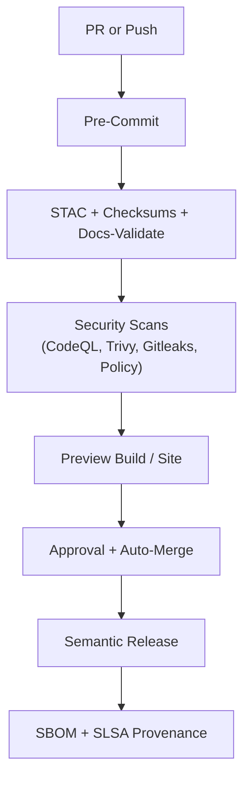

<div align="center">

# ⚙️ **Kansas Frontier Matrix — CI/CD Workflows**

`📁 .github/workflows/README.md`

**Mission:** Orchestrate **validation, security, data governance, versioning, and deployment** for the Kansas Frontier Matrix (KFM) — delivering a **reproducible**, **auditable**, **secure**, and **MCP-compliant** automation framework.

[](./site.yml)
[](./stac-validate.yml)
[](#-workflow-summary)
[](./codeql.yml)
[](./trivy.yml)
[](./dependency-review.yml)
[](./sbom.yml)
[](./slsa.yml)
[](../../docs/)
[](../../LICENSE)

</div>

---

## 📚 Overview

This directory defines all **GitHub Actions** used by **KFM’s CI/CD system** — aligned to **MCP-DL v6.3**:

🧒 **Documented** · 🔍 **Traceable** · 🔐 **Secure** · ♻️ **Reproducible** · 🧮 **Verifiable** · 🏷️ **Versioned**

### Domains

* 🧪 **Validation**: STAC, JSON Schema, link check, SHA-256 checksums, docs-validate  
* 🔒 **Security**: CodeQL, Trivy, Dependency Review, **SBOM**, SARIF, **Policy-as-Code**, **Gitleaks**  
* 🌊 **Data**: Manifest-driven ingestion, DVC/LFS sync, provenance catalogs  
* 🤖 **AI**: Nightly model training/eval; metrics + model card sync  
* 🚀 **Deploy**: GitHub Pages (docs, site)  
* 🧾 **Provenance**: SLSA attestations, signing, retention  
* 🧭 **Governance**: Auto-merge, SemVer, required checks, branch protections

---

## 🗂️ Workflow Directory

```bash
.github/workflows/
├── README.md                 # (this file)
├── site.yml                  # Build & deploy site/docs
├── stac-validate.yml         # STAC + JSON Schema + link validation
├── fetch.yml                 # Manifest-driven dataset fetch
├── checksums.yml             # SHA-256 computation & diff
├── dvc-sync.yml              # DVC/LFS pointer sync (optional)
├── docs-validate.yml         # Markdownlint + broken-link + metadata
├── ai-model.yml              # Train/test models; publish metrics
├── external-sync.yml         # NOAA/USGS/FEMA API heartbeat + schema check
├── codeql.yml                # Static analysis: SARIF
├── trivy.yml                 # CVE scanner + SBOM scan
├── sbom.yml                  # Syft SBOM generation (SPDX/JSON)
├── dependency-review.yml     # GH advisory scan on PR
├── policy-check.yml          # OPA/Conftest policy-as-code gates
├── gitleaks.yml              # Secret scanning with SARIF out
├── release.yml               # Tag, notes, bundle (semantic release)
├── slsa.yml                  # SLSA attestations & provenance
├── pre-commit.yml            # Format, lint, spellcheck, actionlint
└── auto-merge.yml            # Green-check gated auto-merge
```

> ⚠️ If renaming files, update: CI badges · status checks · documentation links.

---

## 🧩 Workflow Summary

| 🧱 Workflow             | 🎯 Purpose                          | ⏰ Trigger(s)           | 📦 Outputs                               |
|-------------------------|-------------------------------------|------------------------|------------------------------------------|
| `site.yml`              | Deploy GitHub Pages + site/docs     | `main`, manual         | `_site/` → Pages                         |
| `stac-validate.yml`     | STAC + JSON Schema + links          | PR, push               | `stac-report.json`                       |
| `fetch.yml`             | Fetch external datasets             | CRON, manual           | `data/raw/` snapshot + logs              |
| `checksums.yml`         | SHA-256 validation                  | data PR, manual        | `.sha256` files + integrity logs         |
| `dvc-sync.yml`          | DVC/LFS sync                        | data PR, manual        | `.dvc` state + pointer verification      |
| `docs-validate.yml`     | Docs as Code                        | PR, push               | Lint & link-check annotations            |
| `ai-model.yml`          | AI training/eval                    | nightly, manual        | Metrics, confusion matrices, model card  |
| `external-sync.yml`     | Upstream API heartbeat              | weekly, manual         | API schema & availability report         |
| `codeql.yml`            | Static analysis (security)          | schedule, PR, push     | `codeql.sarif`                           |
| `trivy.yml`             | CVE scan + SBOM scan                | weekly, PR             | `trivy.sarif`, severity summary          |
| `sbom.yml`              | Generate SBOM                       | PR, release            | `sbom.spdx.json` (Syft)                  |
| `dependency-review.yml` | Advisory annotations                | PR                     | Inline warnings, block on critical       |
| `policy-check.yml`      | Policy-as-Code (OPA)                | PR                     | Policy results; block on violation       |
| `gitleaks.yml`          | Secret scanning                     | PR, push               | `gitleaks.sarif` + artifact              |
| `release.yml`           | SemVer release & changelog          | tag, manual            | Release notes, assets, checksums         |
| `slsa.yml`              | SLSA provenance                     | post-release           | `slsa.intoto.jsonl` attestations         |
| `pre-commit.yml`        | Lint/format/spell/actionlint        | PR                     | PR annotations; fail-fast feedback       |
| `auto-merge.yml`        | Auto-merge after checks + review    | CI pass + CODEOWNERS   | Merged PR + audit trail                  |

---

## 🧠 Governance & SemVer Flow



---

## ⚙️ Workflow Design Patterns

### 🔐 OIDC + Least Privilege

```yaml
permissions:
  contents: read
  id-token: write
  security-events: write
```

### 🧹 Concurrency

```yaml
concurrency:
  group: ${{ github.workflow }}-${{ github.ref }}
  cancel-in-progress: true
```

### 🧱 Matrix Jobs (Python)

```yaml
strategy:
  matrix:
    python-version: ["3.11"]
    os: ["ubuntu-latest"]
```

### ⚡ Cache Pip, Node, & Pre-commit

```yaml
- uses: actions/cache@v4
  with:
    path: |
      ~/.cache/pip
      ~/.cache/pre-commit
      ~/.pnpm-store
    key: ${{ runner.os }}-${{ hashFiles('**/requirements*.txt', '**/pnpm-lock.yaml') }}
```

### 🌿 Environment Guards

```yaml
environment:
  name: production
  url: https://bartytime4life.github.io/Kansas-Frontier-Matrix/
```

---

## 🔐 Secrets & Env Vars

| 🔑 Key              | 🧪 Used By          | Purpose                       | 🔒 Notes                              |
|---------------------|---------------------|-------------------------------|---------------------------------------|
| `PAGES_TOKEN`       | site.yml            | GitHub Pages deploy           | Use Actions Secrets                   |
| `DATA_API_KEY_*`    | fetch.yml           | External data API access      | Rotate quarterly                      |
| `GH_TOKEN`          | auto-merge.yml      | GitHub API merge trigger      | Prefer default `GITHUB_TOKEN`         |
| `SIGNING_KEY`       | slsa.yml (optional) | Artifact signing              | Prefer keyless (OIDC) when available  |
| `OPENAI_API_KEY`    | ai-model.yml (opt)  | Summaries/tests (if enabled)  | Guard with OIDC + absent in forks     |

---

## 🧱 MCP Compliance Matrix

| ✅ Principle         | 🧪 Applied Through                                        |
|---------------------|-----------------------------------------------------------|
| Documentation-First | README, inline workflow docs, docs-validate               |
| Reproducibility     | Pinned actions, checksums, container digests, DVC/LFS     |
| Open Standards      | STAC, SARIF, SPDX, YAML, JSON Schema, Mermaid            |
| Provenance          | SLSA attestations, SHA-256, lineage in STAC              |
| Auditability        | Logs, artifacts, ≥ 90d retention                          |
| Security            | CodeQL, Trivy, Dependency Review, Policy, Gitleaks        |
| Versioning          | SemVer, changelogs, signed tags                           |

---

## 🔄 Maintenance Cadence

| 📆 Frequency | Task                                        | Purpose                          |
|--------------|---------------------------------------------|----------------------------------|
| Weekly       | CodeQL/Trivy runs · dependency review       | Early CVE detection              |
| Weekly       | Docs-validate + link check                  | Docs quality & IA integrity      |
| Monthly      | Pin refresh · Secrets review                | Supply-chain hygiene             |
| Monthly      | External API heartbeat (NOAA/USGS/FEMA)     | Data source stability            |
| Quarterly    | STAC schema audit · MCP docs check          | Governance review                |
| Per-Release  | Version tag · SBOM · SLSA · site bundle     | Immutable builds & provenance    |

---

## 🛠️ CLI & Targets

```bash
make site             # Build & preview documentation
make stac-validate    # Validate STAC + JSON Schema
make checksums        # Generate & diff SHA-256
make sbom             # Syft SBOM; scan with Grype
make dvc-sync         # Sync DVC pointers (if enabled)
python src/utils/fetch_data.py --manifest data/sources/foo.json
pre-commit run --all-files
```

<details><summary><strong>gh CLI Examples</strong></summary>

```bash
gh workflow run site.yml
gh run list
gh run download --name "stac-report.json"
```

</details>

---

## 🔒 Policy-as-Code (OPA/Conftest)

Representative gates enforced in `policy-check.yml`:

- No unpinned actions (tag or SHA required)  
- No plaintext secrets in workflow YAML  
- Required labels present (e.g., `domain:data`, `security:review`)  
- Artifact retention declared for new workflows  
- Disallow publishing of restricted data layers to public Pages

Failures produce inline PR annotations and block merge until resolved.

---

## 🧪 AI Model Workflow (ai-model.yml)

- Train/test NER & summarizer; publish metrics (F1/ROUGE)  
- Bias & regression checks against curated benchmark  
- Update `docs/templates/model_card.md` with hashes + metrics  
- Artifacts: `metrics.json`, confusion matrices, model assets (if stored)  
- Requires `@kfm-ai` approval to promote model

---

## 🕓 Version History

| Version | Date       | Notes                                                                 |
|---------|------------|-----------------------------------------------------------------------|
| v3.1.0  | 2025-10-18 | Added docs-validate, dvc-sync, ai-model, external-sync, policy, gitleaks |
| v3.0.0  | 2025-10-16 | Expanded security + SBOM + SLSA; governance clarifications           |
| v2.6.0  | 2025-10-16 | CI badge links verified · layout upgrades                             |
| v2.5.1  | 2025-10-15 | MCP-DL v6.3 compliance · Mermaid formatting                           |
| v2.5.0  | 2025-10-15 | Table + badge GFM compliance                                          |
| v2.4.0  | 2025-10-14 | Cadence matrix + SLSA annotations                                     |

---

<div align="center">

### ⚙️ Kansas Frontier Matrix — CI/CD: Automation with Integrity

“.github/workflows/” governs the execution, security, and provenance of every pipeline.  
🧬 Every run is traceable. Every artifact is proven.

</div>