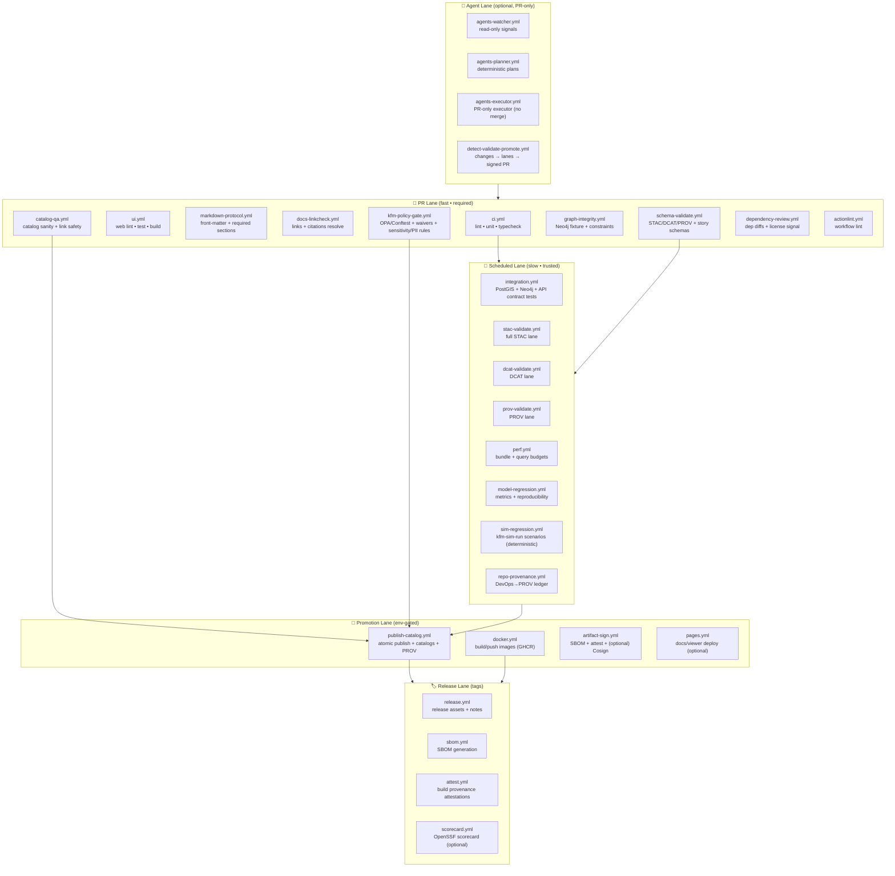
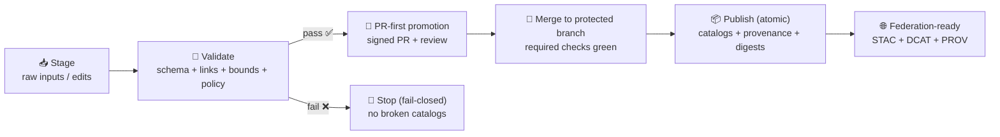

<a id="top"></a>

# 🧰 `.github/workflows/` — CI/CD for Kansas Frontier Matrix (KFM)

<div align="left">

<!-- ✅ Existing workflow badges (should match real workflow filenames in this repo) -->
<a href="https://github.com/bartytime4life/Kansas-Frontier-Matrix/actions/workflows/ci.yml"></a>
<a href="https://github.com/bartytime4life/Kansas-Frontier-Matrix/actions/workflows/codeql.yml"></a>
<a href="https://github.com/bartytime4life/Kansas-Frontier-Matrix/actions/workflows/pages.yml"></a>

<!-- 🧭 KFM “shape” badges (conceptual, but aligned to v13 specs) -->


</div>

> 🧭 This folder contains GitHub Actions workflows that keep KFM **buildable**, **testable**, **secure**, and **shippable** — across **pipelines → catalogs → graph → API → UI → story nodes → focus mode**.  
> ✅ **North Star:** CI/CD protects **trust** (contracts + provenance + governance + supply chain) first, then **speed** (caching + change-aware gates).  
> 🚦 **KFM canonical order (non‑negotiable):** **ETL → STAC/DCAT/PROV → Graph → API → UI → Story Nodes → Focus Mode**.  

> [!IMPORTANT]
> CI is intentionally **boring** (predictable, repeatable, least‑privilege, auditable).  
> The data, stories, and models are the interesting part. 🗺️✨

---

## 🧾 Workflow policy metadata

| Field | Value |
| --- | --- |
| Folder | `.github/workflows/` |
| Status | Active ✅ |
| Last updated | **2026-01-26** |
| v13 source of truth | `docs/MASTER_GUIDE_v13.md` (or mirrored from the v13 guide source) 🧭 |
| Canonical pipeline invariant | **ETL → STAC/DCAT/PROV → Graph → API → UI → Story → Focus** |
| Governance | FAIR + CARE (data + people) 🧭 |
| CI philosophy | PR‑fast lane + scheduled heavy lanes + env‑gated promotion 🚦 |
| Runner baseline | `ubuntu-latest` *(pin images for hermetic lanes: `ubuntu-24.04`)* 🐧 |
| Least‑privilege default | `permissions: { contents: read }` 🔐 |
| PR‑first promotion | Promotion happens via **signed PRs**, not direct pushes 🧾 |
| Fail‑closed posture | Promotion-critical workflows stop on policy/schema/provenance violations 🧯 |
| Canonical publish boundary (v13) | `data/stac/**`, `data/catalog/dcat/**`, `data/prov/**` 🧾 |
| Story Nodes canonical (v13) | `docs/reports/story_nodes/**` 🎬 |
| Policy Pack (current target) | `api/scripts/policy/**` *(OPA/Rego + Conftest + waivers + CI wrapper)* ⚖️ |
| “Data as artifacts” posture | OCI + digests + signatures (recommended) 📦🔏 |

> [!NOTE]
> Some legacy docs and older repo structures may mention `data/catalog/` and `data/provenance/`.  
> v13 standardizes to `data/stac/**`, `data/catalog/dcat/**`, and `data/prov/**` as the canonical **publish boundary**.

---

## ⚡ Quick links

| Action | Link |
| --- | --- |
| ✅ All Action runs | https://github.com/bartytime4life/Kansas-Frontier-Matrix/actions |
| 📦 Releases | https://github.com/bartytime4life/Kansas-Frontier-Matrix/releases |
| 🐛 Issues | https://github.com/bartytime4life/Kansas-Frontier-Matrix/issues |
| 🤝 `.github/` collaboration hub | [`../README.md`](../README.md) |
| 🧭 Repo root overview | [`../../README.md`](../../README.md) |
| 🔐 Security policy | [`../../SECURITY.md`](../../SECURITY.md) |

> [!TIP]
> If an Actions badge 404s, the workflow file probably doesn’t exist yet.  
> This README is a **spec + target shape** — keep it in lockstep with implemented workflows to prevent drift. 🧾✅

---

<details>
<summary><b>🧭 Table of contents</b></summary>

* [📺 Mermaid Workflow TV](#mermaid-workflow-tv)
* [🧠 CI/CD principles](#cicd-principles)
* [🧪 Minimum CI gates for v13 contributions](#minimum-ci-gates-for-v13-contributions)
* [🧬 KFM invariants CI must enforce](#kfm-invariants-ci-must-enforce)
* [🗂️ Repo layout & path triggers](#repo-layout--path-triggers)
* [📁 What lives here](#what-lives-here)
* [🗂️ Workflow catalog](#workflow-catalog)
* [🚦 Change-aware gate matrix](#change-aware-gate-matrix)
* [🧱 Promotion gates](#promotion-gates)
* [🧑‍⚖️ Policy as code gates](#policy-as-code-gates)
* [🧾 Policy Pack — rule IDs + waivers](#policy-pack--rule-ids--waivers)
* [🧬 Repo provenance lane](#repo-provenance-lane)
* [🤖 Agent automation lane](#agent-automation-lane)
* [🗺️ Data + catalog gates](#data--catalog-gates)
* [🕸️ Graph + semantics gates](#graph--semantics-gates)
* [🎬 Story Nodes + Focus Mode gates](#story-nodes--focus-mode-gates)
* [🧪 Integration tests](#integration-tests)
* [🌐 Web UI gates](#web-ui-gates)
* [📦 Offline packs + AR gates](#offline-packs--ar-gates)
* [📈 Modeling + simulation gates](#modeling--simulation-gates)
* [⚡ Performance gates](#performance-gates)
* [🔐 Security scanning](#security-scanning)
* [🔭 Observability & telemetry](#observability--telemetry)
* [📦 Artifacts & traceability](#artifacts--traceability)
* [🧷 Secrets & environments](#secrets--environments)
* [🧩 Reusable workflows & composite actions](#reusable-workflows--composite-actions)
* [🛠️ Starter templates](#starter-templates)
* [🧰 Debug locally](#debug-locally)
* [🧾 Adding a new workflow checklist](#adding-a-new-workflow-checklist)
* [📚 Reference library & influence map](#reference-library--influence-map)

</details>

---

<a id="mermaid-workflow-tv"></a>

## 📺 Mermaid Workflow TV

A “TV guide” of how work moves through KFM CI/CD (PR fast lane → scheduled heavy lanes → env‑gated publish). 📺🧪



**Plain-English summary:**

* PR lane stays fast and blocks obvious breakage.
* Scheduled lanes do real integration, heavy validation, and budget checks.
* Promotion is **env‑gated**, **atomic**, and **audit‑friendly**.
* Optional agents are allowed only if they respect **kill‑switch + determinism + PR‑only**. 🤖🧯

> [!TIP]
> Mermaid on GitHub can be picky. To avoid parse errors:
>
> * keep **one edge per line**
> * use simple IDs (`PR1`, `N1`, …)
> * put punctuation/emoji inside quotes if needed 😄

---

<a id="cicd-principles"></a>

## 🧠 CI/CD principles

### ✅ 1) Contracts over vibes

KFM treats key interfaces as contracts (CI enforces drift detection):

* 📜 **API** contracts (OpenAPI + GraphQL schema) — contract-first is the v13 posture.
* 🗂️ **Catalog** contracts (STAC / DCAT)
* 🧾 **Lineage** contracts (W3C PROV JSON‑LD)
* 🕸️ **Graph** contracts (stable IDs + relationship shapes + migrations)
* 📈 **Evidence artifacts** (analysis/model/simulation outputs: manifests + seeds + metrics)

> [!IMPORTANT]
> If a contract changes, CI must prove: **compatibility** (or a controlled version bump) + **migration notes** + **updated schemas**.

### ✅ 2) Layered gates beat mega workflows

CI mirrors KFM’s architecture with layered checks:

1. **Code gate** → lint, unit tests, type checks
2. **Doc gate** → Markdown protocol + links + citations resolve
3. **Schema gate** → STAC/DCAT/PROV/Story schema validation
4. **Policy gate** → FAIR+CARE, sovereignty, sensitivity, licensing
5. **Integration gate** → real DBs/services via containers (PostGIS + Neo4j as needed)
6. **Security gate** → SAST, dependency review, secret scanning, container scan
7. **Promotion gate** → env‑gated publish with SBOM + attestations (+ signatures)

### ✅ 3) Deterministic, idempotent, auditable 🧾

* Same inputs + config + seed ⇒ same outputs (or diffs are logged and explained)
* Artifacts and logs are uploaded on failure
* Promotion is atomic (no half‑published catalogs)
* Every publishable run emits: run id + inputs + outputs + digests + provenance

### ✅ 4) Least privilege by default 🔐

* Minimal `permissions:` per workflow/job
* No secrets on untrusted PRs (especially forks)
* Avoid `pull_request_target` unless you can justify and review it like production code

---

<a id="minimum-ci-gates-for-v13-contributions"></a>

## 🧪 Minimum CI gates for v13 contributions

v13 defines a “definition of done” for the repo itself: every contribution should pass a minimum set of CI validations. ✅

### ✅ Gate 1 — Markdown protocol & front‑matter check

* Governed docs + Story Nodes must pass front‑matter + required section checks.
* Broken front‑matter or missing required sections fails the build.

**Workflow:** `markdown-protocol.yml`  
**Typical trigger paths:** `docs/**`, `docs/reports/story_nodes/**`, `docs/templates/**`

### ✅ Gate 2 — Link/reference validation (docs + Story Nodes)

* CI verifies internal links, citations, and references resolve (no dangling references).
* Prevents “story cites a thing that doesn’t exist” drift.

**Workflow:** `docs-linkcheck.yml`

### ✅ Gate 3 — JSON schema validation (STAC/DCAT/PROV + Story schema)

* Validate structured outputs: STAC Items/Collections, DCAT datasets, PROV JSON‑LD, Story Node metadata (plus UI/telemetry schemas when present).

**Workflow:** `schema-validate.yml`

### ✅ Gate 4 — Graph integrity tests (Neo4j fixture lane)

* Load a small fixture graph and assert constraints: stable IDs, required properties, relationship validity.
* Catches ontology/data‑model regressions early.

**Workflow:** `graph-integrity.yml`

> [!NOTE]
> **Security scanning** (CodeQL/dependency review/secret scanning) should be present early too — but keep PR checks fast by pushing heavy scans to schedule where needed.

---

<a id="kfm-invariants-ci-must-enforce"></a>

## 🧬 KFM invariants CI must enforce

These are architecture rules that double as security + integrity controls. 🔒🧭

1. 🚦 **Pipeline ordering is absolute**  
   **ETL → Catalogs (STAC/DCAT/PROV) → Graph → API → UI → Story Nodes → Focus Mode**

2. 🔌 **API boundary rule**  
   Frontends (web, mobile, AR, offline tooling) must not query Neo4j or PostGIS directly in production. They go through the governed API boundary so access control + redaction + schemas remain enforceable.

3. 🧾 **Provenance-first publishing**  
   If it’s visible, it must be cataloged and traceable (STAC/DCAT + PROV lineage) **before** graph/UI/story use.

4. ♻️ **Deterministic ETL + evidence artifacts**  
   ETL and analysis/simulation runs must be replayable (seeded, config‑driven, logged, idempotent).

5. 🧭 **Sovereignty & classification propagate**  
   Outputs cannot be less restricted than inputs; public releases require redaction/generalization where needed.

6. ✅ **Validation gates are enforceable**  
   If a rule matters, CI must be able to **fail** for violating it (or block promotion).

7. 🧊 **Derived indices are not sources of truth**  
   Search indices, tiles, caches, embeddings are **derived artifacts**. CI should regenerate them deterministically or prove their digests match trusted inputs.

---

<a id="repo-layout--path-triggers"></a>

## 🗂️ Repo layout & path triggers

v13 calls out “one canonical home per subsystem” and standardizes where publish-boundary artifacts live (STAC/DCAT/PROV). 🧱

### ✅ v13 baseline (preferred)

```text
📦 Kansas-Frontier-Matrix/
├─ 📁 .github/
│  └─ 📁 workflows/               # ✅ CI/CD lives here
├─ 📁 docs/
│  ├─ 📄 MASTER_GUIDE_v13.md      # 🧭 canonical system guide
│  ├─ 📁 templates/               # 🧾 governed doc templates
│  ├─ 📁 standards/               # 📐 KFM profiles (STAC/DCAT/PROV/Markdown)
│  └─ 📁 reports/
│     └─ 📁 story_nodes/          # 🎬 Story Nodes (governed)
├─ 📁 pipelines/                  # ♻️ deterministic ETL + simulation tools
├─ 📁 api/                        # 🔌 API boundary (FastAPI + contracts)
├─ 📁 web/                        # 🌐 React UI (MapLibre; optional Cesium)
├─ 📁 data/
│  ├─ 📁 raw/                     # 📥 staged raw inputs (domain-scoped)
│  ├─ 📁 work/                    # 🧪 intermediates (domain-scoped)
│  ├─ 📁 processed/               # ✅ standardized outputs (domain-scoped)
│  ├─ 📁 stac/
│  │  ├─ 📁 collections/          # 🗂️ STAC collections (publish boundary)
│  │  └─ 📁 items/                # 🧾 STAC items (publish boundary)
│  ├─ 📁 catalog/
│  │  └─ 📁 dcat/                 # 🧾 DCAT JSON-LD (publish boundary)
│  └─ 📁 prov/                    # 🧬 PROV JSON-LD (publish boundary)
└─ 📁 tests/                      # 🧪 unit + integration tests
```

### 🧭 “Consolidation target” (optional, for later)

Some branches may consolidate `api/` + pipeline code into `src/**` (e.g., `src/server`, `src/pipelines`, `src/graph`). If you do: **keep path filters dual-compatible during migration** (CI shouldn’t break mid‑move).

### 🧩 Legacy → v13 mapping (practical CI hint)

> CI can support both during migration, but v13 paths should be treated as canonical.

```text
🧩 Legacy paths sometimes referenced
- data/catalog/            -> data/stac/ (STAC) + data/catalog/dcat/ (DCAT)
- data/provenance/         -> data/prov/
- docs/stories/            -> docs/reports/story_nodes/
- api/                     -> api/ (today) or src/server/ (optional future)
- pipelines/               -> pipelines/ (today) or src/pipelines/ (optional future)
```

---

<a id="what-lives-here"></a>

## 📁 What lives here

> Target shape — add as needed, keep intent stable.  
> Use ✅ for “likely exists now” and 🧾 for “spec / planned”.

```text
📁 .github/workflows/
├─ ✅ ci.yml                        # fast PR lane: lint + unit tests + type checks
├─ 🧾 ui.yml                        # web lint/test/build (path-aware)
├─ 🧾 markdown-protocol.yml         # docs: YAML front-matter + required sections (v13 minimum)
├─ 🧾 docs-linkcheck.yml            # doc link checker (v13 minimum)
├─ 🧾 schema-validate.yml           # schema lane: STAC/DCAT/PROV + story schema (v13 minimum)
├─ 🧾 graph-integrity.yml           # Neo4j fixture + constraint checks (v13 minimum)
├─ 🧾 api-contract.yml              # OpenAPI/GraphQL diff + contract tests (contract-first)
├─ 🧾 dependency-review.yml         # dependency review for PRs
├─ 🧾 catalog-qa.yml                # fast STAC/DCAT sanity + link safety gate
├─ 🧾 kfm-policy-gate.yml           # Policy Pack: OPA/Conftest + waivers + sensitivity/PII rules
├─ 🧾 repo-provenance.yml           # DevOps→PROV ledger emitter (scheduled/merge/tag)
├─ ✅ codeql.yml                    # SAST (scheduled + optional PR)
├─ ✅ pages.yml                     # docs/viewer deploy (optional)
├─ 🧾 integration.yml               # PostGIS (+ Neo4j) + API contract integration tests
├─ 🧾 perf.yml                      # bundle size + query timing budgets (scheduled)
├─ 🧾 model-regression.yml          # metrics drift + reproducibility checks (scheduled)
├─ 🧾 sim-regression.yml            # deterministic scenario simulator lane (scheduled/manual)
├─ 🧾 docker.yml                    # build/push images (GHCR)
├─ 🧾 publish-catalog.yml           # env-gated catalog promotion (atomic publish)
├─ 🧾 artifact-sign.yml             # SBOM + attest + (optional) Cosign signing
├─ 🧾 release.yml                   # release packaging + changelog + provenance
├─ 🧾 sbom.yml                      # SBOM generation (SPDX/CycloneDX)
├─ 🧾 attest.yml                    # build provenance attestations (SLSA-ish)
├─ 🧾 scorecard.yml                 # OpenSSF Scorecard (optional)
├─ 🧾 actionlint.yml                # workflow lint (recommended)
├─ 🧾 agents-watcher.yml            # optional: read-only agent watcher
├─ 🧾 agents-planner.yml            # optional: deterministic planner
├─ 🧾 agents-executor.yml           # optional: PR-only executor (no merge)
├─ 🧾 detect-validate-promote.yml   # optional: change detection → lanes → signed PR
└─ 📄 README.md                     # you are here 👋
```

---

<a id="workflow-catalog"></a>

## 🗂️ Workflow catalog

> If a workflow file isn’t present yet, treat this table as the **spec** for creating it.

| Workflow 📄 | Lane | Protects ✅ | Triggers ⏱️ | Budget 🎯 | Key outputs 📦 |
| --- | --- | --- | --- | ---: | --- |
| `ci.yml` | PR | code integrity | `pull_request`, `push main` | ≤ 10–12 min | junit, coverage, logs |
| `ui.yml` | PR | UI build integrity | PR paths `web/**` | ≤ 12–15 min | build logs, bundle report |
| `markdown-protocol.yml` | PR | docs governance | `docs/**`, `docs/reports/story_nodes/**`, templates | ≤ 7–10 min | front-matter report |
| `docs-linkcheck.yml` | PR | docs reliability | `**/*.md` | ≤ 10 min | link report |
| `schema-validate.yml` | PR | schema conformance | `schemas/**`, `data/stac/**`, `data/catalog/dcat/**`, `data/prov/**`, story nodes | ≤ 12–15 min | schema report |
| `graph-integrity.yml` | PR | graph/ontology shape | `graph/**` / graph tooling paths | ≤ 12–15 min | fixture ingest logs |
| `api-contract.yml` | PR | contract-first API boundary | `api/**` *(+ optional `src/server/**`)* | ≤ 10–12 min | openapi/graphql diff |
| `dependency-review.yml` | PR | dependency risk signal | `pull_request` (code changes) | ≤ 5 min | dependency report |
| `catalog-qa.yml` | PR | metadata “foot‑guns” | `data/**`, `schemas/**` | ≤ 7–10 min | QA report |
| `kfm-policy-gate.yml` | PR | governance + sensitivity + supply chain | `data/**`, `docs/**`, `schemas/**`, `.github/**`, `api/scripts/policy/**` | ≤ 7–10 min | policy + waiver decisions |
| `repo-provenance.yml` | schedule/main | “repo as dataset” ledger | schedule + `push main` + tags | ≤ 10–15 min | `devops-prov.jsonld` |
| `codeql.yml` | schedule | SAST | schedule (+ optional PR) | n/a | SARIF |
| `integration.yml` | schedule | real DB/API parity | schedule + dispatch | 10–45 min | logs, junit |
| `stac-validate.yml` | schedule | STAC conformance | schedule + dispatch | 10–30 min | schema report |
| `dcat-validate.yml` | schedule | DCAT conformance | schedule + dispatch | 10–30 min | schema report |
| `prov-validate.yml` | schedule | PROV integrity | schedule + dispatch | 10–30 min | schema report |
| `perf.yml` | schedule | perf budgets | schedule + dispatch | 10–30 min | perf report |
| `model-regression.yml` | schedule | reproducibility | schedule + dispatch | 10–45 min | metrics + artifacts |
| `sim-regression.yml` | schedule/manual | scenario rigor | schedule + dispatch | 10–60 min | sim outputs + diffs |
| `publish-catalog.yml` | env-gated | atomic publish | `workflow_dispatch` | n/a | catalogs + PROV + digests |
| `docker.yml` | main/tag | images | `push main`, tags | ≤ 30 min | OCI images + digests |
| `artifact-sign.yml` | main/tag | integrity | `push main`, tags | ≤ 20 min | SBOM + attest + sigs |
| `release.yml` | tag | releases | tags | n/a | release assets |

---

<a id="change-aware-gate-matrix"></a>

## 🚦 Change-aware gate matrix

Make gates **path-aware** so PR checks stay fast and relevant (and align to v13 subsystem homes). 🧭

| Change type | Examples | Required gates |
| --- | --- | --- |
| 🧠 Core code | `api/**`, `pipelines/**`, shared libs | `ci.yml` (+ CodeQL as configured) |
| ♻️ Pipelines | pipeline code + configs | `ci.yml` + `catalog-qa.yml` + `schema-validate.yml` |
| 🗺️ Data/catalog | `data/**`, `data/stac/**`, `data/catalog/dcat/**`, `data/prov/**`, `schemas/**` | `catalog-qa.yml` + `schema-validate.yml` + `kfm-policy-gate.yml` |
| 🕸️ Graph/ontology | graph tooling, ID registries, ontology docs | `graph-integrity.yml` (+ integration optional) |
| 🔌 API boundary | `api/**` (or `src/server/**`) | `ci.yml` + `api-contract.yml` |
| 🌐 Web UI | `web/**` | `ui.yml` + `ci.yml` |
| 🎬 Story nodes | `docs/reports/story_nodes/**` | `markdown-protocol.yml` + `docs-linkcheck.yml` + `schema-validate.yml` + policy |
| 🔐 Workflows | `.github/workflows/**`, `.github/actions/**` | `actionlint.yml` + policy + human review |
| 📚 Docs-only | `docs/**` | `markdown-protocol.yml` + `docs-linkcheck.yml` (+ policy when governance applies) |

> [!CAUTION]
> Workflows are security-sensitive. Treat them like production code. 🔐

---

<a id="promotion-gates"></a>

## 🧱 Promotion gates

KFM uses an intentionally gate‑enforced lifecycle: **stage → validate → (optionally attest/sign) → promote via PR → publish**. 🚦



### ✅ What “promotion” means (KFM-shaped)

Promotion is not “copying files somewhere.” It means:

* 🗂️ catalogs are complete (STAC/DCAT)
* 🧾 lineage exists (PROV: inputs → activities → outputs)
* ✅ QA passed (schema, links, bounds, CRS, sensitivity)
* 🔐 access rules are respected (public vs restricted)
* ♻️ publish is atomic (no partial catalogs)
* 🔏 optional: artifacts are signed/attested (SBOM + provenance)

### 🔏 Attestation, SBOM, signatures (recommended)

For anything published:

* attach an **SBOM** (SPDX/CycloneDX)
* emit a **build provenance** record (SLSA-ish)
* (optional but strongly recommended) **sign artifacts** (Cosign/Sigstore)
* store PROV JSON‑LD alongside catalogs for audit + rollback

---

<a id="policy-as-code-gates"></a>

## 🧑‍⚖️ Policy as code gates (OPA/Rego + Conftest)

Policy gates are how FAIR+CARE becomes enforceable, not aspirational. ⚖️✅

KFM’s Policy Pack is expected to validate:

* catalog completeness (STAC/DCAT)
* provenance completeness (PROV)
* sovereignty/classification propagation
* licensing/attribution requirements
* link safety / allowlists (no SSRF foot‑guns)
* sensitive-location & PII rules (generalize/omit/restrict)
* workflow hardening (least privilege, safe triggers, pinning posture)

### 🎯 What policy gates should enforce

**Governance / data integrity**

* license & attribution required for promoted datasets
* sensitive-location rules (generalize/omit/limit precision)
* provenance required (no “mystery layers”)
* catalog conventions (stable IDs, required fields, extension allow/deny lists)
* “classification propagation” (outputs inherit restrictions)

**Catalog safety**

* safe link rules (`links[].href` allow/deny lists; no unsafe schemes)
* metadata profile expectations for STAC/DCAT/PROV
* policy outcomes must be human-readable (“what failed” + “how to fix”)

**Supply chain safety**

* workflow permissions least‑privilege
* workflow trigger safety (avoid risky `pull_request_target`)
* action pinning policy (major versions now; migrate toward SHA pinning)
* promotion jobs are kill‑switch protected

### ✅ Conftest workflow pattern (PR gate)

**When to run**

* PR touches `data/**`, `docs/**`, `schemas/**`, `.github/**`, `api/scripts/policy/**`

**How to run**

* no secrets
* `permissions: contents: read`
* short timeout
* upload report artifact on failure
* run Rego tests in CI (Conftest `test` + unit tests)

Example command shapes:

```bash
# policy checks against repo content
conftest test \
  -p api/scripts/policy/rego \
  --all-namespaces \
  .

# policy unit tests (Rego tests)
conftest verify \
  -p api/scripts/policy/rego \
  api/scripts/policy/tests
```

> [!TIP]
> Keep policy rules “deny by default” and explain failures clearly (“what failed” + “how to fix”). 🧯

---

<a id="policy-pack--rule-ids--waivers"></a>

## 🧾 Policy Pack — rule IDs + waivers

KFM’s Policy Pack should be **auditable** and **operationally practical**:

* every rule has an ID
* exceptions are time‑bounded
* waiver usage is visible in CI artifacts

### 🏷️ Rule ID convention (examples)

* `KFM-CAT-*` → catalog requirements (STAC/DCAT)
* `KFM-PROV-*` → provenance requirements (PROV JSON‑LD)
* `KFM-SOV-*` → sovereignty/classification propagation
* `KFM-LINK-*` → link safety / allowlists
* `KFM-AI-*` → Focus Mode evidence/citation requirements
* `KFM-SC-*` → supply chain hardening rules (workflow perms, pinning)

### 🧾 Waivers

A `waivers.yml` mechanism (recommended) for **time-bound exceptions** must include:

* the rule ID(s)
* a reason
* an owner
* an expiry date/time
* the mitigation plan

**CI behavior (target posture):**
* expired waiver → **fail closed**
* waiver present → allowed **with loud artifacts** (`waiver-decisions.json`)
* waivers never bypass “hard safety” rules (e.g., sensitive location leaks)

---

<a id="repo-provenance-lane"></a>

## 🧬 Repo provenance lane

KFM treats its own evolution as traceable evidence: you should be able to ask “which PR produced this dataset?” and answer it with provenance records. 🧾

### ✅ What this lane should do

A `repo-provenance.yml` workflow (scheduled + on merge/tag) should emit:

* a **PROV JSON‑LD** record describing the CI run as an Activity
* the merged PR (and reviewers) as Agents/Activities
* digests of publish boundary artifacts (STAC/DCAT/PROV files)
* links to artifacts: SBOM, attestations, build-info.json

This makes KFM’s DevOps pipeline “first-class evidence.”

---

<a id="agent-automation-lane"></a>

## 🤖 Agent automation lane (optional) — Watcher · Planner · Executor

Agent automation is allowed only if it stays **governed**, **deterministic**, and **PR‑first**. 🤖🧯

### ✅ Allowed agent behaviors

* 👀 **Watcher**: read‑only signals (facts/alerts), no side effects
* 🧠 **Planner**: deterministic planning (seeded, repeatable), no network by default
* 🧰 **Executor**: runs gates and opens/updates PRs **without merge permissions**

### 🧯 Kill-switch (non-negotiable)

Agents and promotion workflows must honor a central kill switch.

Recommended pattern:

* every workflow that can publish/sign calls a shared step/action first
* if kill-switch is enabled: stop **before** any publish/sign step

✅ Prefer a composite action like `/.github/actions/check-kill-switch` so logic stays consistent.

**Common kill-switch options:**
* repo file flag: `.agent-freeze` (or `.kfm-freeze`)
* environment boolean: `KFM_FREEZE=1` (in GitHub Environments)
* branch protection + manual approvals for `prod`

### 🔐 Token scopes (non-negotiable)

* Watcher/Planner: **read-only** tokens (or none)
* Executor: short‑lived token that can **open PRs**, but **cannot merge**
* Branch protections remain the human safety rail ✅

### 🧾 Artifact expectations

Agent runs should emit:

* a plan (`plan.yml`) + deterministic diff (`diff.patch`)
* gate results (`reports/gates.json`)
* provenance (`prov.jsonld`)
* a PR body that links to evidence artifacts (no vibes)

> [!IMPORTANT]
> If any gate fails, Executor **does not** open/update a PR. It emits evidence and stops. 🚦

---

<a id="data--catalog-gates"></a>

## 🗺️ Data + catalog gates (KFM-specific)

KFM pipelines are expected to be deterministic and to emit standardized outputs under `data/processed/` with catalog + provenance updates (STAC/DCAT/PROV). 🧾

### ✅ “Catalog QA” (fast PR filter)

Runs on PRs that touch `data/**` (and validator code). Prevents broken catalogs from merging.

**Fast checks:**

* required fields present (license, providers, ids, titles) ✅
* `links[].href` safety (allowlists; no unsafe schemes) ✅
* schema sanity on a fixture subset ✅
* CRS + bounds sanity ✅
* sensitivity/PII flags validated ✅

### 🧭 CRS + bounds sanity

Geospatial bugs often come from silent CRS drift:

* EPSG present where expected
* bbox/footprint valid
* Kansas bounds sanity (when claiming Kansas scope)
* geometry validity checks (self-intersections, empties)

> [!CAUTION]
> PR gates should be fast (fixtures + metadata). Deep checks belong in scheduled lanes. 🌙

---

<a id="graph--semantics-gates"></a>

## 🕸️ Graph + semantics gates

KFM’s graph is the semantic backbone for Story Nodes and Focus Mode (and for governed AI context). 🕸️🧠

### ✅ Graph integrity gates should enforce

* stable entity IDs (no renaming without migration notes)
* relationship shape validation (allowed edge types)
* reference integrity (Story Node entity IDs exist)
* fixture build + constraint tests (unique IDs, required properties)

### 🧠 Ontology-aware regression safety (practical)

CI should protect:

* constraint migrations (`graph/migrations/**` or equivalent)
* ontology docs (`docs/standards/**`)
* mapping scripts (STAC/DCAT → graph import)

---

<a id="story-nodes--focus-mode-gates"></a>

## 🎬 Story Nodes + Focus Mode gates

Story Nodes and Focus Mode are trust-sensitive because they look authoritative. 🎬🔎

### ✅ Story Node lint should enforce (evidence-first)

Story Nodes must:

* include provenance/citations for key claims
* reference graph entities via stable identifiers
* distinguish fact vs interpretation (especially with AI assistance)
* honor sensitivity rules (precision, sovereignty)
* only reference assets that exist and are licensed

### ✅ Focus Mode rules (hard gate)

Focus Mode has strict trust rules; CI should treat these as non‑negotiable invariants:

* **only provenance‑linked content** is allowed to render
* **AI contributions must be opt‑in** and clearly labeled with uncertainty/confidence
* **no sensitive location leaks** — maps must generalize/omit sensitive points

### 🧾 Audit trail expectation (telemetry)

Consider a small UI integration test that asserts:  
“sensitive layer rendered → redaction notice shown → telemetry event emitted”. ✅

---

<a id="integration-tests"></a>

## 🧪 Integration tests

Spatial correctness needs real PostGIS (and optionally Neo4j). Prefer containerized integration tests.

KFM’s query-time division of labor:

* Neo4j provides semantic context and dataset/entity linking
* PostGIS does heavy spatial/aggregation work
* the API coordinates them (especially for Focus Mode flows)

### Option A: GitHub Actions service containers (fast + simple)

**PostGIS service**

```yaml
services:
  db:
    image: postgis/postgis:15-3.4
    env:
      POSTGRES_DB: kfm_test
      POSTGRES_USER: postgres
      POSTGRES_PASSWORD: postgres
    ports:
      - 5432:5432
    options: >-
      --health-cmd="pg_isready -U postgres -d kfm_test"
      --health-interval=10s
      --health-timeout=5s
      --health-retries=10
```

**Neo4j (optional)**

```yaml
services:
  neo4j:
    image: neo4j:5
    env:
      NEO4J_AUTH: neo4j/testpass
    ports:
      - 7474:7474
      - 7687:7687
```

> [!CAUTION]
> The #1 cause of CI flake is “tests started before DB was ready.”  
> Always add health checks + explicit waits. ✅

### Option B: Docker Compose (multi-service parity)

Best when you need API + workers + DB + cache for realistic end‑to‑end tests.

---

<a id="web-ui-gates"></a>

## 🌐 Web UI gates (responsive + WebGL + 3D)

KFM’s UI is React/TypeScript, map-first (MapLibre), optional 3D/globe (Cesium), with strong emphasis on provenance surfaced in UI. 🗺️🧾

Recommended CI checks:

* ✅ `npm ci` (lockfile respected)
* ✅ lint (`eslint`) + format (`prettier`)
* ✅ typecheck (`tsc --noEmit`)
* ✅ tests (unit/component)
* ✅ build (`npm run build`)
* 🧪 optional E2E smoke (Playwright/Cypress): map boot + layer toggles + citations visible

### 🧊 3D Web GIS realism check

To keep CI practical:

* treat 3D assets (tilesets/models) as **untrusted inputs**
* validate/limit asset sizes (prevent “one model = one outage”)
* keep bundle size predictable (budgets catch bloat early)
* move heavy rendering/perf benchmarks to scheduled lanes 🌙

---

<a id="offline-packs--ar-gates"></a>

## 📦 Offline packs + AR gates

Roadmap includes:

* Offline packs for field/low-connectivity use
* AR integration (likely via mobile modules using ARCore/ARKit)

### ✅ CI should protect offline packs

Suggested future gates:

* offline pack manifest schema validation (contents, versions, digests)
* licensing/attribution preserved offline
* redaction rules still apply offline (no sensitive leaks)

### ✅ CI should protect AR content

Suggested future gates:

* AR scene configs validate (geo anchors, time ranges, story references)
* asset budgets enforced (size, polygons, textures)
* AR client uses governed APIs (no bypass)

> [!TIP]
> Start these as scheduled/manual lanes, then promote to PR-required once stable.

---

<a id="modeling--simulation-gates"></a>

## 📈 Modeling + simulation gates (analysis discipline)

KFM treats model outputs as governed artifacts (not screenshots). That includes reproducibility, deterministic runs, and documentation.

### ✅ Model regression / reproducibility gates (scheduled)

Recommended:

* deterministic seeds + pinned inputs
* train/test split & leakage checks (where relevant)
* uncertainty reporting / sensitivity notes
* artifacts stored (plots, metrics, model cards)
* provenance linking inputs → transforms → outputs

### 🧪 Scenario simulator lane (deterministic)

If you implement a scenario tool (e.g., `kfm-sim-run`):

* run it in containerized, time-frozen environments
* record inputs, config hashes, and digests
* keep simulated outputs isolated until reviewed
* optionally auto-open a **draft PR** containing outputs + catalogs + PROV (never merge)

---

<a id="performance-gates"></a>

## ⚡ Performance gates (budgeted, scheduled)

Performance regressions are easier to prevent than to debug.

Recommended budgets:

* web bundle size ceilings
* API p95 latency budgets on a fixture dataset
* expensive query guardrails (rate limits / timeouts / explain thresholds)
* pipeline runtime budgets on representative fixtures
* graph query budgets (nightly fixture Cypher set)

✅ Run perf checks on schedule and/or manual dispatch to avoid slowing PRs.

---

<a id="security-scanning"></a>

## 🔐 Security scanning (SAST, deps, secrets, containers)

Baseline expectations:

* ✅ Dependency Review on PRs
* ✅ CodeQL scanning (Python + JS/TS + Actions as applicable)
* ✅ Secret scanning + push protection (GitHub features)
* ✅ Container scan on `main` + tags (recommended)

Supply chain hardening (recommended):

* SBOM generation (SPDX/CycloneDX)
* build attestations (SLSA‑ish / GitHub attestations)
* action pinning (major versions now; migrate toward SHA pinning)

> [!NOTE]
> For forks: publishing workflows must not run with secrets on untrusted PRs.  
> Keep publish steps on `push main`, tags, or `workflow_dispatch`.

---

<a id="observability--telemetry"></a>

## 🔭 Observability & telemetry

KFM is designed to be instrumented:

* pipeline runs emit telemetry (timing, success/failure, volumes)
* runs have unique IDs + configuration hashes for replay and audit
* Focus Mode behavior emits “trust telemetry” (latency, usage, provenance coverage)

CI should support this by standardizing:

* `run_id`, `config_hash`, `inputs_digest`, `outputs_digest` in artifacts
* machine-readable `reports/gates.json` everywhere
* telemetry schema validation (if/when introduced)

---

<a id="artifacts--traceability"></a>

## 📦 Artifacts & traceability (standardize outputs)

Standardize artifact names across workflows for debuggability + audit:

* `unit-test-results.xml` / `pytest.xml`
* `coverage.xml`
* `frontmatter-report.json`
* `linkcheck-report.json`
* `schema-report.json`
* `catalog-qa-report.json`
* `policy-report.txt`
* `waiver-decisions.json`
* `graph-integrity-report.json`
* `api-contract-report.json`
* `reports/gates.json`
* `prov.jsonld`
* `devops-prov.jsonld`
* `build-info.json`
* `sbom.spdx.json` *(or CycloneDX equivalent)*
* `build_provenance.json` *(SLSA-ish)*
* (optional) `cosign.sig` / `cosign.bundle` *(or registry-based signatures)*
* zipped logs on failure (`logs.zip`)

💡 Naming tip: include workflow + sha → `catalog-qa-${{ github.sha }}`

---

<a id="secrets--environments"></a>

## 🧷 Secrets & environments (least privilege by default)

Common secrets:

* `GITHUB_TOKEN` (often enough for GHCR with `packages: write`)
* deploy credentials (only in protected environments)
* third-party tokens (scoped + rotated)

✅ Use GitHub **Environments** (`dev`, `stage`, `prod`) to:

* scope secrets safely
* require approvals for `prod`
* attach deploy history to commits

Recommended permissions default:

```yaml
permissions:
  contents: read
```

Escalate only when needed:

* `packages: write` for GHCR push
* `security-events: write` for SARIF upload
* `id-token: write` for OIDC + attestations/signing

---

<a id="reusable-workflows--composite-actions"></a>

## 🧩 Reusable workflows & composite actions

When workflows multiply, duplication becomes entropy. Prefer:

* ✅ **Reusable workflows** (`workflow_call`) for common CI building blocks
* ✅ **Composite actions** for tiny shared step sets (setup + caching + standardized reporting)

### 🧩 Suggested composite actions layout (KFM-aligned)

```text
📁 .github/actions/
├─ 📁 setup-kfm/                  # 🧰 shared env setup (python/node/tools)
├─ 📁 setup-conftest/             # ⚖️ conftest/OPA install + cache
├─ 📁 check-kill-switch/          # 🧯 centralized kill-switch gate (read-only)
├─ 📁 markdown-protocol/          # 🧾 front-matter + required sections
├─ 📁 docs-linkcheck/             # 🔗 link + citation validation
├─ 📁 schema-validate/            # 🧷 STAC/DCAT/PROV/story validation wrapper
├─ 📁 catalog-qa/                 # 🗃️ fast catalog QA + link safety
├─ 📁 policy-gate/                # ⚖️ policy pack wrapper + waiver logic
├─ 📁 graph-integrity/            # 🕸️ fixture ingest + constraint checks
├─ 📁 api-contract/               # 📜 OpenAPI diff + GraphQL schema check
├─ 📁 repo-provenance/            # 🧬 DevOps→PROV ledger emitter
├─ 📁 sbom/                       # 📦 generate SBOM
├─ 📁 attest/                     # 🖊️ attest build provenance (OIDC)
└─ 📁 docker-build/               # 🐳 docker build/push with labels + digests
```

### ♻️ Suggested reusable workflows layout

```text
📁 .github/workflows/
└─ 📁 reusables/
   ├─ 📄 kfm-reusable-ci.yml
   ├─ 📄 kfm-reusable-policy.yml
   ├─ 📄 kfm-reusable-catalog-qa.yml
   ├─ 📄 kfm-reusable-ui.yml
   └─ 📄 kfm-reusable-schema-validate.yml
```

---

<a id="starter-templates"></a>

## 🛠️ Starter templates (copy / paste)

> Keep PR checks fast, make heavy lanes scheduled, and always upload logs on failure. 🥇  
> These examples show *shape*, not your repo’s final truth — adjust paths for your actual layout.

<details>
<summary><strong>🧪 <code>ci.yml</code> — Python lint + unit tests (fast PR lane)</strong></summary>

```yaml
name: CI

on:
  pull_request:
  push:
    branches: [main]

permissions:
  contents: read

concurrency:
  group: ci-${{ github.ref }}
  cancel-in-progress: true

jobs:
  python:
    runs-on: ubuntu-latest
    timeout-minutes: 15

    steps:
      - uses: actions/checkout@v4
        with:
          fetch-depth: 1

      - uses: actions/setup-python@v5
        with:
          python-version: "3.12"
          cache: "pip"

      - name: Install deps
        run: |
          python -m pip install -U pip
          if [ -f requirements.txt ]; then pip install -r requirements.txt; fi
          if [ -f requirements-dev.txt ]; then pip install -r requirements-dev.txt; fi
          if [ -f api/requirements.txt ]; then pip install -r api/requirements.txt; fi

      - name: Lint
        run: |
          ruff check .
          ruff format --check .

      - name: Unit tests
        run: |
          pytest -q --junitxml=unit-test-results.xml --cov=. --cov-report=xml

      - name: Upload test artifacts
        uses: actions/upload-artifact@v4
        if: always()
        with:
          name: ci-python-${{ github.sha }}
          path: |
            unit-test-results.xml
            coverage.xml
```

</details>

<details>
<summary><strong>🌐 <code>ui.yml</code> — Web UI lint + test + build</strong></summary>

```yaml
name: UI

on:
  pull_request:
    paths:
      - "web/**"
      - ".github/workflows/ui.yml"
  push:
    branches: [main]
    paths:
      - "web/**"

permissions:
  contents: read

concurrency:
  group: ui-${{ github.ref }}
  cancel-in-progress: true

jobs:
  web:
    runs-on: ubuntu-latest
    timeout-minutes: 15
    defaults:
      run:
        working-directory: web

    steps:
      - uses: actions/checkout@v4

      - uses: actions/setup-node@v4
        with:
          node-version: "20"
          cache: "npm"
          cache-dependency-path: web/package-lock.json

      - name: Install
        run: npm ci

      - name: Lint
        run: npm run lint --if-present

      - name: Typecheck
        run: npm run typecheck --if-present

      - name: Test
        run: npm test --if-present

      - name: Build
        run: npm run build

      - name: Upload build artifacts (optional)
        uses: actions/upload-artifact@v4
        if: always()
        with:
          name: ui-${{ github.sha }}
          path: |
            web/dist/**
```

</details>

<details>
<summary><strong>⚖️ <code>kfm-policy-gate.yml</code> — Policy Pack (Conftest/Rego + waivers)</strong></summary>

```yaml
name: KFM Policy Gate (Policy Pack)

on:
  pull_request:
    paths:
      - "data/**"
      - "docs/**"
      - "schemas/**"
      - ".github/**"
      - "api/scripts/policy/**"
      - ".github/workflows/kfm-policy-gate.yml"

permissions:
  contents: read

jobs:
  policy:
    runs-on: ubuntu-latest
    timeout-minutes: 10

    steps:
      - uses: actions/checkout@v4

      - name: Setup conftest (composite)
        uses: ./.github/actions/setup-conftest

      - name: Run policy checks
        run: |
          set -euo pipefail
          conftest test \
            -p api/scripts/policy/rego \
            --all-namespaces \
            .

      - name: Evaluate waivers (shape)
        run: |
          python api/scripts/policy/evaluate_waivers.py \
            --waivers api/scripts/policy/waivers.yml \
            --out waiver-decisions.json

      - uses: actions/upload-artifact@v4
        if: always()
        with:
          name: policy-gate-${{ github.sha }}
          path: |
            waiver-decisions.json
```

</details>

---

<a id="debug-locally"></a>

## 🧰 Debug locally

Preferred order:

1. ✅ run the same commands CI runs (best parity)
2. 🐳 use Compose profiles to mimic integration dependencies
3. 🧪 use `act` to simulate Actions locally *(helpful, not perfect)*

---

<a id="adding-a-new-workflow-checklist"></a>

## 🧾 Adding a new workflow checklist

* [ ] Name jobs after outcomes (`lint`, `unit-tests`, `catalog-qa`, `schema-validate`, `graph-integrity`, `build-image`)
* [ ] Keep PR checks fast (aim ≤ ~10–12 minutes)
* [ ] Put heavy jobs behind schedules or manual dispatch
* [ ] Cache dependencies (pip/npm) and Docker layers
* [ ] Upload artifacts on failure (logs are gold 🥇)
* [ ] Avoid secrets on `pull_request` from forks
* [ ] Use minimal `permissions:` and elevate only when needed
* [ ] Add `concurrency:` cancellation to reduce queue noise
* [ ] Keep the KFM order intact: **ETL → STAC/DCAT/PROV → Graph → API → UI → Story Nodes → Focus Mode**
* [ ] If data/model outputs ship: require **PROV + digests + policy gates**
* [ ] Ensure v13 minimum gates are covered: **Markdown protocol, links, schemas, graph integrity**
* [ ] For automation/agents: honor **kill-switch + determinism + PR‑only** 🧯🤖

---

<a id="reference-library--influence-map"></a>

## 📚 Reference library & influence map

> ⚠️ Reference materials may have different licenses than repo code.  
> Prefer storing large PDFs under `docs/library/` (or outside the repo) and respecting upstream terms (or use Git LFS). 🧾

<details>
<summary><strong>🧭 Canonical KFM specs that shape CI/CD</strong></summary>

* 🧭 **Master Guide v13** — pipeline invariants, repo structure, minimum CI gates  
  → suggested repo home: `docs/MASTER_GUIDE_v13.md`

* 🧱 **Comprehensive Architecture, Features, and Design** — stack, boundaries, modularity, governance posture  
  → suggested repo home: `docs/library/KFM_Architecture_Features_Design.pdf`

* 🤖 **AI System Overview** — Focus Mode trust rules, provenance-first AI, policy gates  
  → suggested repo home: `docs/library/KFM_AI_System_Overview.pdf`

* 🗺️ **UI System Overview (Technical Architecture Guide)** — UI structure + CI pipeline expectations  
  → suggested repo home: `docs/library/KFM_UI_System_Overview_Technical_Architecture.pdf`

* 🧪 **Expanded Technical & Design Guide** — CI/CD, Story Nodes, automation patterns  
  → suggested repo home: `docs/library/KFM_Expanded_Technical_Design_Guide.pdf`

* 🔐 **Comprehensive Technical Documentation** — SLSA/Sigstore, governance enforcement, audit posture  
  → suggested repo home: `docs/library/KFM_Comprehensive_Technical_Documentation.pdf`

</details>

<details>
<summary><strong>📚 Project reference packs that influence future CI lanes</strong></summary>

These packs inform future CI decisions (polyglot tooling, WebGL perf, data science rigor, security posture):

* 🤖 **AI Concepts & more** — evaluation, regression testing ideas, model hygiene
* 🧊 **Maps/GoogleMaps/Virtual Worlds/WebGL** — UI perf budgets, 2D/3D constraints, visualization QA
* 🧰 **Various programming languages & resources** — multi-language lint/test lanes
* 🧠 **Data Management/Theories/Bayesian/Data Science** — metadata rigor, reproducibility mindset
* 🧱 **Mapping/Modeling/Python/Git/HTTP/CSS/Docker/GraphQL/Linux/Security** — DevSecOps + API contracts
* 🛰️ **Geographic Information/Security/Git/R/SciPy/MATLAB/ArcGIS/Spark/TypeScript/Web Apps** — GIS + compute + UI practice

</details>

<p align="right"><a href="#top">⬆️ Back to top</a></p>