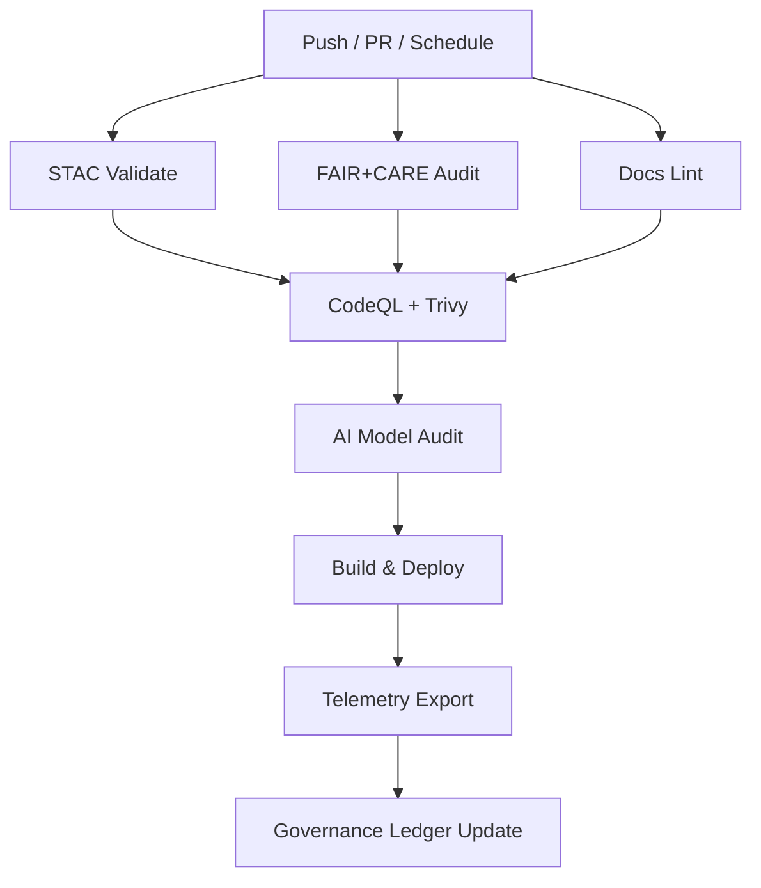

<div align="center">

# 🔄 **Kansas Frontier Matrix — CI/CD Workflows Overview**  
`.github/workflows/README.md`

**Purpose:**  
Define and document all **GitHub Actions workflows** that govern automated validation, security scanning, governance auditing, deployment, and telemetry reporting within the **Kansas Frontier Matrix (KFM)** repository.  
Each workflow is **versioned, reproducible, and ledgered** under **MCP-DL v6.3**, **FAIR+CARE**, **SLSA**, and **ISO 50001/14064** sustainability standards.

[](../../docs/README.md)
[](../../LICENSE)
[](../../docs/standards/faircare.md)
[]()

</div>

---

## 📘 Overview

The workflows in this directory implement **continuous validation, deployment, and auditing** across KFM.  
They ensure every commit is:
- ✅ **Validated** (FAIR+CARE, STAC, DCAT, Docs, and Code)
- 🔒 **Scanned** (static analysis, CVE scanning, SBOM attestation)
- ⚙️ **Deployed** (frontend builds, catalog synchronization)
- 🧾 **Ledgered** (telemetry + governance records with immutable provenance)

Artifacts are summarized in: `../../releases/v10.2.0/focus-telemetry.json`.

---

## 🗂️ Directory Layout

```
.github/workflows/
├── stac-validate.yml           # STAC 1.0.0 / DCAT 3.0 validation
├── stac-dcat-bridge.yml        # STAC↔DCAT synchronization + parity reports
├── faircare-validate.yml       # FAIR+CARE + license / provenance audits
├── docs-lint.yml               # Markdown / YAML / JSON validation
├── codeql.yml                  # Static security analysis (SARIF)
├── trivy.yml                   # Container + dependency CVE scanning (fail CRITICAL)
├── build-and-deploy.yml        # Web frontend build + deploy
├── telemetry-export.yml        # Metrics + sustainability telemetry aggregation
├── ai-model-audit.yml          # AI model governance (bias/drift/explainability)
└── README.md                   # This file
```

Each YAML defines an **autonomous MCP workflow** that emits telemetry and updates governance ledgers.

---

## 🧩 Validation Workflows

| Workflow | Role | Triggers | Output |
|-----------|------|----------|--------|
| **`stac-validate.yml`** | Validates STAC/DCAT schemas & completeness; verifies checksums/licensing. | PR/Push to `data/**`, `schemas/**` | `reports/self-validation/stac/summary.json` |
| **`stac-dcat-bridge.yml`** | Ensures STAC↔DCAT parity; writes delta/parity reports and republishes catalogs. | Schedule/PR/Release | `reports/self-validation/bridge/parity_report.json` |
| **`faircare-validate.yml`** | Enforces FAIR+CARE fields (provenance, consent, sensitivity tags). | PR/Push | `reports/fair/faircare_summary.json` |
| **`docs-lint.yml`** | Validates Markdown structure (front-matter, headings, anchors, links). | PR/Push | `reports/self-validation/docs/lint_summary.json` |

> 💡 **Tip:** Manual runs via `workflow_dispatch` are supported for backfills.

---

## 🛡️ Security Workflows

| Workflow | Function | Enforcement | Output |
|-----------|----------|-------------|--------|
| **`codeql.yml`** | Static analysis (Python, JS/TS) with SARIF upload. | PR + Weekly | `reports/security/codeql/*.sarif` |
| **`trivy.yml`** | Docker images & dependency CVE scanning. | **Fail on CRITICAL** | `reports/security/trivy/*.json` |
| **`dependabot.yml`** | Automated dependency updates & security advisories. | Scheduled | `.github/dependabot.yml` |
| **`ai-model-audit.yml`** | AI bias/drift & SHAP explainability export with model-card checks. | Schedule/Model commit | `reports/audit/ai_model_faircare.json` |

> Results are appended to **security ledgers** and referenced by the **SBOM**.

---

## 🚀 Deployment & Publication Workflows

| Workflow | Function | Output |
|-----------|----------|--------|
| **`build-and-deploy.yml`** | Builds React/MapLibre web frontend; deploys static site (Pages/S3). | `docs/reports/telemetry/build_metrics.json` |
| **`stac-dcat-bridge.yml`** | Republishes catalogs & writes parity diffs for discovery. | `releases/v*/metadata-bridge.meta.json` |
| **`telemetry-export.yml`** | Aggregates workflow results, energy, CO₂e, and compliance metrics. | `releases/v10.2.0/focus-telemetry.json` |

**Deployment URL:**  
https://bartytime4life.github.io/Kansas-Frontier-Matrix/

---

## 🧮 Workflow Interdependencies



Workflows remain autonomous; **required checks** enforce ordered execution for verifiable provenance.

---

## 🧠 Governance & FAIR+CARE Integration

Each CI/CD run is cross-linked to governance and telemetry ledgers.

| Record | Description | File |
|--------|-------------|------|
| **Workflow Ledger** | Execution metadata (SHA, workflow ID, status, duration). | `../../docs/reports/audit/github-workflows-ledger.json` |
| **Governance Ledger** | FAIR+CARE ethical review log and consent evidence. | `../../docs/reports/audit/governance-ledger.json` |
| **Telemetry Snapshot** | Consolidated metrics for dashboards. | `../../releases/v10.2.0/focus-telemetry.json` |

Ledgers are **append-only** and signed; entries include **commit SHAs, run IDs, checksums, and timestamps**.

---

## ⚖️ FAIR+CARE Compliance Summary

| Principle | CI/CD Implementation |
|-----------|----------------------|
| **Findable** | Cataloged reports and releases in `/reports` and `/releases`. |
| **Accessible** | Public artifacts and dashboards; SBOM-linked provenance. |
| **Interoperable** | JSON, NDJSON, STAC/DCAT, SPDX, YAML. |
| **Reusable** | Modular workflow patterns; deterministic runtime; signed artifacts. |
| **CARE** | Governance forms + AI audits to preserve context and consent. |

---

## 🔒 Security & Compliance Controls

- **Branch Protection:** ≥ 2 approvals + passing CI; disallow force pushes to `main`.  
- **Secrets Management:** GitHub Encrypted Secrets / OIDC; rotation ≤ 90 days.  
- **CVE Scanning:** On merge and weekly; **CRITICAL** issues block merges.  
- **SBOM & Provenance:** SPDX manifests + SLSA attestations per release.  
- **Audit Trails:** All logs appended to `github-workflows-ledger.json`.  
- **Sustainability:** Energy (Wh) and CO₂e telemetry recorded (ISO 50001/14064-aligned).

---

## 🧾 Telemetry Integration

**Primary File:** `../../releases/v10.2.0/focus-telemetry.json`

**Metrics Captured:**

| Category | Example Metric |
|----------|----------------|
| Workflow Duration | `workflow_duration_sec` |
| Build Energy | `build_energy_wh` |
| CO₂ Emission | `carbon_gco2e` |
| FAIR+CARE Score | `faircare_score` |
| Security Pass Rate | `security_pass_rate` |
| Lint Success | `docs_lint_pass` |
| Catalog Parity | `stac_parity` |
| Total Runs | `ci_total_runs` |

Telemetry feeds dashboards in `../../docs/reports/telemetry/`.

---

## 🕰️ Version History

| Version | Date | Author | Summary |
|---------|------|--------|---------|
| v10.2.2 | 2025-11-12 | FAIR+CARE Council & DevSecOps | Upgraded to v10.2: parity reports, stricter CVE gating, energy/CO₂ telemetry, immutable ledgers. |
| v10.0.0 | 2025-11-09 | FAIR+CARE Council | Added AI audit workflow, ISO 50001 telemetry metrics, and SLSA provenance integration. |
| v9.7.0 | 2025-11-05 | A. Barta | Introduced telemetry governance and interdependency map. |
| v9.5.0 | 2025-10-20 | Core Team | Added STAC↔DCAT bridge and FAIR+CARE validation. |
| v9.0.0 | 2025-06-01 | KFM Core Team | Initial workflow automation baseline. |

---

<div align="center">

**© 2025 Kansas Frontier Matrix — MIT / CC-BY 4.0**  
Automated under **Master Coder Protocol v6.3** · FAIR+CARE Certified · Diamond⁹ Ω / Crown∞Ω Ultimate Certified  
[Back to GitHub Architecture](../ARCHITECTURE.md) · [Governance Charter](../../docs/standards/governance/ROOT-GOVERNANCE.md)

</div>