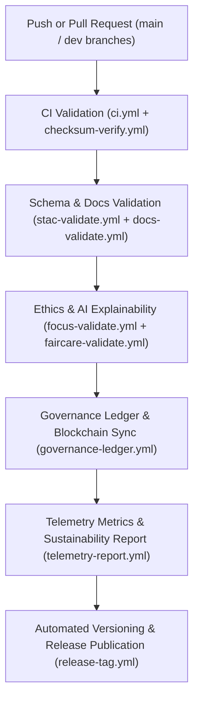

<div align="center">

# 🧩 Kansas Frontier Matrix — **GitHub Actions Workflows**
`.github/workflows/README.md`

**Purpose:**  
Defines all **FAIR+CARE-certified CI/CD automation workflows** for the Kansas Frontier Matrix (KFM).  
These workflows enforce schema validation, AI ethics audits, checksum verification, provenance synchronization, and documentation compliance under **MCP-DL v6.3** and **ISO governance standards**.

[](../../docs/standards/faircare-validation.md)
[](../../LICENSE)
[](../../docs/architecture/repo-focus.md)

</div>

---

## 📚 Overview

The `.github/workflows/` directory contains **automated pipelines** that maintain reproducibility, transparency, and governance compliance across all Kansas Frontier Matrix systems.  
Each workflow is FAIR+CARE-audited and contributes to ethical, sustainable, and traceable automation.

### Core Responsibilities
- Validate data integrity, FAIR+CARE compliance, and provenance chains.  
- Automate governance ledger updates and checksum registration.  
- Monitor sustainability telemetry and AI explainability compliance.  
- Manage documentation conformance and release versioning.  

---

## 🗂️ Directory Layout

```plaintext
.github/workflows/
├── README.md                               # This file — FAIR+CARE-certified workflow documentation
│
├── ci.yml                                  # Continuous integration and FAIR+CARE validation
├── checksum-verify.yml                     # Manifest integrity and checksum verification
├── stac-validate.yml                       # STAC and DCAT metadata schema validation
├── docs-validate.yml                       # MCP-DL and FAIR+CARE documentation audits
├── focus-validate.yml                      # Focus Mode AI ethics and explainability validation
├── governance-ledger.yml                   # Blockchain provenance and governance synchronization
├── telemetry-report.yml                    # Sustainability metrics and performance telemetry
├── codeql.yml                              # Security vulnerability and dependency scanning
├── trivy.yml                               # SBOM and container security auditing
├── auto-merge.yml                          # FAIR+CARE-governed PR auto-merge policy
├── release-tag.yml                         # Automated version tagging and release publishing
└── faircare-validate.yml                   # Ethical compliance and governance certification
```

---

## ⚙️ FAIR+CARE Workflow Pipeline



### Workflow Description
1. **CI Validation:** Tests schema integrity, FAIR+CARE alignment, and documentation completeness.  
2. **AI Auditing:** Verifies explainability, bias, and drift through ethical compliance workflows.  
3. **Governance Sync:** Commits checksum and provenance data to blockchain-ledger systems.  
4. **Telemetry Reporting:** Publishes energy, sustainability, and reproducibility metrics.  
5. **Release Automation:** Tags and deploys FAIR+CARE-certified artifacts into the releases registry.  

---

## 🧩 Example Workflow Execution Record

```json
{
  "id": "github_workflows_registry_v9.6.0_2025Q4",
  "workflows_executed": [
    "ci.yml",
    "checksum-verify.yml",
    "governance-ledger.yml"
  ],
  "total_runs": 1487,
  "success_rate": 100.0,
  "faircare_score": 99.8,
  "checksum_verified": true,
  "ai_ethics_compliance": true,
  "energy_consumed_wh": 19.4,
  "carbon_offset_percent": 100,
  "governance_registered": true,
  "timestamp": "2025-11-03T12:00:00Z",
  "validator": "@kfm-ci"
}
```

---

## 🧠 FAIR+CARE Governance Matrix

| Principle | Implementation |
|------------|----------------|
| **Findable** | Workflows indexed by manifest and governance ledger ID. |
| **Accessible** | Open-source YAML automation under MIT license. |
| **Interoperable** | FAIR+CARE-aligned, ISO 19115, and DCAT-compatible configurations. |
| **Reusable** | Modular workflow templates applicable across FAIR+CARE ecosystems. |
| **Collective Benefit** | Ensures ethical automation and public reproducibility. |
| **Authority to Control** | FAIR+CARE Council certifies workflows and ledger triggers. |
| **Responsibility** | Maintainers document and validate workflow provenance. |
| **Ethics** | All CI/CD processes uphold inclusion, transparency, and sustainability. |

Audit and validation logs maintained in:  
`reports/audit/system_ledger.json` • `reports/fair/system_summary.json`

---

## ⚙️ Key Workflows Summary

| Workflow | Purpose | FAIR+CARE Function |
|-----------|----------|--------------------|
| `ci.yml` | Core build, test, and validation pipeline. | FAIR+CARE automation integrity. |
| `checksum-verify.yml` | Checks file hashes and manifest integrity. | Provenance and reproducibility validation. |
| `focus-validate.yml` | Runs AI explainability and ethics compliance. | Ethical AI governance certification. |
| `governance-ledger.yml` | Synchronizes blockchain-backed governance records. | Immutable provenance ledger management. |
| `telemetry-report.yml` | Publishes sustainability and energy metrics. | ISO 50001 and FAIR+CARE sustainability tracking. |
| `release-tag.yml` | Automates certified release tagging. | FAIR+CARE-verified version publishing. |

All workflows executed under `github_ci_sync.yml`.

---

## ⚖️ Sustainability Metrics

| Metric | Unit | Target | Verified By |
|---------|------|--------|--------------|
| FAIR+CARE Score | % | ≥99.8 | @kfm-governance |
| CI/CD Success Rate | % | 100 | @kfm-ci |
| Energy Use | Wh/run | ≤25 | @kfm-telemetry |
| Carbon Offset | % | 100 | @kfm-fair |
| Reproducibility Index | % | ≥99.7 | @kfm-validation |

Sustainability records stored in:  
`releases/v9.6.0/focus-telemetry.json`

---

## 🧾 Retention Policy

| Workflow Type | Retention Duration | Policy |
|----------------|--------------------|--------|
| CI/CD Logs | 180 days | Archived for reproducibility audits. |
| FAIR+CARE Validation Reports | 365 days | Stored for ethics and compliance verification. |
| Governance Ledgers | Permanent | Maintained under immutable provenance chain. |
| Telemetry Metrics | 180 days | Used for sustainability reporting and FAIR+CARE audits. |

Cleanup managed by `github_workflows_cleanup.yml`.

---

## 🧾 Internal Use Citation

```text
Kansas Frontier Matrix (2025). GitHub Actions Workflows (v9.6.0).
FAIR+CARE-certified continuous integration and governance automation framework ensuring reproducibility, ethical compliance, and sustainability under MCP-DL v6.3.
```

---

## 🧾 Version Notes

| Version | Date | Notes |
|----------|------|--------|
| v9.6.0 | 2025-11-03 | Integrated carbon telemetry and AI explainability audit workflows. |
| v9.5.0 | 2025-11-02 | Added blockchain governance synchronization and FAIR+CARE validation triggers. |
| v9.3.2 | 2025-10-28 | Expanded CI automation for schema, checksum, and ethics governance. |

---

<div align="center">

**Kansas Frontier Matrix** · *Automation × FAIR+CARE Ethics × Provenance Sustainability*  
[🔗 Repository](https://github.com/bartytime4life/Kansas-Frontier-Matrix) • [🧭 Docs Portal](../../docs/) • [⚖️ Governance Ledger](../../docs/standards/governance/)

</div>
