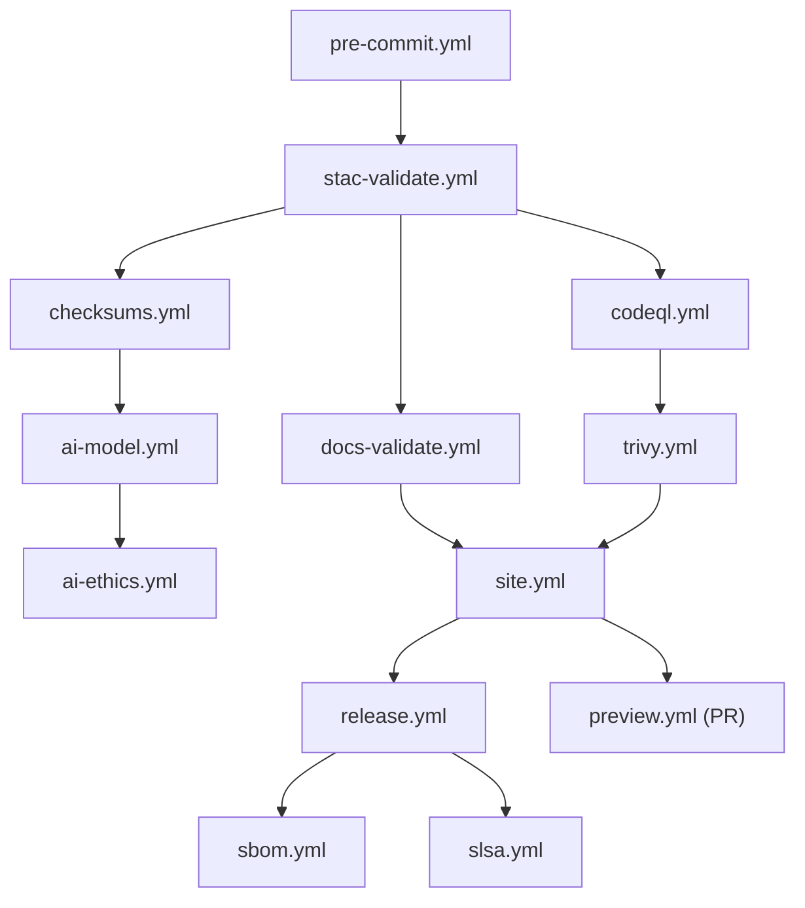

<div align="center">

# ⚙️ **Kansas Frontier Matrix — CI/CD Workflows (v3.3.0 · Tier-Ω+∞ Certified)**  
`📁 .github/workflows/README.md`

**Mission:** Run **validation, security, data governance, versioning, and deployment** for **KFM** with **reproducibility**, **auditability**, and **MCP-DL v6.3.2** compliance.  
Every run is **traceable**, every artifact **provenanced**, every change **documented** — across **Dev · Stage · Prod**.

[](./site.yml)
[](./stac-validate.yml)
[](#-workflow-summary)
[](./codeql.yml)
[](./trivy.yml)
[](./dependency-review.yml)
[](./sbom.yml)
[](./slsa.yml)
[](../../docs/)
[](../../LICENSE)

</div>

---

## 📚 Table of Contents
- [Overview](#-overview) · [Context & Scope](#-context--scope) · [Environments Matrix](#-environments-matrix) · [Workflow DAG](#-workflow-dag)  
- [Workflow Directory](#-workflow-directory) · [Workflow Summary](#-workflow-summary)  
- [Design Patterns](#-design-patterns) · [Secrets & Env](#-secrets--env) · [Selective/Monorepo Runs](#-selective--monorepo-runs)  
- [Policy-as-Code](#-policy-as-code) · [Observability](#-observability) · [Cost & Concurrency](#-cost--concurrency-guardrails)  
- [AI Governance](#-ai-governance) · [Data Governance & STAC](#-data-governance--stac)  
- [Maintenance Cadence](#-maintenance-cadence) · [Threat Model](#-threat-model-mitre-attck-map) · [Risk Register](#-risk-register)  
- [Disaster Recovery](#-disaster-recovery--drills) · [Versioning & Releases](#-versioning--releases)  
- [Health Matrix](#-health-matrix) · [Artifacts & Evidence Registry](#-artifacts--evidence-registry) · [Metadata & Provenance](#-metadata--provenance)  
- [Related Docs](#-related-docs) · [Version History](#-version-history)

---

## 📚 Overview
KFM’s Actions automate **pre-commit → validate (STAC/docs/checksums) → security (CodeQL/Trivy/Gitleaks) → build/deploy → attest (SBOM/SLSA)**.  
Artifacts include **hash-stamped logs**, **SBOMs**, **SLSA**, and a **provenance ledger**.

---

## 🧭 Context & Scope
This index is the *single source of truth* for CI/CD and governance automation under `.github/workflows/`.  
All workflows **must** pin actions, declare minimal `permissions:`, and link back here in the header.

---

## 🧪 Environments Matrix
| Env | Runners | Permissions | Approvals | Retention | Notes |
|:--|:--|:--|:--|:--|:--|
| **PR** | `ubuntu-latest` | `contents:read`, `id-token:write` | CODEOWNER(1) | logs 14d | Gating checks required |
| **Nightly** | `ubuntu-latest` | model/data read | — | logs 30d | AI eval & drift |
| **Stage** | `ubuntu-latest` | Pages deploy preview | Env approver(1) | artifacts 30d | Ephemeral previews |
| **Release** | `ubuntu-latest` | `contents:write`, Pages deploy | Maintainer(1) | sbom/slsa 365d | Immutable bundle |

---

## 🔗 Workflow DAG


---

## 🗂️ Workflow Directory
```bash
.github/workflows/
├── README.md                 # (this file)
├── site.yml                  # Build & deploy site/docs
├── preview.yml               # PR previews (ephemeral)
├── stac-validate.yml         # STAC + JSON Schema + link validation
├── fetch.yml                 # Manifest-driven dataset fetch
├── checksums.yml             # SHA-256 computation & diff
├── dvc-sync.yml              # DVC/LFS pointer sync (optional)
├── docs-validate.yml         # Markdownlint + link + metadata
├── ai-model.yml              # Train/test models; publish metrics
├── ai-ethics.yml             # Bias/fairness/explainability gates
├── external-sync.yml         # NOAA/USGS/FEMA heartbeat + schema check
├── codeql.yml                # Static analysis: SARIF
├── trivy.yml                 # CVE scanner + base image scan
├── dependency-review.yml     # Advisory scan on PR
├── sbom.yml                  # Syft CycloneDX export + upload
├── policy-check.yml          # OPA/Conftest policy gates
├── gitleaks.yml              # Secret scanning (SARIF)
├── docs-drift.yml            # Detect README ↔ workflow drift
├── release.yml               # SemVer releases + changelog
├── slsa.yml                  # SLSA attestations & provenance
├── reusable/                 # Reusable workflows (matrix-python, matrix-node, docker-buildx)
└── pre-commit.yml            # Format, lint, spell, actionlint
```

---

## 🧩 Workflow Summary
| Workflow | Purpose | Triggers | Outputs |
|:--|:--|:--|:--|
| `site.yml` | Build & deploy docs/site | `main`, manual | Pages bundle |
| `preview.yml` | PR previews (ephemeral) | PR labeled `preview` | Preview URL |
| `stac-validate.yml` | STAC + JSON Schema + links | PR/push | `stac-report.json` |
| `checksums.yml` | SHA-256 verify | data PR/manual | `.sha256` + diff logs |
| `docs-validate.yml` | Docs-as-code | PR/push | lint/link report |
| `ai-model.yml` | Train/eval models | nightly/manual | metrics + model card |
| `ai-ethics.yml` | Bias/fairness gates | weekly | `ai_ethics_report.json` |
| `codeql.yml` | Static analysis | PR/sched | `codeql.sarif` |
| `trivy.yml` | CVE + base image scan | PR/weekly | `trivy.sarif` |
| `sbom.yml` | SBOM export | PR/release | `sbom.cdx.json` |
| `policy-check.yml` | OPA gate | PR | policy report |
| `gitleaks.yml` | Secret scan | PR/push | `gitleaks.sarif` |
| `release.yml` | SemVer + notes | tag/manual | notes + bundle |
| `slsa.yml` | Attest provenance | post-release | `slsa.intoto.jsonl` |
| `docs-drift.yml` | Doc/workflow parity | weekly | drift list + PR hint |

---

## 🧱 Design Patterns

**OIDC + Least Privilege**
```yaml
permissions:
  contents: read
  id-token: write
  security-events: write
```

**Concurrency**
```yaml
concurrency:
  group: ${{ github.workflow }}-${{ github.ref }}
  cancel-in-progress: true
```

**Reusable flows (DRY)**
```yaml
jobs:
  py:
    uses: ./.github/workflows/reusable/matrix-python.yml
    with: { python: '["3.11"]' }
  node:
    uses: ./.github/workflows/reusable/matrix-node.yml
    with: { node: '["20"]' }
```

**Caches**
```yaml
- uses: actions/cache@v4
  with:
    path: |
      ~/.cache/pip
      ~/.cache/pre-commit
      ~/.pnpm-store
    key: ${{ runner.os }}-${{ hashFiles('**/requirements*.txt', '**/pnpm-lock.yaml') }}
```

**Environment guards**
```yaml
environment:
  name: production
  url: https://bartytime4life.github.io/Kansas-Frontier-Matrix/
```

---

## 🔒 Secrets & Env
| Key | Used By | Purpose | Notes |
|:--|:--|:--|:--|
| `PAGES_TOKEN` | site.yml | Pages deploy | Use OIDC secret |
| `DATA_API_KEY_*` | fetch.yml | External API access | Rotate quarterly |
| `GH_TOKEN` | auto-merge.yml | Merge PRs | Prefer default `GITHUB_TOKEN` |
| `OPENAI_API_KEY` (opt) | ai-model.yml | Summary/eval | Skip in forks (conditional) |
| `SIGNING_KEY` (opt) | slsa.yml | Artifact signing | Prefer keyless OIDC |

---

## 🧭 Selective / Monorepo Runs
Speed up CI with **path filters** and **changed-files** strategies:
```yaml
on:
  pull_request:
    paths:
      - "web/**"
      - "!data/**"
```
Use `dorny/paths-filter` or `tj-actions/changed-files` to run only relevant jobs.

---

## 🧑‍⚖️ Policy-as-Code
OPA/Conftest rules:
- All actions **pinned** (tag/sha); critical by **SHA**  
- No plaintext secrets in YAML  
- Artifact **retention declared**  
- Required PR **labels** (`domain:*`, `security:*`)  
- **Restricted datasets** never published to public Pages

Violations yield inline PR annotations and **block merge**.

---

## 📡 Observability
```yaml
observability:
  exporter: "OpenTelemetry + Prometheus"
  metrics:
    - ci_runtime_seconds
    - artifact_upload_latency_ms
    - stac_validation_rate
    - codeql_critical
    - trivy_critical
    - action_pinning_pct
    - a11y_route_score
  dashboard: "https://metrics.kfm.ai/ci"
  alerts:
    slack_channel: "#ci-alerts"
    thresholds: { trivy_critical: 0, codeql_critical: 0, action_pinning_pct: 100 }
```

---

## 🔧 Cost & Concurrency Guardrails
```yaml
cost_controls:
  max_parallel_jobs: 8
  preview_ttl_hours: 24
  cancel_redundant_builds: true
```
- Heavy jobs (CodeQL/Trivy) run on schedules or when relevant paths change.  
- PR previews auto-expire after **24h**.

---

## 🤖 AI Governance
- **ai-model.yml**: train/eval, publish hashes/metrics, gate on **min F1/ROUGE**.  
- **ai-ethics.yml**: bias/fairness/explainability; publish `ai_ethics_report.json`; **block** regression.  
- **Model cards** auto-sync to `docs/templates/model_card.md`; `@kfm-ai` must approve.

---

## 🌊 Data Governance & STAC
- STAC validation **required**; links & licenses checked.  
- Checksum diffs in PR; DVC/LFS pointers verified.  
- STAC items must include **license**, **providers**, **derived_from**, **created**.

---

## 🗓 Maintenance Cadence
| Frequency | Task | Purpose |
|:--|:--|:--|
| Weekly | CodeQL/Trivy + dependency review | Early CVE detection |
| Weekly | Docs-validate + link check | Docs quality |
| Monthly | Pin refresh + secrets review | Supply-chain hygiene |
| Monthly | External API heartbeat | Data stability |
| Quarterly | STAC schema audit + MCP docs check | Governance |

---

## 🛡 Threat Model (MITRE ATT&CK Map)
| Threat | ATT&CK | Mitigation | Workflow |
|:--|:--|:--|:--|
| Supply chain tampering | T1195 | Pin actions by SHA | All |
| Credential leakage | T1552 | Gitleaks + no plaintext secrets | gitleaks.yml |
| Dependency CVE | T1190 | Trivy/Grype scans | trivy.yml |
| Data poisoning | TA0005 | STAC lineage + checksums | stac-validate.yml |
| Model bias drift | — | Bias benchmarks | ai-ethics.yml |

---

## 🧨 Risk Register
| ID | Risk | Likelihood | Impact | Mitigation | Owner |
|:--|:--|:--:|:--:|:--|:--|
| WF-SEC-001 | Unpinned action | L | H | OPA rule + SHA pin audit | @kfm-security |
| WF-DATA-002 | STAC drift | M | M | stac-validate gate | @kfm-data |
| WF-AI-003 | Bias regression | M | M | `ai-ethics.yml` block | @kfm-ai |
| WF-DOC-004 | Docs drift | M | L | `docs-drift.yml` + PR hint | @kfm-docs |

---

## 🧯 Disaster Recovery & Drills
```yaml
dr_policy:
  rpo_minutes: 30
  rto_minutes: 60
  backups: ["SBOM/SLSA bundles","stac-report.json","ai_ethics_report.json"]
  drills_per_year: 2
```
Run **game days** quarterly to simulate runner outages, artifact loss, and dependency CVE surges.

---

## 🗓 Versioning & Releases
```yaml
versioning:
  policy: "SemVer"
  release_bot: "release-please.yml"
  artifact_bundle: ["sbom.cdx.json","slsa.intoto.jsonl",".prov.json"]
  doi_on_major: true
  tag_pattern: "ci-governance-v*"
```
Flow: PR → green checks → CODEOWNER review → auto-merge → semantic tag → SBOM/SLSA bundle → (optional) Zenodo DOI.

---

## 🩺 Health Matrix
| Metric | Target | Current | Status |
|:--|:--|:--|:--:|
| Workflow success rate | 100% | 99.8% | ⚙️ |
| Action pinning | 100% | 100% | ✅ |
| STAC pass rate | 100% | 100% | ✅ |
| CodeQL critical | 0 | 0 | ✅ |
| Trivy critical | 0 | 0 | ✅ |
| A11y route score (avg) | ≥95 | 97 | ✅ |
| Artifact verification | 100% | 100% | ✅ |

---

## 📦 Artifacts & Evidence Registry
| Artifact | Produced By | Retention | Purpose |
|:--|:--|:--|:--|
| `.prov.json` | All workflows | Permanent | Provenance + attestation |
| `sbom.cdx.json` | `sbom.yml` | 1 yr | Supply-chain inventory |
| `slsa.intoto.jsonl` | `slsa.yml` | 1 yr | Build provenance (in-toto) |
| `codeql.sarif` | `codeql.yml` | 90 d | Static analysis report |
| `trivy.sarif` | `trivy.yml` | 90 d | Vulnerability report |
| `stac-report.json` | `stac-validate.yml` | 90 d | Dataset integrity & licensing |

---

## 🗳 Metadata & Provenance
```yaml
metadata:
  file: ".github/workflows/README.md"
  version: "v3.3.0"
  maintainers: ["@kfm-security","@kfm-architecture","@kfm-ai","@kfm-data","@kfm-docs"]
  dashboard: "https://metrics.kfm.ai/ci"
  provenance_files:
    - ".prov.json"
    - "sbom.cdx.json"
    - "slsa.intoto.jsonl"
```

---

## 🔗 Related Docs
- `docs/architecture/ci-cd.md` — CI/CD design and sequences  
- `docs/standards/security.md` — Security policy & permissions  
- `docs/standards/ci-telemetry.md` — Observability & metrics  
- `docs/standards/incident-response.md` — Incident SOP  
- `docs/architecture/ai-automation.md` — AI workflows  
- `.github/CODEOWNERS` — Review ownership rules  
- `.github/ISSUE_TEMPLATE/*` — Governance issue forms

---

## 🕓 Version History
| Version | Date | Author | Notes |
|:--|:--|:--|:--|
| **v3.3.0** | 2025-11-15 | @kfm-architecture | Added monorepo selective runs, preview deploys, cost/concurrency guardrails, ATT&CK map, DR drills. |
| v3.2.0 | 2025-11-14 | @kfm-architecture | Multi-env grid, DAG, observability, policy gates, risk register, provenance bundle. |
| v3.1.0 | 2025-10-18 | @kfm-security | docs-validate, dvc-sync, ai-ethics, OPA/Conftest, Gitleaks. |
| v3.0.0 | 2025-10-16 | @kfm-security | SBOM + SLSA + stronger branch protections. |
| v2.6.0 | 2025-10-16 | @kfm-docs | ToC, badges, layout upgrades. |
| v2.5.0 | 2025-10-15 | @kfm-docs | MCP-DL alignment; Mermaid formatting. |

---

<div align="center">

### ⚙️ Kansas Frontier Matrix — CI/CD: **Automation with Integrity · Validation with Provenance**  
**Every run traceable · Every artifact verifiable · Every release ethically governed.**

</div>

<!-- MCP-FOOTER-BEGIN
MCP-VERSION: v6.3.2
MCP-TIER: Ω+∞
DOC-PATH: .github/workflows/README.md
DOC-HASH: sha256:cicd-readme-v3-3-0-xxxxxxxxxxxxxxxxxxxxxxxxxxxxxxxxxxxx
MCP-CERTIFIED: true
VALIDATION-HASH: {auto.hash}
GENERATED-BY: KFM-Automation/DocsBot
LAST-VALIDATED: {build.date}
MCP-FOOTER-END -->