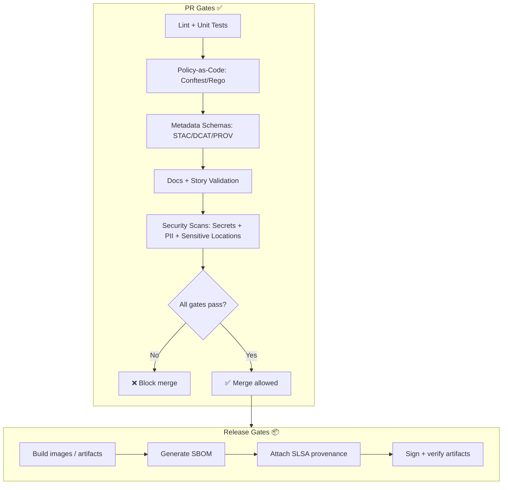

# 🛠️ `.github/workflows` — CI/CD + Governance Gates

<div align="center">

**Kansas Frontier Matrix (KFM)** treats CI/CD as a **governance gatehouse** — not just build automation.  
Every merge must preserve the **truth path**: provenance ➜ policy ➜ access ➜ presentation. ✅🧾🛡️

<!-- Badges (replace <ORG>/<REPO> + workflow filenames) -->
[](https://github.com/<ORG>/<REPO>/actions/workflows/ci.yml)
[](https://github.com/<ORG>/<REPO>/actions/workflows/policy.yml)
[](https://github.com/<ORG>/<REPO>/actions/workflows/schemas.yml)
[](https://github.com/<ORG>/<REPO>/actions/workflows/security.yml)
[](https://github.com/<ORG>/<REPO>/actions/workflows/release.yml)

</div>

> [!IMPORTANT]
> This README is a **responsibility map** ✅. Workflow filenames may differ by repo iteration.  
> Keep this document synced with the actual `.yml` inventory and branch protection rules.

---

## 🧭 Why this folder exists

KFM is a **pipeline → catalog → database → API → UI** system that turns raw files into governed, explorable knowledge. The UI must never bypass the API, and “fail closed” is the default posture.  [oai_citation:0‡Kansas Frontier Matrix (KFM) – Comprehensive Technical Blueprint.pdf](sediment://file_000000006dbc71f89a5094ce310a452d) [oai_citation:1‡Kansas Frontier Matrix Comprehensive System Documentation.pdf](sediment://file_00000000ef40722faf17987b69730695)

### 🧬 The KFM truth path

```text
Raw → Processed → Catalog (STAC/DCAT) → Provenance (PROV) → Databases → API → UI + Focus Mode
```

The architecture explicitly preserves this flow (and blocks bypasses): **UI never directly touches databases**; access is mediated by the governed API, and Focus Mode follows the same path.  [oai_citation:2‡Kansas Frontier Matrix (KFM) – Comprehensive Technical Blueprint.pdf](sediment://file_000000006dbc71f89a5094ce310a452d) [oai_citation:3‡Kansas Frontier Matrix (KFM) – Comprehensive Technical Blueprint.pdf](sediment://file_000000006dbc71f89a5094ce310a452d)

---

## 🗂️ What lives here

```text
.github/
  workflows/
    README.md   👈 you are here
    *.yml       🤖 GitHub Actions workflows
```

KFM’s repository layout treats `.github/` as part of the **governed system surface**, alongside `schemas/`, `policy/`, and `releases/` (SBOM + manifests).  [oai_citation:4‡MARKDOWN_GUIDE_v13.md.gdoc](file-service://file-UYVruFXfueR8veHMUKeugU)

---

## 📌 Non‑negotiables these workflows protect

These are the “must not regress” invariants enforced by CI gates.

### ✅ Governance invariants
- 🧾 **Provenance is mandatory** for publishable datasets; missing PROV means “not publishable.”  [oai_citation:5‡Kansas Frontier Matrix Comprehensive System Documentation.pdf](sediment://file_00000000ef40722faf17987b69730695)
- 🛡️ **Fail closed by default**: missing metadata or unsatisfied policy blocks the operation.  [oai_citation:6‡Kansas Frontier Matrix Comprehensive System Documentation.pdf](sediment://file_00000000ef40722faf17987b69730695)
- 🔐 **Least privilege access** enforced via roles + policy checks; **no bypass to query DB directly**.  [oai_citation:7‡Kansas Frontier Matrix Comprehensive System Documentation.pdf](sediment://file_00000000ef40722faf17987b69730695)

### ✅ Policy invariants
- 🧠 **Policy-as-code is the source of truth** (`policy/`), enforced in CI with Conftest and at runtime with OPA-style decisions.  [oai_citation:8‡Kansas Frontier Matrix (KFM) – Comprehensive Technical Blueprint.pdf](sediment://file_000000006dbc71f89a5094ce310a452d) [oai_citation:9‡Kansas Frontier Matrix Comprehensive System Documentation.pdf](sediment://file_00000000ef40722faf17987b69730695)
- 🧾 **Auditable decisions**: policy versions can be traced via logs (policy hash / commit reference).  [oai_citation:10‡Kansas Frontier Matrix (KFM) – Comprehensive Technical Blueprint.pdf](sediment://file_000000006dbc71f89a5094ce310a452d)

### ✅ Supply chain invariants
- 📦 **SBOMs**, **SLSA provenance**, and optional **container signing** protect release integrity and reduce supply-chain attack risk.  [oai_citation:11‡Kansas Frontier Matrix Comprehensive System Documentation.pdf](sediment://file_00000000ef40722faf17987b69730695)

### ✅ CARE + FAIR invariants
KFM applies FAIR + CARE governance. Sensitive locations may require generalization; privacy protections may include aggregation, suppression thresholds, and auditing of overly specific queries. Indigenous data can be governed via an Indigenous Data Governance Board and sovereignty policy.  [oai_citation:12‡Kansas Frontier Matrix Comprehensive System Documentation.pdf](sediment://file_00000000ef40722faf17987b69730695)

---

## 🧩 Workflow catalog

> [!TIP]
> Treat workflow files as **products**, not scripts: each one should have a stable scope, clear inputs, and predictable outputs.

| Workflow (suggested) | Trigger | Purpose | Merge gate | Outputs |
|---|---|---|---:|---|
| `ci.yml` | PR + push | Unit/integration tests, lint/format | ✅ | test reports, coverage |
| `policy.yml` | PR + push | Conftest/Rego checks on changed artifacts | ✅ | policy report |
| `schemas.yml` | PR + push | Validate STAC/DCAT/PROV + Story schemas | ✅ | schema validation logs |
| `docs.yml` | PR + push | Markdown protocol, front-matter, link validation | ✅ | link report |
| `security.yml` | PR + schedule | Secrets scan, dependency review, CodeQL/SAST, container scan | ✅ (critical findings) | SARIF/security reports |
| `release.yml` | tags + manual | Build images, SBOM, provenance attestation, signing | ⛔ PR | release artifacts |
| `deploy.yml` | push + manual | Deploy to environments (with approvals) | ⛔ PR | deployment logs |
| `maintenance.yml` | schedule | Hygiene: cache busts, dependency audits, drift detection | ⛔ PR | audit outputs |

---

## ✅ CI gates

### 📘 Docs + Story gates
What’s checked:
- Markdown structure & required sections (including Story Nodes)
- Link/reference integrity

Why it matters:
- Documentation is a first-class system component in KFM’s governed repo surface.  [oai_citation:13‡MARKDOWN_GUIDE_v13.md.gdoc](file-service://file-UYVruFXfueR8veHMUKeugU)

### 🗺️ Metadata and standards gates
What’s checked:
- STAC Items/Collections
- DCAT dataset entries
- PROV bundles
- Story Node schemas (where applicable)

Why it matters:
- Metadata is “data about data,” enabling interoperability, attribution, and reuse; it should carry identification, quality, distribution policy, and citation information.  [oai_citation:14‡making-maps-a-visual-guide-to-map-design-for-gis.pdf](sediment://file_00000000602471f786dfbbaac9329fb9)

### 🧾 Provenance gates
What’s checked:
- Every publishable dataset has a PROV lineage record and required catalog metadata.

Why it matters:
- KFM makes provenance mandatory and treats missing provenance as non-publishable.  [oai_citation:15‡Kansas Frontier Matrix Comprehensive System Documentation.pdf](sediment://file_00000000ef40722faf17987b69730695)

### 🕸️ Graph correctness gates
What’s checked:
- Graph constraints against fixture data
- Ontology expectations and relationship invariants

Why it matters:
- Graph outputs are part of the truth path; invalid graph structure corrupts retrieval and downstream narrative accuracy.

### 🔌 API contract gates
What’s checked:
- OpenAPI/GraphQL schema linting
- Contract tests to prevent unintentional breaking changes

Why it matters:
- The API is the enforced boundary layer; bypassing it is disallowed by design.  [oai_citation:16‡Kansas Frontier Matrix (KFM) – Comprehensive Technical Blueprint.pdf](sediment://file_000000006dbc71f89a5094ce310a452d)

### 🛡️ Security + governance gates
What’s checked:
- Secret scanning
- Sensitive data detection
- Sensitive location leakage checks
- Role/classification consistency checks

Why it matters:
- KFM enforces RBAC and policy checks, blocks by default if rules fail, and prevents direct DB access outside the API boundary.  [oai_citation:17‡Kansas Frontier Matrix Comprehensive System Documentation.pdf](sediment://file_00000000ef40722faf17987b69730695)

---

## 🧠 CI mental model



Supply-chain gates belong primarily in **release workflows**, not PR workflows, but should be testable via a dry-run path.  [oai_citation:18‡Kansas Frontier Matrix Comprehensive System Documentation.pdf](sediment://file_00000000ef40722faf17987b69730695)

---

## 🛡️ Policy-as-code enforcement

KFM encodes governance rules as **policy-as-code** (OPA/Rego style). CI runs Conftest to evaluate policies against repo changes; missing license/metadata/PROV can hard-fail PRs.  [oai_citation:19‡Kansas Frontier Matrix (KFM) – Comprehensive Technical Blueprint.pdf](sediment://file_000000006dbc71f89a5094ce310a452d) [oai_citation:20‡Kansas Frontier Matrix (KFM) – Comprehensive Technical Blueprint.pdf](sediment://file_000000006dbc71f89a5094ce310a452d)

### 🔧 Where the policies live
```text
policy/
  data_policies.rego       # dataset metadata requirements, licensing, sensitivity
  ai_policies.rego         # AI guardrails, citations/evidence requirements
  security.rego            # access rules, repo protections, boundary enforcement
  compliance.rego          # regulatory + community restrictions
```

> [!NOTE]
> Runtime enforcement can query OPA with context (user role, dataset sensitivity, response content), deny or sanitize results, and log which policy version made the decision.  [oai_citation:21‡Kansas Frontier Matrix (KFM) – Comprehensive Technical Blueprint.pdf](sediment://file_000000006dbc71f89a5094ce310a452d)

---

## 🔐 Roles, approvals, and controlled changes

KFM defines scoped roles (Public Viewer, Contributor, Maintainer, Admin). Policy decisions enforce what each role can do, and CI prevents deploying non-compliant changes (e.g., missing license or sensitivity label).  [oai_citation:22‡Kansas Frontier Matrix Comprehensive System Documentation.pdf](sediment://file_00000000ef40722faf17987b69730695)

### ✅ Recommended approval patterns
- 🔒 Changes to `policy/**` require **maintainer approval** and ideally **CODEOWNERS** coverage.
- 🧾 Changes to `schemas/**` and `releases/**` require **review + green gates**.
- 🧭 Changes to `.github/workflows/**` require **two reviewers** (one security-minded).

---

## 🧰 Workflow authoring rules

### ✅ Do
- ✅ Use **path filters** so data-only PRs don’t run full container builds.
- ✅ Add **concurrency** to cancel redundant PR runs.
- ✅ Cache dependencies (`pip`, `npm`) and build layers to keep CI fast.
- ✅ Upload artifacts (schema reports, test logs, SARIF) for debugging.

### ❌ Don’t
- ❌ Don’t publish UI artifacts that bypass metadata/provenance gates.
- ❌ Don’t introduce deploy steps into PR workflows that require secrets.

---

## 🔑 Secrets, permissions, and environments

> [!IMPORTANT]
> Treat secrets as **production-grade assets**: never print them, never echo env, never upload them.

Recommended conventions:
- Use **least-privilege** `permissions:` blocks per workflow/job.
- Prefer **GitHub Environments** for deploy jobs (approvals + scoped secrets).
- Prefer **OIDC** for cloud auth where possible; avoid long-lived credentials.

---

## 🧪 Run the same gates locally

Keeping CI fast means **run the same checks before pushing**.

### 🐍 Backend
```bash
docker-compose exec api pytest
```

### ✨ Format / lint
```bash
black .
flake8
```

### 🌐 Frontend
```bash
npm test
npm run lint -- --fix
```

### 🧾 Policy checks
```bash
conftest test .
# or narrow it down
conftest test data/processed/mydata.csv
```

These commands are explicitly described as local mirrors for CI checks.  [oai_citation:23‡Kansas Frontier Matrix (KFM) – Comprehensive Technical Blueprint.pdf](sediment://file_000000006dbc71f89a5094ce310a452d)

---

## 📦 Release integrity

KFM’s security posture includes:
- SBOM generation for releases
- SLSA provenance on build artifacts
- Optional signing + verification of container images (e.g., Cosign)
- Dependency scans and vulnerability tests in CI (including OWASP ZAP in the toolchain)  [oai_citation:24‡Kansas Frontier Matrix Comprehensive System Documentation.pdf](sediment://file_00000000ef40722faf17987b69730695)

> [!TIP]
> Release workflows should emit a “release bundle” that can be audited later: `manifest.json`, checksums, SBOM, provenance, signatures.

---

## ⏰ Scheduled workflows

Use scheduled workflows for hygiene and drift detection:
- dependency + vulnerability audits
- policy drift checks (CI vs runtime policy bundle)
- dataset freshness / dashboard refresh
- log cleanup and report rotation

---

## 🧯 Troubleshooting

<details>
<summary><strong>Common failures and fixes</strong> 🔍</summary>

### ❌ Style failures
- Run `black .` and `flake8` (Python)
- Run `npm run lint -- --fix` (Node)  [oai_citation:25‡Kansas Frontier Matrix (KFM) – Comprehensive Technical Blueprint.pdf](sediment://file_000000006dbc71f89a5094ce310a452d)

### ❌ Policy failures
Examples include missing license, missing PROV, disallowed content.
- Reproduce locally with `conftest test .`
- Fix metadata/provenance gaps; CI blocks merge by design.  [oai_citation:26‡Kansas Frontier Matrix (KFM) – Comprehensive Technical Blueprint.pdf](sediment://file_000000006dbc71f89a5094ce310a452d)

### ❌ Governance failures
- “Fail closed” means missing required metadata or policy context blocks the operation.
- Confirm sensitivity labels and role-based access assumptions.  [oai_citation:27‡Kansas Frontier Matrix Comprehensive System Documentation.pdf](sediment://file_00000000ef40722faf17987b69730695)

</details>

---

## ✅ README upkeep checklist

- [ ] When a new workflow `.yml` is added, update the **Workflow catalog** table.
- [ ] When a gate changes, update the **CI gates** section and branch protection required checks.
- [ ] Keep policy checks aligned with `policy/*.rego` updates (policy drift is a 🧨 foot-gun).
- [ ] Keep workflow changes review-heavy (CI is a security boundary).

---

## 🔗 References and project library

### 📚 Core KFM references
- KFM repo layout and governed paths (including `.github/`, `schemas/`, `releases/`)  [oai_citation:28‡MARKDOWN_GUIDE_v13.md.gdoc](file-service://file-UYVruFXfueR8veHMUKeugU)
- KFM architecture and “truth path” constraints  [oai_citation:29‡Kansas Frontier Matrix (KFM) – Comprehensive Technical Blueprint.pdf](sediment://file_000000006dbc71f89a5094ce310a452d)
- Fail-closed security + governance principles  [oai_citation:30‡Kansas Frontier Matrix Comprehensive System Documentation.pdf](sediment://file_00000000ef40722faf17987b69730695)
- Supply-chain protections: SBOM, SLSA provenance, signing, CI security scans  [oai_citation:31‡Kansas Frontier Matrix Comprehensive System Documentation.pdf](sediment://file_00000000ef40722faf17987b69730695)

### 📎 Project library links
- Web Design (reference material)  [oai_citation:32‡Web Design.pdf](sediment://file_00000000d1987230b931eccca5ab6cda)
- Professional Web Design Techniques & Templates  [oai_citation:33‡professional-web-design-techniques-and-templates.pdf](sediment://file_000000000acc71f8b2e5128c030179fc)
- Learn to Code HTML & CSS  [oai_citation:34‡learn-to-code-html-and-css-develop-and-style-websites.pdf](sediment://file_00000000ed6471fdb0ecead71e051444)
- Kansas Frontier Matrix Comprehensive System Documentation  [oai_citation:35‡Kansas Frontier Matrix Comprehensive System Documentation.pdf](sediment://file_00000000ef40722faf17987b69730695)
- Node.js / React / CSS / HTML reference  [oai_citation:36‡Node.js-React-CSS-HTML.pdf](sediment://file_00000000b09c71f8b277cb19b9f597b2)
- Indigenous Statistics (data governance context)  [oai_citation:37‡Indigenous Statistics.pdf](sediment://file_0000000033ec72308e1f791a79f61bfe)