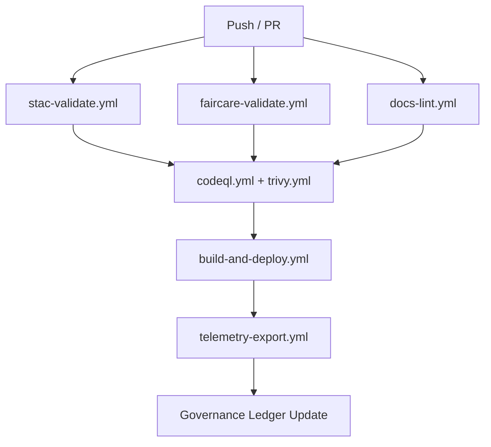

<div align="center">

# 🔄 **Kansas Frontier Matrix — CI/CD Workflows Overview**
`.github/workflows/README.md`

**Purpose:** Summarize the automated validation, deployment, and security workflows that power the continuous integration and governance of the Kansas Frontier Matrix (KFM) project.

[](../../docs/README.md)
[](../../LICENSE)
[](../../docs/standards/faircare.md)
[]()
[]()

</div>

---

## 📦 Overview

The `.github/workflows/` directory contains all **GitHub Actions** automation used to manage KFM’s lifecycle — from dataset validation to frontend deployment.  
Each workflow represents a modular, versioned component of the **Master Coder Protocol (MCP)** automation layer, ensuring reproducibility, security, and governance transparency.

All workflows are:
- **Open Standard Compliant** (STAC 1.0.0, DCAT 3.0, FAIR+CARE)
- **Containerized and deterministic**
- **Linked to SPDX SBOMs and governance ledgers**

---

## ⚙️ Directory Layout

```
.github/workflows/
├── stac-validate.yml         # Validates STAC 1.0.0 catalogs and items
├── faircare-validate.yml     # Runs FAIR+CARE compliance checks
├── docs-lint.yml             # Lints Markdown and YAML documentation
├── codeql.yml                # Security and static code analysis
├── trivy.yml                 # Container and dependency vulnerability scans
├── build-and-deploy.yml      # Builds and deploys web frontend (GitHub Pages)
├── stac-dcat-bridge.yml      # Synchronizes STAC and DCAT catalogs
├── telemetry-export.yml      # Collects and exports build telemetry
└── README.md                 # This file (summary and workflow metadata)
```

Each YAML file under `/workflows` corresponds to a unique CI/CD process documented below.

---

## 🧪 Validation Workflows

### 1. **`stac-validate.yml`**
Validates all [STAC](https://stacspec.org) JSON catalogs and items under `data/stac/**`.

**Runs:**
- `pystac validate` for structural and link integrity
- JSON schema check for `stac_version: "1.0.0"`
- Uploads results to `reports/self-validation/stac/`

**Triggers:**  
- On every pull request or push to `data/stac/**`  
- On manual `workflow_dispatch`

---

### 2. **`faircare-validate.yml`**
Audits data layers for compliance with FAIR (Findable, Accessible, Interoperable, Reusable) and CARE (Collective Benefit, Authority to Control, Responsibility, Ethics) principles.

**Validations Include:**
- License verification (`license` field in dataset manifests)
- Provenance chain check (`provenance` and `checksum`)
- CARE flag detection for Indigenous and community data
- DataContract verification (`data_contract_ref`)

**Outputs:**  
Compliance reports saved in `reports/fair/`.

---

### 3. **`docs-lint.yml`**
Ensures all Markdown, YAML, and JSON documentation follow [Markdown Style Guidelines](../../docs/standards/markdown_rules.md).

**Tools Used:**
- `markdownlint-cli2`
- `yamllint`
- JSON Schema validators for front-matter

**Coverage:**  
All `README.md`, `docs/**/*.md`, `.github/**/*.yml`, and manifest files.

---

## 🔐 Security Workflows

### 4. **`codeql.yml`**
Performs static code analysis using GitHub’s CodeQL engine for multiple languages:
- Python (AI/ETL)
- JavaScript/TypeScript (Web)
- Shell scripts (Tools)

**Frequency:**  
Weekly + on push to `main`

**Reports:**  
`reports/security/codeql/*.sarif` uploaded for audit and telemetry.

---

### 5. **`trivy.yml`**
Scans all Docker images and package manifests for vulnerabilities using [Aqua Trivy](https://github.com/aquasecurity/trivy).

**Checks:**
- CVE database scanning of `Dockerfile`, `requirements.txt`, and `package.json`
- Report severity metrics (CRITICAL/HIGH/MEDIUM)

**Policy:**  
Fails build on any CRITICAL finding.

**Outputs:**  
`reports/security/trivy/*.json`

---

## 🚀 Deployment Workflows

### 6. **`build-and-deploy.yml`**
Builds the **KFM Web UI (React + MapLibre)** and deploys to GitHub Pages.

**Pipeline Steps:**
1. Checkout repository  
2. Install Node.js dependencies  
3. Build React frontend  
4. Deploy static build to `gh-pages` branch  
5. Generate telemetry entry (`focus-telemetry.json`)

**Deployment URL:**  
[https://bartytime4life.github.io/Kansas-Frontier-Matrix/](https://bartytime4life.github.io/Kansas-Frontier-Matrix/)

---

### 7. **`stac-dcat-bridge.yml`**
Synchronizes STAC and DCAT catalogs to maintain metadata interoperability.

**Actions:**
- Converts STAC Items → DCAT Datasets (and vice versa)
- Uses `tools/generate_stac.py` and `tools/generate_dcat.py`
- Validates using `schemas/dcat-v3.json`
- Exports to `releases/v*/metadata-bridge.meta.json`

**Run Frequency:**  
Weekly + post-release

---

### 8. **`telemetry-export.yml`**
Compiles workflow metrics and governance data into a unified telemetry JSON.

**Metrics Tracked:**
- Workflow durations and outcomes  
- FAIR+CARE scores  
- Build size and deployment hash  
- Vulnerability scan summaries  

**Output:**  
`releases/v9.7.0/focus-telemetry.json`

---

## 🧾 Workflow Interdependencies



All workflows are designed to be **idempotent** and **self-contained**, while emitting consistent metadata for reproducibility and audit purposes.

---

## 🧠 Governance Integration

Each workflow reports to the **Governance Ledger**, located in:
```
reports/audit/github-workflows-ledger.json
```

The ledger records:
- Workflow run ID  
- Validation outcomes  
- Operator metadata (user, commit SHA)  
- Telemetry integration timestamps  

Each run generates a digital signature embedded in:
`releases/v9.7.0/sbom.spdx.json`  
and cross-referenced via `telemetry_ref`.

---

## ⚖️ FAIR+CARE Automation Compliance

| Principle | Implementation |
|------------|----------------|
| **Findable** | Validation reports indexed in `reports/` and telemetry JSON |
| **Accessible** | All workflow logs and results are public artifacts |
| **Interoperable** | JSON schema validation and STAC/DCAT alignment |
| **Reusable** | Workflow configurations versioned and modular |
| **CARE** | Enforced via `faircare-validate.yml` and governance review |

---

## 🔒 Security & Reliability

- Workflows run in **read-only mode** for external forks (no secret access).  
- All secrets stored in GitHub Encrypted Secrets.  
- **Branch protection rules** enforce two reviews and passing all CI checks before merge.  
- All dependencies validated via **Dependabot** weekly.  
- SBOMs and provenance attestations auto-generated post-deploy.

---

## 🕰️ Version History

| Version | Date | Author | Summary |
|----------|------|---------|----------|
| v9.7.0 | 2025-11-05 | A. Barta | Added telemetry export and governance audit integration. |
| v9.5.0 | 2025-10-20 | A. Barta | Added STAC↔DCAT bridge and extended FAIR+CARE automation. |
| v9.3.2 | 2025-08-12 | KFM Core Team | Improved validation reports and CI performance. |
| v9.0.0 | 2025-06-01 | KFM Core Team | Initial workflow automation baseline. |

---

<div align="center">

**© 2025 Kansas Frontier Matrix — MIT / CC-BY 4.0**  
Automated under **Master Coder Protocol v6.3** · FAIR+CARE Certified · Diamond⁹ Ω / Crown∞Ω Ultimate Certified  
[Return to GitHub Architecture](../ARCHITECTURE.md) · [Main README](../../README.md)

</div>
