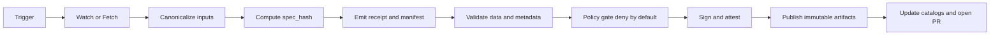

# GitHub Actions Workflows

> CI/CD automation for Kansas Frontier Matrix (KFM): tests, validation, policy gates, and governed promotion.

**Status:** Draft • **Owners:** Update in this file • **Last reviewed:** 2026-02-22

<!--
Badges (add once workflow filenames are stable):


-->

## Quick links

- [Overview](#overview)
- [Workflow inventory](#workflow-inventory)
- [Governance-by-construction loop](#governance-by-construction-loop)
- [Promotion gates](#promotion-gates)
- [Kill switch](#kill-switch)
- [Evidence artifacts](#evidence-artifacts)
- [Security and permissions](#security-and-permissions)
- [Adding or changing a workflow](#adding-or-changing-a-workflow)
- [Templates](#templates)
- [Troubleshooting](#troubleshooting)

---

## Overview

This folder is for **GitHub Actions workflows** that enforce KFM’s “governance-by-construction” posture:

- Validate code and content changes on PRs.
- Produce **evidence artifacts** (receipts/manifests/reports) that explain what changed and why.
- Enforce **fail-closed** promotion: if validation or policy fails, nothing ships.
- Optionally orchestrate *watch → ingest → validate → attest → draft PR* automation for data updates.

### What belongs here

- Workflow files: `*.yml` / `*.yaml`
- This `README.md`

### What does not belong here

- Reusable composite actions (keep those under `.github/actions/`).
- Long operational runbooks (keep those under `docs/` or `ops/` and link to them here).

### Directory map

```text
.github/
  workflows/
    README.md
    <workflow>.yml
  actions/                # optional: composite actions used by workflows
    <action_name>/
      action.yml
```

---

## Workflow inventory

This table is **intentionally explicit**. Reviewers and auditors should be able to answer:

> “What can this workflow do, what does it require, and what does it produce?”

### Reference workflow set

The KFM design docs describe a small, composable set of workflows. The filenames below are **reference names** (they may or may not match what exists in *this* repo today):

- `kfm__provenance-policy-gate.yml` — watcher/fetch → receipts → schema/policy validation → catalogs → draft PR
- `pr-verify-receipts.yml` — PR gate: validate receipts/manifests + policy tests + linkcheck
- `kfm__watchers.yml` — scheduled change detection that opens PRs or dispatches runs
- `kfm__ops-acceptance.yml` — manual ops acceptance tests and release checks

If your repo uses different filenames, update this list and the table below in the same PR.

### Inventory table

| Workflow purpose | Workflow file | Triggers | Allowed to publish | Required checks | Produces | Repo status | Notes |
|---|---|---|---|---|---|---|---|
| PR verification | `pr-verify-receipts.yml` | `pull_request` | no | ✅ | logs, reports, linkcheck output | `TBD` | Reference name; update if different |
| Provenance and policy gate | `kfm__provenance-policy-gate.yml` | `workflow_dispatch`, `schedule`, `push` | yes | ✅ | `run_receipt`, `run_manifest`, validator output | `TBD` | Must be fail-closed; prefer protected env |
| Watchers | `kfm__watchers.yml` | `schedule`, `repository_dispatch` | no | ✅ | change reports, draft PR metadata | `TBD` | Should not publish directly |
| Ops acceptance | `kfm__ops-acceptance.yml` | `workflow_dispatch` | yes | ✅ | rollout report | `TBD` | Use protected environments + reviewers |

> TIP: Treat the inventory as a contract. If you change a workflow’s *permissions, triggers, or publish behavior*, update the row in the same PR.

---

## Governance-by-construction loop



---

## Promotion gates

Promotion gates are **merge-blocking** checks that implement the project’s “truth path” requirements.

Minimum gates to treat as “must pass” for anything that can be published:

1. **License gate**  
   License is captured and allowed. Unknown or forbidden licenses block promotion.

2. **Data validation**  
   Schema checks, geometry validity (vector), raster range/stats checks (raster), null/uniqueness rules, and field domain checks as applicable.

3. **Metadata validation**  
   Catalogs validate and cross-link: STAC, DCAT, and PROV (or your chosen KFM profiles).

4. **Policy gate**  
   Deny-by-default rules (OPA/Conftest or equivalent) that block merges/promotion when:
   - required evidence is missing
   - restricted labels are present for the target audience
   - approvals are missing for protected releases

5. **Determinism checks**  
   Canonicalization + hashing should be stable. If the same inputs produce different outputs, the run must record why.

6. **Attestation and signing**  
   If publishing artifacts, attach attestations and verify them in CI.

7. **Human approval when required**  
   Use GitHub Environments + required reviewers when a policy label or dataset risk level demands it.

### Baseline PR checks

On pull requests, the “baseline” KFM check set typically includes:

- Lint and formatting checks
- Typechecking (if the repo uses a typed language)
- Unit tests
- Catalog validation for any edited STAC/DCAT/PROV content
- Linkcheck for citations and cross-links
- Policy pack unit tests (OPA/Rego)
- Determinism checks (hash drift / idempotency, where applicable)
- Contract tests for the evidence resolver (if citations or evidence surfaces are affected)
- Optional smoke: Focus Mode evaluation harness

Adjust to your stack, but keep the intent: **merge means “evidence and policy stayed green.”**

---

## Kill switch

Any workflow that can publish artifacts, create releases, or open promotion PRs **must** support a kill switch.

Recommended kill-switch mechanisms (pick one and document it in the workflow inventory):

- A repo flag file: `.github/KILL_SWITCH`
- A protected Environment variable or secret: `DEPLOY_KILL_SWITCH=1`

When the kill switch is active:

- Exit non-zero (fail closed).
- Do not publish, deploy, or open PRs.

## Evidence artifacts

Workflows should produce evidence artifacts as first-class outputs (uploaded as artifacts, attached to releases, or stored in your artifact registry).

Common artifacts:

- `run_receipt` (per run): inputs, outputs, checks, timestamps, policy decisions
- `run_manifest` (promotion-oriented rollup): digests, attestations, rights, approvals
- QA reports (drift thresholds, validation summaries)
- Catalog validation logs (STAC/DCAT/PROV)
- Linkcheck reports (citations and cross-links)
- Policy test output (OPA unit tests, Conftest results)
- Signature and attestation verification output

### Retention expectations

- Keep evidence artifacts long enough to support audits and incident response.
- Do not store secrets in artifacts. Sanitize logs before upload.

### Publishing artifacts

If a workflow publishes *immutable* artifacts (packages, datasets, containers, bundles):

- Publish by **digest** when possible (avoid “moving tags” as the source of truth).
- Attach provenance, receipts, and SBOMs as separate evidence artifacts.
- Verify signatures and attestations in CI before considering a run “green.”

If this repo does not publish artifacts from GitHub Actions, keep these responsibilities out of CI and document the alternate promotion path.

---

## Security and permissions

### Least privilege

- Every workflow must set an explicit `permissions:` block.
- Default to `contents: read` unless writing is required.
- Avoid `pull_request_target` unless you have a clear threat model.

### Prefer OIDC to static secrets

If the workflow needs to interact with an external registry or cloud provider:

- Prefer GitHub OIDC (`id-token: write`) and short-lived credentials.
- Limit long-lived secrets to break-glass scenarios.

### Pin third-party actions

- Prefer pinning actions to a commit SHA.
- If you can’t pin, document why in the workflow file.

### Concurrency

- Use `concurrency:` to prevent overlapping promotion runs against the same dataset or branch.

---

## Adding or changing a workflow

### Definition of Done

- [ ] Workflow is listed in the [Workflow inventory](#workflow-inventory)
- [ ] Trigger(s) and environments are correct and minimal
- [ ] `permissions:` is least-privilege and reviewed
- [ ] Merge-blocking checks exist for the gates the workflow is responsible for
- [ ] Evidence artifacts are produced and uploaded
- [ ] Logs and artifacts do not leak secrets or restricted data
- [ ] Rollback path is documented (or workflow is explicitly “no deploy”)
- [ ] Any new policy rules include unit tests

### Branch protection

For merge-blocking workflows:

- Require the relevant checks in branch protection rules.
- If a workflow can publish, require a protected environment with reviewers.

---

## Templates

<details>
<summary><strong>PR verification workflow skeleton</strong></summary>

```yaml
name: kfm__pr_verify

on:
  pull_request:

permissions:
  contents: read

jobs:
  verify:
    runs-on: ubuntu-latest
    timeout-minutes: 30
    steps:
      - name: Checkout
        uses: actions/checkout@v4 # TODO: pin to SHA in hardened mode

      # Replace with your stack: Node, Python, etc.
      - name: Install dependencies
        run: echo "Install deps here"

      - name: Lint, typecheck, tests
        run: echo "Run lint/typecheck/tests here"

      - name: Validate catalogs and provenance
        run: echo "Validate STAC/DCAT/PROV here"

      - name: Policy tests
        run: echo "opa test / conftest test here"

      - name: Upload evidence artifacts
        uses: actions/upload-artifact@v4
        with:
          name: pr-verify-evidence
          path: |
            out/**/*
            reports/**/*
```

</details>

<details>
<summary><strong>Kill-switch guard step</strong></summary>

```bash
# Fail closed if a repo-level kill switch is active.
if [ -f ".github/KILL_SWITCH" ] || [ "${DEPLOY_KILL_SWITCH:-0}" = "1" ]; then
  echo "KILL_SWITCH_ACTIVE"
  exit 1
fi
```

</details>

<details>
<summary><strong>Promotion manifest shape</strong></summary>

Use a promotion manifest to summarize what is being released, with digests for
artifacts and catalogs, plus policy decision references and approvals.

```json
{
  "kfm_promotion_manifest_version": "v1",
  "dataset_slug": "example_dataset",
  "dataset_version_id": "YYYY-MM.<build>",
  "spec_hash": "sha256:<...>",
  "released_at": "YYYY-MM-DDThh:mm:ssZ",
  "artifacts": [
    { "path": "artifact.ext", "digest": "sha256:<...>", "media_type": "..." }
  ],
  "catalogs": [
    { "path": "dcat.jsonld", "digest": "sha256:<...>" },
    { "path": "stac/collection.json", "digest": "sha256:<...>" },
    { "path": "prov/bundle.jsonld", "digest": "sha256:<...>" }
  ],
  "qa": { "status": "pass", "report_digest": "sha256:<...>" },
  "policy": { "policy_label": "public", "decision_id": "kfm://policy_decision/<id>" },
  "approvals": [
    { "role": "steward", "principal": "<id>", "approved_at": "YYYY-MM-DDThh:mm:ssZ" }
  ]
}
```

</details>

---

## Troubleshooting

### A workflow failed on a policy gate

- Inspect the Conftest/OPA output for the failing rule.
- Confirm the evidence artifact the policy expects exists and is correctly linked (paths + digests).
- If you changed the policy pack, ensure policy unit tests were updated.

### Catalog validation fails

- Confirm your STAC/DCAT/PROV validators match the project’s pinned versions.
- Check for broken cross-links (IDs, `prov:wasDerivedFrom`, missing distributions).

### Determinism or hash drift failures

- Ensure inputs are canonicalized (stable JSON ordering, normalized timestamps where allowed).
- Confirm container/tool versions are pinned.

---

*Back to top:* [GitHub Actions Workflows](#github-actions-workflows)
