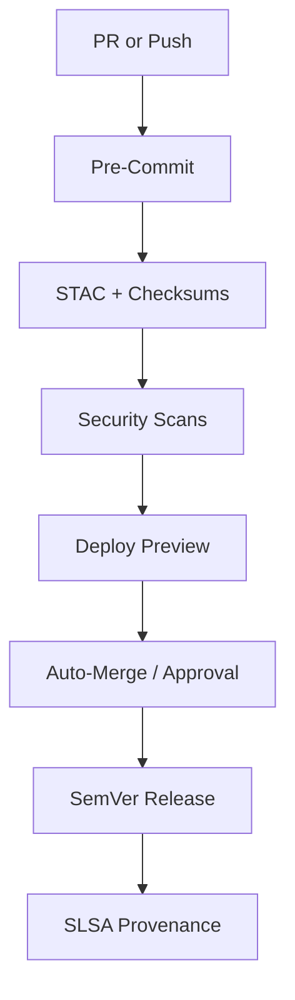

<div align="center">

# ⚙️ **Kansas Frontier Matrix — CI/CD Workflows**

`📁 .github/workflows/README.md`

**Mission:** Orchestrate **validation, security, data governance, versioning, and deployment** for the Kansas Frontier Matrix (KFM) — delivering a **reproducible**, **auditable**, **secure**, and **MCP-compliant** automation framework.

[](./site.yml)
[](./stac-validate.yml)
[](#-workflow-summary)
[](./codeql.yml)
[](./trivy.yml)
[](./dependency-review.yml)
[](https://pre-commit.com/)
[](../../docs/)
[](./provenance.yml)
[](../../LICENSE)

</div>

---

## 📚 Overview

This directory defines all **GitHub Actions** used by **KFM’s CI/CD system** — aligned to **MCP-DL v6.3**:

🧒 **Documented** · 🔍 **Traceable** · 🔐 **Secure** · ♻️ **Reproducible** · 🧮 **Verifiable** · 🏷️ **Versioned**

### Domains

* 🧪 **Validation**: STAC, JSON Schema, link check, SHA-256 checksums
* 🔒 **Security**: CodeQL, Trivy, Dependency Review, SBOM, SARIF
* 🌊 **Data**: Ingestion via manifest + provenance
* 🚀 **Deploy**: GitHub Pages (docs, site)
* 🧾 **Provenance**: SLSA attestations, signing, retention
* 🧭 **Governance**: Auto-merge, SemVer, required checks

---

## 🗂️ Workflow Directory

```bash
.github/workflows/
├── README.md               # (this file)
├── site.yml                # Build & deploy site
├── stac-validate.yml       # STAC, schema, link validation
├── fetch.yml               # Manifest-driven dataset fetch
├── checksums.yml           # SHA-256 computation
├── codeql.yml              # Static analysis: SARIF
├── trivy.yml               # CVE scanner + SBOM/SPDX
├── pre-commit.yml          # Format, lint, spellcheck
├── dependency-review.yml   # GitHub advisory scan
├── release.yml             # Tag, notes, bundle
├── provenance.yml          # SLSA attestations
└── auto-merge.yml          # Green-check gated auto-merge
```

> ⚠️ If renaming files, update: CI badges · status checks · documentation links.

---

## 🧩 Workflow Summary

| 🧱 Workflow             | 🎯 Purpose                      | ⏰ Trigger(s)       | 📦 Outputs                        |
| ----------------------- | ------------------------------- | ------------------ | --------------------------------- |
| `site.yml`              | Deploy GitHub Pages + site      | `main`, manual     | `_site/` folder → Pages           |
| `stac-validate.yml`     | STAC + JSON Schema + link check | PR, push           | `stac-report.json`                |
| `fetch.yml`             | Fetch external datasets         | CRON, manual       | `data/raw/` snapshot              |
| `checksums.yml`         | SHA-256 validation              | data PR, manual    | `.sha256` files + logs            |
| `codeql.yml`            | Static analysis                 | schedule, PR, push | `codeql.sarif`                    |
| `trivy.yml`             | CVE scan, SBOM                  | weekly, PR         | `trivy.sarif`, `sbom.spdx.json`   |
| `pre-commit.yml`        | Lint, format, spellcheck        | PR                 | PR annotations, CI pass           |
| `dependency-review.yml` | Dep vulnerability annotations   | PR                 | Inline advisory alerts            |
| `release.yml`           | Tag SemVer, build, bundle       | tag, manual        | GitHub release, changelog, assets |
| `provenance.yml`        | SLSA provenance, signing        | post-release       | `slsa.intoto.jsonl` attestations  |
| `auto-merge.yml`        | Green-check auto-merge          | CI pass + review   | Merged PR + audit log             |

---

## 🧠 Governance & SemVer Flow



<!-- END OF MERMAID -->

---

## ⚙️ Workflow Design Patterns

### 🔐 OIDC + Least Privilege

```yaml
permissions:
  contents: read
  id-token: write
  security-events: write
```

### 🧹 Concurrency

```yaml
concurrency:
  group: ${{ github.workflow }}-${{ github.ref }}
  cancel-in-progress: true
```

### 🧱 Matrix Jobs (Python)

```yaml
strategy:
  matrix:
    python-version: ["3.10", "3.11"]
    os: ["ubuntu-latest"]
```

### ⚡ Caching Pip & Pre-commit

```yaml
- uses: actions/cache@v4
  with:
    path: |
      ~/.cache/pip
      ~/.cache/pre-commit
    key: ${{ runner.os }}-${{ matrix.python-version }}-${{ hashFiles('**/requirements*.txt') }}
```

### 🌿 Environment Guards

```yaml
environment:
  name: production
  url: https://bartytime4life.github.io/Kansas-Frontier-Matrix/
```

---

## 🔐 Secrets & Env Vars

| 🔑 Key           | 🧪 Used By     | Purpose                  | 🔒 Notes                      |
| ---------------- | -------------- | ------------------------ | ----------------------------- |
| `PAGES_TOKEN`    | site.yml       | GitHub Pages deploy      | Use Actions Secrets           |
| `DATA_API_KEY_*` | fetch.yml      | External data API access | Rotate quarterly              |
| `GH_TOKEN`       | auto-merge.yml | GitHub API merge trigger | Prefer default `GITHUB_TOKEN` |
| `SIGNING_KEY`    | provenance.yml | Artifact signing (opt)   | Use keyless if possible       |

---

## 🧱 MCP Compliance Matrix

| ✅ Principle         | 🧪 Applied Through                                |
| ------------------- | ------------------------------------------------- |
| Documentation-First | README, inline workflow docs, `x-kfm-version` tag |
| Reproducibility     | Pinned actions, checksums, container digests      |
| Open Standards      | STAC, SARIF, SPDX, YAML, JSON Schema              |
| Provenance          | SLSA, SHA-256, source lineage                     |
| Auditability        | Logs, artifacts, ≥ 90d retention                  |
| Security            | CodeQL, Trivy, review gates                       |
| Versioning          | SemVer, tags, changelogs                          |

---

## 🔄 Maintenance Cadence

| 📆 Frequency | Task                                       | Purpose                       |
| ------------ | ------------------------------------------ | ----------------------------- |
| Weekly       | CodeQL/Trivy runs                          | Early CVE detection           |
| Monthly      | Pin refresh · Secrets check                | Supply-chain hygiene          |
| Quarterly    | STAC schema audit · MCP docs check         | Governance review             |
| Per-Release  | Version tag · SBOM · Site bundle + signoff | Immutable builds & provenance |

---

## 🛠️ CLI Tools

```bash
make site             # Build & preview documentation
make stac-validate    # Validate STAC + schema
make checksums        # SHA-256 integrity
python src/utils/fetch_data.py --manifest data/sources/foo.json
pre-commit run --all-files
```

<details><summary><strong>gh CLI Examples</strong></summary>

```bash
gh workflow run site.yml
gh run list
gh run download --name "stac-report.json"
```

</details>

---

## 🕓 Version History

| Version | Date       | Notes                                       |
| ------- | ---------- | ------------------------------------------- |
| v2.6.0  | 2025-10-16 | CI badge links verified · layout upgrades   |
| v2.5.1  | 2025-10-15 | MCP-DL v6.3 compliance · Mermaid formatting |
| v2.5.0  | 2025-10-15 | Table + badge GFM compliance                |
| v2.4.0  | 2025-10-14 | Cadence matrix + SLSA annotations           |

---

<div align="center">

### ⚙️ Kansas Frontier Matrix — CI/CD: Automation with Integrity

“.github/workflows/” governs the execution, security, and provenance of every pipeline.
🧬 Every run is traceable. Every artifact is proven.

</div>
