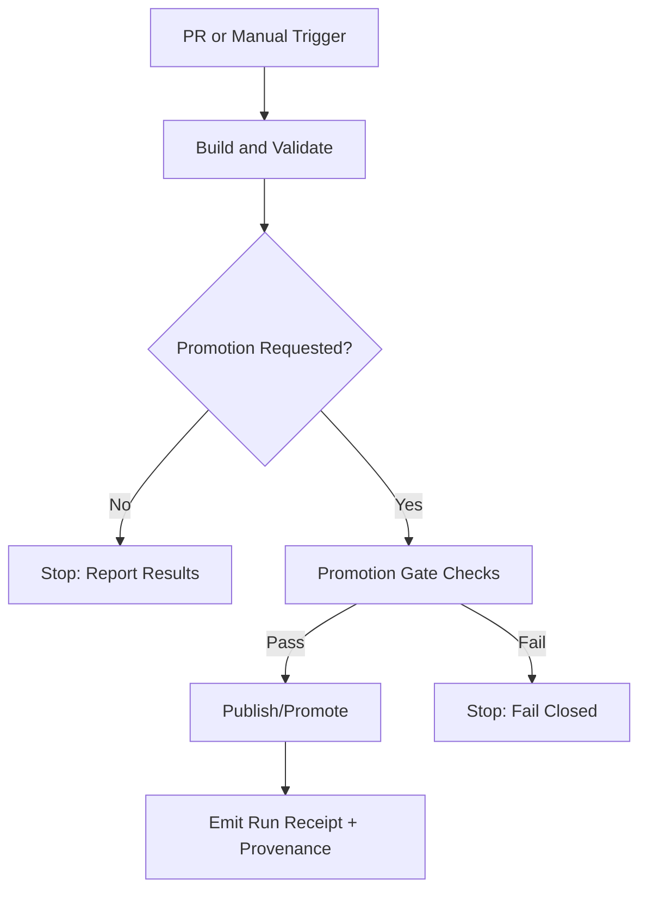

<!-- [KFM_META_BLOCK_V2]
doc_id: kfm://doc/6b7a62d4-5b3a-4b4c-9c07-2a1d6c0a9c6b
title: GitHub Actions Workflows
type: standard
version: v1
status: draft
owners: KFM Engineering; KFM Governance
created: 2026-02-22
updated: 2026-02-22
policy_label: restricted
related:
  - .github/workflows
tags: [kfm, ci, github-actions, workflows, governance, promotion-gates]
notes:
  - Normative conventions for workflows in this repo, plus an inventory table to keep in sync.
  - This file is intentionally “spec-first”: update the Inventory section to reflect what actually exists.
[/KFM_META_BLOCK_V2] -->

# GitHub Actions Workflows
Map-first CI/CD conventions + promotion gates for **governed** builds & data pipelines.  
**Status:** draft • **Owners:** KFM Engineering + Governance • **Scope:** `.github/workflows/*`


---

## Quick navigation
- [What belongs in this directory](#what-belongs-in-this-directory)
- [Workflow inventory](#workflow-inventory)
- [Required conventions](#required-conventions)
- [Promotion gates](#promotion-gates)
- [Audit, provenance, and run receipts](#audit-provenance-and-run-receipts)
- [Security baseline](#security-baseline)
- [Change management](#change-management)
- [Appendix: workflow template](#appendix-workflow-template)

---

## Directory tree
> [!NOTE]
> This tree is a **template**. Replace it with the repo’s real contents as workflows are added/renamed.

```text
.github/
└─ workflows/
   ├─ README.md                # ← you are here
   ├─ ci.yml                   # (expected) build + test + lint
   ├─ security.yml             # (expected) SAST/deps/secrets policy checks
   ├─ docs.yml                 # (expected) docs lint/build/link check
   ├─ data-pipeline.yml        # (optional) scheduled/adhoc pipeline runs (RAW→WORK→PROCESSED)
   └─ release.yml              # (optional) tagged release + deployment (PUBLISHED)
```

---

## What belongs in this directory

This directory is for **GitHub Actions workflow definitions** and the documentation required to operate them safely.

Workflows in this repo are treated as part of the **trust membrane**:

- They must be **deterministic where possible**, and **auditable always**.
- They must **fail-closed** on missing metadata, validation failures, license issues, or policy violations.
- They must never “promote” artifacts (code, data, models, stories) without satisfying the **Promotion Contract** (see [Promotion gates](#promotion-gates)).

---

## Workflow inventory
> [!IMPORTANT]
> Fill this table in so humans can understand *what runs*, *when it runs*, and *what it can publish*.
> If a file doesn’t exist yet, leave it as `(TBD)`.

| Workflow file | Purpose | Triggers | Produces artifacts | Can publish/promote? | Required checks (branch protection) |
|---|---|---:|---:|---:|---|
| `ci.yml` | Build + unit tests + lint | `pull_request`, `push` | yes | no | (TBD) |
| `security.yml` | SAST / deps / secrets policy | `pull_request`, `schedule` | optional | no | (TBD) |
| `docs.yml` | Docs lint/build, link checks | `pull_request` | optional | no | (TBD) |
| `data-pipeline.yml` | Data jobs + validation + receipts | `workflow_dispatch`, `schedule` | yes | **maybe** (gated) | (TBD) |
| `release.yml` | Release & deployment orchestration | tags / `workflow_dispatch` | yes | **yes** (gated) | (TBD) |

---

## Required conventions

### 1) Least privilege permissions (MUST)
Set workflow permissions explicitly. Default should be read-only unless required.

```yaml
permissions:
  contents: read
```

Only grant write scopes to jobs that truly need them (e.g., releasing artifacts, writing attestations).

### 2) Pin action versions (MUST)
Use commit-SHA pinning for third-party actions when feasible.

> [!WARNING]
> Tag pinning (e.g., `@v4`) is convenient but increases supply-chain risk.

### 3) Concurrency and timeouts (MUST)
Prevent duplicated runs and runaway jobs:

```yaml
concurrency:
  group: ${{ github.workflow }}-${{ github.ref }}
  cancel-in-progress: true

jobs:
  build:
    timeout-minutes: 30
```

### 4) Determinism & reproducibility (SHOULD)
- Pin runtime versions (Node/Python/Java/etc.).
- Lock dependencies (`package-lock.json`, `pnpm-lock.yaml`, `poetry.lock`, etc.).
- Prefer hermetic builds where possible (containers, lockfiles, reproducible flags).

### 5) No direct DB / storage writes from CI (MUST)
Workflows must not bypass the governed API/policy boundary:
- CI can **build** and **validate** artifacts.
- CI can **publish** only through approved release/publish steps with gating + receipts.
- No “ad hoc” writes to production stores.

### 6) Secrets hygiene (MUST)
- Never print secrets.
- Prefer OIDC / short-lived credentials over long-lived secrets (where supported).
- Use environment protection rules for prod-like deployments.

---

## Promotion gates

KFM’s data and artifact lifecycle uses zones:

```text
RAW → WORK / QUARANTINE → PROCESSED → PUBLISHED
```

### Promotion Contract (MUST for any promotion)
A workflow step that moves something “forward” (e.g., `PROCESSED → PUBLISHED`) **MUST** prove:

- **Metadata** exists (minimum: identity, version, timestamps, policy label).
- **Validation** passed (schema + QA rules).
- **License checks** passed (allowed redistribution + attribution captured).
- **Provenance** is recorded (inputs, transformations, tools, checksums).
- **Checksums** for inputs and outputs are captured.
- **Audit record / run receipt** is emitted.

> [!IMPORTANT]
> If any required proof is missing → **fail closed**. No partial publish.

### Promotion flow diagram (conceptual)



---

## Audit, provenance, and run receipts

### Run receipts (MUST for publish/promote)
Any publish/promotion job must attach a machine-readable “run receipt” artifact that includes:

- `who`: actor, repo, workflow, job
- `what`: artifact identifiers + checksums
- `when`: run time + commit SHA
- `why`: trigger + inputs/parameters
- `policy`: label + any redactions applied
- `inputs/outputs`: file lists + hashes
- `checks`: validation + license + security outcomes

> [!NOTE]
> Receipt format should match the repo’s canonical audit schema. If the schema isn’t defined yet, create
> a minimal JSON and iterate—**but do not publish without a receipt**.

Example receipt stub:

```json
{
  "run_id": "GITHUB_RUN_ID",
  "workflow": "workflow_file.yml",
  "actor": "github_actor",
  "commit": "sha",
  "timestamp_utc": "YYYY-MM-DDThh:mm:ssZ",
  "artifacts": [
    {"name": "artifact-name", "sha256": "hex"}
  ],
  "promotion": {
    "from_zone": "PROCESSED",
    "to_zone": "PUBLISHED",
    "policy_label": "restricted"
  },
  "checks": {
    "validation": "pass",
    "license": "pass",
    "security": "pass"
  }
}
```

---

## Security baseline

Minimum expectations for CI security posture:

- **Dependency review / lockfile integrity** on PRs
- **Secret scanning** (and prevent secret exfil in logs)
- **SAST** for supported languages
- **Permissions review** (no accidental `contents: write` everywhere)
- **Artifact integrity** (checksums / attestations where possible)

> [!TIP]
> Put security checks in a dedicated workflow and make it a required check for merge.

---

## Change management

### Making changes safely (MUST)
- Treat workflow edits as production changes.
- Require PR review by at least one maintainer.
- Prefer small diffs and reversible changes.
- If a workflow is responsible for publishing: require governance review.

### Rollback strategy (SHOULD)
- Keep workflow behavior behind inputs/flags for quick disable.
- Use environment protection rules for deployment jobs.
- If a publish job fails after partial steps: it must either roll back or record the partial state in the receipt.

---

## Appendix: workflow template

A minimal, safe-ish starting point for new workflows:

```yaml
name: (TBD) Workflow Name

on:
  workflow_dispatch:
  pull_request:
    branches: [ main ]

permissions:
  contents: read

concurrency:
  group: ${{ github.workflow }}-${{ github.ref }}
  cancel-in-progress: true

jobs:
  check:
    runs-on: ubuntu-latest
    timeout-minutes: 30

    steps:
      - name: Checkout
        uses: actions/checkout@v4

      - name: Set up runtime
        # Replace with your language/toolchain setup
        run: |
          echo "TODO: install toolchain"
          echo "TODO: run lint/test/build"

      - name: Produce receipt (if publish/promote)
        if: ${{ false }} # flip to true only in publish workflows
        run: |
          echo '{
            "run_id": "'"${{ github.run_id }}"'",
            "workflow": "'"${{ github.workflow }}"'",
            "actor": "'"${{ github.actor }}"'",
            "commit": "'"${{ github.sha }}"'"
          }' > run-receipt.json

      - name: Upload receipt
        if: ${{ false }} # flip to true only in publish workflows
        uses: actions/upload-artifact@v4
        with:
          name: run-receipt
          path: run-receipt.json
```

---

## Back to top
↑ [Return to top](#github-actions-workflows)
