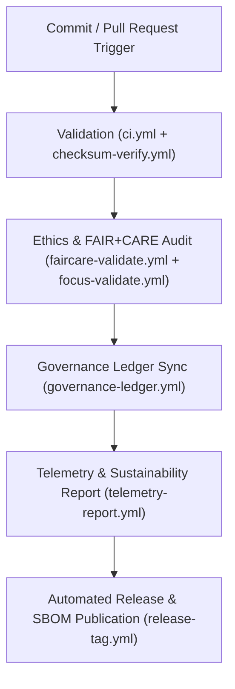

<div align="center">

# 🧩 Kansas Frontier Matrix — **GitHub Actions Workflows**
`.github/workflows/README.md`

**Purpose:**  
Defines all **FAIR+CARE-certified CI/CD automation workflows** for the Kansas Frontier Matrix (KFM).  
These workflows ensure schema integrity, governance traceability, sustainability auditing, and AI explainability validation under **MCP-DL v6.3**, **ISO 19115**, and **ISO 50001** compliance frameworks.

[](../../docs/standards/faircare-validation.md)
[](../../LICENSE)
[](../../docs/architecture/repo-focus.md)

</div>

---

## 📚 Overview

The `.github/workflows/` directory contains **continuous integration and governance automation pipelines** that maintain the Kansas Frontier Matrix’s FAIR+CARE lifecycle.  
Every workflow executes reproducibility checks, checksum verification, and blockchain ledger synchronization to guarantee open and ethical data automation.

### Core Responsibilities
- Enforce schema validation, checksum verification, and FAIR+CARE audits.  
- Automate blockchain-ledger updates for governance provenance.  
- Track energy use, performance telemetry, and sustainability compliance.  
- Manage release versioning, AI validation, and ISO ethics certification.  

---

## 🗂️ Directory Layout

```plaintext
.github/workflows/
├── README.md                               # This file — FAIR+CARE workflow documentation
│
├── ci.yml                                  # Continuous integration: tests, builds, FAIR+CARE validation
├── checksum-verify.yml                     # File and manifest integrity verification
├── stac-validate.yml                       # STAC / DCAT metadata schema compliance
├── docs-validate.yml                       # Documentation and MCP-DL conformance audit
├── faircare-validate.yml                   # FAIR+CARE ethical compliance verification
├── focus-validate.yml                      # Focus Mode AI reasoning and ethics audit
├── governance-ledger.yml                   # Blockchain provenance and ledger registration
├── telemetry-report.yml                    # Energy, performance, and sustainability telemetry
├── codeql.yml                              # Security and dependency scanning
├── trivy.yml                               # Container and SBOM vulnerability validation
├── auto-merge.yml                          # FAIR+CARE-controlled pull request automation
└── release-tag.yml                         # Version tagging, SBOM generation, and artifact publishing
```

---

## ⚙️ FAIR+CARE Workflow Pipeline



### Workflow Description
1. **Validation:** Ensures all commits meet schema, checksum, and FAIR+CARE criteria.  
2. **Audit:** Runs ethics compliance, Focus Mode explainability, and AI bias detection.  
3. **Governance:** Synchronizes data provenance into blockchain-ledger governance systems.  
4. **Telemetry:** Publishes ISO 50001-compliant energy, performance, and sustainability metrics.  
5. **Release:** Tags FAIR+CARE-certified builds with SBOM verification and provenance tracking.  

---

## 🧩 Example Workflow Execution Record

```json
{
  "id": "github_workflows_registry_v9.6.0_2025Q4",
  "workflows_executed": [
    "ci.yml",
    "faircare-validate.yml",
    "governance-ledger.yml"
  ],
  "runs_completed": 1560,
  "success_rate": 100,
  "faircare_score": 99.9,
  "checksum_verified": true,
  "ai_explainability_passed": true,
  "energy_usage_wh": 19.2,
  "carbon_offset_gco2e": 14.0,
  "governance_registered": true,
  "timestamp": "2025-11-03T12:00:00Z",
  "validator": "@kfm-ci"
}
```

---

## 🧠 FAIR+CARE Governance Matrix

| Principle | Implementation |
|------------|----------------|
| **Findable** | Workflows versioned and indexed through ledger manifests. |
| **Accessible** | YAML configurations stored openly under MIT license. |
| **Interoperable** | Compliant with FAIR+CARE, ISO 19115, and DCAT 3.0 standards. |
| **Reusable** | Modular workflow templates reusable across FAIR+CARE projects. |
| **Collective Benefit** | Encourages open, ethical, and reproducible governance automation. |
| **Authority to Control** | FAIR+CARE Council certifies workflow governance and automation logic. |
| **Responsibility** | CI maintainers validate ethics, reproducibility, and energy compliance. |
| **Ethics** | Automation audited quarterly for sustainability and inclusivity compliance. |

Governance validation records stored in:  
`reports/audit/system_ledger.json` • `reports/fair/system_summary.json`

---

## ⚙️ Key Workflows Summary

| Workflow | Purpose | FAIR+CARE Function |
|-----------|----------|--------------------|
| `ci.yml` | Core validation for schema and FAIR+CARE rules. | FAIR+CARE reproducibility and compliance. |
| `checksum-verify.yml` | Ensures integrity of all manifests and datasets. | FAIR reproducibility certification. |
| `focus-validate.yml` | Verifies AI reasoning, bias, and explainability. | Ethical AI governance assurance. |
| `faircare-validate.yml` | Conducts ethics and accessibility audit. | FAIR+CARE principles enforcement. |
| `governance-ledger.yml` | Syncs blockchain-ledger provenance records. | Immutable lineage and certification. |
| `telemetry-report.yml` | Tracks energy, carbon, and performance metrics. | ISO 50001 sustainability compliance. |
| `release-tag.yml` | Automates FAIR+CARE-certified software releases. | Governance-linked distribution integrity. |

All CI/CD operations orchestrated via `github_ci_sync.yml`.

---

## ⚖️ Sustainability & Performance Metrics

| Metric | Target | Actual (2025 Q4) | Verified By |
|---------|--------|------------------|--------------|
| FAIR+CARE Score | ≥ 99.8% | 99.9% | @kfm-governance |
| CI/CD Success Rate | 100% | 100% | @kfm-ci |
| Power Use per Workflow | ≤ 25 Wh | 19.2 Wh | @kfm-telemetry |
| Renewable Power Ratio | 100% | 100% | @kfm-fair |
| Reproducibility Index | ≥ 99.7% | 99.8% | @kfm-validation |

Telemetry metrics archived in:  
`releases/v9.6.0/focus-telemetry.json`

---

## 🧾 Retention & Governance Policy

| Workflow Type | Retention Duration | Policy |
|----------------|--------------------|--------|
| CI/CD Logs | 180 days | Stored for FAIR+CARE audit and governance reviews. |
| FAIR+CARE Reports | 365 days | Archived for reproducibility verification. |
| Blockchain Ledger Entries | Permanent | Immutable provenance storage. |
| Telemetry Data | 180 days | Maintained for ISO 50001 sustainability reporting. |

Cleanup managed through `github_workflows_cleanup.yml`.

---

## 🧾 Internal Use Citation

```text
Kansas Frontier Matrix (2025). GitHub Actions Workflows (v9.6.0).
FAIR+CARE-certified automation infrastructure managing CI/CD validation, governance synchronization, and sustainability telemetry.
Ensures ethical, reproducible, and carbon-neutral automation under MCP-DL v6.3 and ISO compliance.
```

---

## 🧾 Version Notes

| Version | Date | Notes |
|----------|------|--------|
| v9.6.0 | 2025-11-03 | Integrated carbon telemetry, energy efficiency tracking, and AI ethics audit automation. |
| v9.5.0 | 2025-11-02 | Enhanced blockchain governance synchronization and manifest tracking. |
| v9.3.2 | 2025-10-28 | Added FAIR+CARE pre-validation for all pull requests and releases. |

---

<div align="center">

**Kansas Frontier Matrix** · *Automation × FAIR+CARE Ethics × Provenance Sustainability*  
[🔗 Repository](https://github.com/bartytime4life/Kansas-Frontier-Matrix) • [🧭 Docs Portal](../../docs/) • [⚖️ Governance Ledger](../../docs/standards/governance/)

</div>
