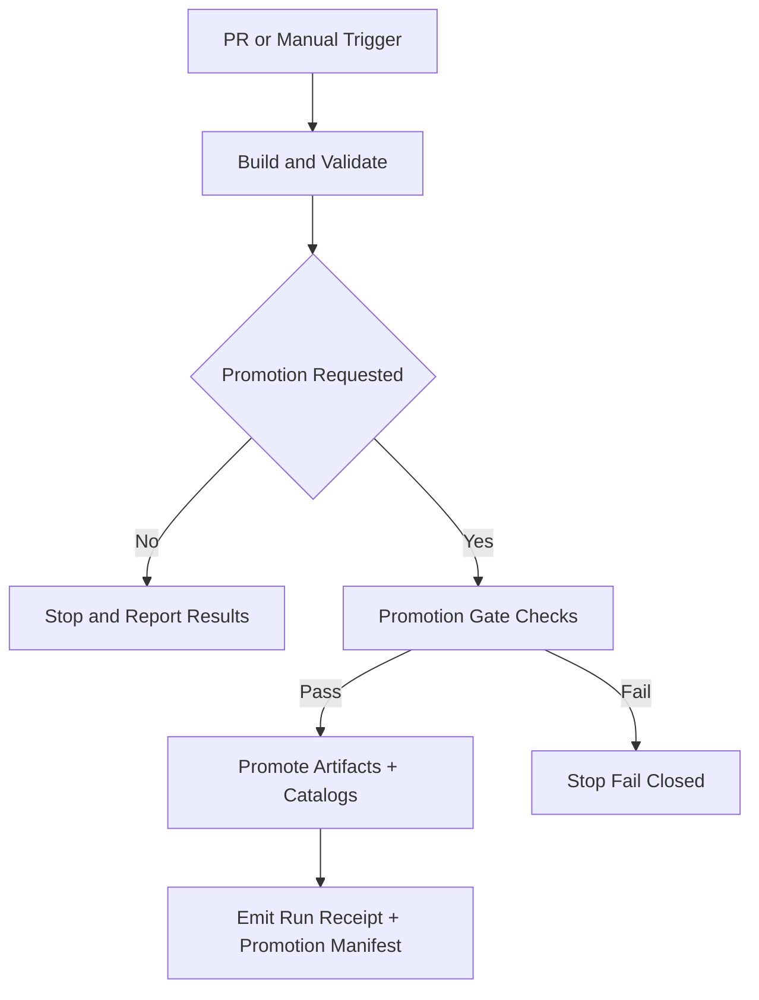

<!-- [KFM_META_BLOCK_V2]
doc_id: kfm://doc/6b7a62d4-5b3a-4b4c-9c07-2a1d6c0a9c6b
title: GitHub Actions Workflows
type: standard
version: v1
status: draft
owners: KFM Engineering; KFM Governance
created: 2026-02-22
updated: 2026-02-28
policy_label: restricted
related:
  - .github/workflows
tags: [kfm, ci, github-actions, workflows, governance, promotion-gates]
notes:
  - Normative conventions for workflows in this repo, plus an inventory table to keep in sync.
  - Spec-first: update the Inventory to reflect what exists; do not “assume” workflows exist.
  - Aligns CI/publish lanes to the KFM truth path + Promotion Contract v1 expectations (fail-closed).
[/KFM_META_BLOCK_V2] -->

# GitHub Actions Workflows
Map-first CI/CD conventions + promotion gates for **governed** builds & data pipelines.  
**Status:** draft • **Owners:** KFM Engineering + Governance • **Scope:** `.github/workflows/*`


---

## Quick navigation
- [What belongs in this directory](#what-belongs-in-this-directory)
- [Directory tree](#directory-tree)
- [Workflow inventory](#workflow-inventory)
- [Non-negotiable invariants](#non-negotiable-invariants)
- [Required conventions](#required-conventions)
- [Promotion gates](#promotion-gates)
- [Audit, provenance, and run receipts](#audit-provenance-and-run-receipts)
- [Security baseline](#security-baseline)
- [Change management](#change-management)
- [Appendix: workflow templates](#appendix-workflow-templates)

---

## What belongs in this directory

This directory is for **GitHub Actions workflow definitions** and the documentation required to operate them safely.

Workflows in this repo are part of the **trust membrane**:

- They must be **auditable always** (every meaningful run emits receipts).
- They must **fail-closed** on missing metadata, validation failures, rights gaps, or policy violations.
- They must never “promote” artifacts (code, data, models, stories) without satisfying the **Promotion Contract** (see [Promotion gates](#promotion-gates)).

### Acceptable inputs
- `*.yml` / `*.yaml` GitHub Actions workflows
- Reusable workflows under a `reusables/` folder (optional)
- Composite actions under `.github/actions/*` (optional)
- Minimal helper scripts **only if** they’re versioned, pinned, and reviewed (prefer repo tools packages instead)

### Exclusions
- Secrets, tokens, private keys (never commit)
- “One-off” workflows not listed in the [Workflow inventory](#workflow-inventory)
- Direct writes to production databases/object stores (must go through governed publish lanes + receipts)

---

## Directory tree
> [!NOTE]
> This tree is a **template**. Replace it with the repo’s real contents as workflows are added/renamed.

```text
.github/
├─ workflows/
│  ├─ README.md                     # ← you are here
│  ├─ ci.yml                        # (expected) build + unit tests + lint
│  ├─ security.yml                  # (expected) SAST/deps/secrets policy checks
│  ├─ docs.yml                      # (expected) docs lint/build/link check
│  ├─ kfm-policy-gate.yml           # (recommended) Conftest/OPA merge-blocking governance gate
│  ├─ data-pipeline.yml             # (optional) scheduled/adhoc pipeline runs (RAW→…→CATALOG)
│  ├─ release.yml                   # (optional) promotion to PUBLISHED (gated)
│  └─ reusables/
│     └─ kfm-lane.yml               # (recommended) reusable lane runner (guardrails + artifacts)
└─ actions/
   └─ setup-conftest/               # (recommended) composite action to install a pinned Conftest
```

---

## Workflow inventory
> [!IMPORTANT]
> Fill this table in so humans can understand *what runs*, *when it runs*, and *what it can publish*.
> If a file doesn’t exist yet, leave it as `(TBD)`.

| Workflow file | Lane | Purpose | Triggers | Produces artifacts | Can publish/promote? | Required checks (branch protection) |
|---|---|---|---|---:|---:|---|
| `ci.yml` | CI | Build + unit tests + lint | `pull_request`, `push` | yes | no | (TBD) |
| `security.yml` | Security | SAST / dependency / secret policy | `pull_request`, `schedule` | optional | no | (TBD) |
| `docs.yml` | Docs | Docs lint/build/link checks | `pull_request` | optional | no | (TBD) |
| `kfm-policy-gate.yml` | Governance | Merge-blocking policy-as-code gate | `pull_request` | yes (reports) | no | (TBD) |
| `data-pipeline.yml` | Data lane | Data jobs + validation + receipts | `workflow_dispatch`, `schedule` | yes | **maybe** (gated) | (TBD) |
| `release.yml` | Promotion | Promotion + deployment orchestration | tags / `workflow_dispatch` | yes | **yes** (gated) | (TBD) |
| `reusables/kfm-lane.yml` | Reusable | Shared lane runner w/ guardrails | `workflow_call` | yes | inherits caller gate | (N/A) |

> [!TIP]
> Keep **workflow check names stable**. If a required check name changes, update branch protection and this inventory in the same PR.

---

## Non-negotiable invariants

These are **safety invariants** for automation in a governed system:

- **PR-first publishing:** automation opens/updates PRs; it never merges and never pushes to protected branches.
- **Idempotency:** rerunning CI should not duplicate lineage/receipts/PRs.
- **Determinism:** same pinned inputs + same code → rebuilds identical artifacts.
- **Fail-closed gates:** schema/policy/QA/reproducibility must pass **before** promotion actions.
- **Kill-switch:** a central flag can stop automation quickly.
- **Network boundaries:** workflows do not write directly to production stores; changes flow via governed mechanisms.

---

## Required conventions

### 0) Normative language
- **MUST** = mandatory requirement (merge-blocking for protected branches)
- **SHOULD** = recommended default; deviations require justification
- **MAY** = optional

### 1) Least-privilege permissions (MUST)
Set workflow permissions explicitly. Default should be read-only unless required.

```yaml
permissions:
  contents: read
```

**Rule:** any job that needs elevated permissions (e.g., creating releases, writing attestations, updating branches via PR automation) must:
- request the minimum scopes at the job level
- be isolated from untrusted inputs (PR-from-fork, user-provided scripts, etc.)

### 2) Pin action versions (MUST for third-party; SHOULD for all)
Prefer full commit-SHA pinning for actions. If you use tags for readability, treat that as a temporary convenience and plan to pin.

> [!WARNING]
> Tag pinning (e.g., `@v4`) is convenient but increases supply-chain risk.

### 3) Concurrency and timeouts (MUST)
Prevent duplicated runs and runaway jobs:

```yaml
concurrency:
  group: ${{ github.workflow }}-${{ github.ref }}
  cancel-in-progress: true

jobs:
  build:
    timeout-minutes: 30
```

### 4) Reusable lanes pattern (SHOULD; recommended default)
Prefer a “thin entry workflow” that calls a reusable workflow per lane. This keeps guardrails consistent.

- Lanes differ by **inputs**, not by structure.
- Guardrails (permissions, concurrency, timeouts, artifact retention) live in the reusable.

### 5) Determinism & reproducibility (SHOULD)
- Pin runtime versions (Node/Python/Java/etc.)
- Lock dependencies (`package-lock.json`, `pnpm-lock.yaml`, `poetry.lock`, etc.)
- Prefer hermetic builds where possible (containers, lockfiles, reproducible flags)
- Treat caches as performance optimization, not as evidence

### 6) No direct DB / storage writes from CI (MUST)
Workflows must not bypass the governed API/policy boundary:
- CI can **build** and **validate** artifacts.
- CI can **publish/promote** only through approved promotion lanes with gating + receipts.
- No “ad hoc” writes to production stores.

### 7) Policy-as-code gates (SHOULD; MUST for promotion)
Policy checks should be merge-blocking, explainable, and versioned.
- Deny messages must tell you what’s missing/violated and how to remediate.

---

## Promotion gates

KFM’s truth path uses zones:

```text
RAW → WORK / QUARANTINE → PROCESSED → CATALOG / TRIPLET → PUBLISHED
```

### Promotion Contract v1 (MUST for any promotion)
A workflow step that moves something “forward” (especially toward **PUBLISHED**) MUST prove the minimum gates below, and MUST fail-closed if any proof is missing.

| Gate | Fail-closed proof (minimum) | Example CI check |
|---|---|---|
| A — Identity & versioning | dataset_id + dataset_version_id; deterministic spec/content digests | schema validation; spec hash golden tests |
| B — Licensing & rights | license/rights fields + snapshot of upstream terms | fail if license missing/unknown |
| C — Sensitivity & redaction | policy_label + obligations applied; default-deny policy tests | OPA/Conftest tests for obligations |
| D — Catalog triplet validation | DCAT/STAC/PROV validate; cross-links resolve; EvidenceRefs resolve | validators + linkcheck |
| E — QA & thresholds | dataset-specific QA checks documented and passed | QA report exists; thresholds met |
| F — Run receipt & audit record | run receipt emitted and schema-valid; append-only audit record | receipt schema validation; optional attest verify |
| G — Promotion manifest | promotion recorded as a manifest referencing artifacts + digests | manifest exists; references match |

### Promotion flow diagram (conceptual)



---

## Audit, provenance, and run receipts

### Run receipts (MUST for publish/promote; SHOULD for all lanes)
Any publish/promotion job must attach a machine-readable **run receipt** artifact.

Minimum expectations:
- stable `run_id`
- `actor` and `operation`
- dataset version identifier (when applicable)
- input/output URIs + digests
- environment capture (git commit, container digest, params digest)
- validation status + report digest
- policy decision reference
- timestamps

### Promotion manifests (MUST when promoting dataset versions)
Any promotion into runtime surfaces should also emit a **promotion manifest** that references:
- dataset slug + dataset_version_id + spec hash
- artifact list + digests + media types
- catalog list + digests (DCAT/STAC/PROV)
- QA status
- policy label + decision id
- approvals (when required)

> [!NOTE]
> Keep receipts and manifests **small, typed, and schema-valid**. They are contract surfaces for UI, evidence resolution, and audit review.

---

## Security baseline

Minimum expectations for CI security posture:

- **Default token permissions restricted** (repo/org setting) + explicit per-workflow `permissions`
- **Pin actions** (full commit SHAs for immutability where feasible)
- **OIDC / short-lived credentials** for cloud deployments (avoid long-lived secrets)
- **Dependency review + lockfile integrity** on PRs
- **Secret scanning** and log redaction discipline
- **SAST** where supported
- **Branch protection** with required status checks for CI + governance gates
- **Environment protection rules** for promotion/deploy jobs (reviewers, approvals)

---

## Change management

### Making changes safely (MUST)
- Treat workflow edits as production changes.
- Require PR review by at least one maintainer.
- Prefer small diffs and reversible changes.
- If a workflow is responsible for publishing/promoting: require governance review.

### Rollback strategy (SHOULD)
- Keep publish behavior behind inputs/flags for quick disable.
- Use environment protection rules for deployment jobs.
- If a publish job fails after partial steps: either roll back or record partial state in the receipt/manifest.

### Verification checklist (recommended for every workflow PR)
- [ ] Inventory table updated to match files + purpose + triggers
- [ ] Required checks list updated (if job/check names changed)
- [ ] permissions set explicitly and minimized
- [ ] concurrency + timeouts set for long-running jobs
- [ ] publish/promote jobs emit receipts + manifests
- [ ] policy gate runs and fails closed on missing proofs

---

## Appendix: workflow templates

> [!NOTE]
> These are **templates**. Copy, then fill in repo-specific tools/paths and pin versions.

### A) Minimal lane workflow (safe-ish starter)

```yaml
name: (TBD) Lane

on:
  workflow_dispatch:
  pull_request:
    branches: [ main ]

permissions:
  contents: read

concurrency:
  group: ${{ github.workflow }}-${{ github.ref }}
  cancel-in-progress: true

jobs:
  lane:
    runs-on: ubuntu-latest
    timeout-minutes: 30

    steps:
      - name: Checkout
        uses: actions/checkout@v4 # TODO: pin to full SHA

      - name: Setup toolchain
        run: |
          echo "TODO: install pinned toolchain"
          echo "TODO: run lint/test/build"

      - name: Emit run receipt (recommended)
        run: |
          echo '{
            "run_id": "kfm://run/${{ github.run_id }}",
            "actor": { "principal": "${{ github.actor }}", "role": "ci" },
            "operation": "verify",
            "environment": { "git_commit": "${{ github.sha }}" }
          }' > run-receipt.json

      - name: Upload run receipt
        uses: actions/upload-artifact@v4
        with:
          name: run-receipt
          path: run-receipt.json
          retention-days: 14
```

### B) Reusable lane skeleton (workflow_call)

```yaml
name: kfm-lane

on:
  workflow_call:
    inputs:
      lane_name:
        required: true
        type: string

permissions:
  contents: read

jobs:
  lane:
    runs-on: ubuntu-latest
    steps:
      - run: echo "TODO: implement lane=${{ inputs.lane_name }}"
```

### C) Policy gate sketch (Conftest/OPA)

```yaml
name: kfm-policy-gate

on:
  pull_request:
    branches: [ main ]

permissions:
  contents: read

jobs:
  policy:
    runs-on: ubuntu-latest
    steps:
      - uses: actions/checkout@v4 # TODO: pin to full SHA
      - name: Install conftest
        run: |
          echo "TODO: install pinned conftest"
      - name: Run policy checks
        run: |
          echo "TODO: conftest test <targets> -p policy/"
```

---

## Back to top
↑ [Return to top](#github-actions-workflows)
