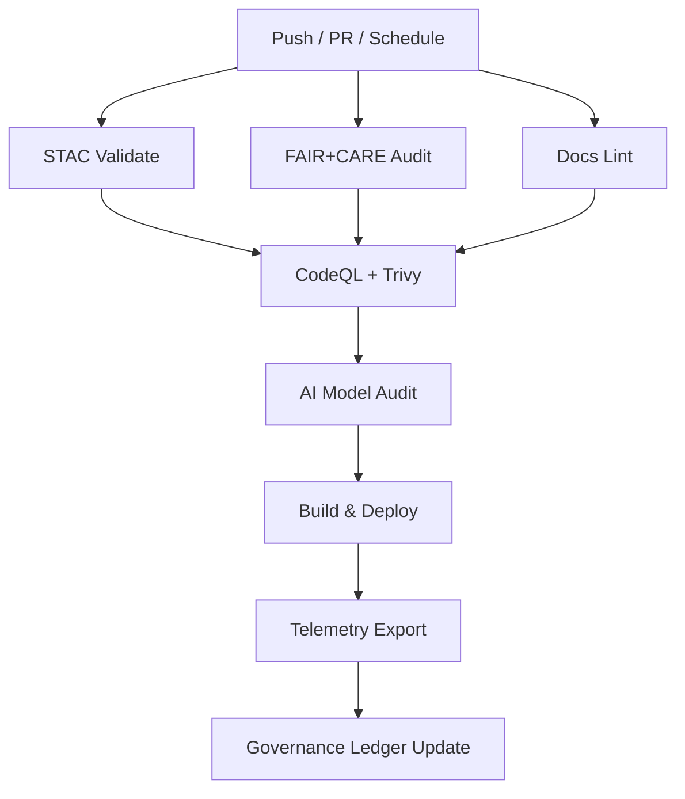

<div align="center">

# 🔄 **Kansas Frontier Matrix — CI/CD Workflows Overview**
`.github/workflows/README.md`

**Purpose:**  
Define and document all **GitHub Actions workflows** that govern automated validation, security scanning, governance auditing, deployment, and telemetry reporting within the **Kansas Frontier Matrix (KFM)** repository.  
Each workflow is **versioned, reproducible, and ledgered** under **MCP-DL v6.3**, **FAIR+CARE**, and **ISO 50001** energy standards.

[](../../docs/README.md)
[](../../LICENSE)
[](../../docs/standards/faircare.md)
[]()

</div>

---

## 📘 Overview
The workflows in this directory implement **continuous validation, deployment, and auditing** for all KFM modules.  
They ensure that every commit is:
- ✅ **Validated** (FAIR+CARE, STAC, DCAT, Docs, and Code)
- 🔒 **Scanned** (static analysis, CVE scanning, SBOM attestation)
- ⚙️ **Deployed** (frontend builds, metadata sync)
- 🧾 **Ledgered** (telemetry + governance reports)

---

## 🗂️ Directory Layout
```
.github/workflows/
├── stac-validate.yml           # STAC 1.0.0 / DCAT 3.0 validation
├── faircare-validate.yml       # FAIR+CARE + license / provenance audits
├── docs-lint.yml               # Markdown / YAML / JSON validation
├── codeql.yml                  # Static security analysis
├── trivy.yml                   # Container + dependency CVE scanning
├── build-and-deploy.yml        # Web frontend build + deploy
├── stac-dcat-bridge.yml        # STAC↔DCAT synchronization
├── telemetry-export.yml        # Metrics + telemetry aggregation
├── ai-model-audit.yml          # FAIR+CARE AI model governance
└── README.md                   # This file
```

Each YAML file defines an **autonomous MCP workflow** that feeds telemetry and reports into the governance ledger.

---

## 🧩 Validation Workflows
| Workflow | Role | Output |
|-----------|------|--------|
| **`stac-validate.yml`** | Validates STAC / DCAT schemas and metadata completeness. | `reports/self-validation/stac/_summary.json` |
| **`faircare-validate.yml`** | Ensures datasets meet FAIR+CARE principles (license, checksum, provenance). | `reports/fair/faircare_summary.json` |
| **`docs-lint.yml`** | Validates Markdown metadata and structure compliance (MD041, MD025, MD040). | `reports/self-validation/docs/lint_summary.json` |

**Triggers:** Pull request or push affecting `data/`, `docs/`, or `schemas/`.  
**Manual Runs:** Supported via `workflow_dispatch`.

---

## 🛡️ Security Workflows
| Workflow | Function | Output |
|-----------|-----------|--------|
| **`codeql.yml`** | Static code analysis (Python, JS/TS). | `reports/security/codeql/*.sarif` |
| **`trivy.yml`** | Container + dependency CVE scanning. | `reports/security/trivy/*.json` |
| **`dependabot.yml`** | Automated dependency updates. | `.github/dependabot.yml` |
| **`ai-model-audit.yml`** | AI model bias/drift + explainability attestation. | `reports/audit/ai_model_faircare.json` |

> Build **fails on CRITICAL vulnerabilities**, and results are added to the **security ledger**.

---

## 🚀 Deployment Workflows
| Workflow | Function | Output |
|-----------|-----------|--------|
| **`build-and-deploy.yml`** | Builds React/MapLibre web frontend and deploys static site. | `docs/reports/telemetry/build_metrics.json` |
| **`stac-dcat-bridge.yml`** | Synchronizes STAC metadata with DCAT 3.0. | `releases/v*/metadata-bridge.meta.json` |
| **`telemetry-export.yml`** | Aggregates workflow results and system telemetry. | `releases/v10.0.0/focus-telemetry.json` |

**Deployment URL:**  
[https://bartytime4life.github.io/Kansas-Frontier-Matrix/](https://bartytime4life.github.io/Kansas-Frontier-Matrix/)

---

## 🧮 Workflow Interdependencies


Each workflow executes independently, yet dependencies enforce ordered execution for verifiable provenance.  
Artifacts and logs are collected under `releases/v10.0.0/focus-telemetry.json`.

---

## 🧠 Governance & FAIR+CARE Integration
Each CI/CD run is cross-linked to governance and telemetry ledgers.

| Record | Description | File |
|---------|--------------|------|
| **Workflow Ledger** | Execution metadata (SHA, workflow ID, status, duration). | `docs/reports/audit/github-workflows-ledger.json` |
| **Governance Ledger** | Ethical review log and FAIR+CARE evaluation results. | `docs/reports/audit/governance-ledger.json` |
| **Telemetry Snapshot** | Consolidated metrics for dashboards. | `releases/v10.0.0/focus-telemetry.json` |

All ledgers include **commit SHAs, run IDs, provenance checksums, and timestamps** for immutable verification.

---

## ⚖️ FAIR+CARE Compliance Summary
| Principle | CI/CD Implementation |
|------------|----------------------|
| **Findable** | Workflows and results indexed in `/reports` and `/releases`. |
| **Accessible** | Public logs and telemetry exported to dashboards. |
| **Interoperable** | Open formats (JSON, STAC, DCAT, SPDX, YAML). |
| **Reusable** | Modular workflow patterns and shared CI logic. |
| **CARE** | Governance forms and AI audits ensure ethical context preservation. |

---

## 🔒 Security & Compliance Controls
- **Branch Protection:** 2 reviewer approvals + passing CI; no force pushes.  
- **Secrets Management:** GitHub Encrypted Secrets (rotated quarterly).  
- **CVE Scanning:** Weekly and on-merge scans using Trivy.  
- **SBOM & Provenance:** SPDX manifests + SLSA attestations per release.  
- **Audit Trails:** Logs appended to `github-workflows-ledger.json`.  
- **ISO 50001 / 14064 Alignment:** Energy and emissions telemetry included.  

---

## 🧾 Telemetry Integration
**Primary File:** `releases/v10.0.0/focus-telemetry.json`

**Metrics Captured:**
| Category | Example Metric |
|-----------|----------------|
| Workflow Duration | `workflow_duration_sec` |
| Build Energy | `build_energy_wh` |
| CO₂ Emission | `carbon_gco2e` |
| FAIR+CARE Score | `faircare_score` |
| Security Pass Rate | `security_pass_rate` |
| Total Workflow Runs | `ci_total_runs` |

Telemetry is visualized in **Governance Dashboards** located at `docs/reports/telemetry/`.

---

## 🕰️ Version History
| Version | Date | Author | Summary |
|----------|------|---------|----------|
| v10.0.0 | 2025-11-09 | FAIR+CARE Council | Added AI audit workflow, ISO 50001 telemetry metrics, and SLSA provenance integration. |
| v9.7.0 | 2025-11-05 | A. Barta | Introduced telemetry governance and interdependency map. |
| v9.5.0 | 2025-10-20 | Core Team | Added STAC↔DCAT bridge and FAIR+CARE validation. |
| v9.0.0 | 2025-06-01 | KFM Core Team | Initial workflow automation baseline. |

---

<div align="center">

**© 2025 Kansas Frontier Matrix — MIT / CC-BY 4.0**  
Automated under **Master Coder Protocol v6.3** · FAIR+CARE Certified · Diamond⁹ Ω / Crown∞Ω Ultimate Certified  
[Back to GitHub Architecture](../ARCHITECTURE.md) · [Governance Charter](../../docs/standards/governance/ROOT-GOVERNANCE.md)

</div>