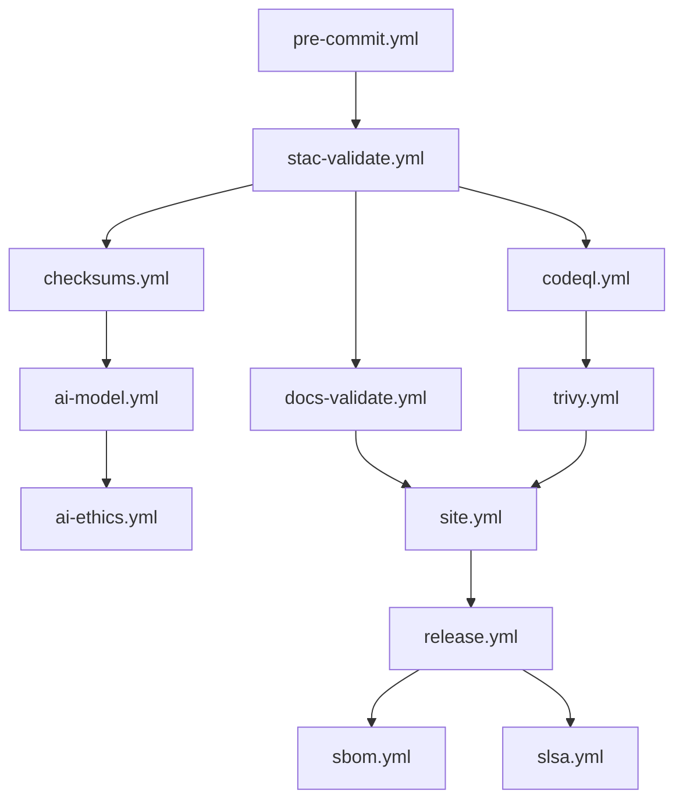

<div align="center">

# ⚙️ **Kansas Frontier Matrix — CI/CD Workflows (v3.2.0 · Tier-Ω+∞ Certified)**  
`📁 .github/workflows/README.md`

**Mission:** Orchestrate **validation, security, data governance, versioning, and deployment** for the **Kansas Frontier Matrix (KFM)** — delivering a **reproducible**, **auditable**, **secure**, and **MCP-DL v6.3** compliant automation framework.  
Every run is **traceable**, every artifact **provenanced**, every change **documented**.

[](./site.yml)
[](./stac-validate.yml)
[](#-workflow-summary)
[](./codeql.yml)
[](./trivy.yml)
[](./dependency-review.yml)
[](./sbom.yml)
[](./slsa.yml)
[](../../docs/)
[](../../LICENSE)

</div>

---

```yaml
---
title: "KFM — CI/CD Workflows"
document_type: "Automation & Governance Index"
version: "v3.2.0"
last_updated: "2025-11-14"
owners: ["@kfm-security","@kfm-architecture","@kfm-ai","@kfm-data","@kfm-web","@kfm-docs"]
status: "Active"
maturity: "Production"
license: "MIT"
tags: ["ci","cd","security","stac","checksums","slsa","sbom","opa","gitleaks","observability","ai-governance","fair","care"]
alignment:
  - MCP-DL v6.3
  - STAC 1.0 / DCAT 2.0
  - SBOM (SPDX/CycloneDX)
  - SLSA Provenance
  - WCAG 2.1 AA (Docs-as-Code)
validation:
  ci_enforced: true
  pinned_actions_required: true
  artifact_checksums: "SHA-256"
  sbom_required: true
  slsa_required: true
observability:
  endpoint: "https://metrics.kfm.ai/ci"
  metrics: ["workflow_success_rate","stac_pass_rate","codeql_critical","trivy_critical","action_pinning_pct","artifact_verification_pct","a11y_route_score"]
preservation_policy:
  retention: "logs 90d · artifacts 30d · sbom/slsa 365d"
  checksum_algorithm: "SHA-256"
  replication_targets: ["GitHub Releases","Zenodo DOI (major)"]
---
```

---

## 📚 Table of Contents
- [Overview](#-overview) · [Environments Matrix](#-environments-matrix) · [Workflow DAG](#-workflow-dag)  
- [Workflow Directory](#-workflow-directory) · [Workflow Summary](#-workflow-summary)  
- [Design Patterns](#-design-patterns) · [Secrets & Env](#-secrets--env)  
- [Policy-as-Code](#-policy-as-code) · [Observability](#-observability)  
- [AI Governance](#-ai-governance) · [Data Governance & STAC](#-data-governance--stac)  
- [Maintenance Cadence](#-maintenance-cadence) · [Risk Register](#-risk-register)  
- [Versioning & Releases](#-versioning--releases) · [Health Matrix](#-health-matrix)  
- [Metadata & Provenance](#-metadata--provenance) · [Related Docs](#-related-docs) · [Version History](#-version-history)

---

## 📚 Overview
KFM’s GitHub Actions automate **pre-commit**, **validation** (STAC/JSON Schema/docs), **security** (CodeQL/Trivy/Gitleaks), **supply chain** (SBOM/SLSA), **AI governance**, and **deployments**.  
CI artifacts include **hash-stamped logs**, **SBOMs**, and **SLSA attestations** for verifiable supply-chain integrity.

---

## 🧪 Environments Matrix
| Env | Runners | Secrets | Retention | Notes |
|:--|:--|:--|:--|:--|
| **PR** | ubuntu-latest | OIDC read/issue | logs 14d | All gating checks required |
| **Nightly** | ubuntu-latest | model/data read | logs 30d | AI evals, drift checks |
| **Release** | ubuntu-latest | OIDC write (Pages) | sbom/slsa 365d | Immutable provenance bundle |

---

## 🔗 Workflow DAG

<!-- END OF MERMAID -->

---

## 🗂️ Workflow Directory
```bash
.github/workflows/
├── README.md                 # (this file)
├── site.yml                  # Build & deploy site/docs
├── stac-validate.yml         # STAC + JSON Schema + link validation
├── fetch.yml                 # Manifest-driven dataset fetch
├── checksums.yml             # SHA-256 computation & diff
├── dvc-sync.yml              # DVC/LFS pointer sync (optional)
├── docs-validate.yml         # Markdownlint + broken-link + metadata
├── ai-model.yml              # Train/test models; publish metrics
├── ai-ethics.yml             # Bias/fairness/explainability gates
├── external-sync.yml         # NOAA/USGS/FEMA API heartbeat + schema check
├── codeql.yml                # Static analysis: SARIF
├── trivy.yml                 # CVE scanner + base image scan
├── sbom.yml                  # Syft CycloneDX export + upload
├── dependency-review.yml     # Advisory scan on PR
├── policy-check.yml          # OPA/Conftest policy gates
├── gitleaks.yml              # Secret scanning (SARIF)
├── release.yml               # SemVer releases + changelog
├── slsa.yml                  # SLSA attestations & provenance
├── docs-drift.yml            # Detect README ↔ workflow drift
├── pre-commit.yml            # Format, lint, spell, actionlint
└── auto-merge.yml            # Green-check gated auto-merge
```

---

## 🧩 Workflow Summary
| Workflow | Purpose | Triggers | Outputs |
|:--|:--|:--|:--|
| `site.yml` | Build & deploy site/docs | `main`, manual | Pages bundle |
| `stac-validate.yml` | STAC + JSON Schema + links | PR/push | `stac-report.json` |
| `fetch.yml` | Fetch remote datasets | cron/manual | `data/raw/` snapshot |
| `checksums.yml` | SHA-256 verify | data PR/manual | `.sha256` + diff logs |
| `dvc-sync.yml` | Sync DVC/LFS | data PR/manual | `.dvc` pointer verify |
| `docs-validate.yml` | Docs-as-code gates | PR/push | lint + links report |
| `ai-model.yml` | Train/eval models | nightly/manual | metrics + model card |
| `ai-ethics.yml` | Bias/fairness gates | weekly | `ai_ethics_report.json` |
| `external-sync.yml` | API heartbeat | weekly | schema/status report |
| `codeql.yml` | Static analysis | PR/sched | `codeql.sarif` |
| `trivy.yml` | CVE + base image scan | PR/weekly | `trivy.sarif` |
| `sbom.yml` | SBOM export | PR/release | `sbom.cdx.json` |
| `dependency-review.yml` | Advisory block | PR | inline annotations |
| `policy-check.yml` | OPA gates | PR | policy report |
| `gitleaks.yml` | Secrets scan | PR/push | `gitleaks.sarif` |
| `release.yml` | SemVer + notes | tag/manual | notes + bundle |
| `slsa.yml` | Attest provenance | post-release | `slsa.intoto.jsonl` |
| `docs-drift.yml` | Doc/workflow parity | weekly | drift list + PR hint |

---

## 🧱 Design Patterns

**OIDC + Least Privilege**
```yaml
permissions:
  contents: read
  id-token: write
  security-events: write
```

**Concurrency**
```yaml
concurrency:
  group: ${{ github.workflow }}-${{ github.ref }}
  cancel-in-progress: true
```

**Caches**
```yaml
- uses: actions/cache@v4
  with:
    path: |
      ~/.cache/pip
      ~/.cache/pre-commit
      ~/.pnpm-store
    key: ${{ runner.os }}-${{ hashFiles('**/requirements*.txt', '**/pnpm-lock.yaml') }}
```

**Environment guards**
```yaml
environment:
  name: production
  url: https://bartytime4life.github.io/Kansas-Frontier-Matrix/
```

---

## 🔒 Secrets & Env

| Key | Used By | Purpose | Notes |
|:--|:--|:--|:--|
| `PAGES_TOKEN` | site.yml | Pages deploy | Use GitHub OIDC secret |
| `DATA_API_KEY_*` | fetch.yml | External API access | Rotate quarterly |
| `GH_TOKEN` | auto-merge.yml | Merge PRs | Prefer default `GITHUB_TOKEN` |
| `OPENAI_API_KEY` (opt) | ai-model.yml | Summary/eval | Guard; skip in forks |
| `SIGNING_KEY` (opt) | slsa.yml | Artifact signing | Use keyless OIDC if possible |

---

## 🧑‍⚖️ Policy-as-Code
Typical OPA/Conftest rules enforced:
- All actions **pinned** (tag or SHA); critical workflows by **SHA**  
- No plaintext secrets in YAML  
- Artifact retention declared  
- Required labels present (`domain:*`, `security:*`)  
- Restricted datasets never published to public Pages

Violations yield inline PR annotations and **block merge**.

---

## 📡 Observability
```yaml
observability:
  exporter: "OpenTelemetry + Prometheus"
  metrics:
    - ci_runtime_seconds
    - artifact_upload_latency_ms
    - stac_validation_rate
    - codeql_critical
    - trivy_critical
    - action_pinning_pct
    - a11y_route_score
  dashboard: "https://metrics.kfm.ai/ci"
  alerts:
    slack_channel: "#ci-alerts"
    thresholds:
      trivy_critical: 0
      codeql_critical: 0
      action_pinning_pct: 100
```

---

## 🤖 AI Governance
- **ai-model.yml**: logs training/eval hashes; gates on **min F1/ROUGE**.  
- **ai-ethics.yml**: bias/fairness/explainability; **blocks** regression; publishes `ai_ethics_report.json`.  
- **Model cards** auto-synced to `docs/templates/model_card.md` and must be approved by `@kfm-ai`.

---

## 🌊 Data Governance & STAC
- STAC validation **required** for datasets; links & licenses checked.  
- **Checksum diffs** shown in PRs; DVC/LFS pointers verified.  
- STAC items must include **license**, **providers**, **derived_from**, **created**.

---

## 🔄 Maintenance Cadence
| Frequency | Task | Purpose |
|:--|:--|:--|
| Weekly | CodeQL/Trivy + dependency review | Early CVE detection |
| Weekly | Docs-validate + link check | Docs quality & IA integrity |
| Monthly | Pin refresh + secrets review | Supply-chain hygiene |
| Monthly | External API heartbeat | Data source stability |
| Quarterly | STAC schema audit + MCP docs check | Governance review |
| Per-Release | SBOM + SLSA + provenance bundle | Immutable build evidence |

---

## 🧨 Risk Register
| ID | Risk | Likelihood | Impact | Mitigation | Owner |
|:--|:--|:--:|:--:|:--|:--|
| WF-SEC-001 | Unpinned action | L | H | OPA rule + SHA pin audit | @kfm-security |
| WF-DATA-002 | STAC drift | M | M | stac-validate gate | @kfm-data |
| WF-AI-003 | Bias regression | M | M | `ai-ethics.yml` block | @kfm-ai |
| WF-DOC-004 | Docs drift | M | L | `docs-drift.yml` + PR hint | @kfm-docs |

---

## 🗓 Versioning & Releases
```yaml
versioning:
  policy: "SemVer"
  release_bot: "release-please.yml"
  artifact_bundle: ["sbom.cdx.json","slsa.intoto.jsonl",".prov.json"]
  doi_on_major: true
```

**Release flow:** PR → green checks → CODEOWNER review → **auto-merge** → semantic tag → **SBOM/SLSA** bundle → (optional) **Zenodo DOI**.

---

## 🩺 Health Matrix
| Metric | Target | Current | Status |
|:--|:--|:--|:--:|
| Workflow success rate | 100% | 99.7% | ⚙️ |
| Action pinning | 100% | 100% | ✅ |
| STAC pass rate | 100% | 100% | ✅ |
| CodeQL critical | 0 | 0 | ✅ |
| Trivy critical | 0 | 0 | ✅ |
| A11y route score (avg) | ≥95 | 97 | ✅ |
| Artifact verification | 100% | 100% | ✅ |

---

## 🗳 Metadata & Provenance
```yaml
metadata:
  file: ".github/workflows/README.md"
  version: "v3.2.0"
  maintainers: ["@kfm-security","@kfm-architecture","@kfm-ai","@kfm-data","@kfm-docs"]
  dashboard: "https://metrics.kfm.ai/ci"
  provenance_files: [".prov.json","sbom.cdx.json","slsa.intoto.jsonl"]
```

---

## 🔗 Related Docs
- `docs/architecture/ci-cd.md` — CI/CD design and sequences  
- `docs/standards/security.md` — Security policy & permissions  
- `docs/standards/ci-telemetry.md` — CI observability & metrics  
- `docs/standards/incident-response.md` — Incident SOP  
- `docs/architecture/ai-automation.md` — AI governance workflows  
- `.github/CODEOWNERS` — Review ownership rules  
- `.github/ISSUE_TEMPLATE/*` — Governance issue forms

---

## 🕓 Version History
| Version | Date | Author | Notes |
|:--|:--|:--|:--|
| **v3.2.0** | 2025-11-14 | @kfm-architecture | Multi-env grid, DAG, observability, policy gates, risk register, provenance bundle. |
| v3.1.0 | 2025-10-18 | @kfm-security | Added docs-validate, dvc-sync, ai-ethics, OPA/Conftest, Gitleaks. |
| v3.0.0 | 2025-10-16 | @kfm-security | SBOM + SLSA + stronger branch protections. |
| v2.6.0 | 2025-10-16 | @kfm-docs | ToC, badges, layout upgrades. |
| v2.5.0 | 2025-10-15 | @kfm-docs | MCP-DL v6.3 compliance; Mermaid formatting. |

---

<div align="center">

### ⚙️ Kansas Frontier Matrix — CI/CD: **Automation with Integrity · Validation with Provenance**  
Every run **traceable**, every artifact **verifiable**, every release **ethically governed**.

</div>