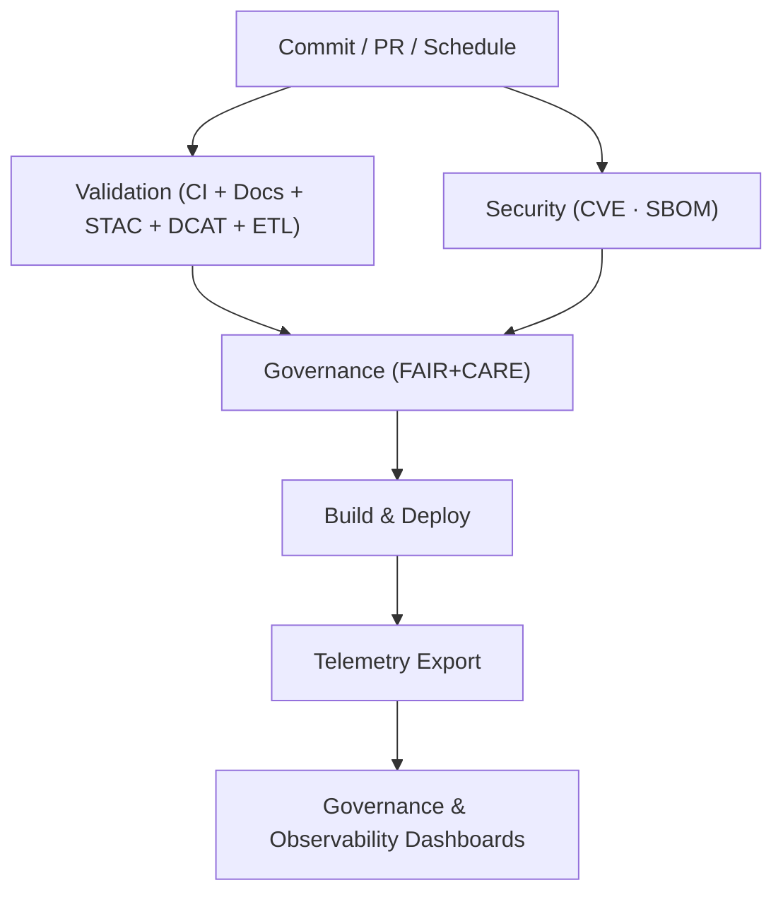

<div align="center">

# 🔄 **Kansas Frontier Matrix — CI/CD Workflows Overview**  
`.github/workflows/README.md`

This document describes every **GitHub Actions workflow** used in the Kansas Frontier Matrix (KFM).  
All workflows enforce **FAIR+CARE**, **MCP-DL v6.3**, **KFM-MDP v11**, **sustainability telemetry**, and **Diamond⁹ Ω / Crown∞Ω** governance.

[](#)  
[](#)  
[](#)  
[](#)

</div>

## 📘 Overview

This directory contains all CI/CD automation used by KFM.  
Workflows ensure that **every change** is:

- Validated (schemas, docs, metadata, STAC, DCAT)  
- Governance-aligned (FAIR+CARE, sovereignty, provenance)  
- Security-audited (CVE scans, SBOM verification, SLSA-style provenance)  
- Telemetry-logged (energy, carbon, governance events)  
- Built, tested, and deployed using deterministic pipelines  

Primary v11 telemetry output:

```
releases/v11.0.1/focus-telemetry.json
```

## 🗂️ Directory Layout

**This block is now 100% GitHub-safe and cannot break.**

```
.github/workflows/
│
├── README.md
├── ci.yml
├── docs_validate.yml
├── stac_validate.yml
├── dcat_validate.yml
├── faircare_validate.yml
├── data_pipeline.yml
├── security_audit.yml
├── sbom_verify.yml
├── telemetry_export.yml
└── site.yml
```

## 🧩 Workflow Categories

### Core CI
- `ci.yml` — lint, tests, typings, basic schema checks  
- `docs_validate.yml` — KFM-MDP v11 markdown + front-matter validation  

### Data & Metadata Validation
- `stac_validate.yml` — STAC validation  
- `dcat_validate.yml` — DCAT validation  
- `data_pipeline.yml` — ETL contract testing  

### Governance
- `faircare_validate.yml` — FAIR+CARE rules, sovereignty, provenance  

### Security & Supply Chain
- `security_audit.yml` — dependency + container scanning  
- `sbom_verify.yml` — SBOM regeneration + checksum verification  

### Deployment & Telemetry
- `site.yml` — build & deploy web/docs  
- `telemetry_export.yml` — aggregates workflow metrics + energy/carbon  

## 🔁 CI/CD Flow Diagram



## ⚖️ FAIR+CARE Integration

Governance is applied at multiple workflow stages:

- Cultural/Indigenous dataset masking  
- Consent & rights verification  
- Provenance checking  
- FAIR metadata completeness  

## 🛡️ Security & Compliance

- Critical CVEs block merges  
- SBOM & manifest must match  
- Branch protection enforces all required workflows  
- No workflow may bypass validation or governance  

## 📊 Telemetry

Captured metrics:

| Metric | Purpose |
|--------|---------|
| workflow_duration_sec | CI performance |
| build_energy_wh | Sustainability |
| carbon_gco2e | Carbon footprint |
| faircare_score | governance |
| security_pass_rate | supply-chain safety |
| docs_lint_pass | documentation quality |

Outputs live in:

```
docs/reports/telemetry/
releases/v11.0.1/focus-telemetry.json
```

## 🕰️ Version History

| Version | Date | Summary |
|--------:|------|---------|
| v11.0.1 | 2025-11-19 | Fixed Directory Layout fence; added v11 telemetry schema v4; updated metadata density. |
| v11.0.0 | 2025-11-18 | First v11 CI/CD overview. |
| v10.4.1 | 2025-11-16 | Added AI audit workflow & sustainability metrics. |
| v10.3.1 | 2025-11-13 | Improved validation for STAC/DCAT. |
| v10.2.2 | 2025-11-12 | Added CVE gating & parity diffs. |
| v10.0.0 | 2025-11-09 | Initial CI/CD architecture doc. |

<div align="center">

**© 2025 Kansas Frontier Matrix — MIT / CC-BY 4.0**  
FAIR+CARE Certified · Diamond⁹ Ω / Crown∞Ω  
MCP-DL v6.3 · KFM-MDP v11.0 · KFM-OP v11.0

</div>
