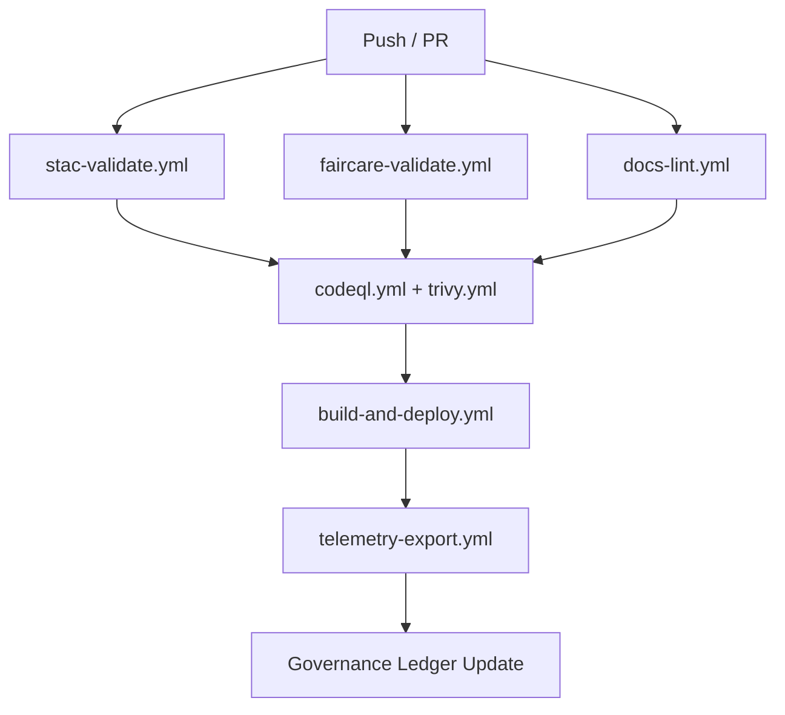

<div align="center">

# 🔄 **Kansas Frontier Matrix — CI/CD Workflows Overview**
`.github/workflows/README.md`

**Purpose:** Outline all GitHub Actions that automate validation, governance, deployment, and telemetry within the **Kansas Frontier Matrix (KFM)** repository.  
Each workflow is versioned, auditable, and aligned with the **Master Coder Protocol (MCP v6.3)** and **FAIR+CARE** data ethics framework.

[](../../docs/README.md)
[](../../LICENSE)
[](../../docs/standards/faircare.md)
[]()

</div>

---

## 📘 Overview

This directory defines all **CI/CD automation** for KFM — ensuring that every commit maintains data integrity, reproducibility, and ethical governance.  
All workflows:
- Run on **containerized, reproducible environments**  
- Validate using **open standards** (STAC, DCAT, FAIR+CARE, SPDX)  
- Export results to **telemetry and audit ledgers**

---

## 🗂️ Directory Layout

```
.github/workflows/
├── stac-validate.yml         # STAC 1.0.0 dataset validation
├── faircare-validate.yml     # FAIR+CARE ethical data checks
├── docs-lint.yml             # Markdown/YAML linting
├── codeql.yml                # Security static analysis
├── trivy.yml                 # Container & dependency CVE scans
├── build-and-deploy.yml      # Web frontend build/deploy pipeline
├── stac-dcat-bridge.yml      # STAC↔DCAT metadata synchronization
├── telemetry-export.yml      # Build metrics & telemetry export
└── README.md                 # This file
```

Each YAML workflow represents one autonomous MCP governance process and links directly into `focus-telemetry.json`.

---

## 🧩 Validation Workflows

| Workflow | Role | Output |
|-----------|------|--------|
| **`stac-validate.yml`** | STAC JSON schema + link integrity check | `reports/self-validation/stac/_summary.json` |
| **`faircare-validate.yml`** | FAIR+CARE, license, checksum, CARE annotations | `reports/fair/faircare_summary.json` |
| **`docs-lint.yml`** | Lint Markdown/YAML, enforce metadata style | `reports/self-validation/docs/lint_summary.json` |

**Triggers:** PR or push on `data/`, `docs/`, or validation branches.  
**Manual Runs:** Supported via `workflow_dispatch`.

---

## 🛡️ Security Workflows

| Workflow | Function | Output |
|-----------|-----------|--------|
| **`codeql.yml`** | Analyze Python/JS/TS for vulnerabilities | `reports/security/codeql/*.sarif` |
| **`trivy.yml`** | Scan Docker & package dependencies | `reports/security/trivy/*.json` |
| **`dependabot.yml`** | Automate dependency patch PRs | `.github/dependabot.yml` |
| **Policy** | Build fails on CRITICAL findings; security ledger updated. | — |

---

## 🚀 Deployment Workflows

| Workflow | Function | Output |
|-----------|-----------|--------|
| **`build-and-deploy.yml`** | Builds React + MapLibre web frontend | `docs/reports/telemetry/build_metrics.json` |
| **`stac-dcat-bridge.yml`** | Converts STAC → DCAT and syncs metadata | `releases/v*/metadata-bridge.meta.json` |
| **`telemetry-export.yml`** | Aggregates metrics, builds telemetry JSON | `releases/v9.7.0/focus-telemetry.json` |

**URL:**  
[https://bartytime4life.github.io/Kansas-Frontier-Matrix/](https://bartytime4life.github.io/Kansas-Frontier-Matrix/)

---

## 🧮 Workflow Interdependencies



All workflows are modular, idempotent, and emit structured telemetry for reproducibility and governance.

---

## 🧠 Governance & FAIR+CARE Integration

Each workflow reports into the governance and telemetry layer.

| Record | Description | Location |
|---------|--------------|-----------|
| **Workflow Ledger** | Execution metadata (ID, outcome, author) | `reports/audit/github-workflows-ledger.json` |
| **Governance Ledger** | Ethical and cultural review records | `reports/audit/governance-ledger.json` |
| **Telemetry Snapshot** | Workflow metrics for dashboards | `releases/v9.7.0/focus-telemetry.json` |

All ledgers reference commit SHAs, workflow IDs, and build artifacts for verification.

---

## ⚖️ FAIR+CARE Compliance Summary

| Principle | CI/CD Implementation |
|------------|----------------------|
| **Findable** | Workflow artifacts published and indexed in `reports/` |
| **Accessible** | Results public via GitHub Actions and dashboards |
| **Interoperable** | JSON, YAML, and STAC/DCAT metadata interoperability |
| **Reusable** | Modular workflows reused across branches and releases |
| **CARE** | Governance form workflow ensures ethical data review |

---

## 🔒 Security & Compliance Controls

- **Branch Protection:** two reviewers, green CI checks, no force pushes.  
- **Secrets Management:** stored in GitHub Encrypted Secrets.  
- **CVE Scanning:** Trivy executed weekly + on merge.  
- **SBOMs:** SPDX manifests per release (`sbom.spdx.json`).  
- **SLSA Provenance:** Attestation attached to all builds.  
- **Audit Trails:** Logs appended to `reports/audit/github-workflows-ledger.json`.

---

## 🧾 Telemetry Integration

**File:** `releases/v9.7.0/focus-telemetry.json`  
**Contents:**
- Workflow durations and statuses  
- FAIR+CARE audit scores  
- Build hashes and artifact metadata  
- Security scan counts and severity levels  
- Version, commit, and author provenance  

Telemetry is visualized through the **Governance Dashboard** under `docs/reports/telemetry/`.

---

## 🕰️ Version History

| Version | Date | Author | Summary |
|----------|------|---------|----------|
| v9.7.0 | 2025-11-05 | A. Barta | Added telemetry, governance linkage, and inter-workflow map. |
| v9.5.0 | 2025-10-20 | A. Barta | Added STAC↔DCAT bridge and FAIR+CARE audit. |
| v9.3.2 | 2025-08-12 | KFM Core Team | Improved validation reports and modular triggers. |
| v9.0.0 | 2025-06-01 | KFM Core Team | Initial workflow automation baseline. |

---

<div align="center">

**© 2025 Kansas Frontier Matrix — MIT / CC-BY 4.0**  
Automated under **Master Coder Protocol v6.3** · FAIR+CARE Certified · Diamond⁹ Ω / Crown∞Ω Ultimate Certified  
[Back to GitHub Architecture](../ARCHITECTURE.md) · [Governance Charter](../../docs/standards/governance/ROOT-GOVERNANCE.md)

</div>
