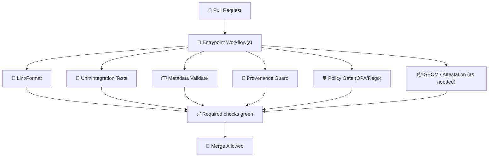

<div align="center">

# ⚙️ GitHub Workflows (CI/CD)

**KFM’s automated “trust pipeline” — policy-governed, provenance-first, and merge-safe.**  
`./.github/workflows/*`

<p>
  <a href="../../README.md"></a>
  <a href="../README.md"></a>
  <a href="../actions/README.md"></a>
  <a href="../ISSUE_TEMPLATE/README.md"></a>
</p>

<p>
  
  
  
  
</p>

</div>

---

## 🧭 Quick index

- [🎯 Purpose](#-purpose)
- [🗺️ KFM invariants enforced by CI](#️-kfm-invariants-enforced-by-ci)
- [🧭 Folder map](#-folder-map)
- [🧬 Canonical “truth path”](#-canonical-truth-path-pr--merge)
- [🧩 Workflow inventory](#-workflow-inventory-recommended)
- [🧠 Change-aware gating](#-change-aware-gating-scope--risk)
- [🛡️ Policy as Code](#️-policy-as-code-oparego)
- [🗂️ Metadata + schema validation](#️-metadata--schema-validation-geo--catalog)
- [🧾 Provenance](#-provenance-guardrails)
- [📦 Supply-chain defaults](#-supply-chain-defaults-sbom-attestations)
- [🤖 AI / agentic workflows](#-ai--agentic-workflows-llms-rag-tools)
- [📈 Performance + observability](#-performance--observability)
- [🧪 Local debugging](#-local-debugging-tips-fast-iteration)
- [🧯 When CI fails](#-when-ci-fails-how-to-fix-fast)
- [📚 Project reference library](#-project-reference-library)

---

## 🎯 Purpose

This folder defines **GitHub Actions workflows** that keep Kansas Frontier Matrix (KFM) contributions:

- ✅ **reproducible** (consistent builds & deterministic checks),
- 🧾 **traceable** (metadata + provenance expectations),
- 🛡️ **governed** (policy as code + safety rails),
- 🚦 **merge-safe** (fail-closed gates).

> [!IMPORTANT]
> KFM is designed to **fail closed**: if policy/permission/provenance is uncertain, the system blocks the change rather than letting it slip through.[^fail_closed][^validation_gates]

---

## 🗺️ KFM invariants enforced by CI

Workflows here exist to protect *architectural invariants* (not just “lint + tests”):

### 1) 🧱 Canonical pipeline order (no shortcuts)
KFM treats the data path as non-negotiable: **ETL → catalog/provenance → databases/graph → API → UI/stories/AI**.[^pipeline_order]

### 2) 🧭 Layer boundaries are enforced (UI never touches DB)
The UI should not directly access database layers; all access is mediated via governed backend APIs.[^ui_boundary]

### 3) 🧾 Provenance is not optional
If new artifacts are introduced, provenance logs must exist. Example from the blueprint: if an output file exists but the corresponding provenance entry is missing, CI fails.[^validation_gates]

### 4) 🛡️ Policy is versioned + machine enforced
Governance is policy-as-code: rules live in Git, are tested, and gate merges through CI (OPA/Rego via tools like Conftest). Policies are versioned for auditability.[^policy_as_code]

### 5) 🌍 FAIR + CARE are enforced at the gate
If contributions don’t meet baseline documentation/metadata expectations (FAIR/CARE alignment), they don’t enter the system.[^fair_care]

---

## 🧭 Folder map

```text
.github/workflows/
├─ ♻️ reusables/            # reusable workflow_call building blocks
├─ 🚦 *.yml                 # entrypoint workflows (PR, release, schedule, manual)
└─ 📘 README.md             # you are here
```

### 🔗 Related building blocks (outside this folder)

```text
.github/
├─ 🧩 actions/              # composite actions (reused across workflows)
├─ 🧾 ISSUE_TEMPLATE/       # governance + intake forms
└─ 🛡️ CODEOWNERS            # reviewers for sensitive paths (policy, schemas, etc.)
```

> [!TIP]
> Prefer **reusable workflows** for job graphs and **composite actions** for step bundles.
> That keeps governance centralized and reduces “copy/paste drift”.

---

## ♻️ What counts as a “reusable workflow”?

Reusable workflows live under `reusables/` and are called from entry workflows via `workflow_call`.

Think of them as **macro building blocks**:
- `pr-validate.yml` → the “trust path”
- `policy-gate.yml` → allow/deny decisions
- `metadata-validate.yml` → schema + catalog checks
- `docker-build.yml` → image build + artifact upload

---

## 🧬 Canonical truth path (PR → merge)



This mirrors KFM’s pipeline philosophy: **data + stories must follow a governed pipeline**, and CI is the automated enforcement layer.[^pipeline_order][^validation_gates]

---

## 🧠 Change-aware gating (scope + risk)

To keep PR feedback fast **and** keep governance strict, workflows should be path-aware:

### ✅ Suggested change classes (pattern)

- 📝 **Docs-only** (`docs/**`, `README.md`)  
  → Markdown lint + link check (fast)

- 🗺️ **Story changes** (`stories/**`, `narratives/**`)  
  → story schema + citation hygiene + link check + policy gate for claims[^stories]

- 🗂️ **Metadata/catalog changes** (`catalog/**`, `metadata/**`, `schemas/**`)  
  → JSON schema validation + STAC/DCAT checks + policy gate[^metadata_standards]

- 🧾 **Data outputs** (`data/processed/**`, `exports/**`)  
  → provenance required + metadata required + (optional) QA regression[^validation_gates]

- 🛡️ **Governance/policy** (`policy/**`, `.github/**`, `schemas/**`)  
  → conftest/OPA tests + CODEOWNER review + “no bypass” checks[^policy_as_code]

> [!IMPORTANT]
> “Fast path” ≠ “unguarded path”. Even doc-only PRs should still fail closed on unsafe or forbidden patterns
> (e.g., secrets, malware artifacts, policy violations).

---

## 🧩 Workflow inventory (recommended)

> [!NOTE]
> Filenames can evolve — what matters is the **intent taxonomy** staying stable.

### 🔀 PR workflows
- `pr-validate.yml` → standard trust path: lint + tests + metadata + provenance + policy
- `pr-docs.yml` → docs-only optimizations (still guarded)
- `pr-policy.yml` → stricter, policy-only checks (Rego test matrix)

### 🧷 Release workflows
- `release.yml` → build/publish containers + generate SBOM + attestations
- `tag.yml` → version stamping, changelog automation, provenance snapshot

### 🕰️ Scheduled workflows
- `nightly-governance.yml` → policy regression suite, dependency hygiene
- `nightly-catalog-qa.yml` → metadata drift, link rot, schema drift

### 🧑‍✈️ Manual workflows
- `rebuild-catalog.yml` → on-demand catalog/index rebuild
- `full-validation.yml` → heavyweight suite (slow, but definitive)

---

## 🧩 How workflows relate to composite actions

Most jobs should be assembled from **composite actions** in:

- `../actions/` → see **`.github/actions/README.md`** for details.

Common action blocks (by intent) include:

- 🧪 `setup-conftest/` → policy testing setup
- 🛡️ `policy-gate/` → allow/deny enforcement
- 🧾 `provenance-guard/` + `pr-provenance/` → provenance completeness checks
- 🗂️ `metadata-validate/` → metadata schema checks (dataset cards, STAC/DCAT, etc.)
- 🗺️ `story-lint/` → story node format + citation hygiene
- 🧰 `setup-kfm/` → repo toolchain bootstrap
- 🧱 `docker-build/` → build container images
- 🧾 `sbom/` + ✅ `attest/` → supply-chain artifacts (SBOM/attestation)

> [!TIP]
> Treat composite actions as **audited primitives**. If you need a new step bundle, prefer adding a new
> composite action rather than sprinkling shell scripts across multiple workflows.

---

## 🛡️ Policy as Code (OPA/Rego)

KFM governance is designed to run as policy checks in CI and runtime enforcement in the stack.[^policy_as_code]

### ✅ CI responsibilities
- run policy tests on PRs (fail closed),
- verify policy bundles compile,
- verify “deny” decisions include actionable messages,
- verify required reviewers on policy/schema changes (CODEOWNERS),
- verify no bypass routes are introduced.

### 🌐 Policy layering (global vs local)
DataSpaces research emphasizes **global** and **local** policies in a “trust integrated dataspace” model.[^dataspaces]
In KFM CI, mirror that idea with layered enforcement:

- 🌍 **Global policies** → org/repo-wide constraints (licensing, security, provenance, minimum metadata)
- 🧩 **Local policies** → domain rules (dataset type rules, story node schemas, API contract rules)

> [!NOTE]
> When policies conflict, default to **deny** and force explicit governance discussion.[^fail_closed]

---

## 🗂️ Metadata + schema validation (geo + catalog)

KFM treats metadata as a first-class CI concern: new datasets should not enter without documentation and structure.[^validation_gates]

### ✅ What “good metadata” means in practice
Map/geo design guidance highlights metadata categories commonly required for map products and datasets:
identification, quality, spatial reference, distribution, citation/reference, temporal reference, and contact.[^metadata_standards]

### Recommended checks
- JSON/YAML schema validation for dataset cards and story nodes
- STAC validation where relevant
- CRS/EPSG presence and projection sanity checks for geodata
- link checks + citation presence checks (for narratives)

> [!TIP]
> Add a “schema test corpus” folder (tiny fixtures) so schema changes are validated in CI
> without needing full datasets.

---

## 🧾 Provenance guardrails

Provenance must be present wherever “processed outputs” exist.[^validation_gates]

### Minimum expectations (pattern)
- Each produced artifact has:
  - source references
  - transformation summary
  - tool versions / parameters
  - timestamp + contributor identity (where appropriate)
- The provenance check runs on PRs that introduce/modify outputs.

> [!IMPORTANT]
> The blueprint gives a concrete example: if an output exists but a corresponding provenance entry is missing, CI fails.[^validation_gates]

---

## 📦 Supply-chain defaults (SBOM, attestations)

Recommended baseline:
- 🔒 Pin third-party actions by SHA
- 🧾 Generate SBOM for releases (and optionally PR builds)
- ✅ Use attestations for release artifacts (containers/binaries)
- 🧯 Keep a kill-switch path to prevent publication when governance flags trigger

These defaults align with KFM’s “auditable & governed operations” stance.[^fail_closed]

---

## 🤖 AI / agentic workflows (LLMs, RAG, tools)

KFM’s blueprint anticipates agentic, tool-using models (multi-step reasoning) operating via **safe backend tool APIs**.[^agentic_tools]

### When to trigger “AI gates”
If a PR touches:
- `ai/**`, `prompts/**`, `rag/**`, `embeddings/**`, `models/**`
- or any “tool surface” exposed to an agent (search/query endpoints)

Then require:
- 📄 model card + license check
- 🔍 prompt/policy lint (no disallowed tool calls)
- 🧪 eval harness smoke tests (golden queries)
- 🛡️ policy gate (what tools can be invoked; what data can be accessed)

### Local model workflows (Ollama)
Ollama supports pulling/running models via CLI (`ollama pull <model>` / `ollama run <model>`), and positions itself as a “Docker-like” local model manager.[^ollama]

> [!TIP]
> Use CI to validate *configuration* (model cards, tool permission policy, eval baselines) — not to run heavy GPU inference by default.

---

## 📈 Performance + observability

CI isn’t just correctness — it’s also keeping KFM shippable under real conditions.

A database performance reference used in this project emphasizes:
- “Always expect spikes” (hardware failures, surprise load)
- “Observability is key in distributed systems” (investigate failures + real-time alerts)[^observability]

### Recommended CI patterns
- 🕰️ Nightly “performance budget” runs (timeboxed)
- 📊 Query plan regression checks (when applicable)
- 🧯 “Backups + recovery” runbooks verified as docs/tests (where relevant)

---

## 🧪 Local debugging tips (fast iteration)

### Option A) Re-run jobs in GitHub UI
- Use “Re-run jobs” for failed runs.
- Add debug logs using `ACTIONS_STEP_DEBUG` (repo/org setting) when needed.

### Option B) Use `act` locally (best-effort parity)
You can dry-run many workflows locally with `act`.  
It’s not perfect parity, but great for speeding up iteration on bash steps and composite actions.

```bash
# list workflows / jobs
act -l

# run a pull_request workflow (example)
act pull_request

# run a specific job
act -j <job_id>
```

> [!CAUTION]
> OIDC, protected secrets, and some marketplace integrations won’t behave the same locally.
> Treat `act` as a developer convenience, not a source of truth.

### Option C) Run gates directly
Typical fast loops (examples; use the repo’s real scripts):

```bash
# policy unit tests
conftest test policy/ -p policy/

# schema checks
python -m pytest tests/schema/

# story lint
python -m pytest tests/stories/
```

---

## 🧯 When CI fails (how to fix fast)

### Common failure causes
- Missing dataset metadata / license fields
- Missing provenance artifacts for new processed outputs
- Story nodes missing citations or template fields
- Governance policy violation (OPA/Rego / Conftest)
- Broken links or schema drift

### How to respond
1. Read the failing job summary (it should tell you *what invariant you broke*).
2. Fix the underlying data/doc issue (not just the symptom).
3. Re-run only the necessary jobs.
4. If CI policy seems wrong, open a governance issue using the appropriate template:
   - `governance_form.yml`
   - `governance_question.yml`

---

## 📚 Project reference library

> [!NOTE]
> These project files inform **what CI enforces** (governance invariants, metadata expectations, data quality, and operational safety).

<details>
<summary><strong>📦 Core architecture + governance</strong></summary>

- **Kansas Frontier Matrix (KFM) – Comprehensive Technical Blueprint** :contentReference[oaicite:0]{index=0}  
  Canonical pipeline order, fail-closed governance, policy enforcement patterns, provenance expectations.[^pipeline_order][^fail_closed][^policy_as_code][^validation_gates]

- **Data Spaces** :contentReference[oaicite:1]{index=1}  
  Trust-integrated dataspace concepts; global vs local policy layering.[^dataspaces]

</details>

<details>
<summary><strong>🗂️ Metadata, mapping, time-series, and storytelling UX</strong></summary>

- **Making Maps: A Visual Guide to Map Design for GIS** :contentReference[oaicite:2]{index=2}  
  Practical metadata categories and map product considerations.[^metadata_standards]

- **Visualization of Time-Oriented Data** :contentReference[oaicite:3]{index=3}  
  Interaction vocabulary for time-series exploration (navigation, brushing/linking, dynamic queries).[^time_viz]

- **Cloud-Based Remote Sensing with Google Earth Engine (Fundamentals & Applications)** :contentReference[oaicite:4]{index=4}  
  Multi-temporal data handling patterns and time-series property expectations (`system:time_start`).[^gee_timeseries]

</details>

<details>
<summary><strong>🧪 Reproducibility, QA, and performance</strong></summary>

- **Scientific Method / Research / Master Coder Protocol Documentation** :contentReference[oaicite:5]{index=5}  
  Emphasizes documenting ETL stages and pipelines (inputs/outputs/versions).[^pipeline_docs]

- **Understanding Statistics & Experimental Design** :contentReference[oaicite:6]{index=6}  
  Highlights how multiple testing inflates false alarms — relevant for rigorous evaluation pipelines.[^stats_multiple_testing]

- **Database Performance at Scale** :contentReference[oaicite:7]{index=7}  
  Reinforces observability and planning for spikes — informs performance/ops checks.[^observability]

</details>

<details>
<summary><strong>🤖 Local LLM operations</strong></summary>

- **Comprehensive Guide to Ollama and Its Supported Open-Source LLMs** :contentReference[oaicite:8]{index=8}  
  CLI usage (`ollama pull/run`) and “Docker-like” local model management; used for AI workflow conventions.[^ollama]

</details>

---

## 🧾 Sources

[^pipeline_order]: KFM treats the pipeline order as a core invariant (ETL → catalog/provenance → DB/graph → API → UI/stories/AI).:contentReference[oaicite:9]{index=9}

[^ui_boundary]: UI should not directly touch database layers; access is mediated via backend APIs (separation of concerns).:contentReference[oaicite:10]{index=10}

[^fail_closed]: KFM governance principle: “fail closed / default deny” — when uncertain, deny/stop rather than allow changes through CI gates.:contentReference[oaicite:11]{index=11}

[^fair_care]: The blueprint frames FAIR + CARE alignment as baseline expectations for data entering the system (“if not met, data doesn’t enter”).:contentReference[oaicite:12]{index=12}

[^policy_as_code]: Governance is policy-as-code (OPA/Rego); policies are versioned for audit, executed by OPA, and logs can include decision id + policy version + input hash for traceability.:contentReference[oaicite:13]{index=13}

[^validation_gates]: CI is treated as a validation gate; example given where missing provenance entries cause CI failure. Also, processed datasets require metadata/provenance to pass ingestion checks.:contentReference[oaicite:14]{index=14}:contentReference[oaicite:15]{index=15}

[^stories]: Story nodes include metadata and sources/citations (narratives as structured, governed artifacts).:contentReference[oaicite:16]{index=16}

[^dataspaces]: DataSpaces emphasizes trust-integrated dataspaces with policy enforcement and discusses global vs local policies in the same ecosystem.:contentReference[oaicite:17]{index=17}

[^metadata_standards]: Map design guidance highlights common metadata categories (identification, quality, spatial reference, distribution, citation/reference, temporal reference, contact).:contentReference[oaicite:18]{index=18}

[^time_viz]: Time-series visualization interaction vocabulary includes navigating in time, brushing & linking, and dynamic queries as foundational capabilities to support.:contentReference[oaicite:19]{index=19}

[^gee_timeseries]: Earth Engine time-series handling often relies on temporal properties like `system:time_start` and supports interactive time-series plots/series evaluation patterns.:contentReference[oaicite:20]{index=20}

[^pipeline_docs]: Research protocol guidance calls for documenting ETL pipeline stages, inputs/outputs, and implementation details for reproducibility.:contentReference[oaicite:21]{index=21}

[^stats_multiple_testing]: Multiple comparisons inflate the probability of false alarms (Type I errors), motivating rigorous evaluation practices and corrections where applicable.:contentReference[oaicite:22]{index=22}

[^observability]: Performance guidance emphasizes expecting spikes and treating observability as key in distributed systems (for investigating failures and real-time alerts).:contentReference[oaicite:23]{index=23}

[^ollama]: Ollama supports pulling/running models via CLI (`ollama pull`, `ollama run`) and describes a “Docker-like” model management approach for local LLMs.:contentReference[oaicite:24]{index=24}:contentReference[oaicite:25]{index=25}

[^agentic_tools]: The blueprint describes an agentic approach where models can use a controlled tool surface via backend APIs; it also notes agent-capable models (e.g., Qwen-3 / GPT-OSS) can run locally via Ollama.:contentReference[oaicite:26]{index=26}
