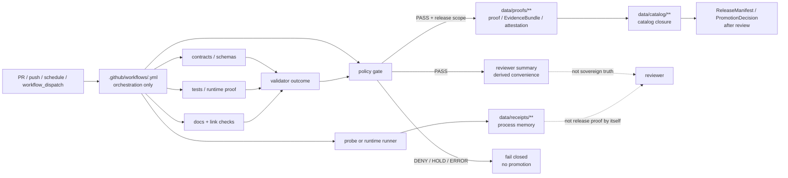

<!-- [KFM_META_BLOCK_V2]
doc_id: kfm://doc/NEEDS-VERIFICATION
title: .github/workflows
type: standard
version: v1
status: draft
owners: @bartytime4life
created: NEEDS-VERIFICATION
updated: 2026-04-22
policy_label: public
related: [../README.md, ../CODEOWNERS, ../PULL_REQUEST_TEMPLATE.md, ../SECURITY.md, ../actions/README.md, ../watchers/README.md, ../dependabot.yml, ../../README.md, ../../CONTRIBUTING.md, ../../contracts/README.md, ../../schemas/README.md, ../../policy/README.md, ../../tests/README.md, ../../tools/ci/README.md, ../../tools/validators/README.md, ../../tools/attest/README.md, ../../tools/probes/README.md, ../../data/receipts/README.md, ../../data/proofs/README.md, ../../data/catalog/README.md]
tags: [kfm, github, workflows, ci, governed-delivery, receipts, proof]
notes: [doc_id and created date need history verification; owner is grounded in broad CODEOWNERS coverage for `/.github/`; current public directory listing shows `README.md` and `.gitkeep`, not checked-in workflow YAML; branch rules, required checks, environment approvals, workflow run state, OIDC bindings, and platform enforcement remain NEEDS VERIFICATION.]
[/KFM_META_BLOCK_V2] -->

<a id="top"></a>

# `.github/workflows`

Governed GitHub Actions orchestration surface for validation, runtime proof, receipt-bearing probes, release evidence, promotion, reconciliation, and correction-ready control in Kansas Frontier Matrix.

> [!NOTE]
> **Status:** `experimental` · **Document status:** `draft` · **Owners:** `@bartytime4life` · **Path:** `.github/workflows/README.md`  
> **Current public inventory:** `README.md` + `verification-baseline.yml` (+ optional `.gitkeep` placeholder); checked-in workflow YAML now includes a baseline verification gate.
> **Badges:**      
> **Quick jumps:** [Scope](#scope) · [Repo fit](#repo-fit) · [Inputs](#inputs) · [Exclusions](#exclusions) · [Directory tree](#directory-tree) · [Quickstart](#quickstart) · [Usage](#usage) · [Diagram](#diagram) · [Workflow lanes](#workflow-lanes) · [Task list](#task-list--definition-of-done) · [FAQ](#faq) · [Appendix](#appendix)

> [!IMPORTANT]
> This directory is part of KFM’s **trust membrane**, not a detached DevOps appendix. Workflow files here may validate contracts, enforce policy, emit reviewer-facing summaries, publish receipts, assemble release evidence, and gate promotion or correction-sensitive transitions. They should stay **fail-closed**, **reviewable**, and **evidence-first**.

> [!TIP]
> Preserve the control-plane split: **probes observe**, **validators verify**, **policy decides**, and **workflows orchestrate**. Workflows should call those surfaces; they should not absorb their authority into YAML.

---

## Scope

`.github/workflows/` is the repo-local control surface where KFM expresses CI, validation, delivery, promotion, runtime proof, receipt-bearing probes, reconciliation, correction, and post-release verification as reviewable automation.

In KFM, workflows do not merely “run tests.” They make a governed claim about what must be true before trust state is allowed to move.

### Core responsibilities

| Responsibility | What it means here |
|---|---|
| **Verification** | Contracts, schemas, tests, docs, policy, and runtime behavior are checked in a fail-closed manner. |
| **Publication** | Reviewer-facing summaries and machine-readable artifacts are emitted in explicit, inspectable order. |
| **State memory** | Process memory is preserved as receipts under governed receipt paths when automation observes or changes something important. |
| **Promotion control** | Trust-significant changes move only after evidence exists and review boundaries are respected. |
| **Correction readiness** | Release, rollback, correction, and supersession paths remain visible instead of being hidden in workflow logs. |

### What this directory is for

This directory exists to answer a small set of consequential questions:

- What automation is allowed to influence trust state?
- What does each workflow prove before it blocks or permits something?
- Which artifacts are reviewer conveniences versus authoritative trust objects?
- Where do probe receipts land, and how are they validated before they become governed process memory?
- Which lane is runtime proof, which lane is release evidence, and which lane is only reconstruction signal?

### Status markers used in this README

| Marker | Meaning here |
|---|---|
| **CONFIRMED** | Grounded in current repo-visible evidence, checked-in Markdown, governing KFM doctrine, or directly inspected public tree state. |
| **INFERRED** | Conservative interpretation connecting direct evidence to adjacent repo doctrine. |
| **PROPOSED** | Repo-native pattern that fits KFM doctrine but is not yet proven as checked-in branch behavior. |
| **UNKNOWN** | Not verified strongly enough to present as current branch, settings, platform, or implementation reality. |
| **NEEDS VERIFICATION** | Detail that should be checked against git history, repo settings, active branch files, or a mounted checkout before merge. |

[Back to top](#top)

---

## Repo fit

**Path:** `.github/workflows/README.md`  
**Role in repo:** directory README for GitHub Actions workflows, gate expectations, historical reconstruction clues, current drafted runtime-proof/probe lanes, and future workflow growth.

### Upstream and adjacent anchors

| Relation | Path | Why it matters | Status |
|---|---|---|---|
| Parent governance surface | [`../README.md`](../README.md) | explains `.github/` as the repo-side gatehouse for review, verification, disclosure, and governed delivery | **CONFIRMED path** |
| Review ownership | [`../CODEOWNERS`](../CODEOWNERS) | makes review boundaries executable | **CONFIRMED path / owner coverage** |
| PR evidence template | [`../PULL_REQUEST_TEMPLATE.md`](../PULL_REQUEST_TEMPLATE.md) | keeps workflow changes aligned with truth labels, proof links, validation links, and rollback expectations | **CONFIRMED path** |
| GitHub security surface | [`../SECURITY.md`](../SECURITY.md) | keeps workflow and repository security guidance near the same governance boundary | **CONFIRMED path** |
| Reusable repo-local actions | [`../actions/README.md`](../actions/README.md) | composite or reusable action logic belongs there, not in this directory | **CONFIRMED path / callers need verification** |
| Adjacent automation scaffolds | [`../watchers/README.md`](../watchers/README.md) | watcher docs may point toward orchestration seams, but do not prove workflow inventory | **CONFIRMED path / active behavior needs verification** |
| Dependency automation | [`../dependabot.yml`](../dependabot.yml) | dependency update policy lives under `.github/`, but it is configuration rather than workflow orchestration | **CONFIRMED path** |
| Root operating index | [`../../README.md`](../../README.md) | defines monorepo posture, evidence model, and top-level directory contract | **CONFIRMED path** |
| Contribution contract | [`../../CONTRIBUTING.md`](../../CONTRIBUTING.md) | contributor obligations should stay aligned with workflow gates | **CONFIRMED path** |
| Contract and schema surfaces | [`../../contracts/README.md`](../../contracts/README.md), [`../../schemas/README.md`](../../schemas/README.md), [`../../schemas/contracts/README.md`](../../schemas/contracts/README.md) | workflows may verify these surfaces, but they do not replace them | **CONFIRMED path / authority still review-sensitive** |
| Policy surface | [`../../policy/README.md`](../../policy/README.md) | deny-by-default rule logic and obligations belong outside workflow YAML | **CONFIRMED path** |
| Test surfaces | [`../../tests/README.md`](../../tests/README.md), [`../../tests/ci/README.md`](../../tests/ci/README.md) | tests define proof burden; workflows orchestrate their execution | **CONFIRMED path** |
| Runtime-proof chain | [`../../tests/e2e/runtime_proof/soil_moisture/README.md`](../../tests/e2e/runtime_proof/soil_moisture/README.md), [`../../apps/governed_api/README.md`](../../apps/governed_api/README.md) | the soil-moisture thin slice is the current documented runtime-proof lane | **NEEDS VERIFICATION on active branch** |
| CI rendering helpers | [`../../tools/ci/README.md`](../../tools/ci/README.md) | reviewer-facing summaries and compact gate outputs should be rendered there and published here | **CONFIRMED path / inventory needs verification** |
| Validator lane | [`../../tools/validators/README.md`](../../tools/validators/README.md), [`../../tools/validators/promotion_gate/README.md`](../../tools/validators/promotion_gate/README.md) | contract, promotion, and linkage checks should stay fail-closed and reviewer-facing | **CONFIRMED path / command coverage needs verification** |
| Attestation lane | [`../../tools/attest/README.md`](../../tools/attest/README.md) | digest checks, proof-pack assembly, and release-evidence helpers belong there | **CONFIRMED path / implementation depth unknown** |
| Probe lane | [`../../tools/probes/README.md`](../../tools/probes/README.md), [`../../data/work/README.md`](../../data/work/README.md) | read-only inspection and bounded source freshness logic should stay separate from promotion logic | **CONFIRMED path / source behavior needs verification** |
| Receipt process-memory surface | [`../../data/receipts/README.md`](../../data/receipts/README.md) | process-memory outputs belong in governed receipt surfaces, not ad hoc artifact storage | **CONFIRMED path** |
| Release proof surface | [`../../data/proofs/README.md`](../../data/proofs/README.md) | proof packs and release evidence are separate trust objects from receipts | **CONFIRMED path** |
| Catalog closure surface | [`../../data/catalog/README.md`](../../data/catalog/README.md) | probes and workflows may feed catalog-facing lanes, but catalog authority lives outside this directory | **CONFIRMED path** |
| Runtime and package surfaces | [`../../apps/governed_api/README.md`](../../apps/governed_api/README.md), [`../../packages/`](../../packages/) | app and package changes may need governed checks without moving ownership into workflow YAML | **CONFIRMED path / exact packages need verification** |

### Current inventory and workflow signal

| Item | Current visible or drafted state | Posture |
|---|---|---|
| `README.md` | current public-main directory listing exposes this README | **CONFIRMED** |
| `verification-baseline.yml` | checked-in baseline workflow that runs `verify_baseline.sh`, shell syntax checks, verifier self-tests, and uploads a baseline inventory artifact | **CONFIRMED** |
| `.gitkeep` | optional placeholder file where present | **NON-BLOCKING** |
| `runtime-proof-soil-moisture.yml` | documented as a drafted thin-slice workflow with contract tests, runtime-proof tests, emitted `actual.response.json`, reviewer summary, and uploaded artifacts | **NEEDS VERIFICATION on active branch** |
| `probes.yml` | documented as a receipts-first scheduled/manual probe workflow with validation, policy evaluation, and artifact upload | **NEEDS VERIFICATION on active branch** |
| broader `*.yml` / `*.yaml` files | one baseline workflow is proven; additional lanes remain unverified | **PARTIALLY VERIFIED** |
| Actions sidebar workflow labels | useful public UI signal where visible | **NEEDS VERIFICATION** before treating as checked-in YAML |
| historical deleted workflow names | useful reconstruction clues | **NEEDS VERIFICATION** before reuse |
| required checks / rulesets / environments | not derivable from this README alone | **UNKNOWN** |

> [!NOTE]
> Workflow run history is not the same thing as current checked-in workflow inventory. Use the directory listing for **what exists on `main` now**, git history and Actions run snapshots for **what may need reconstruction**, and drafted thin-slice names only for the lanes actually being introduced or reviewed.

[Back to top](#top)

---


## Required check baseline (current)

The repository’s currently actionable required-check baseline is:

- `verification-baseline / repo-baseline`

This job now validates:

1. shell syntax for thin-slice scripts,
2. baseline verifier self-tests,
3. README path checker self-tests and path checks,
4. baseline inventory verification,
5. schema/catalog thin-slice scripts,
6. renderer fixture contract validation,
7. renderer test suite in `tests/ci`.

When branch protection is configured, use this job as the minimum required status while adding stronger gates incrementally.


Current command shape for the `repo-baseline` job:

```bash
sh ./tools/ci/test_verify_baseline.sh
sh ./tools/ci/test_check_readme_paths.sh
sh ./tools/ci/check_readme_paths.sh --manifest ./tools/ci/readme_required_paths.txt
sh ./tools/ci/verify_baseline.sh baseline-report.txt
./scripts/bootstrap.sh
python3 ./scripts/validate_schemas.py
python3 ./scripts/catalog_validate.py
python3 ./tools/ci/validate_renderer_fixtures.py --root .
python3 -m pytest -q tests/ci
```


## Inputs

Accepted inputs for this directory include:

- GitHub Actions workflow files that validate, gate, attest, promote, reconcile, correct, or verify repo changes.
- Workflow-local notes explaining current inventory, historical lanes, intended gate families, or migration from placeholder to active automation.
- Minimal reviewer-facing examples that explain what a proposed workflow is supposed to prove.
- Publication snippets for reviewer-facing outputs such as runtime-proof summaries, release-assembly summaries, diff summaries, promotion review handoff documents, probe receipt artifacts, and proof-pack artifacts.
- Only the smallest amount of workflow-facing documentation needed to keep automation reviewable.

### Thin-slice runtime-proof inputs

For a future `runtime-proof-soil-moisture.yml`, the strongest documented input family is:

| Input family | Expected source |
|---|---|
| governed API runtime code | `apps/governed_api/**` |
| source descriptors and soil-moisture contracts | `contracts/**`, `schemas/**`, `data/registry/**` |
| runtime envelope schema | `schemas/contracts/**` or repo-confirmed schema home |
| contract tests | `tests/**` and schema fixture lanes |
| runtime-proof tests and fixtures | `tests/e2e/runtime_proof/**` |
| summary rendering | `tools/ci/**` |
| actual runtime-response emission | governed API or runtime-proof helper lane |

### Thin-slice probe inputs

For a future `probes.yml`, the strongest documented input family is:

| Input family | Expected source |
|---|---|
| bounded source endpoint | declared environment or dispatch input such as `SOURCE_URL` |
| probe implementation | `tools/probes/**` |
| bounded working state | `data/work/**` |
| process-memory receipt | `data/receipts/**` |
| validation tooling | `tools/validators/**`, `schemas/**`, `contracts/**` |
| policy evaluation | `policy/**` |
| optional proof-pack assembly | `tools/attest/**`, `data/proofs/**` |

### Required path discipline for receipt-bearing workflows

| Path family | Role |
|---|---|
| `data/work/**` | bounded intermediate and ephemeral working state |
| `data/receipts/**` | governed process memory for receipts and receipt-local child lanes |
| `data/proofs/**` | release-significant proof objects, EvidenceBundles, attestations, and correction/rollback trace |
| `data/catalog/**` | discoverability, lineage closure, and catalog-facing joins |
| `data/published/**` | release-backed outward scope |
| `policy/**` | deny-by-default rule logic and obligations |
| `schemas/**` / `contracts/**` | machine contracts, schema homes, and stable vocabulary |
| `.github/workflows/**` | orchestration only |

[Back to top](#top)

---

## Exclusions

The following do **not** belong here as canonical truth:

| Do not keep here as canonical truth | Put it here instead |
|---|---|
| Composite action implementations | [`../actions/`](../actions/) |
| Long-lived watcher or probe behavior | [`../watchers/`](../watchers/), [`../../tools/probes/`](../../tools/probes/), or [`../../data/work/`](../../data/work/) |
| Dependabot configuration policy as workflow orchestration | [`../dependabot.yml`](../dependabot.yml) |
| Policy rule bodies, fixtures, or decision logic | [`../../policy/`](../../policy/) |
| Schema definitions, OpenAPI documents, catalog profiles, or vocabularies | [`../../contracts/`](../../contracts/) and [`../../schemas/`](../../schemas/) |
| Release manifests, proof packs, SBOMs, attestations, or EvidenceBundles as ad hoc workflow-only storage | [`../../data/proofs/`](../../data/proofs/) or the designated release-evidence surface |
| Runtime service code, ingestion logic, probes, or watcher implementations | [`../../apps/`](../../apps/), [`../../tools/`](../../tools/), and [`../../data/`](../../data/) |
| Process-memory receipts as release proof | [`../../data/receipts/`](../../data/receipts/) for receipts; [`../../data/proofs/`](../../data/proofs/) for proofs |
| Long-form operational runbooks | [`../../docs/`](../../docs/) |
| `GITHUB_STEP_SUMMARY` as authoritative trust object | governed report, receipt, bundle, diff, diff-policy, manifest, and proof surfaces |

> [!WARNING]
> A successful workflow run is not automatically release proof. A workflow may prepare evidence, run gates, and block promotion; it should not turn summaries, logs, or YAML itself into sovereign truth.

[Back to top](#top)

---

## Directory tree

### Current safe claim

```text
.github/
└── workflows/
    ├── README.md
    └── verification-baseline.yml
```

> [!NOTE]
> `verification-baseline.yml` is the currently verified workflow lane in this checkout. Other drafted workflow names remain planning signals until they exist in the mounted branch.

### Drafted thin-slice intent

These files are part of documented workflow intent, but active-branch YAML presence remains **NEEDS VERIFICATION**.

```text
.github/
└── workflows/
    ├── README.md
    ├── runtime-proof-soil-moisture.yml   # drafted thin slice; verify before treating as checked in
    └── probes.yml                        # drafted thin slice; verify before treating as checked in
```

### Historically observed workflow names

The names below are reconstruction clues, not current checked-in inventory.

```text
verify-contracts-and-policy.yml
verify-docs.yml
verify-runtime.yml
verify-tests-and-reproducibility.yml
release-evidence.yml
promote-and-reconcile.yml
```

### Adjacent documented scaffold signal

This name is a reconciliation clue, not a current workflow inventory claim.

```text
watchers-kansas-env.yml
```

### Starter reconstitution shape

The shape below is **PROPOSED** as a history-aware reconstitution contract. It preserves drafted thin-slice workflows, historical lane names, and one explicit correction drill lane.

```text
.github/workflows/
├── README.md
├── runtime-proof-soil-moisture.yml
├── probes.yml
├── verify-docs.yml
├── verify-contracts-and-policy.yml
├── verify-runtime.yml
├── verify-tests-and-reproducibility.yml
├── release-evidence.yml
├── promote-and-reconcile.yml
└── rehearse-rollback-and-correction.yml
```

Design rule: grow this directory only when a workflow has a clear doctrinal basis, explicit blocking conditions, and a documented rollback or correction consequence.

[Back to top](#top)

---

## Quickstart

Use the smallest possible inspection loop before changing anything here.

```bash
# 1) Confirm the revision being reviewed.
git rev-parse HEAD
git status --short
git branch --show-current

# 2) Inspect this directory and inventory actual workflow YAML.
ls -la .github/workflows
find .github/workflows -maxdepth 1 -type f \( -name '*.yml' -o -name '*.yaml' \) | sort

# 3) Read the parent gatehouse surfaces first.
sed -n '1,260p' .github/README.md
sed -n '1,240p' .github/CODEOWNERS
sed -n '1,320p' .github/PULL_REQUEST_TEMPLATE.md
sed -n '1,220p' .github/SECURITY.md

# 4) Inspect repo-local actions before adding repeated shell glue.
find .github/actions -maxdepth 1 -mindepth 1 -type d | sort
find .github/actions -maxdepth 2 -name 'action.yml' -o -name 'action.yaml' | sort

# 5) Check adjacent watcher docs for scaffold references that may need reconciliation.
sed -n '1,260p' .github/watchers/README.md 2>/dev/null || true

# 6) Cross-check canonical surfaces workflows are expected to verify.
ls -la contracts schemas policy tests docs apps packages tools data 2>/dev/null || true

# 7) Search workflow-local docs for trust-bearing terms.
grep -R "runtime\|receipt\|policy\|catalog\|schema\|release\|evidence\|attest\|proof\|probe\|watcher\|review-handoff\|GITHUB_STEP_SUMMARY" .github/workflows 2>/dev/null || true

# 8) If a lane is being reconstructed, inspect git history instead of guessing.
git log --name-status -- .github/workflows
```

> [!TIP]
> If public Actions history shows a deleted lane you need to restore, use the run’s **View workflow file** snapshot as a clue, then compare it with git history and current canonical repo surfaces before reintroducing anything.

### Minimal review order

1. Read this file, then [`../README.md`](../README.md), [`../PULL_REQUEST_TEMPLATE.md`](../PULL_REQUEST_TEMPLATE.md), and [`../../README.md`](../../README.md).
2. Confirm the real workflow inventory before documenting or tightening gates.
3. If a workflow lane is being reintroduced, inspect public delete-run clues and git history before choosing filenames or responsibilities.
4. Verify ownership and merge-blocking assumptions against [`../CODEOWNERS`](../CODEOWNERS) and repo settings.
5. Check whether repo-local actions under [`../actions/`](../actions/) already cover reusable behavior.
6. Treat watcher-local scaffold references as clues to reconcile, not as proof of current YAML presence.
7. Change the smallest possible workflow surface.
8. Re-check rollback, correction, contributor ergonomics, and reviewer-output publication after adding or tightening gates.

[Back to top](#top)

---

## Usage

### Reconstituting a workflow lane from history

When a workflow lane returns after being absent from current `main`, start from public history and real git history rather than inventing a new family name.

Preferred posture:

1. Confirm the prior filename and last-known role.
2. Decide whether the historic responsibility still matches current repo doctrine.
3. Keep the first reintroduced version PR-only, shadow, draft, or dry-run where possible.
4. Declare explicit permissions.
5. Update README, templates, and adjacent docs in the same PR.

### Using public Actions history safely

Keep the signals separated:

| Signal | How to use it |
|---|---|
| Sidebar workflow labels | UI clue only; not checked-in inventory proof. |
| Delete-run entries | Reconstruction clue; may identify prior workflow filenames. |
| “View workflow file” snapshots | Useful last-known YAML evidence; still compare with git history and current surfaces. |
| Restored lanes | Start small and reviewable; do not restore maximal historical scope by default. |

### Thin-slice runtime-proof workflow

A future `runtime-proof-soil-moisture.yml` lane should remain a **runtime-proof gate**, not a release-evidence or promotion lane.

It should be designed to:

1. Install only the minimum needed test dependencies.
2. Run source-descriptor, runtime-response, validator, governed API, and runtime-proof tests.
3. Emit `actual.response.json` beside fixture cases when runtime comparison is the point of the workflow.
4. Render a reviewer-readable Markdown runtime-proof summary.
5. Upload actual runtime responses and reviewer summaries as artifacts.
6. Fail closed if tests fail or expected artifacts are missing.

### Thin-slice probe workflow

A future `probes.yml` lane should remain a **receipt-bearing probe gate**, not a hidden publish lane or a replacement for catalog authority.

It should be designed to:

1. Run on a documented schedule or by manual dispatch.
2. Fetch from a declared bounded source endpoint.
3. Use bounded working state under `data/work/**`.
4. Emit a receipt under `data/receipts/**`.
5. Locate the latest receipt deterministically.
6. Validate the receipt with validator tooling.
7. Evaluate the receipt against policy in fail-closed mode.
8. Upload reviewer-usable artifacts on success or failure as configured.

### Probe / validator / policy / workflow split

Keep this sequence explicit:

```text
probe observes
validator shape-checks and fails closed
policy decides
workflow stops or continues side effects
```

When this ordering is respected, workflows stay reviewable and helper lanes keep their doctrinal boundaries.

### Receipt / proof separation

KFM keeps these objects distinct even when one workflow touches both:

| Object type | Purpose | Typical path posture |
|---|---|---|
| **Receipt** | process memory of a run, validation, replay, or correction trace | `data/receipts/**` |
| **Proof pack / EvidenceBundle** | review- or release-significant trust object assembled after sufficient validation | `data/proofs/**` or designated release-evidence surface |
| **Step summary** | reviewer convenience rendering | Actions summary or uploaded Markdown artifact |
| **Working state** | temporary probe, watcher, or transform state | `data/work/**` |
| **Catalog record** | discovery and linkage closure | `data/catalog/**` |

A valid receipt is not automatically a release proof object.

### Editing blocking workflow gates

Treat every blocking change here as a governance change, not just a YAML edit.

Preserve these expectations:

- fail-closed behavior on blocking checks
- no silent bypass around policy, evidence, or release state
- explicit reasons and obligations where policy denies something
- build once, promote many
- review remains accountable
- rollback and correction remain possible
- docs and trust-visible examples travel with behavior-significant workflow changes
- reviewer-facing summaries remain derived convenience surfaces rather than authoritative trust objects

### Workflow orchestration versus reusable automation

Keep the boundary sharp:

| Surface | Owns |
|---|---|
| `.github/workflows/` | event triggers, job ordering, permissions, gate orchestration, artifact upload wiring |
| `../actions/` | reusable composite action behavior |
| `../../tools/validators/` | validation logic and failure semantics |
| `../../tools/attest/` | digest, provenance, attestation, and proof-pack helpers |
| `../../tools/probes/` | bounded source observation logic |
| `../../policy/` | deny-by-default policy logic and obligations |
| `../../contracts/` and `../../schemas/` | stable object contracts and machine validation surfaces |
| `../../tests/` | proof burden and regression coverage |
| `../../data/receipts/` | governed process-memory home |
| `../../data/proofs/` | release-evidence and proof-object home |

A workflow may *enforce* these surfaces. It should not become a shadow copy of them.

### Publishing reviewer surfaces safely

When a workflow publishes reviewer-facing content to `GITHUB_STEP_SUMMARY`, keep the publication order explicit and the authority split visible.

Recommended release-facing order:

1. runtime-proof summary
2. release-assembly summary
3. promotion bundle summary
4. promotion bundle diff summary
5. promotion bundle diff-policy summary
6. promotion review handoff

Recommended probe-facing order:

1. validator outcome
2. policy outcome
3. machine-readable receipt artifact
4. raw or work artifacts when appropriate
5. derived reviewer summary

That ordering helps reviewers see what the workflow observed, whether it passed governance, and whether any higher-order proof object was assembled.

[Back to top](#top)

---

## Diagram

This diagram shows the **governed orchestration model** for this directory. It is not a claim that every workflow file shown in the model is checked in on current `main`.


```mermaid
flowchart LR
    change["PR / push / schedule / workflow_dispatch"] --> wf[".github/workflows/<lane>.yml<br/>orchestration only"]

    wf --> docs["docs + link checks"]
    wf --> contracts["contracts / schemas"]
    wf --> tests["tests / runtime proof"]
    wf --> policy["policy gate"]
    wf --> probes["probe or runtime runner"]

    contracts --> validate["validator outcome"]
    tests --> validate
    docs --> validate
    probes --> receipt["data/receipts/**<br/>process memory"]

    validate --> policy
    policy -->|PASS| summary["reviewer summary<br/>derived convenience"]
    policy -->|PASS + release scope| proof["data/proofs/**<br/>proof / EvidenceBundle / attestation"]
    policy -->|DENY / HOLD / ERROR| stop["fail closed<br/>no promotion"]

    proof --> catalog["data/catalog/**<br/>catalog closure"]
    catalog --> release["ReleaseManifest / PromotionDecision<br/>after review"]

    summary -. "not sovereign truth" .-> reviewer["reviewer"]
    receipt -. "not release proof by itself" .-> reviewer
```

[Back to top](#top)

---

## Workflow lanes

| Lane | Purpose | Current posture | Must not become |
|---|---|---|---|
| README / inventory lane | preserve current workflow inventory, history clues, and gate expectations | **CONFIRMED doc surface** | substitute for active YAML inventory |
| `runtime-proof-soil-moisture.yml` | prove a bounded governed runtime path and produce reviewer-readable runtime proof | **PROPOSED / NEEDS VERIFICATION** | general release or promotion lane |
| `probes.yml` | execute bounded observation, validation, policy check, and receipt publication | **PROPOSED / NEEDS VERIFICATION** | hidden publish lane |
| `verify-docs.yml` | check Markdown, links, metadata, anchors, and documentation control-plane hygiene | **historical / PROPOSED** | proof of runtime maturity |
| `verify-contracts-and-policy.yml` | run schemas, fixtures, policy tests, and contract compatibility checks | **historical / PROPOSED** | schema or policy author |
| `verify-runtime.yml` | run governed API and finite-outcome runtime checks | **historical / PROPOSED** | direct model-client or direct-store path |
| `verify-tests-and-reproducibility.yml` | run tests and reproducibility checks over generated or rebuilt artifacts | **historical / PROPOSED** | publication gate by itself |
| `release-evidence.yml` | assemble proof-bearing release evidence after validation | **historical / PROPOSED** | silent deployment lane |
| `promote-and-reconcile.yml` | compare promotion candidate, catalog closure, proof state, and review obligations | **historical / PROPOSED** | file move masquerading as promotion |
| `rehearse-rollback-and-correction.yml` | exercise rollback and correction readiness before risky release changes | **PROPOSED** | destructive rollback against production by default |

[Back to top](#top)

---

## Task list / definition of done

Before a workflow is added, restored, or made blocking:

- [ ] Current `.github/workflows/` inventory was checked from the active branch.
- [ ] Workflow purpose is stated in this README or an adjacent PR note.
- [ ] Trigger scope is minimal and intentional.
- [ ] `permissions:` are explicit and least-privilege.
- [ ] Job names describe the trust burden, not just the tool being run.
- [ ] Inputs and outputs are documented.
- [ ] Receipts, proofs, summaries, and work artifacts are routed to the right surfaces.
- [ ] Policy, schema, validation, and runtime logic remain outside workflow YAML unless a tiny shell wrapper is unavoidable.
- [ ] Fail-closed behavior is explicit for blocking gates.
- [ ] Negative-path coverage exists where the lane can deny, abstain, hold, error, generalize, quarantine, roll back, or correct.
- [ ] Reviewer-facing summaries are clearly marked as derived convenience surfaces.
- [ ] Required checks, branch protections, environments, and approvals are verified separately from checked-in YAML.
- [ ] CODEOWNERS review is satisfied.
- [ ] Rollback or disablement path is documented.
- [ ] Related README, PR template, runbook, ADR, or CHANGELOG changes are included where behavior changed.

[Back to top](#top)

---

## FAQ

### Why is workflow inventory separated from historical workflow signal?

Because a public Actions sidebar, old run, or deleted workflow clue may help reconstruction, but it does not prove the active branch currently contains that YAML. KFM documentation should keep checked-in state, historical evidence, and proposed reconstitution distinct.

### Why keep `.gitkeep` in the current tree?

The current public listing shows `.gitkeep` as a placeholder. It is useful while workflow YAML is absent or intentionally deferred, but it does not itself define a gate.

### Why can’t `GITHUB_STEP_SUMMARY` be treated as proof?

A step summary is a reviewer-facing rendering. Proof belongs in governed artifacts such as receipts, proof packs, EvidenceBundles, manifests, signed attestations, catalog records, or promotion decisions.

### Why do receipts and proofs have different homes?

Receipts are process memory. Proofs are release- or review-significant trust objects. Mixing them makes promotion, rollback, and correction harder to audit.

### Why should workflows fail closed?

A workflow that cannot verify a schema, policy, citation, receipt, proof, or runtime envelope should not silently allow trust state to move. Fail-closed behavior keeps uncertainty from becoming publication.

### Why not put all validation logic directly in YAML?

YAML should orchestrate. Validators, policies, probes, attestations, and runtime checks should live in repo-native surfaces where they can be tested, reused, reviewed, and versioned.

### What must be verified outside this README?

Branch protections, required checks, environment approvals, OIDC trust, GitHub App permissions, secret availability, workflow run state, and platform settings are not proven by Markdown. Verify them in GitHub settings and link evidence in PRs when they matter.

[Back to top](#top)

---

## Appendix

<details>
<summary><strong>Open the workflow evidence boundary</strong></summary>

### Evidence boundary

| Evidence layer | What this README treats as settled |
|---|---|
| **CONFIRMED — current public directory listing** | `.github/workflows/` exposes `README.md` and `.gitkeep`. |
| **CONFIRMED — current checked-in documentation** | Existing workflow README doctrine treats this lane as governed automation, not generic CI. |
| **CONFIRMED — parent gatehouse posture** | `.github/` is documented as the repo-side gatehouse for review routing, workflow-facing governance, disclosure posture, dependency policy, and watcher guidance. |
| **CONFIRMED — owner coverage** | `CODEOWNERS` assigns `/.github/` and broad repo surfaces to `@bartytime4life`. |
| **CONFIRMED — PR evidence posture** | The PR template requires explicit truth labels, evidence / proof links, validation, risk, rollback, and no overclaiming of public-main facts. |
| **PROPOSED — workflow lane shape** | Runtime-proof, probe, verification, release-evidence, promotion, and rollback/correction lanes are doctrinally aligned but not proven as active YAML from current public directory listing. |
| **UNKNOWN / NEEDS VERIFICATION** | Active branch deltas, workflow YAML inventory beyond README + `.gitkeep`, required checks, branch rules, environment approvals, OIDC wiring, platform settings, live runner state, and emitted proof objects. |

### Starter reconstitution checklist

Use this checklist when converting a proposed lane into checked-in YAML:

1. Identify the exact lane burden.
2. Confirm whether an old lane exists in git history.
3. Confirm whether repo-local actions already cover reusable steps.
4. Define `permissions:` before jobs.
5. Route process memory to `data/receipts/**`.
6. Route release evidence to `data/proofs/**` or the repo-confirmed proof surface.
7. Publish summaries only after machine-readable artifacts exist.
8. Add or update tests before making the workflow blocking.
9. Update this README in the same PR.
10. Link CI run, proof pack, or runtime-proof summary in the PR.

### Pre-publish checklist

- [x] Title present.
- [x] One-line purpose directly below title.
- [x] Status, owners, badges, and quick jumps present.
- [x] Repo fit includes path and upstream/downstream anchors.
- [x] Accepted inputs included.
- [x] Exclusions included.
- [x] Directory tree included and truth-labeled.
- [x] Quickstart snippets included and language-tagged.
- [x] Mermaid diagram included and scoped as a model, not inventory proof.
- [x] Tables used for mappings and gates.
- [x] Definition of done included.
- [x] Long appendix wrapped in `<details>`.
- [x] Relative links used from `.github/workflows/README.md`.
- [x] Back-to-top links included.
- [x] Unknowns and verification gaps remain visible.

</details>

[Back to top](#top)
