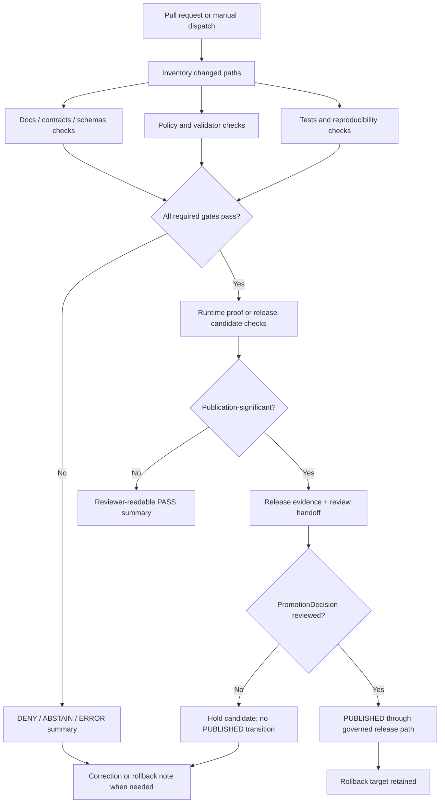

<!-- [KFM_META_BLOCK_V2]
doc_id: kfm://doc/TODO-NEEDS-VERIFICATION
title: .github/workflows
type: standard
version: v1
status: draft
owners: TODO-NEEDS-VERIFICATION
created: TODO-NEEDS-VERIFICATION
updated: TODO-NEEDS-VERIFICATION
policy_label: TODO-NEEDS-VERIFICATION
related: [
  ../README.md,
  ../CODEOWNERS,
  ../PULL_REQUEST_TEMPLATE.md,
  ../actions/README.md,
  ../watchers/README.md,
  ../../README.md,
  ../../CONTRIBUTING.md,
  ../../SECURITY.md,
  ../../contracts/README.md,
  ../../schemas/README.md,
  ../../policy/README.md,
  ../../tests/README.md,
  ../../tools/ci/README.md,
  ../../tools/validators/README.md,
  ../../data/receipts/README.md,
  ../../data/proofs/README.md,
  ../../release/README.md
]
tags: [kfm, github, workflows, ci-cd, validation, runtime-proof, release-evidence, rollback, correction]
notes: [
  "This README defines the governed role of .github/workflows/ as workflow orchestration, not as a truth, policy, release, or proof authority.",
  "All workflow filenames in this document are proposed starter lanes unless verified by the active checkout.",
  "Owners, branch rulesets, required checks, GitHub environment approvals, OIDC wiring, exact workflow inventory, and platform enforcement posture need maintainer verification before publication."
]
[/KFM_META_BLOCK_V2] -->

<a id="top"></a>

# `.github/workflows`

Governed GitHub Actions orchestration for KFM validation, runtime proof, release evidence, and rollback-ready review handoff.

> [!NOTE]
> **Status:** `draft`  
> **Owners:** `TODO: owner not verified`  
> **Authority:** `PROPOSED` workflow-lane contract; current repo implementation is `NEEDS VERIFICATION`  
> **Repo fit:** `.github/workflows/README.md` under the GitHub gatehouse root  
> **Review burden:** repo steward, CI maintainer, policy steward, and any affected domain steward must confirm that workflows are fail-closed, no-network by default where appropriate, and do not bypass KFM release governance.


**Quick jumps:** [Scope](#scope) · [Repo fit](#repo-fit) · [Accepted inputs](#accepted-inputs) · [Exclusions](#exclusions) · [Workflow lanes](#workflow-lanes) · [Operating rules](#operating-rules) · [Quickstart](#quickstart) · [Review gates](#review-gates) · [Rollback](#rollback) · [Open verification](#open-verification)

---

## Scope

`.github/workflows/` is the orchestration surface for GitHub Actions workflows that help maintain KFM’s trust spine.

It may coordinate checks over docs, contracts, schemas, policy, tests, fixtures, runtime envelopes, receipts, release candidates, proof references, and rollback rehearsals. It does **not** own the meaning of those objects.

In KFM terms, this directory helps answer:

- Did the changed files pass the right validation gates?
- Did tests run against deterministic, no-network fixtures where expected?
- Did policy checks fail closed when evidence, rights, sensitivity, release state, or review state were missing?
- Did runtime proof produce governed envelopes rather than raw model or internal-store output?
- Did release evidence remain separate from process receipts?
- Is rollback or correction rehearsed before publication-significant changes are trusted?

> [!IMPORTANT]
> A passing workflow is not a publication decision. Promotion is a governed state transition that requires evidence, policy, review, release manifest, correction path, and rollback target.

[Back to top](#top)

---

## Repo fit

| Field | Value |
| --- | --- |
| Path | `.github/workflows/README.md` |
| Owning root | `.github/` |
| Responsibility | repo-wide CI/CD orchestration and review automation |
| Authority level | `PROPOSED` until active workflow YAML, CODEOWNERS, required checks, and branch rules are verified |
| Upstream surfaces to verify | `../README.md`, `../CODEOWNERS`, `../PULL_REQUEST_TEMPLATE.md`, `../actions/README.md`, `../watchers/README.md`, `../../README.md`, `../../CONTRIBUTING.md`, `../../SECURITY.md` |
| Downstream surfaces checked by workflows | `../../docs/`, `../../contracts/`, `../../schemas/`, `../../policy/`, `../../tests/`, `../../fixtures/`, `../../tools/`, `../../data/`, `../../release/`, `../../apps/`, `../../packages/` |

Directory placement is justified because GitHub workflow orchestration is a repo-wide validation and runtime-operation responsibility. Domain workflows may exist here, but domain knowledge belongs under the proper responsibility roots such as `docs/domains/<domain>/`, `schemas/contracts/v1/domains/<domain>/`, `policy/domains/<domain>/`, `tests/domains/<domain>/`, `fixtures/domains/<domain>/`, `pipelines/domains/<domain>/`, and lifecycle data under `data/<stage>/<domain>/`.

[Back to top](#top)

---

## Accepted inputs

Workflows in this directory may consume:

| Input | Expected source | Rule |
| --- | --- | --- |
| Pull request diff | GitHub event payload | Treat as candidate change, not proof. |
| Repo-local contracts and schemas | `contracts/`, `schemas/` | Validate shape and meaning without creating parallel authority. |
| Policy rules and fixtures | `policy/`, `tests/`, `fixtures/` | Fail closed on unclear rights, sensitivity, release state, or evidence. |
| Test fixtures | `fixtures/`, `tests/fixtures/` | Prefer deterministic no-network fixtures in PR CI. |
| Runtime proof outputs | `apps/`, `packages/`, `tests/e2e/`, `tools/ci/` | Public-facing runtime outputs must use governed envelopes. |
| Receipts | `data/receipts/` | Receipts are process memory; they are not release proof. |
| Proof and release candidates | `data/proofs/`, `release/` | Release proof remains separate from receipts and requires review. |
| Review summaries | `tools/ci/`, `GITHUB_STEP_SUMMARY` | Summaries must not expose secrets, RAW data, restricted geometry, or direct model output. |

[Back to top](#top)

---

## Exclusions

Do not put these responsibilities in `.github/workflows/`:

| Excluded material | Correct home |
| --- | --- |
| Domain doctrine or architecture | `docs/domains/<domain>/` |
| Semantic object definitions | `contracts/` |
| Machine-checkable schemas | `schemas/` |
| Policy-as-code and policy rationale | `policy/` |
| Reusable validator implementation | `tools/validators/` or `packages/` |
| Reusable CI summary helpers | `tools/ci/` |
| Source connectors | `connectors/` |
| Pipeline logic | `pipelines/`, `pipeline_specs/` |
| Lifecycle data | `data/raw/`, `data/work/`, `data/quarantine/`, `data/processed/`, `data/catalog/`, `data/published/` |
| Release manifests and release operations | `release/` |
| Proof packs | `data/proofs/` or release-specific proof home |
| Secrets, credentials, tokens, private keys | GitHub secret store or deployment secret manager; never committed |
| Direct AI/model runtime behavior | governed API and runtime packages; never direct public workflow output as truth |

[Back to top](#top)

---

## Workflow lanes

The table below is a proposed lane map. Verify actual checked-in YAML before claiming that any lane is active.

| Proposed workflow | Purpose | Required fail-closed behavior | Status |
| --- | --- | --- | --- |
| `verify-docs.yml` | Check KFM Meta Block v2, one H1, relative links, placeholders, and doc structure. | Fail on broken required structure or unreviewed placeholder leakage in publication-facing docs. | `PROPOSED` |
| `verify-contracts-and-policy.yml` | Validate schemas, contract fixtures, policy fixtures, and policy-deny cases. | Fail if invalid fixtures pass, expected pass fixtures fail, or policy cannot evaluate. | `PROPOSED` |
| `verify-tests-and-reproducibility.yml` | Run deterministic unit, contract, policy, validator, and reproducibility checks. | Fail on unexplained drift, missing fixtures, or tests that depend on live source systems without explicit approval. | `PROPOSED` |
| `verify-runtime.yml` | Confirm governed API/runtime outputs use finite envelopes and do not expose internal stores. | Fail on RAW/WORK/QUARANTINE refs, uncited public claims, direct model output, or missing envelope fields. | `PROPOSED` |
| `runtime-proof-soil-moisture.yml` | Prove the first public-safe runtime slice, if soil moisture is the active thin-slice lane. | Fail if runtime output lacks EvidenceBundle linkage, policy decision, receipt reference, or finite outcome. | `PROPOSED / NEEDS VERIFICATION` |
| `incremental-stac-watcher.yml` | Exercise watcher-style source/candidate detection and receipt emission. | Fail if a watcher attempts auto-publication or treats a receipt as proof. | `PROPOSED / NEEDS VERIFICATION` |
| `release-evidence.yml` | Assemble release-candidate evidence reports and proof references. | Fail if catalog/proof/release references are missing, mismatched, or not reviewable. | `PROPOSED` |
| `promote-and-reconcile.yml` | Support review handoff for a PromotionDecision candidate. | Fail if promotion is modeled as a file copy or if rollback/correction paths are absent. | `PROPOSED` |
| `rehearse-rollback-and-correction.yml` | Rebuild rollback cards, correction notices, and withdrawal/repointing drills. | Fail if published history would be deleted instead of superseded, corrected, or repointed. | `PROPOSED` |

> [!TIP]
> Add a new workflow only when it has a clear KFM trust purpose, explicit blocking conditions, minimal permissions, and a documented rollback or correction consequence.

[Back to top](#top)

---

## Operating rules

### 1. Preserve the lifecycle boundary

Workflows may inspect candidates and emitted artifacts, but public-facing outputs must preserve the KFM lifecycle:

```text
RAW -> WORK / QUARANTINE -> PROCESSED -> CATALOG / TRIPLET -> PUBLISHED
```

Public docs, public APIs, map popups, Evidence Drawer payloads, Focus Mode answers, exports, and release summaries must not read directly from `data/raw/`, `data/work/`, `data/quarantine/`, unpublished candidates, internal canonical stores, source-system side effects, direct model runtime outputs, secrets, or credentials.

### 2. Use finite outcome language

Workflow summaries should use bounded outcomes:

| Outcome | Use |
| --- | --- |
| `PASS` | Required checks passed for the declared scope. |
| `REVIEWABLE PASS` | Drift or warning is explicitly bounded and requires reviewer attention. |
| `DENY` | Policy, rights, sensitivity, role, release state, or access posture blocks the change. |
| `ABSTAIN` | Evidence is insufficient to support the claim or output. |
| `ERROR` | The check failed due to tool, configuration, malformed input, or missing required artifact. |

### 3. Keep receipts and proofs separate

Receipts record process memory: what ran, when, with what input, and with what outcome. Proof objects support release-grade claims. A workflow may emit or upload both, but it must not call a receipt a proof pack.

### 4. Keep permissions minimal

Start with read-only permissions unless the workflow must write.

```yaml
permissions:
  contents: read
```

Only add write permissions for tightly scoped jobs such as draft PR creation, release-candidate upload, or signed attestation, and document why the permission is needed.

### 5. Avoid live source calls in PR CI by default

Pull request workflows should use deterministic fixtures. Live source connectors, external API calls, publication jobs, destructive cleanup, or mutable release actions require explicit workflow dispatch, environment approval, or a separately reviewed release lane.

### 6. Do not leak sensitive content

Workflow logs and summaries must not expose:

- secrets or tokens
- restricted exact coordinates
- living-person, DNA, archaeology, rare-species, critical-infrastructure, or other sensitive data
- RAW, WORK, QUARANTINE, unpublished candidate payloads
- direct model prompts or direct model output used as truth

[Back to top](#top)

---

## Workflow model


```mermaid
flowchart TD
    A[Pull request or manual dispatch] --> B[Inventory changed paths]
    B --> C[Docs / contracts / schemas checks]
    B --> D[Policy and validator checks]
    B --> E[Tests and reproducibility checks]
    C --> F{All required gates pass?}
    D --> F
    E --> F

    F -->|No| G[DENY / ABSTAIN / ERROR summary]
    F -->|Yes| H[Runtime proof or release-candidate checks]

    H --> I{Publication-significant?}
    I -->|No| J[Reviewer-readable PASS summary]
    I -->|Yes| K[Release evidence + review handoff]

    K --> L{PromotionDecision reviewed?}
    L -->|No| M[Hold candidate; no PUBLISHED transition]
    L -->|Yes| N[PUBLISHED through governed release path]

    G --> O[Correction or rollback note when needed]
    M --> O
    N --> P[Rollback target retained]
```

[Back to top](#top)

---

## Quickstart

Use this inspection loop before changing workflows.

```bash
# 1. Confirm you are in the intended checkout.
pwd
git status --short
git branch --show-current || true
git rev-parse --show-toplevel || true

# 2. Inspect workflow inventory.
find .github/workflows -maxdepth 1 -type f | sort

# 3. Inspect parent GitHub governance.
sed -n '1,260p' .github/README.md 2>/dev/null || true
sed -n '1,220p' .github/CODEOWNERS 2>/dev/null || true
sed -n '1,260p' .github/PULL_REQUEST_TEMPLATE.md 2>/dev/null || true
sed -n '1,240p' .github/actions/README.md 2>/dev/null || true
sed -n '1,240p' .github/watchers/README.md 2>/dev/null || true

# 4. Inspect trust-bearing surfaces before wiring checks.
find contracts schemas policy tests fixtures tools data release apps packages \
  -maxdepth 3 -type f 2>/dev/null | sort | sed -n '1,500p'

# 5. Search for KFM trust vocabulary.
grep -RInE \
  'EvidenceBundle|EvidenceRef|DecisionEnvelope|RuntimeResponseEnvelope|SourceDescriptor|ReleaseManifest|PromotionDecision|Rollback|CorrectionNotice|spec_hash|run_receipt|AIReceipt|RAW|QUARANTINE|PROCESSED|PUBLISHED' \
  docs contracts schemas policy tests fixtures tools data release apps packages .github 2>/dev/null || true

# 6. Inspect workflow history before restoring or renaming lanes.
git log --name-status -- .github/workflows 2>/dev/null | sed -n '1,160p' || true
```

[Back to top](#top)

---

## Adding or changing a workflow

Before adding a workflow YAML file, fill this review card in the PR body or an adjacent runbook.

| Question | Required answer |
| --- | --- |
| What trust gap does this workflow close? | Must name the validation, runtime, policy, release, correction, or rollback risk. |
| What root owns the objects being checked? | Example: `schemas/`, `policy/`, `tests/`, `data/receipts/`, `release/`. |
| What inputs are accepted? | Must exclude secrets and unsafe lifecycle stages unless the job is explicitly restricted. |
| What does the workflow emit? | Summary, report, receipt, proof reference, artifact, annotation, or release candidate. |
| What is the failure mode? | `DENY`, `ABSTAIN`, `ERROR`, or reviewer-held `REVIEWABLE PASS`. |
| Does it call live sources? | Default answer should be no for PR CI. If yes, document approval and cache/freshness policy. |
| Does it publish? | Default answer should be no. Publication requires promotion governance. |
| How is rollback handled? | Revert workflow PR, disable job, or repoint release alias while preserving receipts/proofs. |

[Back to top](#top)

---

## Minimal workflow template

Use this only as a starting point after the repo toolchain is verified.

```yaml
name: verify-example

on:
  pull_request:
  workflow_dispatch:

permissions:
  contents: read

jobs:
  verify:
    runs-on: ubuntu-latest
    steps:
      - name: Checkout
        uses: actions/checkout@v4

      - name: Inspect scope
        run: |
          git status --short
          find .github/workflows -maxdepth 1 -type f | sort

      - name: Run repo-native validation
        run: |
          echo "TODO: replace with verified repo-native command"
          echo "Expected examples: make test, pytest, pnpm test, schema validator, or policy test harness"

      - name: Write reviewer summary
        if: always()
        run: |
          {
            echo "## KFM workflow summary"
            echo ""
            echo "- Outcome: TODO"
            echo "- Scope: TODO"
            echo "- Receipts: TODO"
            echo "- Proof refs: TODO"
            echo "- Rollback note: TODO"
          } >> "$GITHUB_STEP_SUMMARY"
```

> [!WARNING]
> Do not copy this template into an active merge-blocking lane until the package manager, test runner, schema validator, policy engine, artifact retention, and required checks have been verified.

[Back to top](#top)

---

## Review gates

A workflow change is not ready unless reviewers can answer “yes” to each applicable gate.

- [ ] Directory placement is justified under `.github/workflows/`.
- [ ] The workflow does not create a new schema, policy, source, release, proof, or registry authority home.
- [ ] Permissions are minimal and documented.
- [ ] PR CI uses deterministic fixtures unless live source access is explicitly approved.
- [ ] Failure is fail-closed, not warning-only, for trust-bearing checks.
- [ ] Workflow output distinguishes receipts from proof objects.
- [ ] Workflow summaries avoid secrets, restricted geometry, RAW/WORK/QUARANTINE, and direct model output.
- [ ] Runtime checks use governed envelopes and finite outcomes.
- [ ] Publication-significant jobs require release evidence, review, correction path, and rollback target.
- [ ] Rollback for the workflow change itself is documented.
- [ ] Any new required check is coordinated with branch protection and maintainer ownership.

[Back to top](#top)

---

## Rollback

For a workflow-only change:

```bash
git revert <workflow-change-commit>
```

For an unsafe or noisy workflow after merge:

1. Disable the workflow in GitHub Actions or revert the workflow file.
2. Preserve run logs and uploaded artifacts needed for audit.
3. Open a correction issue if the workflow produced misleading status, summaries, receipts, proof references, or release-candidate output.
4. If a release candidate depended on the bad workflow, mark the candidate blocked and rerun release evidence after the workflow is fixed.
5. If published material was affected, use the governed correction and rollback path rather than deleting published history.

[Back to top](#top)

---

## Open verification

These items must be checked in the active repository before this README is treated as authoritative:

| Item | Status |
| --- | --- |
| Exact checked-in workflow YAML inventory | `NEEDS VERIFICATION` |
| `.github/CODEOWNERS` coverage for `.github/workflows/` | `NEEDS VERIFICATION` |
| Required checks and branch/ruleset enforcement | `NEEDS VERIFICATION` |
| GitHub environment approvals for release or promotion jobs | `NEEDS VERIFICATION` |
| OIDC, signing, artifact retention, and attestation wiring | `NEEDS VERIFICATION` |
| Repo package manager and test runners | `NEEDS VERIFICATION` |
| Schema validator, policy engine, and workflow-local actions | `NEEDS VERIFICATION` |
| Whether soil-moisture runtime proof is still the active first proof lane | `NEEDS VERIFICATION` |
| Whether watcher workflows are docs-only or live orchestration | `NEEDS VERIFICATION` |
| Whether generated summaries are reviewed by humans before promotion | `NEEDS VERIFICATION` |

[Back to top](#top)

---

<details>
<summary>Appendix: starter reconstitution shape</summary>

The following shape is a proposed starter map for a mature workflow directory. Do not create these files all at once. Add only the smallest useful lane with tests, ownership, failure behavior, and rollback.

```text
.github/workflows/
├── README.md
├── verify-docs.yml
├── verify-contracts-and-policy.yml
├── verify-tests-and-reproducibility.yml
├── verify-runtime.yml
├── runtime-proof-soil-moisture.yml
├── incremental-stac-watcher.yml
├── release-evidence.yml
├── promote-and-reconcile.yml
└── rehearse-rollback-and-correction.yml
```

Design rule: grow this directory only when a workflow has a clear doctrinal basis, explicit blocking conditions, and a documented rollback or correction consequence.

</details>
