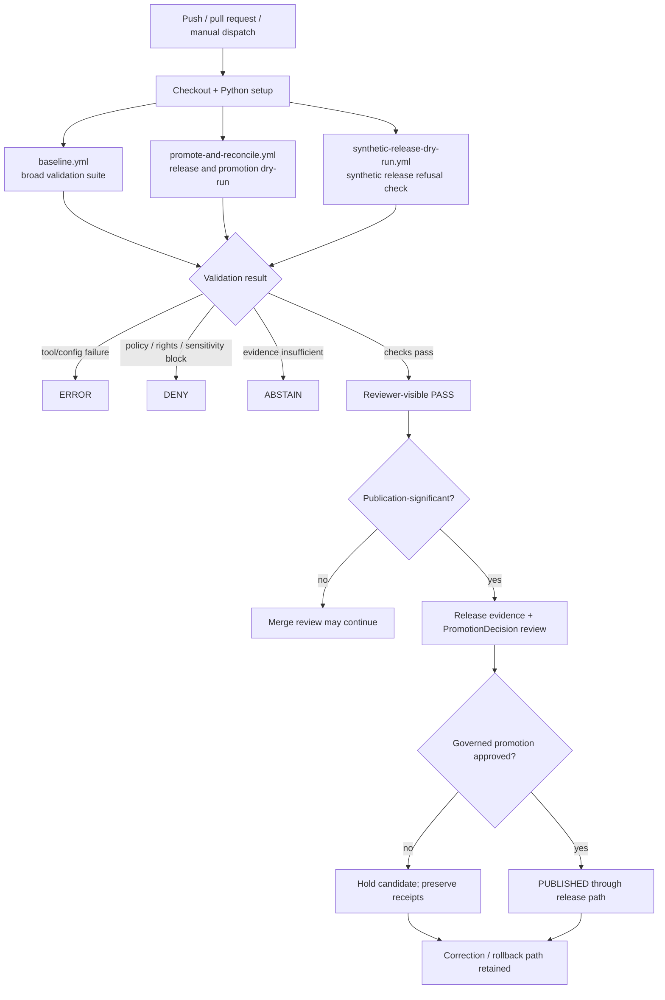

<!-- [KFM_META_BLOCK_V2]
doc_id: kfm://doc/TODO-NEEDS-VERIFICATION
title: .github/workflows
type: standard
version: v1
status: draft
owners: NEEDS_VERIFICATION
created: NEEDS_VERIFICATION
updated: 2026-05-06
policy_label: NEEDS_VERIFICATION
related: [
  ../README.md,
  ../CODEOWNERS,
  ../PULL_REQUEST_TEMPLATE.md,
  ../actions/README.md,
  ../watchers/README.md,
  ../../README.md,
  ../../SECURITY.md,
  ../../contracts/README.md,
  ../../schemas/README.md,
  ../../policy/README.md,
  ../../tests/README.md,
  ../../fixtures/README.md,
  ../../tools/ci/verify_baseline.sh,
  ../../scripts/validate_all.sh,
  ../../scripts/check_synthetic_release_local.sh,
  ../../data/receipts/README.md,
  ../../data/proofs/README.md,
  ../../release/README.md
]
tags: [kfm, github, workflows, ci-cd, validation, release-evidence, promotion, rollback, correction]
notes: [
  "Revision updates the README from a proposed lane map to a repo-evidence-aware workflow directory guide.",
  "Observed workflow inventory on main: baseline.yml, promote-and-reconcile.yml, synthetic-release-dry-run.yml.",
  "Owners, CODEOWNERS routing, PR template content, branch rulesets, required checks, protected environments, artifact retention, and Actions platform settings remain NEEDS_VERIFICATION."
]
[/KFM_META_BLOCK_V2] -->

<a id="top"></a>

# `.github/workflows`

GitHub Actions orchestration for KFM validation, promotion dry-runs, synthetic release checks, and reviewable trust-spine evidence.

> [!NOTE]
> **Status:** `active` workflow directory / `draft` README  
> **Owners:** `NEEDS_VERIFICATION`  
> **Observed workflow inventory:** `CONFIRMED` on `main` at revision time; re-verify before changing required checks  
> **Repo fit:** `.github/workflows/README.md` under the `.github/` gatehouse root  
> **Review burden:** CI, policy, contract/schema, release, and affected domain reviewers should verify that workflow changes remain least-privilege, fail-closed, receipt-aware, and non-publishing unless a governed promotion path explicitly applies.


**Quick jumps:** [Scope](#scope) · [Repo fit](#repo-fit) · [Current workflow inventory](#current-workflow-inventory) · [Accepted inputs](#accepted-inputs) · [Exclusions](#exclusions) · [Workflow model](#workflow-model) · [Operating rules](#operating-rules) · [Quickstart](#quickstart) · [Changing workflows](#changing-workflows) · [Review gates](#review-gates) · [Rollback](#rollback) · [Open verification](#open-verification)

---

## Scope

`.github/workflows/` owns **GitHub Actions workflow orchestration** for the repository.

It may run validation scripts, fixture checks, schema checks, policy checks, source-rights checks, hydrology proof-slice checks, promotion dry-runs, synthetic release dry-runs, and reviewer-visible artifact uploads. It does **not** own KFM truth, source authority, semantic contracts, machine schemas, policy meaning, release approval, proof-pack authority, or public publication.

KFM’s workflow lane exists to keep this trust spine testable:

```text
RAW -> WORK / QUARANTINE -> PROCESSED -> CATALOG / TRIPLET -> PUBLISHED
```

A passing workflow can make a change **reviewable**. It does not, by itself, make a claim published, authoritative, or public-safe.

> [!IMPORTANT]
> Promotion is a governed state transition, not a file move. A workflow may assemble release evidence or run a promotion dry-run, but publication still requires evidence closure, policy posture, review state, release state, correction path, and rollback target.

[Back to top](#top)

---

## Repo fit

| Field | Value |
| --- | --- |
| Path | `.github/workflows/README.md` |
| Owning root | `.github/` |
| Root responsibility | Repo-wide automation, CI orchestration, validation entrypoints, and review handoff |
| Upstream governance | [`../README.md`](../README.md), [`../actions/README.md`](../actions/README.md), [`../watchers/README.md`](../watchers/README.md), [`../CODEOWNERS`](../CODEOWNERS), [`../PULL_REQUEST_TEMPLATE.md`](../PULL_REQUEST_TEMPLATE.md), [`../../README.md`](../../README.md) |
| Downstream surfaces checked or invoked | `contracts/`, `schemas/`, `policy/`, `tests/`, `fixtures/`, `tools/`, `scripts/`, `release/`, `data/receipts/`, `data/proofs/`, `apps/`, `packages/` |
| Current authority | `CONFIRMED` workflow-file inventory; `NEEDS_VERIFICATION` platform enforcement and owner routing |
| Directory Rules basis | `.github/` is a repo-wide governance and validation root; domain knowledge belongs under responsibility roots, not here |

Domain-specific workflow checks may be orchestrated here, but domain meaning belongs elsewhere:

| Concern | Correct home |
| --- | --- |
| Domain doctrine | `docs/domains/<domain>/` |
| Semantic contracts | `contracts/domains/<domain>/` or verified contract home |
| Machine schemas | `schemas/contracts/v1/domains/<domain>/` or verified schema home |
| Policy rules | `policy/domains/<domain>/` |
| Tests and fixtures | `tests/domains/<domain>/`, `fixtures/domains/<domain>/` |
| Lifecycle data | `data/raw/<domain>/`, `data/work/<domain>/`, `data/quarantine/<domain>/`, `data/processed/<domain>/`, `data/catalog/<domain>/`, `data/published/<domain>/` |
| Release candidates | `release/` and verified release-candidate homes |

[Back to top](#top)

---

## Current workflow inventory

The active `main` branch inventory observed during this revision contains three workflow YAML files.

```text
.github/workflows/
├── README.md
├── baseline.yml
├── promote-and-reconcile.yml
└── synthetic-release-dry-run.yml
```

| Workflow | Triggers | Permissions | Main job | What it currently does | Verification posture |
| --- | --- | --- | --- | --- | --- |
| [`baseline.yml`](./baseline.yml) | `push`, `pull_request` | `contents: read` | `test` | Sets up Python 3.11, runs repository structure, fixture, schema, docs truth-label, directory-rule, source, API contract, promotion receipt, release-manifest, hydrology profile, and unit-test checks; ends with [`../../scripts/validate_all.sh`](../../scripts/validate_all.sh). | `CONFIRMED` file content; required-check enforcement `NEEDS_VERIFICATION` |
| [`promote-and-reconcile.yml`](./promote-and-reconcile.yml) | `pull_request` and `push` to `main` for `contracts/**`, `schemas/**`, `fixtures/**`, `release/**`, `tools/**`, `tests/**`, plus `workflow_dispatch` | `contents: read` | `promote-and-reconcile` | Runs repository/governed-boundary checks, release/publication gates, hydrology release validators, `tools/promotion_dry_run.py`, promotion receipt determinism, drift reconciliation, release-focused unit tests, and uploads promotion/reconciliation receipts. | `CONFIRMED` file content; human promotion authority `NEEDS_VERIFICATION` |
| [`synthetic-release-dry-run.yml`](./synthetic-release-dry-run.yml) | `pull_request`, `push` on all branches | `NEEDS_VERIFICATION` because no explicit `permissions` block is present in the observed file | `dry-run` | Sets up Python 3.11 and runs [`../../scripts/check_synthetic_release_local.sh`](../../scripts/check_synthetic_release_local.sh), which validates fixtures, source terms, activation decisions, evidence closure, public path guards, and synthetic release dry-run behavior. | `CONFIRMED` file content; add explicit least-privilege permissions as `PROPOSED` hardening |

> [!WARNING]
> Do not infer branch protection, required checks, protected environments, artifact-retention policy, or release approval behavior from YAML alone. Those GitHub platform settings must be inspected separately.

[Back to top](#top)

---

## Accepted inputs

Workflows in this directory may consume repository-local files and GitHub event context when those inputs are scoped, reviewable, and safe for CI logs.

| Input | Accepted from | Required behavior |
| --- | --- | --- |
| Pull request or push diff | GitHub event payload | Treat as candidate change, not publication proof. |
| Contracts and schemas | `contracts/`, `schemas/` | Validate meaning and machine shape without creating parallel authority. |
| Policy rules and policy fixtures | `policy/`, `tests/`, `fixtures/` | Fail closed on missing policy, missing deny fixtures, unclear rights, or sensitivity gaps. |
| Test fixtures | `fixtures/`, `tests/fixtures/`, domain fixture homes | Prefer deterministic no-network fixtures for PR CI. |
| Validator and helper scripts | `tools/`, `scripts/` | Keep real logic in reviewable repo roots; workflows orchestrate. |
| Release candidates and dry-runs | `release/`, `fixtures/**/release_*`, `release/dry_runs/` | Keep promotion dry-run distinct from publication. |
| Receipts and validation reports | `data/receipts/`, `fixtures/**/validation_reports/`, verified receipt homes | Treat as process memory, not proof by default. |
| Proof references | `data/proofs/`, verified proof homes | Require reviewable linkage to release evidence before publication claims. |
| Workflow artifacts | GitHub Actions artifact upload | Do not expose secrets, restricted geometry, RAW/WORK/QUARANTINE payloads, or direct model output. |

[Back to top](#top)

---

## Exclusions

Do not place these responsibilities in `.github/workflows/`.

| Excluded material | Why | Correct home |
| --- | --- | --- |
| KFM doctrine or architecture | Workflows should not become doctrine | `docs/` |
| Semantic object definitions | Workflow YAML is not a contract surface | `contracts/` |
| Machine-checkable schemas | Schema authority must remain executable and versioned | `schemas/` |
| Policy-as-code | Workflows call policy; they do not own policy | `policy/` |
| Reusable validator implementation | Large logic hidden in YAML is hard to review | `tools/validators/`, `tools/`, `packages/` |
| Broad orchestration scripts | Shell/Python orchestration should be reviewable outside YAML | `scripts/`, `tools/` |
| Source connectors | Connector logic must carry source rights and source-role review | `connectors/` |
| Pipeline logic | Workflow orchestration is not pipeline semantics | `pipelines/`, `pipeline_specs/` |
| Lifecycle data | CI must not become a data store | `data/` |
| Receipts, proofs, release manifests | These are emitted trust objects, not workflow definitions | `data/receipts/`, `data/proofs/`, `release/` |
| Secrets, tokens, private keys | Never commit credentials | GitHub secrets, environments, OIDC, approved secret manager |
| Public model or AI truth outputs | AI is interpretive and evidence-subordinate | Governed API/runtime packages and released EvidenceBundles only |

[Back to top](#top)

---

## Workflow model


```mermaid
flowchart TD
    A[Push / pull request / manual dispatch] --> B[Checkout + Python setup]
    B --> C[baseline.yml<br/>broad validation suite]
    B --> D[promote-and-reconcile.yml<br/>release and promotion dry-run]
    B --> E[synthetic-release-dry-run.yml<br/>synthetic release refusal check]

    C --> F{Validation result}
    D --> F
    E --> F

    F -->|tool/config failure| G[ERROR]
    F -->|policy / rights / sensitivity block| H[DENY]
    F -->|evidence insufficient| I[ABSTAIN]
    F -->|checks pass| J[Reviewer-visible PASS]

    J --> K{Publication-significant?}
    K -->|no| L[Merge review may continue]
    K -->|yes| M[Release evidence + PromotionDecision review]

    M --> N{Governed promotion approved?}
    N -->|no| O[Hold candidate; preserve receipts]
    N -->|yes| P[PUBLISHED through release path]

    O --> Q[Correction / rollback path retained]
    P --> Q
```

This model describes the intended boundary. It does not prove that branch settings currently require these workflows before merge.

[Back to top](#top)

---

## Operating rules

### 1. Keep workflows as orchestration

Workflow YAML should stay small enough to review. Durable logic should live in `tools/`, `scripts/`, `packages/`, `tests/`, `policy/`, or the relevant responsibility root.

### 2. Default to least privilege

Use explicit read-only permissions unless a job genuinely needs write access.

```yaml
permissions:
  contents: read
```

`baseline.yml` and `promote-and-reconcile.yml` already declare `contents: read`. `synthetic-release-dry-run.yml` should be hardened with an explicit permissions block unless maintainers intentionally require inherited defaults.

### 3. Keep PR CI deterministic

Pull request checks should prefer no-network fixtures and dry-runs. Live source calls, destructive operations, mutable publication, release signing, environment writes, and deployment require explicit review and platform controls.

### 4. Distinguish outcomes

Use finite outcome language in workflow summaries, PR comments, and artifacts.

| Outcome | Meaning |
| --- | --- |
| `PASS` | Declared checks passed for the declared scope. |
| `REVIEWABLE_PASS` | Checks passed but a reviewer must inspect bounded drift or warnings. |
| `DENY` | Policy, rights, sensitivity, source role, release state, or access posture blocks the change. |
| `ABSTAIN` | Evidence is insufficient to support the output or claim. |
| `ERROR` | Tooling, malformed input, missing required artifact, or configuration failure. |

### 5. Separate receipts from proofs

Receipts record process memory. Proof objects support release-grade claims. Workflows may upload receipts, but must not relabel receipts as proof packs.

### 6. Do not leak sensitive material

Workflow logs, summaries, and uploaded artifacts must not expose:

- secrets or tokens
- restricted exact coordinates
- living-person, DNA/genomic, archaeology, rare-species, critical-infrastructure, or steward-restricted data
- RAW, WORK, QUARANTINE, or unpublished candidate payloads
- direct model prompts or direct model output presented as truth

### 7. Treat dry-runs as dry-runs

`promote-and-reconcile.yml` and `synthetic-release-dry-run.yml` are valuable because they keep promotion and release testing reviewable without asserting public publication. Preserve that distinction.

[Back to top](#top)

---

## Quickstart

Run from the repository root before changing workflows.

```bash
# Confirm checkout and branch.
git status --short
git branch --show-current || true
git rev-parse --show-toplevel || true

# Inventory workflows.
find .github/workflows -maxdepth 1 -type f | sort

# Inspect workflow definitions.
sed -n '1,260p' .github/workflows/baseline.yml
sed -n '1,260p' .github/workflows/promote-and-reconcile.yml
sed -n '1,180p' .github/workflows/synthetic-release-dry-run.yml

# Inspect neighboring GitHub governance surfaces.
sed -n '1,260p' .github/README.md 2>/dev/null || true
sed -n '1,220p' .github/CODEOWNERS 2>/dev/null || true
sed -n '1,260p' .github/PULL_REQUEST_TEMPLATE.md 2>/dev/null || true
sed -n '1,240p' .github/actions/README.md 2>/dev/null || true
sed -n '1,240p' .github/watchers/README.md 2>/dev/null || true

# Inspect workflow helper scripts.
sed -n '1,260p' scripts/validate_all.sh 2>/dev/null || true
sed -n '1,220p' scripts/check_synthetic_release_local.sh 2>/dev/null || true
sed -n '1,220p' tools/ci/verify_baseline.sh 2>/dev/null || true
```

Run the broad local validation entrypoints when the active checkout has the required tools:

```bash
python -m unittest discover -s tests
bash scripts/validate_all.sh
bash scripts/check_synthetic_release_local.sh
```

Do not report test or workflow success unless the command actually ran on the active checkout.

[Back to top](#top)

---

## Changing workflows

Use this review card for workflow changes.

| Question | Required answer |
| --- | --- |
| What trust gap does this workflow close? | Name the validation, source, policy, runtime, release, correction, or rollback risk. |
| Which responsibility roots does it touch? | Identify `contracts/`, `schemas/`, `policy/`, `tests/`, `fixtures/`, `tools/`, `release/`, `data/`, or domain paths. |
| What triggers it? | `push`, `pull_request`, path filters, `workflow_dispatch`, schedule, or other event. |
| What permissions does it request? | Start at `contents: read`; justify any write scope. |
| What does it emit? | Summary, report, receipt, validation report, artifact, proof reference, or release candidate. |
| What can fail closed? | Required failure mode should be `DENY`, `ABSTAIN`, or `ERROR`, not silent warning. |
| Does it call live sources? | Default should be no for PR CI. Document approval if yes. |
| Does it publish? | Default should be no. Publication requires governed release state. |
| How is rollback handled? | Revert, disable, rerun receipts/proofs, or mark affected release candidate blocked. |

### Minimal hardened workflow shape

```yaml
name: verify-example

on:
  pull_request:
  workflow_dispatch:

permissions:
  contents: read

concurrency:
  group: ${{ github.workflow }}-${{ github.ref }}
  cancel-in-progress: true

defaults:
  run:
    shell: bash

jobs:
  verify:
    runs-on: ubuntu-latest
    timeout-minutes: 20
    env:
      PYTHONPATH: ${{ github.workspace }}

    steps:
      - name: Check out repository
        uses: actions/checkout@v4

      - name: Set up Python
        uses: actions/setup-python@v5
        with:
          python-version: "3.11"

      - name: Run repo-native validation
        run: |
          set -euo pipefail
          echo "Replace with verified repo-native command."

      - name: Write reviewer summary
        if: always()
        run: |
          {
            echo "## KFM workflow summary"
            echo ""
            echo "- Outcome: NEEDS_VERIFICATION"
            echo "- Scope: workflow template only"
            echo "- Receipts: none"
            echo "- Proof refs: none"
            echo "- Rollback: revert workflow change"
          } >> "$GITHUB_STEP_SUMMARY"
```

[Back to top](#top)

---

## Review gates

A workflow PR is not ready until reviewers can answer every applicable item.

- [ ] Active workflow inventory was rechecked.
- [ ] The workflow belongs in `.github/workflows/` and does not create a new authority home.
- [ ] Triggers are scoped to the intended risk surface.
- [ ] Permissions are explicit and least-privilege.
- [ ] External actions are justified and version-pinned or otherwise reviewed.
- [ ] PR CI behavior is deterministic unless live-source access is explicitly approved.
- [ ] The workflow calls repo-owned scripts or tools rather than burying complex logic in YAML.
- [ ] Failure is fail-closed for trust-bearing gates.
- [ ] Logs and artifacts avoid secrets, restricted geometry, RAW/WORK/QUARANTINE, and direct model output.
- [ ] Receipts and proof objects remain distinct.
- [ ] Promotion or release jobs remain dry-run or review-gated unless a governed release path is explicitly invoked.
- [ ] Rollback or disablement path is documented.
- [ ] Required-check and branch-protection impacts are verified outside the repo files.
- [ ] Adjacent docs are updated when contributor behavior changes.

[Back to top](#top)

---

## Rollback

Workflow rollback should preserve audit evidence.

| Situation | Response |
| --- | --- |
| Bad workflow-only change | Revert the workflow commit. |
| Noisy or unsafe workflow after merge | Disable the workflow in GitHub Actions or revert the file, then preserve logs and artifacts. |
| Bad promotion dry-run output | Mark the candidate blocked, preserve the receipt trail, fix the generator or fixture, and rerun reconciliation. |
| Bad release-significant artifact | Open or update the relevant correction notice or rollback card; do not delete audit history. |
| Permission overreach | Revert permission expansion first, then inspect Actions logs for unexpected write behavior. |
| Required check misconfiguration | Update branch/ruleset settings through GitHub platform controls and document the platform-side change. |

For a workflow-only revert:

```bash
git revert <workflow-change-commit>
```

[Back to top](#top)

---

## Open verification

These items must be verified before this README can move beyond `draft`.

| Item | Status | Why it matters |
| --- | --- | --- |
| `doc_id` | `NEEDS_VERIFICATION` | Required for stable document identity. |
| Owners for `.github/workflows/` | `NEEDS_VERIFICATION` | Observed CODEOWNERS file is not enough to prove reviewer routing. |
| CODEOWNERS content and coverage | `NEEDS_VERIFICATION` | The observed file exists but owner coverage must be populated or intentionally documented. |
| PR template content | `NEEDS_VERIFICATION` | The observed file exists but reviewer checklist content must be populated or intentionally documented. |
| Branch protection and required checks | `NEEDS_VERIFICATION` | Not stored in workflow YAML. |
| GitHub environment approvals | `NEEDS_VERIFICATION` | Needed before release or promotion behavior can be claimed. |
| Artifact retention and log-retention policy | `NEEDS_VERIFICATION` | Determines audit durability. |
| OIDC, signing, and attestation wiring | `NEEDS_VERIFICATION` | Required before claiming provenance or signing maturity. |
| Whether `synthetic-release-dry-run.yml` should add explicit `permissions: contents: read` | `PROPOSED` | Aligns with least-privilege workflow posture. |
| Whether `synthetic-release-dry-run.yml` should add concurrency and timeout | `PROPOSED` | Aligns with existing baseline workflow hygiene. |
| Whether workflow success is merge-blocking | `NEEDS_VERIFICATION` | Requires platform settings, not just files. |
| Whether generated receipts/proofs are sufficient for release review | `NEEDS_VERIFICATION` | Requires emitted artifacts and reviewer expectations. |

[Back to top](#top)

---

<details>
<summary><strong>Appendix: observed command and helper map</strong></summary>

### `baseline.yml` helper families

`baseline.yml` currently calls broad validation families, including:

- repository structure
- fixture validation
- schema conformance
- fixture-to-schema mapping
- documentation truth labels
- directory rules
- public/internal path guards
- source rights, probes, activation, attribution, and semantics
- API contracts
- promotion receipt determinism
- release manifest consistency
- hydrology source profiles and observation semantics
- dry-run metadata probes
- Python unittest discovery
- aggregate validation through `scripts/validate_all.sh`

### `promote-and-reconcile.yml` helper families

`promote-and-reconcile.yml` currently checks:

- repository and governed boundaries
- release and publication gates
- hydrology release manifest and proof-slice validators
- public Focus answer validation
- promotion dry-run output
- promotion receipt determinism
- drift in tracked dry-run receipt/proof fixture paths
- release-focused unit tests
- receipt artifact upload

### `synthetic-release-dry-run.yml` helper path

`synthetic-release-dry-run.yml` runs:

```bash
bash scripts/check_synthetic_release_local.sh
```

That script currently runs fixture, source-terms, activation, evidence-closure, public-path guard, and synthetic release dry-run validators, then prints that publish remains refused by dry-run policy.

</details>

[Back to top](#top)
