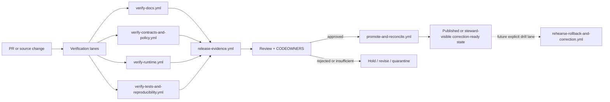

<!-- [KFM_META_BLOCK_V2]
doc_id: kfm://doc/NEEDS-VERIFICATION
title: .github/workflows
type: standard
version: v1
status: draft
owners: @bartytime4life
created: NEEDS-VERIFICATION
updated: NEEDS-VERIFICATION
policy_label: NEEDS-VERIFICATION
related: [../README.md, ../CODEOWNERS, ../PULL_REQUEST_TEMPLATE.md, ../actions/README.md, ../SECURITY.md, ../../README.md, ../../CONTRIBUTING.md, ../../contracts/README.md, ../../schemas/README.md, ../../policy/README.md, ../../tests/README.md, ../../apps/, ../../packages/]
tags: [kfm, github, workflows, ci-cd, docops]
notes: [Owner is grounded in current parent-path CODEOWNERS coverage for `/.github/`; doc_id, created/updated dates, and policy_label still need repo confirmation.]
[/KFM_META_BLOCK_V2] -->

<a id="top"></a>

# `.github/workflows`

Governed GitHub Actions surface for validation, promotion, release evidence, and correction-ready control in Kansas Frontier Matrix.

> **Status:** experimental  
> **Owners:** `@bartytime4life`  
> **Path:** `.github/workflows/README.md`  
> **Repo fit:** workflow orchestration lane inside the `.github` gatehouse; upstream from [`../README.md`](../README.md), [`../CODEOWNERS`](../CODEOWNERS), [`../PULL_REQUEST_TEMPLATE.md`](../PULL_REQUEST_TEMPLATE.md), [`../actions/README.md`](../actions/README.md), and [`../SECURITY.md`](../SECURITY.md); downstream into contracts, policy, tests, docs, apps, packages, and release evidence.  
>        
> **Quick jump:** [Scope](#scope) · [Repo fit](#repo-fit) · [Inputs](#inputs) · [Exclusions](#exclusions) · [Directory tree](#directory-tree) · [Quickstart](#quickstart) · [Usage](#usage) · [Workflow model](#workflow-model) · [Workflow lanes](#workflow-lanes) · [Task list](#task-list) · [FAQ](#faq) · [Appendix](#appendix)

> [!IMPORTANT]
> Current public `main` inspection confirms `.github/workflows/` contains `README.md` only.

> [!NOTE]
> Public GitHub Actions history also shows prior workflow activity and deleted workflow filenames such as `verify-docs.yml`, `verify-contracts-and-policy.yml`, `verify-runtime.yml`, `verify-tests-and-reproducibility.yml`, `release-evidence.yml`, and `promote-and-reconcile.yml`.
>
> Treat that as **historical signal**, not as proof that those YAML files are checked in on current `main`.

---

## Scope

`.github/workflows/` is the repo-local control surface where KFM expresses CI, delivery, promotion, reconciliation, correction, and post-release verification as reviewable automation.

In KFM, workflow files are not a detached DevOps appendix. They are part of the trust membrane: the place where documentation checks, contract checks, policy checks, release-evidence checks, and post-deploy verification become executable rather than aspirational.

This directory exists to answer one narrow but consequential question:

**What automation is allowed to change trust state, and what must be proven before that happens?**

### Status markers used in this README

| Marker | Meaning here |
| --- | --- |
| **CONFIRMED** | Grounded in the current public repo tree, current public Markdown, or attached KFM doctrine inspected for this revision |
| **INFERRED** | Conservative interpretation connecting direct repo evidence to adjacent project doctrine |
| **PROPOSED** | Repo-native pattern that fits KFM doctrine but is not yet proven as current checked-in workflow behavior |
| **UNKNOWN** | Not verified strongly enough to present as current branch, settings, or mounted implementation reality |
| **NEEDS VERIFICATION** | Placeholder detail that should be checked against git history, GitHub settings, or a mounted checkout before merge |

<p align="right"><a href="#top">Back to top ⤴</a></p>

## Repo fit

Path: `.github/workflows/README.md`

Role in repo: directory README for GitHub Actions workflows, workflow inventory, gate expectations, historical reconstruction clues, and future workflow growth.

### Upstream and adjacent anchors

| Relation | Path | Why it matters |
| --- | --- | --- |
| Parent governance surface | [`../README.md`](../README.md) | Explains `.github/` as the repository-side gatehouse for review, verification, and governed delivery |
| Review ownership | [`../CODEOWNERS`](../CODEOWNERS) | Makes review boundaries executable |
| PR evidence template | [`../PULL_REQUEST_TEMPLATE.md`](../PULL_REQUEST_TEMPLATE.md) | Keeps workflow changes aligned with proof links, truth labels, and rollback expectations |
| GitHub security surface | [`../SECURITY.md`](../SECURITY.md) | Keeps workflow and repo security guidance close to the same governance boundary |
| Reusable repo-local actions | [`../actions/README.md`](../actions/README.md) | Composite or reusable action logic belongs there, not in this directory |
| Root operating index | [`../../README.md`](../../README.md) | Defines monorepo posture, evidence model, and top-level directory contract |
| Contribution contract | [`../../CONTRIBUTING.md`](../../CONTRIBUTING.md) | Contributor obligations should stay aligned with workflow gates |
| Canonical verification surfaces | [`../../contracts/README.md`](../../contracts/README.md), [`../../schemas/README.md`](../../schemas/README.md), [`../../policy/README.md`](../../policy/README.md), [`../../tests/README.md`](../../tests/README.md) | Workflows may verify these surfaces, but they do not replace them |
| Runtime and package surfaces | [`../../apps/`](../../apps/), [`../../packages/`](../../packages/) | App and package changes often need the same governed checks without moving canonical ownership into workflow YAML |
| Long-form doctrine and runbooks | [`../../docs/`](../../docs/) | Behavior-significant workflow changes should keep docs aligned |

### Current public inventory and historical signal

| Item | Current visible state | Posture |
| --- | --- | --- |
| `./README.md` | Present | **CONFIRMED** |
| `./*.yml` / `./*.yaml` workflow files | Not visible in the current public `main` directory listing | **CONFIRMED** current snapshot |
| Public Actions history | GitHub’s public Actions UI shows prior workflow activity and deleted workflow filenames | **CONFIRMED** historical signal / **NEEDS VERIFICATION** if reconstructing exact file contents |
| `../CODEOWNERS` workflow ownership | Current parent-path coverage assigns `/.github/` to `@bartytime4life`; `/.github/workflows/` is not called out separately | **CONFIRMED** parent coverage / **INFERRED** workflow-path coverage |
| Exact required checks / rulesets / environment approvals | Not derivable from public directory contents alone | **UNKNOWN** |

> [!NOTE]
> A workflow run history is not the same thing as a current checked-in workflow inventory.
>
> Use the directory listing for **what exists on `main` now**. Use the Actions tab and git history for **what may need reconstruction, migration, or cleanup**.

<p align="right"><a href="#top">Back to top ⤴</a></p>

## Inputs

Accepted inputs for this directory include:

- GitHub Actions workflow files that validate, gate, attest, promote, reconcile, or verify repo changes
- Workflow-local notes that explain current inventory, historically visible lanes, intended gate families, or migration from placeholder to active automation
- Minimal examples that help reviewers understand what a proposed workflow is supposed to prove
- Only the smallest amount of workflow-facing documentation needed to keep automation reviewable

## Exclusions

The following do **not** belong here as the canonical source of truth:

- Composite action implementations  
  → place under [`../actions/`](../actions/)
- Policy rule bodies, rule fixtures, or policy decision logic  
  → place under [`../../policy/`](../../policy/)
- Schema definitions, OpenAPI documents, catalog profiles, or vocabularies  
  → place under [`../../contracts/`](../../contracts/) and [`../../schemas/`](../../schemas/)
- Release manifests, receipts, SBOMs, attestations, or evidence bundles as ad hoc storage  
  → keep them in the project’s designated release-evidence, proof, or artifact surfaces
- Runtime service code, ingestion logic, UI code, or evidence resolvers  
  → keep them in code surfaces such as [`../../apps/`](../../apps/) and [`../../packages/`](../../packages/)
- Long-form operational runbooks that outgrow directory-local explanation  
  → place under [`../../docs/`](../../docs/)

---

## Directory tree

### Current verified snapshot

```text
.github/
└── workflows/
    └── README.md
```

### Historically observed public workflow names

The names below come from public GitHub Actions history, not from the current `main` tree.

```text
verify-contracts-and-policy.yml
verify-docs.yml
verify-runtime.yml
verify-tests-and-reproducibility.yml
release-evidence.yml
promote-and-reconcile.yml
```

### Starter reconstitution shape

The shape below is **PROPOSED** as the smallest history-aware reconstitution contract for this directory. It preserves the currently visible historical lane names and adds one explicit correction drill lane that is doctrinally warranted even though it was not visible in the historical filename set.

```text
.github/workflows/
├── README.md
├── verify-docs.yml
├── verify-contracts-and-policy.yml
├── verify-runtime.yml
├── verify-tests-and-reproducibility.yml
├── release-evidence.yml
├── promote-and-reconcile.yml
└── rehearse-rollback-and-correction.yml
```

Design rule: grow this directory only when a workflow has a clear doctrinal basis, explicit blocking conditions, and a documented rollback or correction consequence.

<p align="right"><a href="#top">Back to top ⤴</a></p>

## Quickstart

Use the smallest possible inspection loop before changing anything here.

```bash
# 1) Inspect the directory itself
ls -la .github/workflows

# 2) Read the parent governance surface
sed -n '1,240p' .github/README.md

# 3) Confirm review ownership and path coverage
sed -n '1,200p' .github/CODEOWNERS
grep -n "/.github" .github/CODEOWNERS || true

# 4) Inventory actual workflow files, if any exist
find .github/workflows -maxdepth 1 -type f \( -name '*.yml' -o -name '*.yaml' \) | sort

# 5) Cross-check repo surfaces workflows are expected to verify
ls -la contracts schemas policy tests docs apps packages 2>/dev/null || true

# 6) Search workflow-local docs for release-, policy-, or evidence-facing terms
grep -R "policy\|catalog\|schema\|docs\|release\|evidence\|attest\|sbom" .github/workflows 2>/dev/null || true

# 7) If the lane is being reconstructed, inspect git history instead of guessing
git log --name-status -- .github/workflows
```

### Minimal review order

1. Read this file, then read [`../README.md`](../README.md), then read [`../../README.md`](../../README.md).
2. Confirm the real workflow inventory before documenting or tightening gates.
3. If a workflow lane is being reintroduced, inspect git history before choosing filenames or responsibilities.
4. Verify ownership and merge-blocking assumptions against [`../CODEOWNERS`](../CODEOWNERS) and repo settings.
5. Check that contracts, policy, docs, tests, apps, and packages stay in the same governed stream as workflow edits.
6. Change the smallest possible workflow surface.
7. Re-check rollback, correction, and contributor ergonomics after adding or tightening gates.

---

## Usage

### Reconstituting a workflow lane from history

When a workflow lane returns after being absent from current `main`, start from public history and real git history rather than inventing a new family name blindly.

Preferred posture:

1. Confirm the prior filename and its last known role.
2. Decide whether the historic responsibility still matches the current repo.
3. Keep the first reintroduced version PR-only, shadow, draft, or dry-run where possible.
4. Declare explicit permissions.
5. Update README, templates, and adjacent docs in the same PR.

### Editing blocking workflow gates

Treat every blocking change here as a governance change, not just a YAML edit.

Preserve these expectations:

- fail-closed behavior on blocking checks
- no silent bypass around policy, evidence, or release state
- build once, promote many
- review remains accountable
- rollback and correction stay possible
- documentation and accessibility changes travel with behavior-significant workflow changes

### Workflow orchestration versus reusable automation

Keep the boundary sharp:

- **This directory** should describe workflow orchestration, event triggers, job ordering, and blocking gates.
- **`../actions/`** should hold reusable composite behavior.
- **`../../policy/`**, **`../../contracts/`**, **`../../schemas/`**, and **`../../tests/`** remain the canonical surfaces being checked.

A workflow may *enforce* those surfaces. It should not become a shadow copy of them.

<p align="right"><a href="#top">Back to top ⤴</a></p>

## Workflow model

The diagram below combines current public historical signal with KFM doctrine. It shows the **kind** of orchestration this directory is meant to carry, not a claim that these YAML files are checked in on current `main`.


```mermaid
flowchart LR
    A[PR or source change] --> B[Verification lanes]
    B --> B1[verify-docs.yml]
    B --> B2[verify-contracts-and-policy.yml]
    B --> B3[verify-runtime.yml]
    B --> B4[verify-tests-and-reproducibility.yml]

    B1 --> C[release-evidence.yml]
    B2 --> C
    B3 --> C
    B4 --> C

    C --> D[Review + CODEOWNERS]
    D -->|approved| E[promote-and-reconcile.yml]
    E --> F[Published or steward-visible correction-ready state]

    D -->|rejected or insufficient| G[Hold / revise / quarantine]
    F -. future explicit drill lane .-> H[rehearse-rollback-and-correction.yml]
```

Reading rule: **promotion is a trust-state change, not a blind deploy step**.

---

## Workflow lanes

| Lane | Working interpretation here | Blockers to expect | Evidence posture |
| --- | --- | --- | --- |
| `verify-docs.yml` | Docs, links, examples, and trust-visible guidance stay aligned | broken links, stale examples, trust-cue drift | **CONFIRMED** historical filename / **INFERRED** responsibility |
| `verify-contracts-and-policy.yml` | Contract, schema, and policy surfaces remain machine-checkable | invalid fixtures passing, schema drift, policy denial | **CONFIRMED** historical filename / **INFERRED** responsibility |
| `verify-runtime.yml` | Runtime-facing trust behavior remains bounded and explainable | negative-path regressions, uncited answer path, envelope drift, hidden correction state | **CONFIRMED** historical filename / **INFERRED** responsibility |
| `verify-tests-and-reproducibility.yml` | Candidate changes remain testable and repeatable | failed tests, reproducibility drift, missing proof of deterministic behavior | **CONFIRMED** historical filename / **INFERRED** responsibility |
| `release-evidence.yml` | Candidate proof objects are assembled before promotion | missing manifests, missing validation summaries, absent attestation refs | **CONFIRMED** historical filename / **INFERRED** responsibility |
| `promote-and-reconcile.yml` | Already-reviewed state moves into publishable scope and any required reconciliation runs | missing approvals, missing release evidence, unresolved policy blockers | **CONFIRMED** historical filename / **INFERRED** responsibility |
| `rehearse-rollback-and-correction.yml` | Recovery and visible correction behavior become explicit and testable | failed rollback lineage, silent overwrite, missing correction drills | **PROPOSED** doctrinal addition |

### Naming guidance

Prefer names that expose purpose, not implementation trivia.

Good current cues:

- historically visible names such as `verify-docs.yml`, `verify-runtime.yml`, and `release-evidence.yml`
- explicit future drill names such as `rehearse-rollback-and-correction.yml`

Avoid names that hide responsibility behind generic words like `main.yml`, `pipeline.yml`, or `automation.yml`.

---

## Task list

Definition of done for changes in `.github/workflows/`:

- [ ] The actual current workflow inventory is listed exactly.
- [ ] Historical workflow signal is kept separate from current checked-in inventory.
- [ ] Every blocking workflow states what it proves.
- [ ] Permissions are explicit and minimal.
- [ ] Required checks and review boundaries are verified against active repo settings where relevant.
- [ ] Docs, examples, and templates change in the same governed stream as workflow behavior.
- [ ] A reintroduced lane is marked as a historical reconstitution or a net-new lane.
- [ ] New automation begins in draft, shadow, dry-run, or PR-only mode unless a narrower approval lane is explicitly documented.
- [ ] Promotion paths consume already-approved artifacts or reviewed desired state rather than rebuilding silently later.
- [ ] Candidate and release proof-pack expectations are explicit where the lane is trust-significant.
- [ ] Runtime verification, rollback, or correction consequences are documented for any workflow that can change trust state.
- [ ] Unknowns remain visible instead of being rewritten as certainty.

<p align="right"><a href="#top">Back to top ⤴</a></p>

## FAQ

### Why does this directory need a README before any workflow YAML exists on current `main`?

Because KFM treats release, review, verification, and correction as one governed system. A README-first contract prevents the first restored or newly added workflow from becoming an undocumented authority surface.

### Why mention deleted or historical workflow names if the directory is README-only today?

Because public Actions history is a real repo signal. It helps maintainers reconstruct prior lanes responsibly. It does **not** override the current directory listing as the source of truth for what is checked in now.

### Does this README claim those historical workflow files still exist?

No. It explicitly distinguishes **current checked-in inventory** from **historical public signal**.

### Can workflow automation self-approve policy-significant or public-truth changes?

This README assumes **no**. Workflows may prepare evidence, run gates, and block promotion, but accountable review boundaries still matter.

### Should policy rules, schemas, or attestations live here?

No. Workflows may verify them, but canonical ownership remains outside this directory.

### What becomes CONFIRMED here?

Only what the public repo tree, checked-in files, or current public GitHub UI visibly prove. Everything else stays **INFERRED**, **PROPOSED**, **UNKNOWN**, or **NEEDS VERIFICATION**.

---

## Appendix

<details>
<summary><strong>Illustrative starter workflow skeleton (PROPOSED)</strong></summary>

This example is intentionally minimal and non-authoritative. It shows shape, not repo-verified behavior.

```yaml
name: verify-contracts-and-policy

on:
  pull_request:
    paths:
      - ".github/workflows/**"
      - ".github/CODEOWNERS"
      - "contracts/**"
      - "schemas/**"
      - "policy/**"
      - "tests/**"

jobs:
  verify:
    runs-on: ubuntu-latest
    permissions:
      contents: read
    steps:
      - uses: actions/checkout@v4

      - name: Explain placeholder
        run: |
          echo "Replace this job with repo-verified schema, policy, and fixture checks."
          echo "Keep the first live workflow small, reviewable, and fail-closed."
```

</details>

<details>
<summary><strong>Review questions before restoring or adding a blocking workflow</strong></summary>

1. What exact trust-state transition does this workflow control?
2. Is this a restored historical lane or a net-new lane?
3. What evidence does it emit?
4. What explicitly blocks merge or promotion?
5. What correction path exists if the workflow proves too weak or too strong?
6. Which canonical surfaces does it verify rather than duplicate?
7. Can a future maintainer explain this workflow from its filename and README entry alone?

</details>

<details>
<summary><strong>Future expansion rule</strong></summary>

Do not add a workflow file here merely because GitHub Actions can do it. Add it only when:

- the repo has a stable surface worth verifying,
- the gate has a clear doctrinal basis,
- the failure mode is understandable,
- the rollback or correction consequence is known, and
- the new automation reduces ambiguity instead of creating another invisible control plane.

</details>

<p align="right"><a href="#top">Back to top ⤴</a></p>
