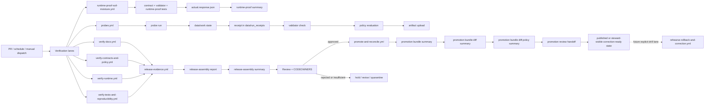

<!--
KFM Meta Block V2
doc_id: kfm://doc/NEEDS-VERIFICATION
title: .github/workflows
type: standard
version: v1
status: draft
owners: @bartytime4life
created: NEEDS-VERIFICATION
updated: 2026-04-16
policy_label: NEEDS-VERIFICATION
related:
  - ../README.md
  - ../CODEOWNERS
  - ../PULL_REQUEST_TEMPLATE.md
  - ../actions/README.md
  - ../watchers/README.md
  - ../dependabot.yml
  - ../SECURITY.md
  - ../../README.md
  - ../../CONTRIBUTING.md
  - ../../contracts/README.md
  - ../../schemas/README.md
  - ../../schemas/contracts/README.md
  - ../../policy/README.md
  - ../../tests/README.md
  - ../../tests/ci/README.md
  - ../../tests/e2e/runtime_proof/soil_moisture/README.md
  - ../../tools/ci/README.md
  - ../../tools/validators/promotion_gate/README.md
  - ../../tools/attest/README.md
  - ../../tools/probes/README.md
  - ../../tools/validators/README.md
  - ../../data/receipts/README.md
  - ../../data/run_receipts/
  - ../../data/work/README.md
  - ../../data/catalog/README.md
  - ../../apps/governed_api/README.md
  - ../../packages/
tags:
  - kfm
  - github
  - workflows
  - ci-cd
  - runtime-proof
  - receipts
  - watchers
  - promotion
  - release-evidence
  - governed-automation
notes:
  - Owner is grounded in current parent-path CODEOWNERS coverage for `/.github/`.
  - This revision preserves the README-first and history-aware posture while aligning the directory to the current probe -> receipt -> validator -> policy -> CI chain.
  - Receipt/proof separation is explicit here: receipts are process memory; proof packs and release evidence remain separate trust objects.
  - doc_id, created date, policy_label, exact checked-in workflow inventory, and branch/ruleset enforcement posture still need repo confirmation.
-->

<a id="top"></a>

# `.github/workflows`

Governed GitHub Actions surface for validation, runtime proof, receipt-bearing watchers, promotion, release evidence, and correction-ready control in Kansas Frontier Matrix.

<div align="left">


</div>

| Field | Value |
|---|---|
| **Path** | `.github/workflows/README.md` |
| **Owners** | `@bartytime4life` |
| **Role** | workflow inventory, gate expectations, and orchestration boundary for GitHub Actions |
| **Current emphasis** | runtime proof, receipts-first watcher automation, promotion/release evidence, fail-closed orchestration |
| **Not this lane** | policy authorship, validator logic, probe implementation, contract/schema ownership |
| **Quick jump** | [Scope](#scope) · [Repo fit](#repo-fit) · [Inputs](#inputs) · [Exclusions](#exclusions) · [Directory tree](#directory-tree) · [Quickstart](#quickstart) · [Usage](#usage) · [Workflow model](#workflow-model) · [Workflow lanes](#workflow-lanes) · [Task list](#task-list) · [FAQ](#faq) · [Appendix](#appendix) |

> [!IMPORTANT]
> This directory is part of KFM’s trust membrane, not a detached DevOps appendix. Workflow files here may validate contracts, enforce policy, emit reviewer-facing summaries, publish receipts, assemble release evidence, and gate promotion or correction-sensitive transitions. They should stay **fail-closed**, **reviewable**, and **evidence-first**.

> [!NOTE]
> Current public and in-session signal should be kept in separate buckets:
>
> - **README-first public signal** for this directory
> - **historical Actions/UI clues** that may point to prior lanes
> - **current thin-slice drafted workflows** added in-session, including:
>   - `runtime-proof-soil-moisture.yml`
>   - `probes.yml`
>
> Treat those drafted workflows as strong current intent for this revision, but still verify against the active branch before presenting them as fully landed inventory.

> [!TIP]
> Keep the control-plane split explicit:
>
> - **probes observe**
> - **validators verify**
> - **policy decides**
> - **workflows orchestrate**
>
> Workflows should call these surfaces, not absorb their authority into YAML.

---

## Scope

`.github/workflows/` is the repo-local control surface where KFM expresses CI, validation, delivery, promotion, runtime proof, receipt-bearing watchers, reconciliation, correction, and post-release verification as reviewable automation.

In KFM, workflows do not merely “run tests.” They make a governed claim about what must be true before trust state is allowed to move. That includes at least four recurring responsibilities:

1. **Verification** — contracts, schemas, tests, docs, policy, and runtime behavior are checked in a fail-closed manner.
2. **Publication** — reviewer-facing summaries and machine-readable artifacts are emitted in explicit, inspectable order.
3. **State memory** — process memory is preserved as receipts under governed paths when automation observes or changes something important.
4. **Promotion control** — trust-significant changes move only after evidence exists and review boundaries are respected.

### What this directory is for

This directory exists to answer a small set of consequential questions:

- What automation is allowed to influence trust state?
- What does each workflow prove before it blocks or permits something?
- Which artifacts are convenience summaries versus authoritative trust objects?
- Where do watcher receipts land, and how are they validated before they become part of governed process memory?

### What changed in this revision

This revision tightens the workflow model around the currently documented thin slices:

- **runtime-proof summary publication** for the soil-moisture thin slice
- **runtime-proof actual-response artifact emission** for expected-vs-actual review
- **scheduled or manual probe execution**
- **receipt emission to `data/run_receipts/`**
- **validator + policy enforcement before downstream side effects**
- **artifact upload for receipts, raw captures, and work metadata**
- **explicit receipt/proof separation in pathing and review language**

### Status markers used in this README

| Marker | Meaning here |
| --- | --- |
| **CONFIRMED** | Grounded in the supplied README text, current KFM doctrine already established in-project, or drafted workflow work done in-session |
| **INFERRED** | Conservative interpretation connecting direct evidence to adjacent repo doctrine |
| **PROPOSED** | Repo-native pattern that fits KFM doctrine but is not yet proven as current checked-in branch behavior |
| **UNKNOWN** | Not verified strongly enough to present as current branch, settings, or implementation reality |
| **NEEDS VERIFICATION** | Placeholder detail that should be checked against git history, repo settings, or a mounted checkout before merge |

[Back to top](#top)

---

## Repo fit

**Path:** `.github/workflows/README.md`

**Role in repo:** directory README for GitHub Actions workflows, workflow inventory, gate expectations, historical reconstruction clues, current thin-slice runtime-proof workflow, current drafted probe workflow, and future workflow growth.

### Upstream and adjacent anchors

| Relation | Path | Why it matters |
| --- | --- | --- |
| Parent governance surface | [`../README.md`](../README.md) | Explains `.github/` as the repo-side gatehouse for review, verification, and governed delivery |
| Review ownership | [`../CODEOWNERS`](../CODEOWNERS) | Makes review boundaries executable |
| PR evidence template | [`../PULL_REQUEST_TEMPLATE.md`](../PULL_REQUEST_TEMPLATE.md) | Keeps workflow changes aligned with proof links, truth labels, validation links, and rollback expectations |
| GitHub security surface | [`../SECURITY.md`](../SECURITY.md) | Keeps workflow and repository security guidance near the same governance boundary |
| Reusable repo-local actions | [`../actions/README.md`](../actions/README.md) | Composite or reusable action logic belongs there, not in this directory |
| Adjacent automation scaffolds | [`../watchers/README.md`](../watchers/README.md) | Watcher documentation may point toward orchestration seams, but does not by itself prove workflow inventory |
| Dependency update automation | [`../dependabot.yml`](../dependabot.yml) | Dependency update policy already lives under `.github/`, but it is configuration rather than orchestration |
| Root operating index | [`../../README.md`](../../README.md) | Defines monorepo posture, evidence model, and top-level directory contract |
| Contribution contract | [`../../CONTRIBUTING.md`](../../CONTRIBUTING.md) | Contributor obligations should stay aligned with workflow gates |
| Canonical verification surfaces | [`../../contracts/README.md`](../../contracts/README.md), [`../../schemas/README.md`](../../schemas/README.md), [`../../policy/README.md`](../../policy/README.md), [`../../tests/README.md`](../../tests/README.md) | Workflows may verify these surfaces, but they do not replace them |
| CI renderer and helper-proof surfaces | [`../../tools/ci/README.md`](../../tools/ci/README.md), [`../../tests/ci/README.md`](../../tests/ci/README.md) | Reviewer-facing summaries and compact gate outputs are rendered there and published here |
| Runtime-proof chain | [`../../tests/e2e/runtime_proof/soil_moisture/README.md`](../../tests/e2e/runtime_proof/soil_moisture/README.md), [`../../apps/governed_api/README.md`](../../apps/governed_api/README.md) | The soil-moisture thin slice is a current concrete runtime-proof lane |
| Validator lane | [`../../tools/validators/README.md`](../../tools/validators/README.md), [`../../tools/validators/promotion_gate/README.md`](../../tools/validators/promotion_gate/README.md) | Contract, promotion, and linkage checks should stay fail-closed and reviewer-facing |
| Attestation lane | [`../../tools/attest/README.md`](../../tools/attest/README.md) | Proof-pack assembly, digest checks, and release-evidence helpers belong there |
| Probe lane | [`../../tools/probes/README.md`](../../tools/probes/README.md), [`../../data/work/README.md`](../../data/work/README.md) | Read-only inspection and bounded source freshness logic should stay separated from promotion logic |
| Receipt process-memory surface | [`../../data/receipts/README.md`](../../data/receipts/README.md), [`../../data/run_receipts/`](../../data/run_receipts/) | Process-memory outputs belong in governed receipt surfaces, not ad hoc artifact storage |
| Catalog closure surfaces | [`../../data/catalog/README.md`](../../data/catalog/README.md) | Probes and workflows may feed catalog-facing lanes, but catalog authority lives outside this directory |
| Runtime and package surfaces | [`../../apps/governed_api/README.md`](../../apps/governed_api/README.md), [`../../packages/`](../../packages/) | App and package changes often need the same governed checks without moving ownership into workflow YAML |

### Current public inventory and drafted thin-slice signal

| Item | Current visible or drafted state | Posture |
| --- | --- | --- |
| `./README.md` | Present in supplied evidence | **CONFIRMED** |
| `runtime-proof-soil-moisture.yml` | Drafted in-session as a concrete thin-slice workflow with contract tests, runtime-proof tests, emitted `actual.response.json`, and uploaded reviewer artifacts | **CONFIRMED in-session thin slice** / **NEEDS VERIFICATION** on active branch |
| `probes.yml` | Drafted in-session as a receipts-first scheduled probe workflow with validation, policy evaluation, and artifact upload | **CONFIRMED in-session thin slice** / **NEEDS VERIFICATION** on active branch |
| Broader `./*.yml` / `./*.yaml` workflow files | Not proven from a mounted checkout in this session | **UNKNOWN** beyond drafted thin slice |
| Actions sidebar workflow list | Public Actions UI surfaces may still expose workflow-like entries | **CONFIRMED** UI signal / **UNKNOWN** checked-in YAML provenance |
| Public delete-run history | Public Actions history may still expose names like `verify-docs.yml`, `verify-contracts-and-policy.yml`, `verify-runtime.yml`, `verify-tests-and-reproducibility.yml`, `release-evidence.yml`, and `promote-and-reconcile.yml` | **CONFIRMED** historical signal / **NEEDS VERIFICATION** if reconstructing exact file contents |
| Delete-run `View workflow file` links | Some public entries may expose per-run workflow-file snapshots | **CONFIRMED** reconstruction clue / **NEEDS VERIFICATION** before reuse |
| `.github/actions/` local action inventory | Older README evidence shows reusable local-action seams under `../actions/` | **CONFIRMED** adjacent implementation seam |
| `../CODEOWNERS` workflow ownership | Current parent-path coverage assigns `/.github/` to `@bartytime4life`; `/.github/workflows/` was not separately proven in supplied text | **CONFIRMED** parent coverage / **INFERRED** workflow-path coverage |
| Exact required checks / rulesets / environment approvals | Not derivable from supplied README alone | **UNKNOWN** |

> [!NOTE]
> A workflow run history is not the same thing as a current checked-in workflow inventory.
>
> Use the directory listing for **what exists on `main` now**. Use the Actions tab and git history for **what may need reconstruction, migration, or cleanup**. Use the thin-slice drafted workflows only for the specific lanes actually added in-session.

[Back to top](#top)

---

## Inputs

Accepted inputs for this directory include:

- GitHub Actions workflow files that validate, gate, attest, promote, reconcile, correct, or verify repo changes
- workflow-local notes that explain current inventory, historically visible lanes, intended gate families, or migration from placeholder to active automation
- minimal examples that help reviewers understand what a proposed workflow is supposed to prove
- publish-step examples for reviewer-facing outputs such as:
  - runtime-proof summaries
  - release-assembly summaries
  - diff summaries
  - diff-policy summaries
  - promotion review handoff documents
  - watcher or probe receipt artifacts
  - proof-pack artifacts
- only the smallest amount of workflow-facing documentation needed to keep automation reviewable

### Thin-slice runtime-proof inputs

For `runtime-proof-soil-moisture.yml`, the strongest current input family is:

- governed API runtime code under `apps/governed_api/**`
- soil-moisture contracts and source-descriptor surfaces
- runtime envelope schema
- source-descriptor and runtime-response contract tests
- soil-moisture validator surfaces
- runtime-proof tests and fixtures
- runtime-proof summary renderer
- actual runtime-response emission helper

### Thin-slice probe inputs

For `probes.yml`, the strongest current intended input family is:

- a bounded source endpoint such as `SOURCE_URL`
- probe implementation code under a path like `tools/probes/**`
- temporary work state under `data/work/**`
- receipt output under `data/run_receipts/**`
- contract and schema validation under `schemas/**` and validator tooling
- policy enforcement under `policy/**`
- optional proof-pack assembly under `tools/attest/**`

### Required path discipline for receipt-bearing workflows

The receipts-first probe lane should preserve these distinctions:

| Path family | Role |
| --- | --- |
| `data/work/**` | bounded intermediate and ephemeral working state |
| `data/receipts/**` | governed process memory for broader receipts/report lanes where used |
| `data/run_receipts/**` | run-level process memory for probe receipts |
| `data/proof_packs/**` or equivalent governed proof surface | review- or release-significant proof objects |
| `policy/**` | deny-by-default rule logic and obligations |
| `schemas/**` / `contracts/**` | machine contracts and schema homes |
| `.github/workflows/**` | orchestration only |

---

## Exclusions

The following do **not** belong here as the canonical source of truth:

- Composite action implementations  
  → place under [`../actions/`](../actions/)
- Long-lived watcher or probe behavior and operational doctrine  
  → place under [`../watchers/`](../watchers/), `tools/`, or `data/work/` as appropriate
- Dependabot configuration policy as workflow orchestration  
  → keep in [`../dependabot.yml`](../dependabot.yml) unless a separate workflow truly needs to coordinate around it
- Policy rule bodies, rule fixtures, or policy decision logic  
  → place under [`../../policy/`](../../policy/)
- Schema definitions, OpenAPI documents, catalog profiles, or vocabularies  
  → place under [`../../contracts/`](../../contracts/) and [`../../schemas/`](../../schemas/)
- Release manifests, proof packs, SBOMs, attestations, or evidence bundles as ad hoc workflow-only storage  
  → keep them in designated proof or release-evidence surfaces
- Runtime service code, ingestion logic, probes, or watcher implementations  
  → keep them in code and data surfaces such as [`../../apps/`](../../apps/), [`../../tools/`](../../tools/), and [`../../data/`](../../data/)
- Treating receipts as proof packs or vice versa  
  → receipts are **process memory**; proofs are **release- or review-significant trust objects**
- Long-form operational runbooks that outgrow directory-local explanation  
  → place under [`../../docs/`](../../docs/)
- Treating `GITHUB_STEP_SUMMARY` output as the authoritative trust object  
  → keep machine-authoritative objects in governed report, receipt, bundle, diff, diff-policy, manifest, and proof surfaces

---

## Directory tree

### Current safe claim

```text
.github/
└── workflows/
    └── README.md
```

### Current thin-slice drafted inventory

```text
.github/
└── workflows/
    ├── README.md
    ├── runtime-proof-soil-moisture.yml   # drafted in-session; active-branch presence still NEEDS VERIFICATION
    └── probes.yml                        # drafted in-session; active-branch presence still NEEDS VERIFICATION
```

### Historically observed public workflow names

The names below come from public GitHub Actions history, not from a branch-mounted checkout in this session.

```text
verify-contracts-and-policy.yml
verify-docs.yml
verify-runtime.yml
verify-tests-and-reproducibility.yml
release-evidence.yml
promote-and-reconcile.yml
```

### Adjacent documented scaffold signal

The path below is **not** part of the current confirmed inventory here. It appears only as an adjacent documentation clue and therefore remains a reconciliation signal rather than a checked-in fact for this directory.

```text
watchers-kansas-env.yml
```

### Starter reconstitution shape

The shape below is **PROPOSED** as a history-aware reconstitution contract for this directory. It preserves both drafted thin-slice workflows, the historically visible lane names, and one explicit correction drill lane that is doctrinally warranted even though it was not shown in the historical filename set.

```text
.github/workflows/
├── README.md
├── runtime-proof-soil-moisture.yml
├── probes.yml
├── verify-docs.yml
├── verify-contracts-and-policy.yml
├── verify-runtime.yml
├── verify-tests-and-reproducibility.yml
├── release-evidence.yml
├── promote-and-reconcile.yml
└── rehearse-rollback-and-correction.yml
```

Design rule: grow this directory only when a workflow has a clear doctrinal basis, explicit blocking conditions, and a documented rollback or correction consequence.

[Back to top](#top)

---

## Quickstart

Use the smallest possible inspection loop before changing anything here.

```bash
# 1) Inspect the directory itself
ls -la .github/workflows

# 2) Read the parent governance surface
sed -n '1,260p' .github/README.md

# 3) Confirm review ownership and path coverage
sed -n '1,240p' .github/CODEOWNERS
grep -n "/.github" .github/CODEOWNERS || true

# 4) Read the PR evidence template that governs review language
sed -n '1,260p' .github/PULL_REQUEST_TEMPLATE.md

# 5) Inventory actual workflow files, if any exist
find .github/workflows -maxdepth 1 -type f \( -name '*.yml' -o -name '*.yaml' \) | sort

# 6) Inspect current repo-local actions before inventing new workflow step glue
find .github/actions -maxdepth 1 -mindepth 1 -type d | sort
find .github/actions -maxdepth 2 -name 'action.yml' | sort

# 7) Check adjacent watcher docs for scaffold references that may need reconciliation
sed -n '1,260p' .github/watchers/README.md 2>/dev/null || true

# 8) Cross-check canonical surfaces workflows are expected to verify
ls -la contracts schemas policy tests docs apps packages tools data 2>/dev/null || true

# 9) Search workflow-local docs for runtime-, receipt-, policy-, evidence-, or review-handoff-facing terms
grep -R "runtime\|receipt\|policy\|catalog\|schema\|docs\|release\|evidence\|attest\|proof\|probe\|watcher\|review-handoff\|GITHUB_STEP_SUMMARY" .github/workflows 2>/dev/null || true

# 10) If a lane is being reconstructed, inspect git history instead of guessing
git log --name-status -- .github/workflows
```

> [!TIP]
> If public Actions history shows a deleted lane you need to restore, use the run’s **View workflow file** snapshot as a clue, then verify it against git history and current canonical repo surfaces before reintroducing anything.

### Minimal review order

1. Read this file, then read [`../README.md`](../README.md), [`../PULL_REQUEST_TEMPLATE.md`](../PULL_REQUEST_TEMPLATE.md), and [`../../README.md`](../../README.md).
2. Confirm the real workflow inventory before documenting or tightening gates.
3. If a workflow lane is being reintroduced, inspect public delete-run clues and git history before choosing filenames or responsibilities.
4. Verify ownership and merge-blocking assumptions against [`../CODEOWNERS`](../CODEOWNERS) and repo settings.
5. Check whether repo-local actions under [`../actions/`](../actions/) already cover reusable behavior.
6. Treat watcher-local scaffold references as clues to reconcile, not as proof of current YAML presence.
7. Change the smallest possible workflow surface.
8. Re-check rollback, correction, contributor ergonomics, and reviewer-output publication after adding or tightening gates.

---

## Usage

### Reconstituting a workflow lane from history

When a workflow lane returns after being absent from current `main`, start from public history and real git history rather than inventing a new family name blindly.

Preferred posture:

1. confirm the prior filename and last-known role
2. decide whether the historic responsibility still matches the current repo
3. keep the first reintroduced version PR-only, shadow, draft, or dry-run where possible
4. declare explicit permissions
5. update README, templates, and adjacent docs in the same PR

### Using public Actions history safely

Keep the signals separated:

- sidebar workflow labels are **UI surfaces**, not checked-in inventory assertions
- delete-run entries are stronger reconstruction clues because they reference actual workflow filenames
- **View workflow file** snapshots are useful last-known YAML evidence, but they still need git-history and current-surface comparison before reuse
- the first restored lane should still be the smallest reviewable version, not a maximal rewrite

### Thin-slice runtime-proof workflow

The current thin-slice runtime-proof workflow is designed to:

1. install Python test dependencies
2. run:
   - source descriptor contract tests
   - runtime response schema contract tests
   - soil-moisture rule tests
   - validator orchestration tests
   - fixture-driven runtime-proof tests
   - runtime route tests
   - governed app tests
   - CI summary-renderer tests
3. emit `actual.response.json` beside each runtime-proof fixture case
4. render a reviewer-readable Markdown runtime-proof summary
5. upload both:
   - actual runtime responses
   - runtime-proof summary
6. fail closed if tests fail or expected artifacts are missing

That workflow should remain a **runtime-proof gate**, not a release-evidence or promotion lane.

### Thin-slice probe workflow

The current drafted probe workflow is designed to:

1. run on a schedule or by manual dispatch
2. fetch from a declared external source endpoint
3. use bounded working state under `data/work/**`
4. emit a receipt to `data/run_receipts/**`
5. locate the latest receipt deterministically
6. validate the receipt with validator tooling
7. evaluate the receipt against policy in fail-closed mode
8. upload reviewer-usable artifacts on success or failure as configured

That workflow should remain a **receipt-bearing probe gate**, not a hidden publish lane or a replacement for catalog authority.

### Probe / validator / policy / workflow split

Keep this sequence explicit:

1. **probe observes**
2. **validator shape-checks and fails closed**
3. **policy decides**
4. **workflow stops or continues side effects**

When that ordering is respected, workflows stay reviewable and helper lanes keep their doctrinal boundaries.

### Receipt / proof separation

KFM keeps these objects distinct even when one workflow touches both:

| Object type | Purpose | Typical path posture |
| --- | --- | --- |
| **Receipt** | Process memory of a run, validation, or replay/correction trace | `data/receipts/**` or `data/run_receipts/**` depending on lane |
| **Proof pack** | Review- or release-significant trust object assembled after sufficient validation | governed proof / release-evidence surface |
| **Step summary** | Reviewer convenience rendering | Actions summary or uploaded markdown artifact |
| **Working state** | Temporary probe, watcher, or transform state | `data/work/**` |

This split matters because a valid receipt is not automatically a release proof object.

### Editing blocking workflow gates

Treat every blocking change here as a governance change, not just a YAML edit.

Preserve these expectations:

- fail-closed behavior on blocking checks
- no silent bypass around policy, evidence, or release state
- explicit reasons and obligations where policy denies something
- build once, promote many
- review remains accountable
- rollback and correction stay possible
- docs and trust-visible examples travel with behavior-significant workflow changes
- reviewer-facing summaries remain derived convenience surfaces rather than authoritative trust objects

### Workflow orchestration versus reusable automation

Keep the boundary sharp:

- **This directory** should describe workflow orchestration, event triggers, job ordering, and blocking gates.
- **`../actions/`** should hold reusable composite behavior.
- **`../../tools/validators/`**, **`../../tools/attest/`**, **`../../tools/probes/`**, **`../../policy/`**, **`../../contracts/`**, **`../../schemas/`**, and **`../../tests/`** remain the canonical surfaces being checked.
- **`../../data/receipts/`** and **`../../data/run_receipts/`** remain process-memory homes.

A workflow may *enforce* those surfaces. It should not become a shadow copy of them.

### Distinguishing Actions UI surfaces from checked-in YAML

The public Actions UI may show sidebar entries, historical deleted lanes, or recently removed workflow names. That is useful operational signal, but it should not overwrite the checked-in tree as the source of truth for current inventory.

Current examples to keep separated:

- current drafted thin-slice names:
  - `runtime-proof-soil-moisture.yml`
  - `probes.yml`
- historical signals:
  - `verify-docs.yml`
  - `verify-contracts-and-policy.yml`
  - `verify-runtime.yml`
  - `verify-tests-and-reproducibility.yml`
  - `release-evidence.yml`
  - `promote-and-reconcile.yml`

Reading rule:

- **directory listing first** for current `main`
- **git history second** for reconstruction
- **Actions UI third** for activity clues and cleanup signal

### Reusing repo-local actions before creating new workflow glue

The public `.github/actions/` tree already exposes reusable local seams such as:

- `metadata-validate-v2`
- `metadata-validate`
- `opa-gate`
- `provenance-guard`
- `sbom-produce-and-sign`

Prefer consuming those seams before embedding repeated shell logic directly in workflow YAML.

### Publishing reviewer surfaces safely

When a workflow publishes reviewer-facing content to `GITHUB_STEP_SUMMARY`, keep the publication order explicit and the authority split visible.

Good publication order guidance:

1. runtime-proof summary
2. release-assembly summary
3. promotion bundle summary
4. promotion bundle diff summary
5. promotion bundle diff-policy summary
6. promotion review handoff

For probe lanes, the publication order should normally look like:

1. validator outcome
2. policy outcome
3. machine-readable receipt artifact
4. raw or work artifacts when appropriate
5. any reviewer summary derived from those artifacts

That ordering helps a reviewer see what the workflow observed, whether it passed governance, and whether any higher-order proof object was assembled.

### Illustrative runtime-proof publication path

The current thin slice supports a report + render chain for runtime proof:

- source descriptor contract tests
- runtime response schema contract tests
- fixture-driven runtime-proof tests
- runtime-proof summary renderer
- emitted `actual.response.json` artifacts

A workflow lane may therefore:

1. run the contract, validator, and runtime-proof tests
2. emit actual runtime responses
3. render a reviewer-readable Markdown summary
4. upload both machine-readable actuals and the reviewer summary
5. optionally publish the summary to `GITHUB_STEP_SUMMARY`

### Illustrative receipt path

The current drafted probe lane supports a receipts-first chain:

- declared source endpoint
- bounded working state
- emitted receipt
- validator enforcement
- policy evaluation
- artifact upload

A receipt-bearing lane may therefore:

1. run the probe
2. emit exactly one or more governed receipts
3. locate the newest receipt deterministically
4. fail closed if validator or policy checks fail
5. only then upload or continue downstream artifacts

[Back to top](#top)

---

## Workflow model

The diagram below combines current thin-slice work, current historical signal, and KFM doctrine. It shows the **kind** of orchestration this directory is meant to carry, not a claim that every YAML file is checked in on current `main`.


```mermaid
flowchart LR
    A[PR / schedule / manual dispatch] --> B[Verification lanes]

    B --> B0[runtime-proof-soil-moisture.yml]
    B --> B1[probes.yml]
    B --> B2[verify-docs.yml]
    B --> B3[verify-contracts-and-policy.yml]
    B --> B4[verify-runtime.yml]
    B --> B5[verify-tests-and-reproducibility.yml]

    B0 --> B0A[contract + validator + runtime-proof tests]
    B0A --> B0B[actual.response.json]
    B0B --> B0C[runtime-proof summary]

    B1 --> B1A[probe run]
    B1A --> B1B[data/work state]
    B1B --> B1C[receipt in data/run_receipts]
    B1C --> B1D[validator check]
    B1D --> B1E[policy evaluation]
    B1E --> B1F[artifact upload]

    B2 --> C[release-evidence.yml]
    B3 --> C
    B4 --> C
    B5 --> C

    C --> C1[release-assembly report]
    C1 --> C2[release-assembly summary]
    C2 --> D[Review + CODEOWNERS]
    D -->|approved| E[promote-and-reconcile.yml]
    E --> F[promotion bundle summary]
    F --> G[promotion bundle diff summary]
    G --> H[promotion bundle diff-policy summary]
    H --> I[promotion review handoff]
    I --> J[published or steward-visible correction-ready state]

    D -->|rejected or insufficient| K[hold / revise / quarantine]
    J -. future explicit drill lane .-> L[rehearse-rollback-and-correction.yml]
```

Reading rule: **promotion is a trust-state change, not a blind deploy step**.  
Receipt rule: **a receipt-bearing probe workflow is governed automation, not background convenience glue**.

---

## Workflow lanes

| Lane | Working interpretation here | Blockers to expect | Evidence posture |
| --- | --- | --- | --- |
| `runtime-proof-soil-moisture.yml` | thin-slice governed runtime gate for the soil-moisture stack | failed contract tests, failed runtime-proof tests, failed route/app tests, failed actual-response emission, failed runtime summary render | **CONFIRMED in-session thin slice** / **NEEDS VERIFICATION** on active branch |
| `probes.yml` | scheduled or manual probe workflow that emits governed receipts, validates them, and only continues on pass | source fetch failure, probe failure, no receipt found, validator failure, policy failure | **CONFIRMED in-session thin slice** / **NEEDS VERIFICATION** on active branch |
| `verify-docs.yml` | docs, links, examples, and trust-visible guidance stay aligned | broken links, stale examples, trust-cue drift | **CONFIRMED** historical filename / **INFERRED** responsibility |
| `verify-contracts-and-policy.yml` | contract, schema, and policy surfaces remain machine-checkable | invalid fixtures passing, schema drift, policy denial | **CONFIRMED** historical filename / **INFERRED** responsibility |
| `verify-runtime.yml` | runtime-facing trust behavior remains bounded and explainable | negative-path regressions, uncited answer path, envelope drift, hidden correction state | **CONFIRMED** historical filename / **INFERRED** responsibility |
| `verify-tests-and-reproducibility.yml` | candidate changes remain testable and repeatable | failed tests, reproducibility drift, missing proof of deterministic behavior | **CONFIRMED** historical filename / **INFERRED** responsibility |
| `release-evidence.yml` | candidate proof objects are assembled before promotion | missing manifests, missing validation summaries, absent attestation refs, failed release-assembly report | **CONFIRMED** historical filename / **INFERRED** responsibility |
| `promote-and-reconcile.yml` | already-reviewed state moves into publishable scope and any required reconciliation runs | missing approvals, missing release evidence, unresolved policy blockers | **CONFIRMED** historical filename / **INFERRED** responsibility |
| `watchers-kansas-env.yml` | environment or watcher-oriented automation suggested by adjacent docs | stale scaffold refs, undocumented orchestration, confusion with current inventory | **CONFIRMED** adjacent scaffold clue / **INFERRED** role / **NEEDS VERIFICATION** current or historical file status |
| `rehearse-rollback-and-correction.yml` | recovery and visible correction behavior become explicit and testable | failed rollback lineage, silent overwrite, missing correction drills | **PROPOSED** doctrinal addition |

### Naming guidance

Prefer names that expose purpose, not implementation trivia.

Good current cues:

- thin-slice names such as `runtime-proof-soil-moisture.yml`
- explicit probe names such as `probes.yml`
- historically visible names such as `verify-docs.yml`, `verify-runtime.yml`, and `release-evidence.yml`
- future drill names such as `rehearse-rollback-and-correction.yml`

Avoid names that hide responsibility behind generic words like `main.yml`, `pipeline.yml`, or `automation.yml`.

---

## Task list

Definition of done for changes in `.github/workflows/`:

- [ ] The actual current workflow inventory is listed exactly.
- [ ] Historical workflow signal is kept separate from current checked-in inventory.
- [ ] Sidebar workflow labels and platform-visible Actions UI entries are not silently rewritten as checked-in YAML facts.
- [ ] Every blocking workflow states what it proves.
- [ ] Permissions are explicit and minimal.
- [ ] Required checks and review boundaries are verified against active repo settings where relevant.
- [ ] Repo-local actions are inspected before repeated step logic is added directly into YAML.
- [ ] If public delete-run clues are used, resulting YAML is compared against git history and current canonical repo surfaces before merge.
- [ ] Adjacent watcher scaffold references are reconciled instead of being copied forward as assumed facts.
- [ ] Docs, examples, and templates change in the same governed stream as workflow behavior.
- [ ] A reintroduced lane is marked as a historical reconstitution or a net-new lane.
- [ ] New automation begins in draft, shadow, dry-run, or PR-only mode unless a narrower approval lane is explicitly documented.
- [ ] Promotion paths consume already-approved artifacts or reviewed desired state rather than rebuilding silently later.
- [ ] Candidate and release proof-pack expectations are explicit where the lane is trust-significant.
- [ ] Runtime-proof summary publication is explicit where the soil-moisture thin slice is active.
- [ ] Runtime-proof lanes that claim expected-vs-actual review actually emit and publish `actual.response.json` or an equivalent machine-readable artifact.
- [ ] Receipt-bearing lanes that claim governed process memory actually emit receipts into `data/run_receipts/**` or another explicitly documented governed receipt surface, not ad hoc artifact folders.
- [ ] Receipt and proof-pack responsibilities are kept distinct in pathing and review language.
- [ ] Validator enforcement and policy evaluation are explicit before any receipt-bearing lane uploads or continues governed artifacts.
- [ ] Release-assembly summary publication happens before downstream bundle/diff/review-handoff publication when that lane is active.
- [ ] Runtime verification, rollback, or correction consequences are documented for any workflow that can change trust state.
- [ ] Reviewer-summary publication order is explicit when runtime-proof, receipts, proof packs, release-assembly, bundle, diff, diff-policy, and review-handoff artifacts are all published.
- [ ] Unknowns remain visible instead of being rewritten as certainty.

[Back to top](#top)

---

## FAQ

### Why does this directory need a README before every workflow YAML exists on current `main`?

Because KFM treats release, runtime, review, verification, receipts, and correction as one governed system. A README-first contract prevents the first restored or newly added workflow from becoming an undocumented authority surface.

### Why mention deleted or historical workflow names if the directory may still be README-first today?

Because public Actions history is a real repo signal. It helps maintainers reconstruct prior lanes responsibly. It does **not** override the current directory listing as the source of truth for what is checked in now.

### Does this README claim those historical workflow files still exist?

No. It explicitly distinguishes **current checked-in inventory**, **drafted thin-slice workflows**, and **historical public signal**.

### Why call out `runtime-proof-soil-moisture.yml` and `probes.yml` specifically?

Because those are the two concrete workflows drafted in-session for this revision: one proves bounded runtime behavior, the other establishes a receipts-first governed probe loop.

### Can workflow automation self-approve policy-significant or public-truth changes?

This README assumes **no**. Workflows may prepare evidence, run gates, and block promotion, but accountable review boundaries still matter.

### Should policy rules, schemas, contracts, receipts, or attestations live here?

No. Workflows may verify or orchestrate them, but canonical ownership remains outside this directory.

### Can a receipt be treated as a release proof object?

No. A receipt is process memory. A proof pack or release-evidence object has a different trust role and should only be assembled through the appropriate governed lane.

### Can `GITHUB_STEP_SUMMARY` output become the authoritative review object?

No. It is a reviewer convenience surface. The authoritative machine objects remain in governed decision, receipt, report, bundle, diff, diff-policy, manifest, proof-pack, and emitted runtime artifact lanes.

### What becomes CONFIRMED here?

Only what the supplied README, already-established KFM doctrine, public repo signals, or drafted in-session workflow work visibly support. Everything else stays **INFERRED**, **PROPOSED**, **UNKNOWN**, or **NEEDS VERIFICATION**.

---

## Appendix

<details>
<summary><strong>Current public adjacent action directories (CONFIRMED as adjacent seam)</strong></summary>

```text
.github/actions/
├── metadata-validate-v2/
├── metadata-validate/
├── opa-gate/
├── provenance-guard/
├── sbom-produce-and-sign/
├── src/
├── README.md
└── action.yml
```

Use this inventory as a reuse clue. It does **not** by itself prove which historical workflow lane called which action, or whether every action is complete enough for reuse without inspection.

</details>

<details>
<summary><strong>Current workflow signal buckets</strong></summary>

### Current drafted thin-slice signal

- `runtime-proof-soil-moisture.yml`
- `probes.yml`

### Historical public workflow signal

- `verify-docs.yml`
- `verify-contracts-and-policy.yml`
- `verify-runtime.yml`
- `verify-tests-and-reproducibility.yml`
- `release-evidence.yml`
- `promote-and-reconcile.yml`

### Adjacent scaffold clue

- `watchers-kansas-env.yml`

Safe use rule: treat these as **three different signal classes** and compare them against git history and current canonical repo surfaces before restoring or tightening anything.

</details>

<details>
<summary><strong>Illustrative starter workflow skeleton (PROPOSED)</strong></summary>

This example is intentionally minimal and non-authoritative. It shows shape, not repo-verified behavior.

```yaml
name: verify-contracts-and-policy

on:
  pull_request:
    paths:
      - ".github/workflows/**"
      - ".github/CODEOWNERS"
      - "contracts/**"
      - "schemas/**"
      - "policy/**"
      - "tests/**"

jobs:
  verify:
    runs-on: ubuntu-latest
    permissions:
      contents: read
    steps:
      - uses: actions/checkout@v4

      - name: Explain placeholder
        run: |
          echo "Replace this job with repo-verified schema, policy, and fixture checks."
          echo "Keep the first live workflow small, reviewable, and fail-closed."
```

</details>

<details>
<summary><strong>Illustrative runtime-proof publication path (PROPOSED)</strong></summary>

```yaml
- name: Run contract, validator, and runtime-proof tests
  run: |
    pytest -q \
      tests/contracts/test_source_descriptor_schema.py \
      tests/contracts/test_runtime_response_schema.py \
      tests/validators/test_soil_moisture_rules.py \
      tests/validators/test_soil_moisture_validator.py \
      tests/e2e/runtime_proof/soil_moisture/test_runtime_soil_moisture_proof.py \
      tests/e2e/runtime_proof/soil_moisture/test_runtime_route_soil_moisture.py \
      tests/e2e/runtime_proof/test_governed_api_app.py \
      tests/ci/test_render_runtime_proof_summary.py

- name: Emit actual runtime responses
  run: |
    pytest -q tests/e2e/runtime_proof/soil_moisture/test_runtime_emit_actual_responses.py

- name: Render runtime proof summary
  run: |
    python tools/ci/render_runtime_proof_summary.py \
      --fixtures tests/e2e/runtime_proof/soil_moisture/fixtures \
      --output artifacts/runtime-proof-summary-soil-moisture.md \
      --title "Runtime Proof Summary — Soil Moisture"

- name: Upload actual runtime responses
  uses: actions/upload-artifact@v4
  with:
    name: runtime-proof-actual-responses-soil-moisture
    path: tests/e2e/runtime_proof/soil_moisture/fixtures/**/actual.response.json
    if-no-files-found: error

- name: Upload runtime proof summary
  uses: actions/upload-artifact@v4
  with:
    name: runtime-proof-summary-soil-moisture
    path: artifacts/runtime-proof-summary-soil-moisture.md
    if-no-files-found: error
```

Use this as ordering guidance, not as proof that current `main` already contains the workflow file.

</details>

<details>
<summary><strong>Illustrative probe receipt path (PROPOSED)</strong></summary>

```yaml
- name: Run STAC change probe
  run: |
    python3 tools/probes/stac_change_runner.py

- name: Find latest receipt
  run: |
    find data/run_receipts -type f -name '*.json' | sort | tail -n 1

- name: Validate receipt
  run: |
    python3 tools/validators/run_receipt_validator.py "${RECEIPT_PATH}"

- name: Evaluate policy
  run: |
    conftest test "${RECEIPT_PATH}" -p policy

- name: Upload receipts and raw artifacts
  uses: actions/upload-artifact@v4
  with:
    name: probe-artifacts
    path: |
      data/run_receipts/
      data/work/raw/
      data/work/meta/
```

Use this as ordering guidance, not as proof that the workflow file is already present on current `main`.

</details>

<details>
<summary><strong>Review questions before restoring or adding a blocking workflow</strong></summary>

1. What exact trust-state transition does this workflow control?
2. Is this a restored historical lane, a drafted thin-slice lane, or a net-new lane?
3. What evidence or receipts does it emit?
4. What explicitly blocks merge, commit, promotion, or publication?
5. What correction path exists if the workflow proves too weak or too strong?
6. Which canonical surfaces does it verify rather than duplicate?
7. Does it preserve receipt/proof separation where relevant?
8. Can a future maintainer explain this workflow from its filename and README entry alone?
9. If it publishes reviewer-facing artifacts, in what order are they shown and why?

</details>

<details>
<summary><strong>Future expansion rule</strong></summary>

Do not add a workflow file here merely because GitHub Actions can do it. Add it only when:

- the repo has a stable surface worth verifying,
- the gate has a clear doctrinal basis,
- the failure mode is understandable,
- the rollback or correction consequence is known,
- receipts and proofs remain distinguishable where applicable, and
- the new automation reduces ambiguity instead of creating another invisible control plane.

</details>

[Back to top](#top)
