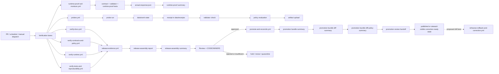

<!-- [KFM_META_BLOCK_V2]
doc_id: kfm://doc/NEEDS-VERIFICATION
title: .github/workflows
type: standard
version: v1
status: draft
owners: @bartytime4life
created: NEEDS-VERIFICATION
updated: 2026-04-16
policy_label: NEEDS-VERIFICATION
related:
  - ../README.md
  - ../CODEOWNERS
  - ../PULL_REQUEST_TEMPLATE.md
  - ../actions/README.md
  - ../watchers/README.md
  - ../dependabot.yml
  - ../SECURITY.md
  - ../../README.md
  - ../../CONTRIBUTING.md
  - ../../contracts/README.md
  - ../../schemas/README.md
  - ../../schemas/contracts/README.md
  - ../../policy/README.md
  - ../../tests/README.md
  - ../../tests/ci/README.md
  - ../../tests/e2e/runtime_proof/soil_moisture/README.md
  - ../../tools/ci/README.md
  - ../../tools/validators/promotion_gate/README.md
  - ../../tools/attest/README.md
  - ../../tools/probes/README.md
  - ../../tools/validators/README.md
  - ../../data/receipts/README.md
  - ../../data/proofs/README.md
  - ../../data/work/README.md
  - ../../data/catalog/README.md
  - ../../apps/governed_api/README.md
  - ../../packages/
tags:
  - kfm
  - github
  - workflows
  - ci-cd
  - runtime-proof
  - receipts
  - watchers
  - promotion
  - release-evidence
  - governed-automation
notes:
  - Owner is grounded in current parent-path CODEOWNERS coverage for `/.github/`.
  - This revision preserves the README-first and history-aware posture while aligning the directory to the current probe -> receipt -> validator -> policy -> CI chain.
  - Receipt/proof separation is explicit here: receipts are process memory; proofs and release evidence remain separate trust objects.
  - Current public-main inventory confirms this directory is README-first; drafted workflow names remain intent signals until active-branch YAML is verified.
  - doc_id, created date, policy_label, exact checked-in workflow inventory, required checks, and branch/ruleset enforcement posture still need repo confirmation.
[/KFM_META_BLOCK_V2] -->

<a id="top"></a>

# `.github/workflows`

Governed GitHub Actions surface for validation, runtime proof, receipt-bearing probes, promotion, release evidence, and correction-ready control in Kansas Frontier Matrix.

<div align="left">


</div>

| Field | Value |
|---|---|
| **Status** | `experimental` |
| **Document status** | `draft` |
| **Path** | `.github/workflows/README.md` |
| **Owners** | `@bartytime4life` |
| **Role** | workflow inventory, gate expectations, and orchestration boundary for GitHub Actions |
| **Current emphasis** | runtime proof, receipts-first probe automation, promotion/release evidence, fail-closed orchestration |
| **Not this lane** | policy authorship, validator logic, probe implementation, schema ownership, canonical proof storage |
| **Quick jump** | [Scope](#scope) · [Repo fit](#repo-fit) · [Inputs](#inputs) · [Exclusions](#exclusions) · [Directory tree](#directory-tree) · [Quickstart](#quickstart) · [Usage](#usage) · [Workflow model](#workflow-model) · [Workflow lanes](#workflow-lanes) · [Task list](#task-list) · [FAQ](#faq) · [Appendix](#appendix) |

> [!IMPORTANT]
> This directory is part of KFM’s trust membrane, not a detached DevOps appendix. Workflow files here may validate contracts, enforce policy, emit reviewer-facing summaries, publish receipts, assemble release evidence, and gate promotion or correction-sensitive transitions. They should stay **fail-closed**, **reviewable**, and **evidence-first**.

> [!NOTE]
> Keep current signal in separate buckets:
>
> - **checked-in public-main inventory** — currently safest to treat as README-first
> - **drafted thin-slice intent** — `runtime-proof-soil-moisture.yml` and `probes.yml`
> - **historical Actions/UI clues** — useful for reconstruction, not proof of current YAML
>
> Do not present drafted or historical workflow names as active branch inventory until the checkout, git history, or workflow run source proves them.

> [!TIP]
> Preserve the control-plane split:
>
> - **probes observe**
> - **validators verify**
> - **policy decides**
> - **workflows orchestrate**
>
> Workflows should call these surfaces, not absorb their authority into YAML.

---

## Scope

`.github/workflows/` is the repo-local control surface where KFM expresses CI, validation, delivery, promotion, runtime proof, receipt-bearing probes, reconciliation, correction, and post-release verification as reviewable automation.

In KFM, workflows do not merely “run tests.” They make a governed claim about what must be true before trust state is allowed to move.

### Core responsibilities

| Responsibility | What it means here |
|---|---|
| **Verification** | contracts, schemas, tests, docs, policy, and runtime behavior are checked in a fail-closed manner |
| **Publication** | reviewer-facing summaries and machine-readable artifacts are emitted in explicit, inspectable order |
| **State memory** | process memory is preserved as receipts under governed receipt paths when automation observes or changes something important |
| **Promotion control** | trust-significant changes move only after evidence exists and review boundaries are respected |

### What this directory is for

This directory exists to answer a small set of consequential questions:

- What automation is allowed to influence trust state?
- What does each workflow prove before it blocks or permits something?
- Which artifacts are reviewer conveniences versus authoritative trust objects?
- Where do probe receipts land, and how are they validated before they become governed process memory?
- Which lane is runtime proof, which lane is release evidence, and which lane is only reconstruction signal?

### What changed in this revision

This revision tightens the workflow README around the documented thin slices and current KFM doctrine:

- runtime-proof summary publication for the soil-moisture thin slice
- actual runtime-response artifact emission for expected-vs-actual review
- scheduled or manual probe execution
- receipt emission under `data/receipts/**`
- validator + policy enforcement before downstream side effects
- artifact upload for receipts, raw captures, and work metadata
- explicit receipt/proof separation in pathing and review language
- clearer separation of current checked-in inventory from drafted and historical workflow signal

### Status markers used in this README

| Marker | Meaning here |
|---|---|
| **CONFIRMED** | Grounded in current repo-visible evidence, supplied README text, current KFM doctrine, or supplied in-session workflow drafts |
| **INFERRED** | Conservative interpretation connecting direct evidence to adjacent repo doctrine |
| **PROPOSED** | Repo-native pattern that fits KFM doctrine but is not yet proven as checked-in branch behavior |
| **UNKNOWN** | Not verified strongly enough to present as current branch, settings, or implementation reality |
| **NEEDS VERIFICATION** | Detail that should be checked against git history, repo settings, active branch files, or a mounted checkout before merge |

[Back to top](#top)

---

## Repo fit

**Path:** `.github/workflows/README.md`

**Role in repo:** directory README for GitHub Actions workflows, gate expectations, historical reconstruction clues, current drafted runtime-proof/probe lanes, and future workflow growth.

### Upstream and adjacent anchors

| Relation | Path | Why it matters |
|---|---|---|
| Parent governance surface | [`../README.md`](../README.md) | explains `.github/` as the repo-side gatehouse for review, verification, and governed delivery |
| Review ownership | [`../CODEOWNERS`](../CODEOWNERS) | makes review boundaries executable |
| PR evidence template | [`../PULL_REQUEST_TEMPLATE.md`](../PULL_REQUEST_TEMPLATE.md) | keeps workflow changes aligned with proof links, truth labels, validation links, and rollback expectations |
| GitHub security surface | [`../SECURITY.md`](../SECURITY.md) | keeps workflow and repository security guidance near the same governance boundary |
| Reusable repo-local actions | [`../actions/README.md`](../actions/README.md) | composite or reusable action logic belongs there, not in this directory |
| Adjacent automation scaffolds | [`../watchers/README.md`](../watchers/README.md) | watcher docs may point toward orchestration seams, but do not prove workflow inventory |
| Dependency automation | [`../dependabot.yml`](../dependabot.yml) | dependency update policy lives under `.github/`, but it is configuration rather than workflow orchestration |
| Root operating index | [`../../README.md`](../../README.md) | defines monorepo posture, evidence model, and top-level directory contract |
| Contribution contract | [`../../CONTRIBUTING.md`](../../CONTRIBUTING.md) | contributor obligations should stay aligned with workflow gates |
| Contract and schema surfaces | [`../../contracts/README.md`](../../contracts/README.md), [`../../schemas/README.md`](../../schemas/README.md), [`../../schemas/contracts/README.md`](../../schemas/contracts/README.md) | workflows may verify these surfaces, but they do not replace them |
| Policy surface | [`../../policy/README.md`](../../policy/README.md) | deny-by-default rule logic and obligations belong outside workflow YAML |
| Test surfaces | [`../../tests/README.md`](../../tests/README.md), [`../../tests/ci/README.md`](../../tests/ci/README.md) | tests define proof burden; workflows orchestrate their execution |
| Runtime-proof chain | [`../../tests/e2e/runtime_proof/soil_moisture/README.md`](../../tests/e2e/runtime_proof/soil_moisture/README.md), [`../../apps/governed_api/README.md`](../../apps/governed_api/README.md) | the soil-moisture thin slice is the current concrete runtime-proof lane |
| CI rendering helpers | [`../../tools/ci/README.md`](../../tools/ci/README.md) | reviewer-facing summaries and compact gate outputs are rendered there and published here |
| Validator lane | [`../../tools/validators/README.md`](../../tools/validators/README.md), [`../../tools/validators/promotion_gate/README.md`](../../tools/validators/promotion_gate/README.md) | contract, promotion, and linkage checks should stay fail-closed and reviewer-facing |
| Attestation lane | [`../../tools/attest/README.md`](../../tools/attest/README.md) | digest checks, proof-pack assembly, and release-evidence helpers belong there |
| Probe lane | [`../../tools/probes/README.md`](../../tools/probes/README.md), [`../../data/work/README.md`](../../data/work/README.md) | read-only inspection and bounded source freshness logic should stay separate from promotion logic |
| Receipt process-memory surface | [`../../data/receipts/README.md`](../../data/receipts/README.md) | process-memory outputs belong in governed receipt surfaces, not ad hoc artifact storage |
| Release proof surface | [`../../data/proofs/README.md`](../../data/proofs/README.md) | proof packs and release evidence are separate trust objects from receipts |
| Catalog closure surface | [`../../data/catalog/README.md`](../../data/catalog/README.md) | probes and workflows may feed catalog-facing lanes, but catalog authority lives outside this directory |
| Runtime and package surfaces | [`../../apps/governed_api/README.md`](../../apps/governed_api/README.md), [`../../packages/`](../../packages/) | app and package changes may need governed checks without moving ownership into workflow YAML |

### Current inventory and workflow signal

| Item | Current visible or drafted state | Posture |
|---|---|---|
| `README.md` | current public-main directory listing exposes this README | **CONFIRMED** |
| `runtime-proof-soil-moisture.yml` | drafted as a thin-slice workflow with contract tests, runtime-proof tests, emitted `actual.response.json`, reviewer summary, and uploaded artifacts | **CONFIRMED in supplied draft** / **NEEDS VERIFICATION** on active branch |
| `probes.yml` | drafted as a receipts-first scheduled/manual probe workflow with validation, policy evaluation, and artifact upload | **CONFIRMED in supplied draft** / **NEEDS VERIFICATION** on active branch |
| broader `*.yml` / `*.yaml` files | not proven from the current public-main directory listing | **UNKNOWN** |
| Actions sidebar workflow labels | useful public UI signal where visible | **NEEDS VERIFICATION** before treating as checked-in YAML |
| historical deleted workflow names | useful reconstruction clues | **NEEDS VERIFICATION** before reuse |
| required checks / rulesets / environments | not derivable from this README alone | **UNKNOWN** |

> [!NOTE]
> A workflow run history is not the same thing as a current checked-in workflow inventory.
>
> Use the directory listing for **what exists on `main` now**. Use git history and Actions run snapshots for **what may need reconstruction**. Use drafted thin-slice names only for the lanes actually being introduced or reviewed.

[Back to top](#top)

---

## Inputs

Accepted inputs for this directory include:

- GitHub Actions workflow files that validate, gate, attest, promote, reconcile, correct, or verify repo changes
- workflow-local notes explaining current inventory, historical lanes, intended gate families, or migration from placeholder to active automation
- minimal examples that help reviewers understand what a proposed workflow is supposed to prove
- publication snippets for reviewer-facing outputs such as:
  - runtime-proof summaries
  - release-assembly summaries
  - diff summaries
  - diff-policy summaries
  - promotion review handoff documents
  - probe receipt artifacts
  - proof-pack artifacts
- only the smallest amount of workflow-facing documentation needed to keep automation reviewable

### Thin-slice runtime-proof inputs

For `runtime-proof-soil-moisture.yml`, the strongest current input family is:

- governed API runtime code under `apps/governed_api/**`
- soil-moisture contracts and source-descriptor surfaces
- runtime envelope schema
- source-descriptor and runtime-response contract tests
- soil-moisture validator surfaces
- runtime-proof tests and fixtures
- runtime-proof summary renderer
- actual runtime-response emission helper

### Thin-slice probe inputs

For `probes.yml`, the strongest current intended input family is:

- a bounded source endpoint such as `SOURCE_URL`
- probe implementation code under `tools/probes/**`
- temporary working state under `data/work/**`
- receipt output under `data/receipts/**`
- contract and schema validation under `schemas/**` and validator tooling
- policy enforcement under `policy/**`
- optional proof-pack assembly under `tools/attest/**`

### Required path discipline for receipt-bearing workflows

| Path family | Role |
|---|---|
| `data/work/**` | bounded intermediate and ephemeral working state |
| `data/receipts/**` | governed process memory for receipts and receipt-local child lanes |
| `data/proofs/**` | release-significant proof objects, evidence bundles, and correction/rollback trace |
| `data/catalog/**` | discoverability, lineage closure, and catalog-facing joins |
| `data/published/**` | already release-backed outward scope |
| `policy/**` | deny-by-default rule logic and obligations |
| `schemas/**` / `contracts/**` | machine contracts, schema homes, and stable vocabulary |
| `.github/workflows/**` | orchestration only |

---

## Exclusions

The following do **not** belong here as canonical truth:

| Do not keep here as canonical truth | Put it here instead |
|---|---|
| Composite action implementations | [`../actions/`](../actions/) |
| Long-lived watcher or probe behavior | [`../watchers/`](../watchers/), [`../../tools/probes/`](../../tools/probes/), or [`../../data/work/`](../../data/work/) |
| Dependabot configuration policy as workflow orchestration | [`../dependabot.yml`](../dependabot.yml) |
| Policy rule bodies, fixtures, or decision logic | [`../../policy/`](../../policy/) |
| Schema definitions, OpenAPI documents, catalog profiles, or vocabularies | [`../../contracts/`](../../contracts/) and [`../../schemas/`](../../schemas/) |
| Release manifests, proof packs, SBOMs, attestations, or EvidenceBundles as ad hoc workflow-only storage | [`../../data/proofs/`](../../data/proofs/) or the designated release-evidence surface |
| Runtime service code, ingestion logic, probes, or watcher implementations | [`../../apps/`](../../apps/), [`../../tools/`](../../tools/), and [`../../data/`](../../data/) |
| Process-memory receipts as release proof | [`../../data/receipts/`](../../data/receipts/) for receipts; [`../../data/proofs/`](../../data/proofs/) for proofs |
| Long-form operational runbooks | [`../../docs/`](../../docs/) |
| `GITHUB_STEP_SUMMARY` as authoritative trust object | governed report, receipt, bundle, diff, diff-policy, manifest, and proof surfaces |

> [!WARNING]
> A successful workflow run is not automatically release proof. A workflow may prepare evidence, run gates, and block promotion; it should not turn summaries, logs, or YAML itself into sovereign truth.

[Back to top](#top)

---

## Directory tree

### Current safe claim

```text
.github/
└── workflows/
    └── README.md
```

### Drafted thin-slice intent

These files are part of the current README’s workflow intent, but their active-branch YAML presence remains **NEEDS VERIFICATION**.

```text
.github/
└── workflows/
    ├── README.md
    ├── runtime-proof-soil-moisture.yml   # drafted thin slice; verify before treating as checked in
    └── probes.yml                        # drafted thin slice; verify before treating as checked in
```

### Historically observed workflow names

The names below are reconstruction clues, not current checked-in inventory.

```text
verify-contracts-and-policy.yml
verify-docs.yml
verify-runtime.yml
verify-tests-and-reproducibility.yml
release-evidence.yml
promote-and-reconcile.yml
```

### Adjacent documented scaffold signal

This path is a reconciliation clue, not a current workflow inventory claim.

```text
watchers-kansas-env.yml
```

### Starter reconstitution shape

The shape below is **PROPOSED** as a history-aware reconstitution contract. It preserves drafted thin-slice workflows, historical lane names, and one explicit correction drill lane.

```text
.github/workflows/
├── README.md
├── runtime-proof-soil-moisture.yml
├── probes.yml
├── verify-docs.yml
├── verify-contracts-and-policy.yml
├── verify-runtime.yml
├── verify-tests-and-reproducibility.yml
├── release-evidence.yml
├── promote-and-reconcile.yml
└── rehearse-rollback-and-correction.yml
```

Design rule: grow this directory only when a workflow has a clear doctrinal basis, explicit blocking conditions, and a documented rollback or correction consequence.

[Back to top](#top)

---

## Quickstart

Use the smallest possible inspection loop before changing anything here.

```bash
# 1) Inspect the directory itself
ls -la .github/workflows

# 2) Read the parent governance surface
sed -n '1,260p' .github/README.md

# 3) Confirm review ownership and path coverage
sed -n '1,240p' .github/CODEOWNERS
grep -n "/.github" .github/CODEOWNERS || true

# 4) Read the PR evidence template that governs review language
sed -n '1,260p' .github/PULL_REQUEST_TEMPLATE.md

# 5) Inventory actual workflow files
find .github/workflows -maxdepth 1 -type f \( -name '*.yml' -o -name '*.yaml' \) | sort

# 6) Inspect repo-local actions before adding repeated shell glue
find .github/actions -maxdepth 1 -mindepth 1 -type d | sort
find .github/actions -maxdepth 2 -name 'action.yml' | sort

# 7) Check adjacent watcher docs for scaffold references that may need reconciliation
sed -n '1,260p' .github/watchers/README.md 2>/dev/null || true

# 8) Cross-check canonical surfaces workflows are expected to verify
ls -la contracts schemas policy tests docs apps packages tools data 2>/dev/null || true

# 9) Search workflow-local docs for trust-bearing terms
grep -R "runtime\|receipt\|policy\|catalog\|schema\|release\|evidence\|attest\|proof\|probe\|watcher\|review-handoff\|GITHUB_STEP_SUMMARY" .github/workflows 2>/dev/null || true

# 10) If a lane is being reconstructed, inspect git history instead of guessing
git log --name-status -- .github/workflows
```

> [!TIP]
> If public Actions history shows a deleted lane you need to restore, use the run’s **View workflow file** snapshot as a clue, then compare it with git history and current canonical repo surfaces before reintroducing anything.

### Minimal review order

1. Read this file, then [`../README.md`](../README.md), [`../PULL_REQUEST_TEMPLATE.md`](../PULL_REQUEST_TEMPLATE.md), and [`../../README.md`](../../README.md).
2. Confirm the real workflow inventory before documenting or tightening gates.
3. If a workflow lane is being reintroduced, inspect public delete-run clues and git history before choosing filenames or responsibilities.
4. Verify ownership and merge-blocking assumptions against [`../CODEOWNERS`](../CODEOWNERS) and repo settings.
5. Check whether repo-local actions under [`../actions/`](../actions/) already cover reusable behavior.
6. Treat watcher-local scaffold references as clues to reconcile, not as proof of current YAML presence.
7. Change the smallest possible workflow surface.
8. Re-check rollback, correction, contributor ergonomics, and reviewer-output publication after adding or tightening gates.

[Back to top](#top)

---

## Usage

### Reconstituting a workflow lane from history

When a workflow lane returns after being absent from current `main`, start from public history and real git history rather than inventing a new family name.

Preferred posture:

1. confirm the prior filename and last-known role
2. decide whether the historic responsibility still matches current repo doctrine
3. keep the first reintroduced version PR-only, shadow, draft, or dry-run where possible
4. declare explicit permissions
5. update README, templates, and adjacent docs in the same PR

### Using public Actions history safely

Keep the signals separated:

- sidebar workflow labels are **UI surfaces**, not checked-in inventory assertions
- delete-run entries are reconstruction clues because they may reference actual workflow filenames
- **View workflow file** snapshots are useful last-known YAML evidence, but they still need git-history and current-surface comparison before reuse
- restored lanes should start as the smallest reviewable version, not a maximal rewrite

### Thin-slice runtime-proof workflow

The drafted `runtime-proof-soil-moisture.yml` lane is designed to:

1. install Python test dependencies
2. run:
   - source descriptor contract tests
   - runtime response schema contract tests
   - soil-moisture rule tests
   - validator orchestration tests
   - fixture-driven runtime-proof tests
   - runtime route tests
   - governed app tests
   - CI summary-renderer tests
3. emit `actual.response.json` beside runtime-proof fixture cases
4. render a reviewer-readable Markdown runtime-proof summary
5. upload:
   - actual runtime responses
   - runtime-proof summary
6. fail closed if tests fail or expected artifacts are missing

That workflow should remain a **runtime-proof gate**, not a release-evidence or promotion lane.

### Thin-slice probe workflow

The drafted `probes.yml` lane is designed to:

1. run on a schedule or by manual dispatch
2. fetch from a declared external source endpoint
3. use bounded working state under `data/work/**`
4. emit a receipt under `data/receipts/**`
5. locate the latest receipt deterministically
6. validate the receipt with validator tooling
7. evaluate the receipt against policy in fail-closed mode
8. upload reviewer-usable artifacts on success or failure as configured

That workflow should remain a **receipt-bearing probe gate**, not a hidden publish lane or a replacement for catalog authority.

### Probe / validator / policy / workflow split

Keep this sequence explicit:

```text
probe observes
validator shape-checks and fails closed
policy decides
workflow stops or continues side effects
```

When this ordering is respected, workflows stay reviewable and helper lanes keep their doctrinal boundaries.

### Receipt / proof separation

KFM keeps these objects distinct even when one workflow touches both:

| Object type | Purpose | Typical path posture |
|---|---|---|
| **Receipt** | process memory of a run, validation, replay, or correction trace | `data/receipts/**` |
| **Proof pack / EvidenceBundle** | review- or release-significant trust object assembled after sufficient validation | `data/proofs/**` or designated release-evidence surface |
| **Step summary** | reviewer convenience rendering | Actions summary or uploaded Markdown artifact |
| **Working state** | temporary probe, watcher, or transform state | `data/work/**` |
| **Catalog record** | discovery and linkage closure | `data/catalog/**` |

A valid receipt is not automatically a release proof object.

### Editing blocking workflow gates

Treat every blocking change here as a governance change, not just a YAML edit.

Preserve these expectations:

- fail-closed behavior on blocking checks
- no silent bypass around policy, evidence, or release state
- explicit reasons and obligations where policy denies something
- build once, promote many
- review remains accountable
- rollback and correction remain possible
- docs and trust-visible examples travel with behavior-significant workflow changes
- reviewer-facing summaries remain derived convenience surfaces rather than authoritative trust objects

### Workflow orchestration versus reusable automation

Keep the boundary sharp:

- **This directory** describes workflow orchestration, event triggers, job ordering, and blocking gates.
- **`../actions/`** holds reusable composite behavior.
- **`../../tools/validators/`**, **`../../tools/attest/`**, **`../../tools/probes/`**, **`../../policy/`**, **`../../contracts/`**, **`../../schemas/`**, and **`../../tests/`** remain the canonical surfaces being checked.
- **`../../data/receipts/`** remains the governed process-memory home.
- **`../../data/proofs/`** remains the release-evidence home.

A workflow may *enforce* these surfaces. It should not become a shadow copy of them.

### Publishing reviewer surfaces safely

When a workflow publishes reviewer-facing content to `GITHUB_STEP_SUMMARY`, keep the publication order explicit and the authority split visible.

Recommended release-facing order:

1. runtime-proof summary
2. release-assembly summary
3. promotion bundle summary
4. promotion bundle diff summary
5. promotion bundle diff-policy summary
6. promotion review handoff

Recommended probe-facing order:

1. validator outcome
2. policy outcome
3. machine-readable receipt artifact
4. raw or work artifacts when appropriate
5. derived reviewer summary

That ordering helps reviewers see what the workflow observed, whether it passed governance, and whether any higher-order proof object was assembled.

[Back to top](#top)

---

## Workflow model

This diagram combines current README doctrine, drafted thin-slice intent, and historical signal. It shows the **kind** of orchestration this directory is meant to carry, not a claim that every YAML file is checked in on current `main`.


```mermaid
flowchart LR
    A[PR / schedule / manual dispatch] --> B[Verification lanes]

    B --> B0[runtime-proof-soil-moisture.yml]
    B --> B1[probes.yml]
    B --> B2[verify-docs.yml]
    B --> B3[verify-contracts-and-policy.yml]
    B --> B4[verify-runtime.yml]
    B --> B5[verify-tests-and-reproducibility.yml]

    B0 --> B0A[contract + validator + runtime-proof tests]
    B0A --> B0B[actual.response.json]
    B0B --> B0C[runtime-proof summary]

    B1 --> B1A[probe run]
    B1A --> B1B[data/work state]
    B1B --> B1C[receipt in data/receipts]
    B1C --> B1D[validator check]
    B1D --> B1E[policy evaluation]
    B1E --> B1F[artifact upload]

    B2 --> C[release-evidence.yml]
    B3 --> C
    B4 --> C
    B5 --> C

    C --> C1[release-assembly report]
    C1 --> C2[release-assembly summary]
    C2 --> D[Review + CODEOWNERS]

    D -->|approved| E[promote-and-reconcile.yml]
    E --> F[promotion bundle summary]
    F --> G[promotion bundle diff summary]
    G --> H[promotion bundle diff-policy summary]
    H --> I[promotion review handoff]
    I --> J[published or steward-visible correction-ready state]

    D -->|rejected or insufficient| K[hold / revise / quarantine]
    J -. proposed drill lane .-> L[rehearse-rollback-and-correction.yml]
```

Reading rule: **promotion is a trust-state change, not a blind deploy step**.  
Receipt rule: **a receipt-bearing probe workflow is governed automation, not background convenience glue**.

[Back to top](#top)

---

## Workflow lanes

| Lane | Working interpretation here | Blockers to expect | Evidence posture |
|---|---|---|---|
| `runtime-proof-soil-moisture.yml` | thin-slice governed runtime gate for the soil-moisture stack | failed contract tests, failed runtime-proof tests, failed route/app tests, failed actual-response emission, failed summary render | **CONFIRMED in supplied draft** / **NEEDS VERIFICATION** on active branch |
| `probes.yml` | scheduled/manual probe workflow that emits governed receipts, validates them, and only continues on pass | source fetch failure, probe failure, no receipt found, validator failure, policy failure | **CONFIRMED in supplied draft** / **NEEDS VERIFICATION** on active branch |
| `verify-docs.yml` | docs, links, examples, and trust-visible guidance stay aligned | broken links, stale examples, trust-cue drift | **HISTORICAL SIGNAL** / **INFERRED** responsibility |
| `verify-contracts-and-policy.yml` | contract, schema, and policy surfaces remain machine-checkable | invalid fixtures passing, schema drift, policy denial | **HISTORICAL SIGNAL** / **INFERRED** responsibility |
| `verify-runtime.yml` | runtime-facing trust behavior remains bounded and explainable | negative-path regressions, uncited answer path, envelope drift, hidden correction state | **HISTORICAL SIGNAL** / **INFERRED** responsibility |
| `verify-tests-and-reproducibility.yml` | candidate changes remain testable and repeatable | failed tests, reproducibility drift, missing deterministic proof | **HISTORICAL SIGNAL** / **INFERRED** responsibility |
| `release-evidence.yml` | candidate proof objects are assembled before promotion | missing manifests, validation summaries, attestation refs, or release-assembly report | **HISTORICAL SIGNAL** / **INFERRED** responsibility |
| `promote-and-reconcile.yml` | already-reviewed state moves into publishable scope and any required reconciliation runs | missing approvals, missing release evidence, unresolved policy blockers | **HISTORICAL SIGNAL** / **INFERRED** responsibility |
| `watchers-kansas-env.yml` | environment or watcher-oriented automation suggested by adjacent docs | stale scaffold refs, undocumented orchestration, confusion with current inventory | **ADJACENT SIGNAL** / **NEEDS VERIFICATION** |
| `rehearse-rollback-and-correction.yml` | recovery and visible correction behavior become explicit and testable | failed rollback lineage, silent overwrite, missing correction drills | **PROPOSED** doctrinal addition |

### Naming guidance

Prefer names that expose purpose, not implementation trivia.

Good current cues:

- `runtime-proof-soil-moisture.yml`
- `probes.yml`
- `verify-docs.yml`
- `verify-runtime.yml`
- `release-evidence.yml`
- `rehearse-rollback-and-correction.yml`

Avoid names that hide responsibility behind generic labels such as `main.yml`, `pipeline.yml`, or `automation.yml`.

[Back to top](#top)

---

## Task list

Definition of done for changes in `.github/workflows/`:

- [ ] The actual current workflow inventory is listed exactly.
- [ ] Historical workflow signal is kept separate from current checked-in inventory.
- [ ] Drafted workflow names are not presented as active YAML unless the branch proves them.
- [ ] Sidebar workflow labels and Actions UI entries are not silently rewritten as checked-in YAML facts.
- [ ] Every blocking workflow states what it proves.
- [ ] Permissions are explicit and minimal.
- [ ] Required checks and review boundaries are verified against active repo settings where relevant.
- [ ] Repo-local actions are inspected before repeated step logic is added directly into YAML.
- [ ] If public delete-run clues are used, resulting YAML is compared against git history and current canonical repo surfaces before merge.
- [ ] Adjacent watcher scaffold references are reconciled instead of copied forward as assumed facts.
- [ ] Docs, examples, and templates change in the same governed stream as workflow behavior.
- [ ] A reintroduced lane is marked as a historical reconstitution or net-new lane.
- [ ] New automation begins in draft, shadow, dry-run, or PR-only mode unless narrower approval is explicitly documented.
- [ ] Promotion paths consume already-approved artifacts or reviewed desired state rather than rebuilding silently later.
- [ ] Candidate and release proof-pack expectations are explicit where the lane is trust-significant.
- [ ] Runtime-proof summary publication is explicit where the soil-moisture thin slice is active.
- [ ] Runtime-proof lanes that claim expected-vs-actual review emit and publish `actual.response.json` or an equivalent machine-readable artifact.
- [ ] Receipt-bearing lanes that claim governed process memory emit receipts into `data/receipts/**` or another documented governed receipt surface.
- [ ] Receipt and proof-pack responsibilities are distinct in pathing and review language.
- [ ] Validator enforcement and policy evaluation happen before any receipt-bearing lane uploads or continues governed artifacts.
- [ ] Release-assembly summary publication happens before downstream bundle/diff/review-handoff publication when that lane is active.
- [ ] Runtime verification, rollback, or correction consequences are documented for any workflow that can change trust state.
- [ ] Reviewer-summary publication order is explicit when runtime-proof, receipts, proof packs, release-assembly, bundle, diff, diff-policy, and review-handoff artifacts are all published.
- [ ] Unknowns remain visible instead of being rewritten as certainty.

[Back to top](#top)

---

## FAQ

### Why does this directory need a README before every workflow YAML exists on current `main`?

Because KFM treats release, runtime, review, verification, receipts, and correction as one governed system. A README-first contract prevents the first restored or newly added workflow from becoming an undocumented authority surface.

### Does this README claim the drafted workflow files currently exist on the active branch?

No. It distinguishes **current checked-in inventory**, **drafted thin-slice intent**, and **historical public signal**.

### Why mention deleted or historical workflow names?

Historical public workflow names can help maintainers reconstruct prior lanes responsibly. They do **not** override the current directory listing as the source of truth for what is checked in now.

### Why call out `runtime-proof-soil-moisture.yml` and `probes.yml` specifically?

Because those are the two concrete thin-slice workflow names in the current revision context: one proves bounded runtime behavior, and the other establishes a receipts-first governed probe loop.

### Can workflow automation self-approve policy-significant or public-truth changes?

No. Workflows may prepare evidence, run gates, and block promotion, but accountable review boundaries still matter.

### Should policy rules, schemas, contracts, receipts, or attestations live here?

No. Workflows may verify or orchestrate those surfaces, but canonical ownership remains outside this directory.

### Can a receipt be treated as a release proof object?

No. A receipt is process memory. A proof pack or EvidenceBundle has a different trust role and belongs in the designated proof or release-evidence surface.

### Can `GITHUB_STEP_SUMMARY` output become the authoritative review object?

No. It is a reviewer convenience surface. Authoritative machine objects remain in governed decision, receipt, report, bundle, diff, diff-policy, manifest, proof-pack, and emitted runtime artifact lanes.

[Back to top](#top)

---

## Appendix

<details>
<summary><strong>Current signal buckets</strong></summary>

### Checked-in public-main inventory

```text
.github/workflows/
└── README.md
```

### Drafted thin-slice intent

```text
runtime-proof-soil-moisture.yml
probes.yml
```

### Historical workflow signal

```text
verify-docs.yml
verify-contracts-and-policy.yml
verify-runtime.yml
verify-tests-and-reproducibility.yml
release-evidence.yml
promote-and-reconcile.yml
```

### Adjacent scaffold clue

```text
watchers-kansas-env.yml
```

Safe use rule: treat these as **different signal classes** and compare them against git history and current canonical repo surfaces before restoring or tightening anything.

</details>

<details>
<summary><strong>Adjacent local action seams to inspect before adding workflow glue</strong></summary>

```text
.github/actions/
├── metadata-validate-v2/
├── metadata-validate/
├── opa-gate/
├── provenance-guard/
├── sbom-produce-and-sign/
├── src/
├── README.md
└── action.yml
```

Use this inventory as a reuse clue. It does not prove which historical workflow lane called which action, or whether every action is complete enough for reuse without inspection.

</details>

<details>
<summary><strong>Illustrative runtime-proof publication path (PROPOSED)</strong></summary>

This example is ordering guidance, not proof that current `main` already contains the workflow file.

```yaml
- name: Run contract, validator, and runtime-proof tests
  run: |
    pytest -q \
      tests/contracts/test_source_descriptor_schema.py \
      tests/contracts/test_runtime_response_schema.py \
      tests/validators/test_soil_moisture_rules.py \
      tests/validators/test_soil_moisture_validator.py \
      tests/e2e/runtime_proof/soil_moisture/test_runtime_soil_moisture_proof.py \
      tests/e2e/runtime_proof/soil_moisture/test_runtime_route_soil_moisture.py \
      tests/e2e/runtime_proof/test_governed_api_app.py \
      tests/ci/test_render_runtime_proof_summary.py

- name: Emit actual runtime responses
  run: |
    pytest -q tests/e2e/runtime_proof/soil_moisture/test_runtime_emit_actual_responses.py

- name: Render runtime proof summary
  run: |
    python tools/ci/render_runtime_proof_summary.py \
      --fixtures tests/e2e/runtime_proof/soil_moisture/fixtures \
      --output artifacts/runtime-proof-summary-soil-moisture.md \
      --title "Runtime Proof Summary — Soil Moisture"

- name: Upload actual runtime responses
  uses: actions/upload-artifact@v4
  with:
    name: runtime-proof-actual-responses-soil-moisture
    path: tests/e2e/runtime_proof/soil_moisture/fixtures/**/actual.response.json
    if-no-files-found: error

- name: Upload runtime proof summary
  uses: actions/upload-artifact@v4
  with:
    name: runtime-proof-summary-soil-moisture
    path: artifacts/runtime-proof-summary-soil-moisture.md
    if-no-files-found: error
```

</details>

<details>
<summary><strong>Illustrative probe receipt path (PROPOSED)</strong></summary>

This example is ordering guidance, not proof that current `main` already contains the workflow file.

```yaml
- name: Run probe
  run: |
    python3 tools/probes/stac_change_runner.py

- name: Find latest receipt
  id: latest-receipt
  run: |
    receipt="$(find data/receipts -type f -name '*.json' | sort | tail -n 1)"
    test -n "$receipt"
    echo "path=$receipt" >> "$GITHUB_OUTPUT"

- name: Validate receipt
  run: |
    python3 tools/validators/run_receipt_validator.py "${{ steps.latest-receipt.outputs.path }}"

- name: Evaluate policy
  run: |
    conftest test "${{ steps.latest-receipt.outputs.path }}" -p policy

- name: Upload probe artifacts
  uses: actions/upload-artifact@v4
  with:
    name: probe-artifacts
    path: |
      data/receipts/
      data/work/
    if-no-files-found: error
```

</details>

<details>
<summary><strong>Review questions before restoring or adding a blocking workflow</strong></summary>

1. What exact trust-state transition does this workflow control?
2. Is this a restored historical lane, a drafted thin-slice lane, or a net-new lane?
3. What evidence or receipts does it emit?
4. What explicitly blocks merge, commit, promotion, or publication?
5. What correction path exists if the workflow proves too weak or too strong?
6. Which canonical surfaces does it verify rather than duplicate?
7. Does it preserve receipt/proof separation where relevant?
8. Can a future maintainer explain this workflow from its filename and README entry alone?
9. If it publishes reviewer-facing artifacts, in what order are they shown and why?

</details>

<details>
<summary><strong>Future expansion rule</strong></summary>

Do not add a workflow file here merely because GitHub Actions can do it. Add it only when:

- the repo has a stable surface worth verifying,
- the gate has a clear doctrinal basis,
- the failure mode is understandable,
- the rollback or correction consequence is known,
- receipts and proofs remain distinguishable where applicable, and
- the new automation reduces ambiguity instead of creating another invisible control plane.

</details>

[Back to top](#top)