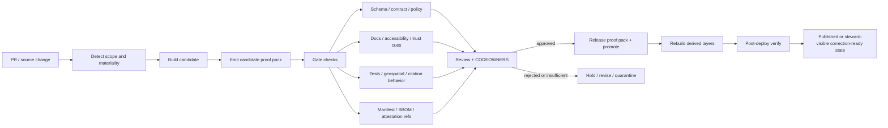

<!-- [KFM_META_BLOCK_V2]
doc_id: kfm://doc/NEEDS-VERIFICATION
title: .github/workflows
type: standard
version: v1
status: draft
owners: @bartytime4life
created: NEEDS-VERIFICATION
updated: NEEDS-VERIFICATION
policy_label: NEEDS-VERIFICATION
related: [../README.md, ../CODEOWNERS, ../actions/, ../SECURITY.md, ../../README.md, ../../CONTRIBUTING.md, ../../docs/, ../../contracts/, ../../schemas/, ../../policy/, ../../tests/, ../../apps/, ../../packages/]
tags: [kfm, github, workflows, ci-cd, docops]
notes: [Current public main shows README.md only in this directory; raw current .github/CODEOWNERS covers /.github/ under @bartytime4life, so narrower /.github/workflows/ ownership is inferred rather than directly mapped; doc_id, dates, and policy_label still need repo confirmation.]
[/KFM_META_BLOCK_V2] -->

<a id="top"></a>

# `.github/workflows`

Governed GitHub Actions surface for validation, promotion, and release control in Kansas Frontier Matrix.

> **Status:** experimental  
> **Owners:** `@bartytime4life`  
> **Path:** `.github/workflows/README.md`  
> **Repo fit:** workflow orchestration lane inside the `.github` gatehouse; upstream from [`../README.md`](../README.md) and [`../CODEOWNERS`](../CODEOWNERS), downstream into release evidence, contracts, policy, tests, and public/steward application surfaces.  
>       
> **Quick jump:** [Scope](#scope) · [Repo fit](#repo-fit) · [Inputs](#inputs) · [Exclusions](#exclusions) · [Directory tree](#directory-tree) · [Quickstart](#quickstart) · [Usage](#usage) · [Workflow model](#workflow-model) · [Workflow families](#workflow-families) · [Task list](#task-list) · [FAQ](#faq) · [Appendix](#appendix)

> [!IMPORTANT]
> Current public `main` inspection shows `.github/workflows/` containing `README.md` only. No checked-in workflow YAML files were visible in the public tree during this revision.

---

## Scope

`.github/workflows/` is the repo-local control surface where KFM should express CI, delivery, promotion, reconciliation, correction, and post-deploy verification as reviewable automation.

In KFM, workflow files are not a detached DevOps appendix. They are part of the trust membrane: the place where documentation checks, contract checks, policy checks, release-evidence checks, and post-deploy verification become executable rather than aspirational.

This directory exists to answer a narrow but consequential question:

**What automation is allowed to change trust state, and what must be proven before that happens?**

### Status markers used in this README

| Marker | Meaning here |
| --- | --- |
| **CONFIRMED** | Grounded in the current public repo tree, current public Markdown, or attached KFM doctrine inspected for this revision |
| **INFERRED** | Conservative interpretation connecting direct repo evidence to adjacent project doctrine |
| **PROPOSED** | Repo-native workflow pattern that fits KFM doctrine but is not yet proven as checked-in workflow behavior |
| **UNKNOWN** | Not verified strongly enough to present as current branch, settings, or mounted implementation reality |
| **NEEDS VERIFICATION** | Placeholder detail that should be checked against git history, GitHub settings, or a mounted checkout before commit |

<p align="right"><a href="#top">Back to top ⤴</a></p>

## Repo fit

Path: `.github/workflows/README.md`

Role in repo: directory README for GitHub Actions workflows, workflow inventory, gate expectations, and future workflow growth.

### Upstream and adjacent anchors

| Relation | Path | Why it matters |
| --- | --- | --- |
| Parent governance surface | [`../README.md`](../README.md) | Explains `.github/` as the repository-side gatehouse for review, verification, and governed delivery |
| Review ownership | [`../CODEOWNERS`](../CODEOWNERS) | Makes review boundaries executable |
| GitHub security surface | [`../SECURITY.md`](../SECURITY.md) | Keeps workflow and repo security guidance close to the same governance boundary |
| Reusable repo automation | [`../actions/`](../actions/) | Composite or reusable action logic belongs there, not in this directory |
| Root operating index | [`../../README.md`](../../README.md) | Defines monorepo posture, evidence model, and top-level directory contract |
| Contribution contract | [`../../CONTRIBUTING.md`](../../CONTRIBUTING.md) | Contributor obligations should stay aligned with workflow gates |
| Canonical verification surfaces | [`../../contracts/`](../../contracts/), [`../../schemas/`](../../schemas/), [`../../policy/`](../../policy/), [`../../tests/`](../../tests/) | Workflows may verify these surfaces, but they do not replace them |
| Runtime and package surfaces | [`../../apps/`](../../apps/), [`../../packages/`](../../packages/) | App and package changes often need the same governed checks without moving canonical ownership into workflow YAML |
| Long-form doctrine and runbooks | [`../../docs/`](../../docs/) | Behavior-significant workflow changes should keep docs aligned |

### Current public `main` inventory

| Item | Current visible state | Posture |
| --- | --- | --- |
| `./README.md` | Present | **CONFIRMED** |
| `./*.yml` / `./*.yaml` workflow files | Not visible in the current public `main` directory listing | **CONFIRMED** current snapshot |
| `../CODEOWNERS` workflow ownership | Raw current file assigns `/.github/` to `@bartytime4life`; narrower `/.github/workflows/` coverage is not separately listed | **CONFIRMED** parent coverage / **INFERRED** workflow-path coverage |
| Exact required checks / rulesets / environment approvals | Not derivable from public directory contents alone | **UNKNOWN** |

<p align="right"><a href="#top">Back to top ⤴</a></p>

## Inputs

Accepted inputs for this directory include:

- GitHub Actions workflow files that validate, gate, attest, promote, reconcile, or verify repo changes
- Reusable workflow definitions when the repo chooses to place them here rather than under `../actions/`
- Workflow-local notes that explain current inventory, intended gate families, or migration from placeholder to active automation
- Minimal examples that help reviewers understand what a proposed workflow is supposed to prove
- Only the smallest amount of workflow-facing documentation needed to keep automation reviewable

## Exclusions

The following do **not** belong here as the canonical source of truth:

- Composite action implementations  
  → place under [`../actions/`](../actions/)
- Policy rule bodies, rule fixtures, or policy decision logic  
  → place under [`../../policy/`](../../policy/)
- Schema definitions, OpenAPI documents, catalog profiles, or vocabularies  
  → place under [`../../contracts/`](../../contracts/) and [`../../schemas/`](../../schemas/)
- Release manifests, receipts, SBOMs, attestations, or evidence bundles as ad hoc storage  
  → keep them in the project’s designated release-evidence, proof, or artifact surfaces
- Runtime service code, ingestion logic, UI code, or evidence resolvers  
  → keep them in code surfaces such as [`../../apps/`](../../apps/) and [`../../packages/`](../../packages/)
- Long-form operational runbooks that outgrow directory-local explanation  
  → place under [`../../docs/`](../../docs/)

---

## Directory tree

### Current verified snapshot

```text
.github/
└── workflows/
    └── README.md
```

### Proposed growth shape

The shape below is a **PROPOSED** target contract, not a claim about the current branch.

```text
.github/workflows/
├── README.md
├── verify-docs-and-accessibility.yml
├── verify-contracts-policy-and-geospatial.yml
├── emit-candidate-proof-pack.yml
├── promote-release.yml
├── verify-postdeploy-and-derived-rebuild.yml
└── rehearse-rollback-and-correction.yml
```

Design rule: grow this directory only when a workflow has a clear doctrinal basis, explicit blocking conditions, and a documented rollback or correction consequence.

<p align="right"><a href="#top">Back to top ⤴</a></p>

## Quickstart

Use the smallest possible inspection loop before changing anything here.

```bash
# 1) Inspect the directory itself
ls -la .github/workflows

# 2) Read the parent governance surface
sed -n '1,240p' .github/README.md

# 3) Confirm review ownership and path coverage
sed -n '1,200p' .github/CODEOWNERS
grep -n "/.github" .github/CODEOWNERS || true

# 4) Inventory actual workflow files, if any exist
find .github/workflows -maxdepth 1 -type f \( -name '*.yml' -o -name '*.yaml' \) | sort

# 5) Cross-check repo surfaces workflows are expected to verify
ls -la contracts schemas policy tests docs apps packages 2>/dev/null || true

# 6) Search workflow-local docs for release-, policy-, or evidence-facing terms
grep -R "policy\|catalog\|schema\|docs\|release\|evidence\|attest\|sbom" .github/workflows 2>/dev/null || true
```

### Minimal review order

1. Read this file, then read [`../README.md`](../README.md), then read [`../../README.md`](../../README.md).
2. Confirm the real workflow inventory before documenting or tightening gates.
3. Verify ownership and merge-blocking assumptions against [`../CODEOWNERS`](../CODEOWNERS) and repo settings.
4. Check that contracts, policy, docs, tests, apps, and packages stay in the same governed stream as workflow edits.
5. Change the smallest possible workflow surface.
6. Re-check rollback, correction, and contributor ergonomics after adding or tightening gates.

---

## Usage

### Adding the first workflow

When this directory moves from README-only to active automation, the first workflow should start narrow and observable.

Preferred initial posture:

1. **PR-only or draft-first**
2. **Explicit permissions**
3. **One clear proof obligation**
4. **No hidden publish path**
5. **Docs updated in the same PR**

A good first workflow proves something small but load-bearing, such as:

- docs / links / examples stay aligned
- schema and policy fixtures fail closed
- candidate proof-pack emission is repeatable and reviewable
- release evidence is present before any promotion logic can advance

### Editing blocking workflow gates

Treat every blocking change here as a governance change, not just a YAML edit.

Preserve these expectations:

- fail-closed behavior on blocking checks
- no silent bypass around policy, evidence, or release state
- build once, promote many
- review remains accountable
- rollback and correction stay possible
- documentation and accessibility changes travel with behavior-significant workflow changes

### Workflow orchestration versus reusable automation

Keep the boundary sharp:

- **This directory** should describe workflow orchestration, event triggers, job ordering, and blocking gates.
- **`../actions/`** should hold reusable composite behavior.
- **`../../policy/`**, **`../../contracts/`**, **`../../schemas/`**, and **`../../tests/`** remain the canonical surfaces being checked.

A workflow may *enforce* those surfaces. It should not become a shadow copy of them.

<p align="right"><a href="#top">Back to top ⤴</a></p>

## Workflow model

The diagram below is **PROPOSED** as the target operating contract for future workflow files in this directory.


```mermaid
flowchart LR
    A[PR / source change] --> B[Detect scope and materiality]
    B --> C[Build candidate]
    C --> D[Emit candidate proof pack]

    D --> E[Gate checks]
    E --> E1[Schema / contract / policy]
    E --> E2[Docs / accessibility / trust cues]
    E --> E3[Tests / geospatial / citation behavior]
    E --> E4[Manifest / SBOM / attestation refs]

    E1 --> F[Review + CODEOWNERS]
    E2 --> F
    E3 --> F
    E4 --> F

    F -->|approved| G[Release proof pack + promote]
    G --> H[Rebuild derived layers]
    H --> I[Post-deploy verify]
    I --> J[Published or steward-visible correction-ready state]

    F -->|rejected or insufficient| K[Hold / revise / quarantine]
```

Reading rule: **promotion is a trust-state change, not a blind deploy step**.

---

## Workflow families

| Workflow family | Primary job in KFM | Must block on | Current repo-visible state |
| --- | --- | --- | --- |
| **Docs and accessibility verification** | Keep docs and trust cues as production surfaces, not afterthoughts | broken links, stale examples, accessibility regressions, trust-visible UI drift | **Not visible** |
| **Contracts / catalog / policy verification** | Prove structural correctness before trust increases | schema failure, invalid fixtures passing, catalog closure breakage, policy denial | **Not visible** |
| **Tests and geospatial verification** | Keep candidate changes buildable, testable, and reviewable | failed tests, CRS/time/geometry regressions, citation-negative failures | **Not visible** |
| **Candidate proof-pack emission** | Make pre-promotion evidence inspectable | missing build digest, missing validation summaries, incomplete candidate manifest | **Not visible** |
| **Promotion / release evidence** | Move already-reviewed state into a publishable trust lane | missing approvals, missing proof objects, unresolved policy blockers, absent release manifest | **Not visible** |
| **Post-deploy verification / derived rebuild** | Prove deployment did not silently degrade trust state | stale derived layers, failed runtime verification, evidence-resolution breakage | **Not visible** |
| **Rollback / correction drills** | Rehearse recovery and visible correction behavior | failed rollback lineage, silent correction overwrite, missing drill evidence | **Not visible** |

### Naming guidance for future workflow files

Use names that expose purpose, not implementation trivia.

Good patterns:

- `verify-*.yml`
- `emit-*-proof-pack.yml`
- `promote-*.yml`
- `verify-postdeploy-*.yml`
- `rehearse-rollback-and-correction.yml`

Avoid names that hide responsibility behind generic words like `main.yml`, `pipeline.yml`, or `automation.yml`.

---

## Task list

Definition of done for changes in `.github/workflows/`:

- [ ] The actual workflow inventory is listed and linked exactly.
- [ ] Every blocking workflow states what it proves.
- [ ] Permissions are explicit and minimal.
- [ ] Required checks and review boundaries are verified against the active repo settings.
- [ ] Docs, examples, and templates change in the same governed stream as workflow behavior.
- [ ] New automation begins in draft, shadow, dry-run, or PR-only mode unless a narrower approval lane is explicitly documented.
- [ ] Promotion paths consume already-approved artifacts or reviewed desired state rather than rebuilding silently later.
- [ ] Candidate and release proof-pack expectations are explicit where the lane is trust-significant.
- [ ] Runtime verification, rollback, or correction consequences are documented for any workflow that can change trust state.
- [ ] Unknowns remain visible instead of being rewritten as certainty.

<p align="right"><a href="#top">Back to top ⤴</a></p>

## FAQ

### Why does this directory need a README before any workflow YAML exists?

Because KFM treats release, review, verification, and correction as one governed system. A README-first contract prevents the first workflow from becoming an undocumented authority surface.

### Does this README claim workflow files already exist?

No. It explicitly records the current public `main` snapshot as README-only and marks future workflow families as **PROPOSED**.

### Can workflow automation self-approve policy-significant or public-truth changes?

This README assumes **no**. Workflows may prepare evidence, run gates, and block promotion, but accountable review boundaries still matter.

### Should policy rules, schemas, or attestations live here?

No. Workflows may verify them, but canonical ownership remains outside this directory.

### What becomes CONFIRMED here?

Only what the public repo tree, checked-in files, or current repo settings visibly prove. Everything else stays **INFERRED**, **PROPOSED**, **UNKNOWN**, or **NEEDS VERIFICATION**.

---

## Appendix

<details>
<summary><strong>Illustrative starter workflow skeleton (PROPOSED)</strong></summary>

This example is intentionally minimal and non-authoritative. It shows shape, not repo-verified behavior.

```yaml
name: verify-trust-foundation

on:
  pull_request:
    paths:
      - ".github/workflows/**"
      - ".github/CODEOWNERS"
      - "docs/**"
      - "contracts/**"
      - "schemas/**"
      - "policy/**"
      - "tests/**"

jobs:
  verify:
    runs-on: ubuntu-latest
    permissions:
      contents: read
    steps:
      - uses: actions/checkout@v4

      - name: Explain placeholder
        run: |
          echo "Replace this job with repo-verified docs, schema, policy, and test checks."
          echo "Keep the first real workflow small, reviewable, and fail-closed."
```

</details>

<details>
<summary><strong>Review questions before adding any blocking workflow</strong></summary>

1. What exact trust-state transition does this workflow control?
2. What evidence does it emit?
3. What explicitly blocks merge or promotion?
4. What correction path exists if the workflow proves too weak or too strong?
5. Which canonical surfaces does it verify rather than duplicate?
6. Does it widen automation authority without widening review evidence?
7. Can a future maintainer explain this workflow from its file name and README entry alone?

</details>

<details>
<summary><strong>Future expansion rule</strong></summary>

Do not add a workflow file here merely because GitHub Actions can do it. Add it only when:

- the repo has a stable surface worth verifying,
- the gate has a clear doctrinal basis,
- the failure mode is understandable,
- the rollback or correction consequence is known, and
- the new automation reduces ambiguity instead of creating another invisible control plane.

</details>

<p align="right"><a href="#top">Back to top ⤴</a></p>
