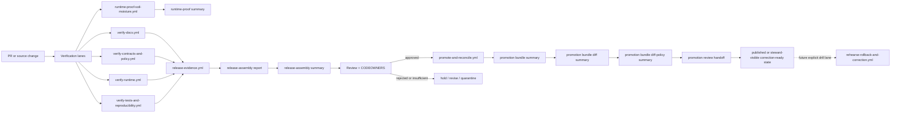

<!-- [KFM_META_BLOCK_V2]
doc_id: kfm://doc/NEEDS-VERIFICATION
title: .github/workflows
type: standard
version: v1
status: draft
owners: @bartytime4life
created: NEEDS-VERIFICATION
updated: 2026-04-15
policy_label: NEEDS-VERIFICATION
related: [
  ../README.md,
  ../CODEOWNERS,
  ../PULL_REQUEST_TEMPLATE.md,
  ../actions/README.md,
  ../watchers/README.md,
  ../dependabot.yml,
  ../SECURITY.md,
  ../../README.md,
  ../../CONTRIBUTING.md,
  ../../contracts/README.md,
  ../../contracts/source/kansas_mesonet_source_descriptor.md,
  ../../contracts/soil_moisture/reading.schema.json,
  ../../schemas/README.md,
  ../../schemas/contracts/README.md,
  ../../schemas/contracts/v1/runtime/runtime_response_envelope.schema.json,
  ../../schemas/soil_moisture/README.md,
  ../../policy/README.md,
  ../../tests/README.md,
  ../../tests/ci/README.md,
  ../../tests/validators/README.md,
  ../../tests/e2e/runtime_proof/soil_moisture/README.md,
  ../../tests/e2e/runtime_proof/soil_moisture/test_runtime_soil_moisture_proof.py,
  ../../tests/e2e/runtime_proof/soil_moisture/test_runtime_route_soil_moisture.py,
  ../../tests/e2e/runtime_proof/test_governed_api_app.py,
  ../../tools/ci/README.md,
  ../../tools/ci/render_runtime_proof_summary.py,
  ../../tools/validators/promotion_gate/README.md,
  ../../tools/validators/release_assembly_report.py,
  ../../tools/ci/render_release_assembly_summary.py,
  ../../apps/governed_api/README.md,
  ../../apps/governed_api/app.py,
  ../../apps/governed_api/routes/soil_moisture.py,
  ../../apps/governed_api/runtime/soil_moisture_runtime.py,
  ../../packages/
]
tags: [kfm, github, workflows, ci-cd, runtime-proof, review-handoff, release-assembly, soil-moisture]
notes: [
  Owner is grounded in current parent-path CODEOWNERS coverage for `/.github/`.
  This revision preserves the stronger old workflows README doctrine while adding the current thin-slice runtime-proof soil-moisture workflow as a concrete workflow lane.
  Public Actions history and adjacent `.github/actions/` tree still provide reconstruction clues but do not prove broader current checked-in YAML inventory beyond the thin slice added in-session.
  doc_id, created date, policy_label, broader workflow inventory, and exact branch-level enforcement posture still need repo confirmation.
]
[/KFM_META_BLOCK_V2] -->

<a id="top"></a>

# `.github/workflows`

Governed GitHub Actions surface for validation, runtime proof, promotion, release evidence, and correction-ready control in Kansas Frontier Matrix.

> [!NOTE]
> **Status:** experimental  
> **Owners:** `@bartytime4life`  
> **Path:** `.github/workflows/README.md`  
>        
> **Quick jump:** [Scope](#scope) · [Repo fit](#repo-fit) · [Inputs](#inputs) · [Exclusions](#exclusions) · [Directory tree](#directory-tree) · [Quickstart](#quickstart) · [Usage](#usage) · [Workflow model](#workflow-model) · [Workflow lanes](#workflow-lanes) · [Task list](#task-list) · [FAQ](#faq) · [Appendix](#appendix)

> [!IMPORTANT]
> Current public snapshot evidence in the older README established this directory as README-first and history-aware. The current thin slice now also has one concrete candidate workflow lane for **runtime-proof soil moisture**, but that does **not** justify overclaiming a broader current YAML inventory.

> [!NOTE]
> Public GitHub Actions surfaces still carry useful reconstruction clues, but they must be read carefully:
>
> - the Actions UI may show workflow surfaces that are not equivalent to checked-in YAML inventory
> - public delete-run history may expose removed lane names such as `verify-docs.yml`, `verify-contracts-and-policy.yml`, `verify-runtime.yml`, `verify-tests-and-reproducibility.yml`, `release-evidence.yml`, and `promote-and-reconcile.yml`
> - the current thin slice also introduces a concrete workflow candidate: `runtime-proof-soil-moisture.yml`
>
> Treat all of that as **current thin-slice signal plus historical or platform signal**, not as proof that every named YAML file is checked in on current `main`.

---

## Scope

`.github/workflows/` is the repo-local control surface where KFM expresses CI, delivery, promotion, runtime proof, reconciliation, correction, and post-release verification as reviewable automation.

In KFM, workflow files are not a detached DevOps appendix. They are part of the trust membrane: the place where documentation checks, contract checks, policy checks, runtime checks, release-evidence checks, and post-deploy verification become executable rather than aspirational.

This directory exists to answer two narrow but consequential questions:

1. **What automation is allowed to change trust state, and what must be proven before that happens?**
2. **Which reviewer-facing artifacts are published into workflow summaries so stewards can inspect trust-significant drift without leaving the governed review path?**

That second question now explicitly includes:

- **runtime-proof summary publication** for the soil-moisture thin slice
- **release-assembly reporting**
- promotion bundle, diff, diff-policy, and review-handoff publication

### Status markers used in this README

| Marker | Meaning here |
| --- | --- |
| **CONFIRMED** | Grounded in current public Markdown, current in-session thin-slice files, or supplied KFM doctrine inspected for this revision |
| **INFERRED** | Conservative interpretation connecting direct evidence to adjacent project doctrine |
| **PROPOSED** | Repo-native pattern that fits KFM doctrine but is not yet proven as current checked-in workflow behavior |
| **UNKNOWN** | Not verified strongly enough to present as current branch, settings, or mounted implementation reality |
| **NEEDS VERIFICATION** | Placeholder detail that should be checked against git history, GitHub settings, or a mounted checkout before merge |

[Back to top](#top)

---

## Repo fit

Path: `.github/workflows/README.md`

Role in repo: directory README for GitHub Actions workflows, workflow inventory, gate expectations, historical reconstruction clues, current thin-slice runtime-proof workflow, and future workflow growth.

### Upstream and adjacent anchors

| Relation | Path | Why it matters |
| --- | --- | --- |
| Parent governance surface | [`../README.md`](../README.md) | Explains `.github/` as the repository-side gatehouse for review, verification, and governed delivery |
| Review ownership | [`../CODEOWNERS`](../CODEOWNERS) | Makes review boundaries executable |
| PR evidence template | [`../PULL_REQUEST_TEMPLATE.md`](../PULL_REQUEST_TEMPLATE.md) | Keeps workflow changes aligned with proof links, truth labels, validation links, and rollback expectations |
| GitHub security surface | [`../SECURITY.md`](../SECURITY.md) | Keeps workflow and repo security guidance close to the same governance boundary |
| Reusable repo-local actions | [`../actions/README.md`](../actions/README.md) | Composite or reusable action logic belongs there, not in this directory |
| Adjacent automation scaffolds | [`../watchers/README.md`](../watchers/README.md) | Watcher documentation may point toward future orchestration seams, but does not by itself prove current workflow inventory |
| Dependency update automation | [`../dependabot.yml`](../dependabot.yml) | Dependency update policy already lives under `.github/`, but it is configuration rather than workflow orchestration |
| Root operating index | [`../../README.md`](../../README.md) | Defines monorepo posture, evidence model, and top-level directory contract |
| Contribution contract | [`../../CONTRIBUTING.md`](../../CONTRIBUTING.md) | Contributor obligations should stay aligned with workflow gates |
| Canonical verification surfaces | [`../../contracts/README.md`](../../contracts/README.md), [`../../schemas/README.md`](../../schemas/README.md), [`../../policy/README.md`](../../policy/README.md), [`../../tests/README.md`](../../tests/README.md) | Workflows may verify these surfaces, but they do not replace them |
| CI renderer and helper-proof surfaces | [`../../tools/ci/README.md`](../../tools/ci/README.md), [`../../tests/ci/README.md`](../../tests/ci/README.md) | Reviewer-facing diff, diff-policy, runtime-proof, release-assembly, and review-handoff artifacts are rendered there and published here |
| Soil-moisture runtime proof chain | [`../../tests/e2e/runtime_proof/soil_moisture/README.md`](../../tests/e2e/runtime_proof/soil_moisture/README.md), [`../../tools/ci/render_runtime_proof_summary.py`](../../tools/ci/render_runtime_proof_summary.py), [`../../apps/governed_api/README.md`](../../apps/governed_api/README.md) | The new thin-slice workflow is built around this exact runtime-proof chain |
| Release-assembly validator path | [`../../tools/validators/release_assembly_report.py`](../../tools/validators/release_assembly_report.py), [`../../tools/ci/render_release_assembly_summary.py`](../../tools/ci/render_release_assembly_summary.py) | Release completeness now has a machine-readable report and reviewer-readable summary path that workflows may publish |
| Validator promotion chain | [`../../tools/validators/promotion_gate/README.md`](../../tools/validators/promotion_gate/README.md), [`../../tests/validators/README.md`](../../tests/validators/README.md) | Promotion review flows include bundle diff, diff-policy, and review-handoff outputs that workflow summaries may publish |
| Runtime and package surfaces | [`../../apps/governed_api/README.md`](../../apps/governed_api/README.md), [`../../packages/`](../../packages/) | App and package changes often need the same governed checks without moving canonical ownership into workflow YAML |

### Current public inventory and thin-slice signal

| Item | Current visible or drafted state | Posture |
| --- | --- | --- |
| `./README.md` | Present in the older surfaced file | **CONFIRMED** |
| `runtime-proof-soil-moisture.yml` | Drafted in-session as a concrete thin-slice workflow | **CONFIRMED in-session thin slice** / **NEEDS VERIFICATION** on active branch |
| Broader `./*.yml` / `./*.yaml` workflow files | Not proven from current mounted checkout in this session | **UNKNOWN** beyond thin slice |
| Actions sidebar workflow list | Public Actions UI surfaces may still expose workflow-like entries | **CONFIRMED** UI signal / **UNKNOWN** checked-in YAML provenance |
| Public delete-run history | Public Actions history may still expose filenames like `verify-docs.yml`, `verify-contracts-and-policy.yml`, `verify-runtime.yml`, `verify-tests-and-reproducibility.yml`, `release-evidence.yml`, and `promote-and-reconcile.yml` | **CONFIRMED** historical signal / **NEEDS VERIFICATION** if reconstructing exact file contents |
| Delete-run `View workflow file` links | Some public entries may expose per-run workflow-file snapshots | **CONFIRMED** reconstruction clue / **NEEDS VERIFICATION** before reuse |
| `.github/actions/` local action inventory | Older surfaced README shows reusable local-action seams under `../actions/` | **CONFIRMED** adjacent implementation seam |
| `../CODEOWNERS` workflow ownership | Current parent-path coverage assigns `/.github/` to `@bartytime4life`; `/.github/workflows/` was not called out separately in the old README | **CONFIRMED** parent coverage / **INFERRED** workflow-path coverage |
| Exact required checks / rulesets / environment approvals | Not derivable from public directory contents alone | **UNKNOWN** |

> [!NOTE]
> A workflow run history is not the same thing as a current checked-in workflow inventory.
>
> Use the directory listing for **what exists on `main` now**. Use the Actions tab and git history for **what may need reconstruction, migration, or cleanup**. Use the current thin-slice draft only for the workflow actually added in-session.

[Back to top](#top)

---

## Inputs

Accepted inputs for this directory include:

- GitHub Actions workflow files that validate, gate, attest, promote, reconcile, correct, or verify repo changes
- workflow-local notes that explain current inventory, historically visible lanes, intended gate families, or migration from placeholder to active automation
- minimal examples that help reviewers understand what a proposed workflow is supposed to prove
- publish-step examples for reviewer-facing outputs such as:
  - runtime-proof summaries
  - release-assembly summaries
  - diff summaries
  - diff-policy summaries
  - composed promotion review handoff documents
- only the smallest amount of workflow-facing documentation needed to keep automation reviewable

### Thin-slice runtime-proof workflow inputs

For `runtime-proof-soil-moisture.yml`, the strongest current input family is:

- governed API runtime code under `apps/governed_api/**`
- soil-moisture contracts and source-descriptor surfaces
- runtime envelope schema
- soil-moisture validator surfaces
- runtime-proof tests and fixtures
- runtime-proof summary renderer

---

## Exclusions

The following do **not** belong here as the canonical source of truth:

- Composite action implementations  
  → place under [`../actions/`](../actions/)
- Long-lived watcher behavior or watcher-specific operational doctrine  
  → place under [`../watchers/`](../watchers/)
- Dependabot configuration policy as workflow orchestration  
  → keep in [`../dependabot.yml`](../dependabot.yml) unless a separate workflow truly needs to coordinate around it
- Policy rule bodies, rule fixtures, or policy decision logic  
  → place under [`../../policy/`](../../policy/)
- Schema definitions, OpenAPI documents, catalog profiles, or vocabularies  
  → place under [`../../contracts/`](../../contracts/) and [`../../schemas/`](../../schemas/)
- Release manifests, receipts, SBOMs, attestations, or evidence bundles as ad hoc storage  
  → keep them in the project’s designated release-evidence, proof, or artifact surfaces
- Runtime service code, ingestion logic, UI code, or evidence resolvers  
  → keep them in code surfaces such as [`../../apps/`](../../apps/) and [`../../packages/`](../../packages/)
- Long-form operational runbooks that outgrow directory-local explanation  
  → place under [`../../docs/`](../../docs/)
- Treating `GITHUB_STEP_SUMMARY` output as the authoritative trust object  
  → keep machine-authoritative objects in their governed report, bundle, diff, diff-policy, manifest, and proof surfaces

---

## Directory tree

### Current safe claim

```text
.github/
└── workflows/
    └── README.md
```

### Current thin-slice candidate inventory

```text
.github/
└── workflows/
    ├── README.md
    └── runtime-proof-soil-moisture.yml   # drafted in-session; active-branch presence still NEEDS VERIFICATION
```

### Historically observed public workflow names

The names below come from public GitHub Actions history, not from a branch-mounted checkout in this session.

```text
verify-contracts-and-policy.yml
verify-docs.yml
verify-runtime.yml
verify-tests-and-reproducibility.yml
release-evidence.yml
promote-and-reconcile.yml
```

### Adjacent documented scaffold signal

The path below is **not** part of the current confirmed inventory here. It appears only as an adjacent documentation reference in `.github/watchers/README.md` and therefore remains a reconciliation clue rather than a checked-in fact for this directory.

```text
watchers-kansas-env.yml
```

### Starter reconstitution shape

The shape below is **PROPOSED** as the smallest history-aware reconstitution contract for this directory. It preserves the current thin-slice runtime-proof workflow, the historically visible lane names, and one explicit correction drill lane that is doctrinally warranted even though it was not visible in the historical filename set.

```text
.github/workflows/
├── README.md
├── runtime-proof-soil-moisture.yml
├── verify-docs.yml
├── verify-contracts-and-policy.yml
├── verify-runtime.yml
├── verify-tests-and-reproducibility.yml
├── release-evidence.yml
├── promote-and-reconcile.yml
└── rehearse-rollback-and-correction.yml
```

Design rule: grow this directory only when a workflow has a clear doctrinal basis, explicit blocking conditions, and a documented rollback or correction consequence.

[Back to top](#top)

---

## Quickstart

Use the smallest possible inspection loop before changing anything here.

```bash
# 1) Inspect the directory itself
ls -la .github/workflows

# 2) Read the parent governance surface
sed -n '1,260p' .github/README.md

# 3) Confirm review ownership and path coverage
sed -n '1,240p' .github/CODEOWNERS
grep -n "/.github" .github/CODEOWNERS || true

# 4) Read the PR evidence template that governs review language
sed -n '1,260p' .github/PULL_REQUEST_TEMPLATE.md

# 5) Inventory actual workflow files, if any exist
find .github/workflows -maxdepth 1 -type f \( -name '*.yml' -o -name '*.yaml' \) | sort

# 6) Inspect current repo-local actions before inventing new workflow step glue
find .github/actions -maxdepth 1 -mindepth 1 -type d | sort
find .github/actions -maxdepth 2 -name 'action.yml' | sort

# 7) Check adjacent watcher docs for scaffold references that may need reconciliation
sed -n '1,260p' .github/watchers/README.md 2>/dev/null || true

# 8) Cross-check repo surfaces workflows are expected to verify
ls -la contracts schemas policy tests docs apps packages tools 2>/dev/null || true

# 9) Search workflow-local docs for runtime-, policy-, evidence-, or review-handoff-facing terms
grep -R "runtime\|policy\|catalog\|schema\|docs\|release\|evidence\|attest\|sbom\|review-handoff\|release-assembly\|GITHUB_STEP_SUMMARY" .github/workflows 2>/dev/null || true

# 10) If the lane is being reconstructed, inspect git history instead of guessing
git log --name-status -- .github/workflows
```

> [!TIP]
> If public Actions history shows a delete-run for a lane you need to restore, use the run’s **View workflow file** snapshot as a last-known clue, then verify it against git history and current canonical repo surfaces before reintroducing anything.

### Minimal review order

1. Read this file, then read [`../README.md`](../README.md), [`../PULL_REQUEST_TEMPLATE.md`](../PULL_REQUEST_TEMPLATE.md), and [`../../README.md`](../../README.md).
2. Confirm the real workflow inventory before documenting or tightening gates.
3. If a workflow lane is being reintroduced, inspect public delete-run clues and git history before choosing filenames or responsibilities.
4. Verify ownership and merge-blocking assumptions against [`../CODEOWNERS`](../CODEOWNERS) and repo settings.
5. Check whether repo-local actions under [`../actions/`](../actions/) already cover reusable workflow behavior.
6. Treat watcher-local scaffold references as clues to reconcile, not as proof of current YAML presence.
7. Change the smallest possible workflow surface.
8. Re-check rollback, correction, contributor ergonomics, and reviewer-output publication after adding or tightening gates.

---

## Usage

### Reconstituting a workflow lane from history

When a workflow lane returns after being absent from current `main`, start from public history and real git history rather than inventing a new family name blindly.

Preferred posture:

1. Confirm the prior filename and its last known role.
2. Decide whether the historic responsibility still matches the current repo.
3. Keep the first reintroduced version PR-only, shadow, draft, or dry-run where possible.
4. Declare explicit permissions.
5. Update README, templates, and adjacent docs in the same PR.

### Using public Actions history safely

Keep the signals separated:

- sidebar workflow labels are **UI surfaces**, not checked-in inventory assertions for this directory
- delete-run entries are stronger reconstruction clues because they reference actual workflow filenames
- **View workflow file** snapshots are useful last-known YAML evidence, but they still need git-history and current-surface comparison before reuse
- the first restored lane should still be the smallest reviewable version, not a maximal rewrite

### Thin-slice runtime-proof workflow

The current thin-slice runtime-proof workflow is designed to:

1. install Python test dependencies
2. run:
   - soil-moisture rule tests
   - validator orchestration tests
   - fixture-driven runtime-proof tests
   - runtime route tests
   - governed app tests
   - CI summary-renderer tests
3. render a Markdown runtime-proof summary
4. upload that summary as a workflow artifact
5. fail closed if tests fail or the summary is missing

That workflow should remain a **runtime-proof gate**, not a release-evidence or promotion lane.

### Editing blocking workflow gates

Treat every blocking change here as a governance change, not just a YAML edit.

Preserve these expectations:

- fail-closed behavior on blocking checks
- no silent bypass around policy, evidence, or release state
- build once, promote many
- review remains accountable
- rollback and correction stay possible
- documentation and accessibility changes travel with behavior-significant workflow changes
- reviewer-facing summaries remain derived convenience surfaces rather than authoritative trust objects

### Workflow orchestration versus reusable automation

Keep the boundary sharp:

- **This directory** should describe workflow orchestration, event triggers, job ordering, and blocking gates.
- **`../actions/`** should hold reusable composite behavior.
- **`../../policy/`**, **`../../contracts/`**, **`../../schemas/`**, and **`../../tests/`** remain the canonical surfaces being checked.

A workflow may *enforce* those surfaces. It should not become a shadow copy of them.

### Distinguishing Actions UI surfaces from checked-in YAML

The public Actions UI may show workflow surfaces such as sidebar entries, historical deleted lanes, or recently removed workflow names. That is useful operational signal, but it should not overwrite the checked-in tree as the source of truth for current inventory.

Current examples to keep separated:

- current thin-slice draft: `runtime-proof-soil-moisture.yml`
- historical signals: `verify-docs.yml`, `verify-contracts-and-policy.yml`, `verify-runtime.yml`, `verify-tests-and-reproducibility.yml`, `release-evidence.yml`, `promote-and-reconcile.yml`

Reading rule:

- **Directory listing first** for current `main`
- **Git history second** for reconstruction
- **Actions UI third** for activity clues and cleanup signal

### Reusing repo-local actions before creating new workflow glue

The public `.github/actions/` tree already exposes reusable local seams such as:

- `metadata-validate-v2`
- `metadata-validate`
- `opa-gate`
- `provenance-guard`
- `sbom-produce-and-sign`

Prefer consuming those seams before embedding repeated shell logic directly in future workflow YAML.

### Publishing reviewer surfaces safely

When a workflow publishes reviewer-facing content to `GITHUB_STEP_SUMMARY`, keep the publication order explicit and the authority split visible.

Good current publication order guidance:

1. runtime-proof summary
2. release-assembly summary
3. promotion bundle summary
4. promotion bundle diff summary
5. promotion bundle diff-policy summary
6. promotion review handoff

That ordering helps a reviewer see:

- whether runtime behavior is bounded and finite
- whether release assembly is complete enough to review
- the governed bundle itself
- prior/current drift
- the policy classification of that drift
- the composed steward-facing conclusion

without confusing the final composed handoff document for the underlying machine-authoritative records.

### Illustrative runtime-proof publication path

The current thin slice now supports a report + render chain for runtime proof:

- fixture-driven runtime-proof tests
- `tools/ci/render_runtime_proof_summary.py`

A workflow lane may therefore:

1. run the runtime-proof tests
2. render a reviewer-readable Markdown summary
3. upload that summary as an artifact
4. optionally later publish it to `GITHUB_STEP_SUMMARY`

That keeps runtime proof visible **before** broader release or promotion evidence is discussed.

[Back to top](#top)

---

## Workflow model

The diagram below combines current thin-slice work, current public historical signal, and KFM doctrine. It shows the **kind** of orchestration this directory is meant to carry, not a claim that every YAML file is checked in on current `main`.


```mermaid
flowchart LR
    A[PR or source change] --> B[Verification lanes]
    B --> B0[runtime-proof-soil-moisture.yml]
    B --> B1[verify-docs.yml]
    B --> B2[verify-contracts-and-policy.yml]
    B --> B3[verify-runtime.yml]
    B --> B4[verify-tests-and-reproducibility.yml]

    B0 --> B0A[runtime-proof summary]
    B1 --> C[release-evidence.yml]
    B2 --> C
    B3 --> C
    B4 --> C

    C --> C1[release-assembly report]
    C1 --> C2[release-assembly summary]
    C2 --> D[Review + CODEOWNERS]
    D -->|approved| E[promote-and-reconcile.yml]
    E --> F[promotion bundle summary]
    F --> G[promotion bundle diff summary]
    G --> H[promotion bundle diff-policy summary]
    H --> I[promotion review handoff]
    I --> J[published or steward-visible correction-ready state]

    D -->|rejected or insufficient| K[hold / revise / quarantine]
    J -. future explicit drill lane .-> L[rehearse-rollback-and-correction.yml]
```

Reading rule: **promotion is a trust-state change, not a blind deploy step**.

---

## Workflow lanes

| Lane | Working interpretation here | Blockers to expect | Evidence posture |
| --- | --- | --- | --- |
| `runtime-proof-soil-moisture.yml` | thin-slice governed runtime gate for the soil-moisture stack | failed runtime-proof tests, failed route/app tests, failed runtime summary render | **CONFIRMED in-session thin slice** / **NEEDS VERIFICATION** on active branch |
| `verify-docs.yml` | Docs, links, examples, and trust-visible guidance stay aligned | broken links, stale examples, trust-cue drift | **CONFIRMED** historical filename / **INFERRED** responsibility |
| `verify-contracts-and-policy.yml` | Contract, schema, and policy surfaces remain machine-checkable | invalid fixtures passing, schema drift, policy denial | **CONFIRMED** historical filename / **INFERRED** responsibility |
| `verify-runtime.yml` | Runtime-facing trust behavior remains bounded and explainable | negative-path regressions, uncited answer path, envelope drift, hidden correction state | **CONFIRMED** historical filename / **INFERRED** responsibility |
| `verify-tests-and-reproducibility.yml` | Candidate changes remain testable and repeatable | failed tests, reproducibility drift, missing proof of deterministic behavior | **CONFIRMED** historical filename / **INFERRED** responsibility |
| `release-evidence.yml` | Candidate proof objects are assembled before promotion | missing manifests, missing validation summaries, absent attestation refs, failed release-assembly report | **CONFIRMED** historical filename / **INFERRED** responsibility |
| `promote-and-reconcile.yml` | Already-reviewed state moves into publishable scope and any required reconciliation runs | missing approvals, missing release evidence, unresolved policy blockers | **CONFIRMED** historical filename / **INFERRED** responsibility |
| `watchers-kansas-env.yml` | Environment or watcher-oriented automation suggested by adjacent watcher docs | stale scaffold refs, undocumented orchestration, confusion with current inventory | **CONFIRMED** adjacent scaffold reference / **INFERRED** role / **NEEDS VERIFICATION** current or historical file status |
| `rehearse-rollback-and-correction.yml` | Recovery and visible correction behavior become explicit and testable | failed rollback lineage, silent overwrite, missing correction drills | **PROPOSED** doctrinal addition |

### Naming guidance

Prefer names that expose purpose, not implementation trivia.

Good current cues:

- current thin-slice names such as `runtime-proof-soil-moisture.yml`
- historically visible names such as `verify-docs.yml`, `verify-runtime.yml`, and `release-evidence.yml`
- explicit future drill names such as `rehearse-rollback-and-correction.yml`

Avoid names that hide responsibility behind generic words like `main.yml`, `pipeline.yml`, or `automation.yml`.

---

## Task list

Definition of done for changes in `.github/workflows/`:

- [ ] The actual current workflow inventory is listed exactly.
- [ ] Historical workflow signal is kept separate from current checked-in inventory.
- [ ] Sidebar workflow labels and platform-visible Actions UI entries are not silently rewritten as checked-in YAML facts.
- [ ] Every blocking workflow states what it proves.
- [ ] Permissions are explicit and minimal.
- [ ] Required checks and review boundaries are verified against active repo settings where relevant.
- [ ] Repo-local actions are inspected before repeated step logic is added directly into YAML.
- [ ] If public delete-run clues are used, the resulting YAML is compared against git history and current canonical repo surfaces before merge.
- [ ] Adjacent watcher scaffold references are reconciled instead of being copied forward as assumed facts.
- [ ] Docs, examples, and templates change in the same governed stream as workflow behavior.
- [ ] A reintroduced lane is marked as a historical reconstitution or a net-new lane.
- [ ] New automation begins in draft, shadow, dry-run, or PR-only mode unless a narrower approval lane is explicitly documented.
- [ ] Promotion paths consume already-approved artifacts or reviewed desired state rather than rebuilding silently later.
- [ ] Candidate and release proof-pack expectations are explicit where the lane is trust-significant.
- [ ] Runtime-proof summary publication is explicit where the soil-moisture thin slice is active.
- [ ] Release-assembly summary publication happens before downstream bundle/diff/review-handoff publication when that lane is active.
- [ ] Runtime verification, rollback, or correction consequences are documented for any workflow that can change trust state.
- [ ] Reviewer-summary publication order is explicit when runtime-proof, release-assembly, bundle, diff, diff-policy, and review-handoff artifacts are all published.
- [ ] Unknowns remain visible instead of being rewritten as certainty.

[Back to top](#top)

---

## FAQ

### Why does this directory need a README before every workflow YAML exists on current `main`?

Because KFM treats release, runtime, review, verification, and correction as one governed system. A README-first contract prevents the first restored or newly added workflow from becoming an undocumented authority surface.

### Why mention deleted or historical workflow names if the directory may still be README-first today?

Because public Actions history is a real repo signal. It helps maintainers reconstruct prior lanes responsibly. It does **not** override the current directory listing as the source of truth for what is checked in now.

### Does this README claim those historical workflow files still exist?

No. It explicitly distinguishes **current checked-in inventory**, **current thin-slice drafted workflow**, and **historical public signal**.

### Why call out `runtime-proof-soil-moisture.yml` specifically?

Because the current thin slice now has a complete soil-moisture governed runtime stack plus a concrete workflow draft to test it. That makes it different from purely historical lane names.

### Can workflow automation self-approve policy-significant or public-truth changes?

This README assumes **no**. Workflows may prepare evidence, run gates, and block promotion, but accountable review boundaries still matter.

### Should policy rules, schemas, or attestations live here?

No. Workflows may verify them, but canonical ownership remains outside this directory.

### Can `GITHUB_STEP_SUMMARY` output become the authoritative review object?

No. It is a reviewer convenience surface. The authoritative machine objects remain in the governed decision, report, bundle, diff, diff-policy, manifest, and proof lanes.

### What becomes CONFIRMED here?

Only what the supplied README, current thin-slice files, public repo signals, or current public GitHub UI visibly prove. Everything else stays **INFERRED**, **PROPOSED**, **UNKNOWN**, or **NEEDS VERIFICATION**.

---

## Appendix

<details>
<summary><strong>Current public adjacent action directories (CONFIRMED as adjacent seam)</strong></summary>

```text
.github/actions/
├── metadata-validate-v2/
├── metadata-validate/
├── opa-gate/
├── provenance-guard/
├── sbom-produce-and-sign/
├── src/
├── README.md
└── action.yml
```

Use this inventory as a step-level reuse clue. It does **not** by itself prove which historical workflow lane called which action, or whether every action is complete enough for reuse without inspection.

</details>

<details>
<summary><strong>Current workflow signal buckets</strong></summary>

### Current thin-slice workflow signal

- `runtime-proof-soil-moisture.yml`

### Historical public workflow signal

- `verify-docs.yml`
- `verify-contracts-and-policy.yml`
- `verify-runtime.yml`
- `verify-tests-and-reproducibility.yml`
- `release-evidence.yml`
- `promote-and-reconcile.yml`

### Adjacent scaffold clue

- `watchers-kansas-env.yml`

Safe use rule: treat these as **three different signal classes** and compare them against git history and current canonical repo surfaces before restoring or tightening anything.

</details>

<details>
<summary><strong>Illustrative starter workflow skeleton (PROPOSED)</strong></summary>

This example is intentionally minimal and non-authoritative. It shows shape, not repo-verified behavior.

```yaml
name: verify-contracts-and-policy

on:
  pull_request:
    paths:
      - ".github/workflows/**"
      - ".github/CODEOWNERS"
      - "contracts/**"
      - "schemas/**"
      - "policy/**"
      - "tests/**"

jobs:
  verify:
    runs-on: ubuntu-latest
    permissions:
      contents: read
    steps:
      - uses: actions/checkout@v4

      - name: Explain placeholder
        run: |
          echo "Replace this job with repo-verified schema, policy, and fixture checks."
          echo "Keep the first live workflow small, reviewable, and fail-closed."
```

</details>

<details>
<summary><strong>Illustrative runtime-proof publication path (PROPOSED)</strong></summary>

```yaml
- name: Run runtime-proof tests
  run: |
    pytest -q \
      tests/validators/test_soil_moisture_rules.py \
      tests/validators/test_soil_moisture_validator.py \
      tests/e2e/runtime_proof/soil_moisture/test_runtime_soil_moisture_proof.py \
      tests/e2e/runtime_proof/soil_moisture/test_runtime_route_soil_moisture.py \
      tests/e2e/runtime_proof/test_governed_api_app.py \
      tests/ci/test_render_runtime_proof_summary.py

- name: Render runtime proof summary
  run: |
    python tools/ci/render_runtime_proof_summary.py \
      --fixtures tests/e2e/runtime_proof/soil_moisture/fixtures \
      --output artifacts/runtime-proof-summary-soil-moisture.md \
      --title "Runtime Proof Summary — Soil Moisture"

- name: Publish runtime proof summary
  run: |
    cat artifacts/runtime-proof-summary-soil-moisture.md >> "$GITHUB_STEP_SUMMARY"
```

Use this as ordering guidance, not as proof that current `main` already contains the workflow file.

</details>

<details>
<summary><strong>Review questions before restoring or adding a blocking workflow</strong></summary>

1. What exact trust-state transition does this workflow control?
2. Is this a restored historical lane, a current thin-slice lane, or a net-new lane?
3. What evidence does it emit?
4. What explicitly blocks merge or promotion?
5. What correction path exists if the workflow proves too weak or too strong?
6. Which canonical surfaces does it verify rather than duplicate?
7. Can a future maintainer explain this workflow from its filename and README entry alone?
8. If it publishes reviewer-facing artifacts, in what order are they shown and why?

</details>

<details>
<summary><strong>Future expansion rule</strong></summary>

Do not add a workflow file here merely because GitHub Actions can do it. Add it only when:

- the repo has a stable surface worth verifying,
- the gate has a clear doctrinal basis,
- the failure mode is understandable,
- the rollback or correction consequence is known, and
- the new automation reduces ambiguity instead of creating another invisible control plane.

</details>

[Back to top](#top)
