<div align="center">

# 🔄 **Kansas Frontier Matrix — CI/CD Workflows Master Architecture (v11.2.3 LTS)**  
`.github/workflows/README.md`

[](../../docs/standards/kfm_markdown_protocol_v11.2.5.md)
[](../../docs/standards/faircare/FAIRCARE-GUIDE.md)
[]()
[]()
[]()
[](../../LICENSE)

**Purpose**  
Describe the **canonical CI/CD architecture** for all workflows in `.github/workflows/` that implement  
validation, FAIR+CARE governance, supply-chain integrity, security, telemetry, data lineage, and automated deployment  
for the Kansas Frontier Matrix (KFM) v11.2.3 monorepo.

</div>

---

## 📘 Overview

This document is the **master CI/CD architecture spec** for KFM:

- Treats GitHub Actions as a **governed policy engine**, not just build scripts.  
- Defines how workflows together realize a **prov:Plan** for safe evolution of code, data, models, and narratives.  
- Connects CI/CD behavior to **FAIR+CARE**, **sovereignty**, **ontology**, and **supply-chain** standards.  
- Ensures every change is **reproducible, observable, auditable**, and **ethically constrained**.

Workflows in this directory:

- **Validate** code, docs, schemas, and geospatial/temporal metadata.  
- **Enforce** FAIR+CARE and sovereignty rules.  
- **Protect** supply-chain and secrets.  
- **Govern** AI models, Story Nodes, and Focus Mode narratives.  
- **Emit** OpenTelemetry + OpenLineage telemetry into KFM’s governance data lake.  

---

## 🗂️ Directory Layout

```text
.github/
└── 🤖 workflows/                             # All governed CI/CD workflows (this directory)
    ├── 🧪 ci.yml                             # Core CI: lint, tests, type-checks, base schema checks
    ├── 📚 docs_validate.yml                  # KFM-MDP v11.2.5 markdown + front-matter validation
    ├── 🛰️ stac_validate.yml                  # STAC 1.x Item/Collection validation (data/stac/**)
    ├── 🗂️ dcat_validate.yml                  # DCAT 3.0 dataset/distribution validation
    ├── 🧬 jsonld_validate.yml                # JSON-LD + ontology checks (CIDOC/OWL-Time/GeoSPARQL/PROV-O)
    ├── ⚖️ faircare_validate.yml              # FAIR+CARE & ethics checks
    ├── 🧊 h3_generalization.yml              # H3 generalization enforcement for sensitive coordinates
    ├── 🔐 security_audit.yml                 # Dependency CVEs, secret scanning, workflow hardening
    ├── 📦 sbom_verify.yml                    # SBOM + manifest + SLSA attestation verification
    ├── 🔁 data_pipeline.yml                  # ETL contract & lineage validation (KFM-PDC v11)
    ├── 🤖 ai_behavior_check.yml              # AI behavior, drift, bias, forbidden narratives
    ├── 🎯 focusmode_mlops.yml                # Focus Mode v3 MLOps (fusion, narrative safety, explainability)
    ├── 📊 telemetry_export.yml               # Telemetry aggregation → github-infra-telemetry.json
    ├── 🚀 release.yml                        # Signed release packaging, manifest, SBOM
    ├── 🔄 kfm-auto-update.yml                # Scheduled auto-update & promotion orchestration
    ├── 🏷️ labeler.yml                        # Auto-label PRs by component/domain
    └── 🌐 site.yml                           # Web + docs build & deployment pipelines
```

Any new workflow added to this directory MUST be:

- Documented in this README.  
- Wired into schemas under `schemas/telemetry/` when it affects telemetry.  
- Aligned with FAIR+CARE and sovereignty policy documents.

---

## 🧱 Architecture

At a high level, `.github/workflows/` implements a **multi-stage gate**:

```mermaid
flowchart TB
    A["🔔 Triggers\npush · PR · schedule · manual"] --> B["🧪 Core CI\nci.yml"]
    B --> C["📚 Docs & Metadata\n docs_validate · stac_validate · dcat_validate · jsonld_validate"]
    C --> D["⚖ Governance\n faircare_validate · h3_generalization"]
    D --> E["🔐 Security & Supply Chain\n security_audit · sbom_verify"]
    E --> F["📦 Build & Release\n site · release"]
    F --> G["🔄 Auto-Update & Promotion\n kfm-auto-update"]
    G --> H["📊 Telemetry & Lineage\n telemetry_export + OpenLineage"]
```



**Design principles:**

- **Single-pass correctness**: each stage either passes or fails; no “best-effort” modes for governed checks.  
- **Path-aware execution**: workflows trigger only when relevant files change, but never skip required checks for those paths.  
- **Provenance-first**: every critical step emits lineage and telemetry, forming an audit graph.  

---

## 🧪 Validation & CI/CD

### Core CI (`ci.yml`)

- Runs for most PRs and pushes.  
- Responsibilities:
  - Linting (TS/JS/CSS/Python).  
  - Unit + integration tests.  
  - Minimal schema checks (e.g., core configs).  
- Provides a **fast feedback loop** before deeper governance workflows.

---

### Documentation, Metadata & Ontology

**`docs_validate.yml`**

- Enforces **KFM-MDP v11.2.5**, including:  
  - YAML front-matter presence & key fields.  
  - Heading hierarchy & emoji usage at H2.  
  - Directory layout + version history sections for governed docs.  

**`stac_validate.yml` / `dcat_validate.yml` / `jsonld_validate.yml`**

- **STAC**:
  - Collections & Items under `data/stac/**`.  
  - Bounding boxes, datetimes, CRS, licenses, asset metadata.  

- **DCAT**:
  - Dataset JSON-LD (KFM-DCAT v11).  
  - Distributions & references.  

- **JSON-LD / Ontology**:
  - CIDOC-CRM classes/properties.  
  - OWL-Time instants/intervals.  
  - GeoSPARQL geometry & relationships.  
  - PROV-O lineage relationships.

Any failure **blocks merges and releases**.

---

### FAIR+CARE, Sovereignty & H3

**`faircare_validate.yml`**

- Validates:
  - CARE labels & FAIR categories.  
  - Sovereignty flags and policy references.  
  - Presence of required governance metadata for high-sensitivity domains.  

**`h3_generalization.yml`**

- Checks for:
  - High-precision coordinates in sensitive datasets.  
  - Proper H3 generalization and/or masking for archaeology and tribal sites.  
  - Metadata fields indicating generalization applied.  

Failed FAIR+CARE or H3 checks → PR must be corrected or escalated via `governance_issue` template.

---

### Security & Supply-Chain

**`security_audit.yml`**

- Runs:
  - Secret scanners on code and configs.  
  - Vulnerability scanners against dependencies.  
  - Optional container scans.  

- Policy:
  - Critical CVEs → block until resolved.  
  - High CVEs → require explicit governance sign-off.

**`sbom_verify.yml`**

- Ensures:
  - SBOM (SPDX) exists and is valid.  
  - SBOM matches `manifest.zip`.  
  - SLSA-like attestations and signatures are present.  

Results feed into security sections of the telemetry and governance ledgers.

---

### Data Pipelines & Lineage (`data_pipeline.yml`)

- Ensures:
  - Pipeline configurations follow KFM-PDC v11 data contracts.  
  - Lineage events are consistently emitted.  
  - Changes to ETL don’t silently break downstream contracts.  

This workflow helps keep ETL-derived products reproducible and well documented.

---

### AI & Focus Mode Governance

**`ai_behavior_check.yml`**

- Checks:
  - Forbid patterns in AI outputs (e.g., speculative history, ungrounded claims).  
  - Grounding and citation quality.  
  - Bias and drift metrics where configured.  

**`focusmode_mlops.yml`**

- Ensures:
  - Story Node and Focus Mode v3 models are properly configured and versioned.  
  - Model cards in `mcp/model_cards/**` are present & updated.  
  - Explainability artifacts exist for critical models (where required).

No AI or Focus Mode change may skip these governance layers.

---

### Telemetry & Reporting (`telemetry_export.yml`)

- Aggregates metrics into `github-infra-telemetry.json` using `github-workflows-v4.json` schema.  
- Metrics include:
  - Pass/fail rates and durations per workflow.  
  - Governance & FAIR+CARE violation counts.  
  - Energy & carbon estimations.  
  - Security and supply-chain events (CVE/secret/attestation outcomes).  

Telemetry is a first-class artifact, not an afterthought.

---

### Site & Release Workflows (`site.yml`, `release.yml`)

- **`site.yml`**:
  - Builds & deploys:
    - Web client (MapLibre/Cesium).  
    - Docs site.  

- **`release.yml`**:
  - Packages and signs releases.  
  - Attaches SBOM, manifest, telemetry, and attestation files.  
  - Emits final OpenLineage events that mark release completion.

---

### 🔄 Auto-Update & Promotion (`kfm-auto-update.yml`)

- **Purpose**:
  - Orchestrate **scheduled auto-updates** for data layers, models, or indexes (e.g., nightly or weekly refresh).  
  - Coordinate safe promotion from freshly refreshed states → staging → production.

- **Behavior**:
  - Triggers on schedules (cron) or manual dispatch.  
  - Runs subsets of:
    - Data pipeline checks (ETL validation & lineage).  
    - Metadata/ontology validation (STAC/DCAT/JSON-LD).  
    - FAIR+CARE and H3 checks for affected assets.  
    - Security & SBOM checks when release-like flows are involved.  

- **Gating**:
  - Promotion to production only when:
    - All relevant workflows (ci/docs/stac/dcat/jsonld/faircare/h3/security/sbom) pass.  
    - Governance-approved thresholds for drift, bias, or risk are satisfied.  

- **Telemetry**:
  - Emits additional signals for auto-refresh success rates and error budgets to telemetry.

---

## 📦 Data & Metadata

The workflows themselves are modeled as **metadata-producing infrastructure**:

- Each workflow run = `prov:Activity` with a unique ID & timestamp.  
- Artifacts (logs, SBOM, manifests, telemetry JSON) = `prov:Entity`.  
- Links to docs & standards via `governance_ref`, `ethics_ref`, `sovereignty_policy`.  

These elements can be exported into:

- DCAT catalogs for CI/CD artifacts.  
- STAC-like registries of non-spatial pipeline outputs.  
- The knowledge graph as infrastructure entities and events.

---

## ⚖ FAIR+CARE & Governance

CI/CD enforces FAIR+CARE by:

- Ensuring proper metadata and licensing before assets are considered “valid”.  
- Enforcing Indigenous data sovereignty and CARE constraints via `faircare_validate` and `h3_generalization`.  
- Blocking changes when governance rules are not satisfied, rather than just logging warnings.

CI/CD architecture is therefore a **governance tool**, not a purely technical system.

---

## 🕰️ Version History

| Version | Date       | Summary                                                                                                                                |
|--------:|------------|----------------------------------------------------------------------------------------------------------------------------------------|
| v11.2.3 | 2025-12-08 | Aligned with KFM-MDP v11.2.5; refreshed telemetry references and governance links; clarified auto-update/promotion behavior.          |
| v11.2.2 | 2025-11-28 | Deep v11.2.2 architecture update; added `kfm-auto-update.yml` to layout & flows; aligned with GitHub Infra README and telemetry wiring. |
| v11.2.0 | 2025-11-27 | First v11.2 master CI/CD architecture; consolidated governance, security, AI, and telemetry views.                                    |
| v11.0.2 | 2025-11-19 | Expanded ETL and lineage workflows; added sustainability considerations.                                                               |
| v11.0.1 | 2025-11-19 | Fixed directory layout; aligned schemas and telemetry references with GitHub infra docs.                                              |
| v11.0.0 | 2025-11-18 | Initial v11 CI/CD overview with FAIR+CARE-aware workflows.                                                                             |
| v10.4.1 | 2025-11-16 | Added AI workflow descriptions; improved metadata checks.                                                                              |
| v10.3.1 | 2025-11-13 | Introduced STAC/DCAT validators and telemetry bundling concepts.                                                                      |
| v10.2.2 | 2025-11-12 | Added sustainability metrics to CI/CD; started CVE gating.                                                                             |
| v10.0.0 | 2025-11-09 | Initial CI/CD workflow documentation for early KFM versions.                                                                           |

---

<div align="center">

🔄 **Kansas Frontier Matrix — CI/CD Workflows Master Architecture (v11.2.3)**  
Automation-First · FAIR+CARE-Governed · Provenance-Aware  

[⬅ GitHub Infrastructure Overview](../README.md) · [🏗 Repository Architecture](../ARCHITECTURE.md) · [🛡 Governance Charter](../../docs/standards/governance/ROOT-GOVERNANCE.md)

</div>
