<div align="center">

# 🔄 **Kansas Frontier Matrix — CI/CD Workflows Master Architecture (v11.2 LTS)**  
`.github/workflows/README.md`

[]()
[]()
[]()
[]()
[]()
[]()

**Purpose**  
Provide the **canonical, system-level architectural description** of all GitHub Actions workflows powering  
**validation**, **governance**, **supply-chain security**, **telemetry**, **data lineage**, **NPM worm defense**, and **automated deployment & promotion** of the Kansas Frontier Matrix (KFM) v11.2.

</div>

---

## 📘 1. Overview

This document is the **master architecture** for CI/CD in the KFM monorepo. It covers:

- Core CI (build, lint, test, schema checks)  
- Docs & markdown governance (KFM-MDP v11.2.2)  
- STAC/DCAT/JSON-LD validation  
- FAIR+CARE & sovereignty gates  
- OpenLineage + OpenTelemetry integration checks  
- Supply-chain security (SBOM, SLSA, Sigstore, NPM worm defense)  
- Auto-update & promotion (`kfm-auto-update.yml`)  
- Telemetry export (energy, carbon, governance metrics)  
- Site & docs deploys (web, docs, story-driven UIs)  

Workflows are treated as a **federated governance engine**, not just a build system.

---

## 🗂️ 2. CI/CD & System Directory Layout (v11.2 · Immediate + One Branch)

```text
📁 .github/                                   — GitHub configuration & automation
│   📂 workflows/                             — CI/CD workflows (this README + YAMLs)
│   📄 ARCHITECTURE.md                        — CI/CD & GitHub architecture blueprint

📁 src/pipelines/instrumentation/             — OpenLineage + OpenTelemetry integration layer
│   📄 README.md                              — Lineage + telemetry instrumentation overview

📁 supply-chain-protection/                   — NPM worm defense & supply-chain scanners
│   📄 README.md                              — NPM worm defense suite overview

📁 schemas/                                   — Shared schemas
│   📂 telemetry/                             — Telemetry event schemas (incl. github-workflows-v4)
│   📂 json/                                  — Workflow README JSON Schemas

📁 data/releases/                             — Release artifacts, SBOMs, manifests & telemetry
│   📂 2025Q4/                                — Example quarterly release bundles (data + CI telemetry)
```

This is the **immediate+one-branch snapshot** for CI/CD–relevant paths in KFM.  
Deeper trees are documented in each domain-specific README.

---

## 🧬 3. CI/CD as Federated Governance Engine

KFM’s workflows implement a **multi-layer governance pipeline**:

```mermaid
flowchart TB
    A["Trigger: Push · PR · Schedule · Manual"] --> B["Core CI (ci.yml)"]
    B --> C["Docs & Schema Validation (docs_validate.yml · stac_validate.yml · dcat_validate.yml)"]
    C --> D["Governance Gating (faircare_validate.yml · sovereignty checks)"]
    D --> E["Security & Supply Chain (security_audit.yml · sbom_verify.yml · npm-defense)"]
    E --> F["Build & Package (site.yml · release builders)"]
    F --> G["Telemetry Export (telemetry_export.yml · instrumentation layer)"]
    G --> H["Auto-Update & Promotion (kfm-auto-update.yml · env gates)"]
```



**Key idea:**  
CI/CD is the **last line of defense and the first line of governance** for:

- Metadata correctness  
- Ethical & sovereign data usage  
- Supply-chain safety  
- Sustainability & energy accounting  

---

## 🧱 4. Workflow Categories

| Category                | Example Workflows                                    | Primary Role                                   |
|-------------------------|------------------------------------------------------|-----------------------------------------------|
| Core CI                 | `ci.yml`                                            | Lint, build, test, schema & contracts         |
| Docs & Schema           | `docs_validate.yml`, `stac_validate.yml`, `dcat_validate.yml` | Documentation & metadata compliance  |
| Governance              | `faircare_validate.yml`                              | FAIR+CARE, sovereignty & CARE gating          |
| Security & Supply Chain | `security_audit.yml`, `sbom_verify.yml`, NPM defense workflows | CVE scanning, SBOM & worm defense    |
| Data Pipelines          | `data_pipeline.yml`                                  | ETL & data contract validation                |
| Telemetry               | `telemetry_export.yml`                               | Aggregated CI/CD telemetry                    |
| Site & Docs Deploy      | `site.yml`                                           | Web & docs builds, static deploys             |
| Auto-Update & Promotion | `kfm-auto-update.yml`                                | Scheduled staging ingest + gated promotions   |

---

## 🧪 5. Workflow Deep-Dive

### 5.1 `ci.yml` — Core CI Engine

**Responsibilities**

- Lint (Python, TypeScript, etc.)  
- Run unit/integration tests  
- Check basic schemas & contracts  
- Run minimal energy/cost instrumentation  

**Governance**

- Blocks merges when:
  - Tests fail  
  - Core schemas break  
  - Critical structural issues are detected  

Outputs partial telemetry consumed by `telemetry_export.yml`.

---

### 5.2 `docs_validate.yml` — Markdown & Documentation Governance

Enforces:

- YAML front-matter presence and shape  
- Heading structure (single H1, emoji H2)  
- Directory layout consistency  
- Footer and version history sections  
- No broken code fences / nested fences  

Integrates with **KFM-MDP v11.2.2** and ensures docs:

- Are indexable  
- Include FAIR+CARE metadata where applicable  
- Provide correct `path` and `doc_uuid` fields  

---

### 5.3 `stac_validate.yml` & `dcat_validate.yml` — Catalog Enforcement

`stac_validate.yml`:

- Validates Collections & Items  
- Checks extents, CRS, asset types & STAC extensions  
- Ensures H3 masking metadata is carried correctly  

`dcat_validate.yml`:

- Checks KFM-DCAT v11 compliance  
- Validates JSON-LD context & dataset/distribution structure  
- Ensures licensing and temporal coverage are set  

Failures: **no merge, no release**.

---

### 5.4 `faircare_validate.yml` — FAIR+CARE & Sovereignty Gate

Enforces:

- CARE labels & sensitivity flags  
- Sovereignty policies for heritage data  
- Minimum H3 resolution for protected sites  
- Exclusion or generalization of disallowed content  

Failures:

- Missing CARE metadata  
- Raw sensitive coordinates  
- Unclear licenses or data ownership  

---

### 5.5 `security_audit.yml` — Security & Workflow Auditing

Handles:

- Dependency CVEs  
- Workflow permission scanning  
- Container image scans (optional)  
- GitHub Actions security posture  

Integrates with:

- **supply-chain-protection/** (NPM worm defense)  
- SBOM outputs from build jobs  

---

### 5.6 `sbom_verify.yml` — SBOM & SLSA Compliance

Verifies:

- SPDX/CycloneDX SBOM presence  
- Checksum alignment with `manifest.zip`  
- SLSA provenance attestations  
- Sigstore/Cosign signatures (if used)  

Any SBOM mismatch or missing attestation → **hard fail**.

---

### 5.7 `data_pipeline.yml` — ETL Contract & Lineage Validation

Ensures data pipelines:

- Follow KFM-PDC v11 data contracts  
- Emit OpenLineage events as required  
- Are WAL/replay safe  
- Preserve end-to-end lineage for:

  - Hydrology  
  - Atmospheric  
  - Geology  
  - Archaeology  

---

### 5.8 `telemetry_export.yml` — Telemetry Aggregation & Governance

Aggregates per-workflow telemetry into:

```text
releases/<version>/focus-telemetry.json
```

Metrics include:

- Job durations  
- Governance violations  
- FAIR+CARE indicators  
- Energy (Wh) & carbon (gCO₂e)  
- Security summaries  
- Docs compliance counts  

This file powers:

- Governance dashboards  
- Sustainability monitors  
- Focus Mode introspection views  

---

### 5.9 `site.yml` — Web & Docs Build/Deploy

Builds & deploys:

- React/MapLibre/Cesium web app  
- Documentation site  

Gated by:

- Protected `prod` environment  
- Required reviewers / wait timers  
- No pending governance violations  

---

### 5.10 `kfm-auto-update.yml` — Autonomous Ingest & Gated Promotion

Key jobs:

- **`ingest` (stage)**  
  - Runs scheduled nightly  
  - Ingest & validate (e.g., HRRR, airquality, hydrology)  
  - Emits lineage & telemetry  

- **`promote` (prod)**  
  - Requires environment gate (`prod`)  
  - Uses `python promote.py --from stage --to prod`  
  - Tags releases (`kfm-<version>`)  

Examples of features:

- Concurrency lock (`kfm-auto-update`)  
- Long-running `ingest` job with GE/OTEL validation  
- Strict gating of promotions based on success + governance  

---

## 🛡️ 6. Supply-Chain & NPM Worm Defense Integration

CI/CD is tightly integrated with the **Supply-Chain Security & NPM Worm Defense** framework:

- NPM workflows use:
  - `npm ci --ignore-scripts` where safe  
  - No secrets in install jobs  
  - Internal registry controls (supply-chain-protection/registry)  
- `security_audit.yml` and dedicated worm-defense workflows:
  - Use scanners under `supply-chain-protection/scanners`  
  - Enforce policies under `supply-chain-protection/policies`  
  - Require tests under `supply-chain-protection/tests` to pass  

Any detection of Shai-Hulud-class worm behavior → **CI/Pipeline fail**, security escalation, and ledger logging.

---

## 📊 7. Telemetry & Sustainability

Every workflow can emit telemetry; `telemetry_export.yml` aggregates into:

```text
releases/<version>/focus-telemetry.json
```

Monitored metrics:

- **Performance** — durations, failures, retries  
- **Governance** — CARE violations, FAIR status  
- **Sustainability** — energy Wh, carbon gCO₂e  
- **Security** — CVE counts, worm detections  
- **Documentation** — MDP compliance  

KFM uses this to align with:

- **ISO 14064** (GHG accounting)  
- **ISO 50001** (energy management)  

---

## ⚖️ 8. FAIR+CARE in CI/CD

CI/CD workflows embody FAIR+CARE principles via:

- **Findable** — SBOM + provenance + telemetry all indexed per release  
- **Accessible** — logs and metadata available in governed contexts  
- **Interoperable** — standardized formats (SPDX, CycloneDX, JSON-LD, STAC, DCAT)  
- **Reusable** — reproducible builds, lineage traces, and docs  

CARE aspects:

- Supply-chain decisions consider community impact  
- Sensitive data is masked or generalized at CI-level  
- Sovereignty rules are enforced before release & deployment  

---

## 🕰️ 9. Version History

| Version | Date       | Summary                                                                                                                                |
|--------:|------------|----------------------------------------------------------------------------------------------------------------------------------------|
| v11.2.0 | 2025-11-27 | Upgraded to KFM-MDP v11.2.2; merged CI/CD, supply chain, telemetry, NPM worm defense, and governance into a single master architecture. |
| v11.0.2 | 2025-11-19 | Expanded system-level architecture; sustainability + governance instrumentation.                                                       |
| v11.0.1 | 2025-11-19 | Directory block fixes, telemetry schema alignment, governance metadata extensions.                                                     |
| v11.0.0 | 2025-11-18 | First v11 CI/CD overview with FAIR+CARE integration.                                                                                  |
| v10.4.1 | 2025-11-16 | Added AI audit workflows and stricter metadata tests.                                                                                  |
| v10.3.1 | 2025-11-13 | Introduced STAC/DCAT validators and telemetry bundling.                                                                                |
| v10.2.2 | 2025-11-12 | Added sustainability metrics; introduced CVE gating.                                                                                   |
| v10.0.0 | 2025-11-09 | Initial CI/CD workflow documentation.                                                                                                  |

---

<div align="center">

**Kansas Frontier Matrix — CI/CD Master Architecture**  
*Ethical · Governed · Observable · Secure · Sustainable*

[⬅ GitHub Infrastructure Overview](../README.md) ·  
[🏗 Repository Architecture](../ARCHITECTURE.md) ·  
[⚖ Governance Charter](../../docs/standards/governance/ROOT-GOVERNANCE.md)

</div>
