<div align="center">

# ⚙️ Kansas Frontier Matrix — **GitHub Actions Workflows**  
`.github/workflows/README.md`

**Purpose:** Documents all CI/CD workflows that automate builds, validations, security, and ethical AI governance for the Kansas Frontier Matrix (KFM).  
Implements full-stack reproducibility and compliance checks under **Master Coder Protocol (MCP-DL v6.4.3 Diamond⁹ Ω)**.

[](./site.yml)
[](./stac-validate.yml)
[](./dcat-export.yml)
[](./docs-validate.yml)
[](./codeql.yml)
[](./trivy.yml)
[](../../docs/standards/faircare-validation.md)

</div>

---

## 🗂️ Directory Layout

```plaintext
.github/workflows/
├── README.md                 # This file — documentation for all workflows
│
├── site.yml                  # Build & deploy React + MapLibre frontend and docs portal
├── stac-validate.yml         # Validate STAC 1.0 metadata and schema conformance
├── dcat-export.yml           # Generate DCAT 3.0 JSON-LD feeds from STAC
├── docs-validate.yml         # Lint markdown, check links, validate front-matter & Mermaid
├── codeql.yml                # Static code analysis with GitHub CodeQL
├── trivy.yml                 # Container/SBOM/dependency CVE scanning
├── pre-commit.yml            # MCP-DL style/lint hooks, secret scan, schema checks
├── faircare-validate.yml     # FAIR+CARE data ethics & governance validation
└── governance-ledger.yml     # Update provenance ledger, checksums, telemetry, SBOM links
```

> **In summary:** CI/CD ensures **data, code, and documentation** are reproducible, validated, secure, and ethically governed.

---

## 📚 Overview

Workflows coordinate every automation process in the KFM monorepo. Together they validate:
- Build & deployment consistency  
- Geospatial metadata integrity (**STAC 1.0**) and catalog interoperability (**DCAT 3.0**)  
- FAIR+CARE ethical compliance and governance lineage  
- AI/ML reproducibility and drift detection  
- Supply-chain and runtime security (CodeQL, Trivy, SBOM)  
- Documentation quality (lint, links, metadata, Mermaid)

All actions run via **GitHub Actions** and emit logs to `/reports/**` for MCP verification.

---

## ⚙️ Workflow Summary

| Workflow File | Description | Trigger | Output Reports / Artifacts |
|---|---|---|---|
| `site.yml` | Builds & deploys frontend and docs site (gh-pages/Netlify). | Push/PR to `main` | `reports/deploy/site_build.log`, `dist/**` |
| `stac-validate.yml` | STAC 1.0 validation & schema checks for `data/stac/**`. | Push to `data/**` / Nightly | `reports/self-validation/stac_*.json` |
| `dcat-export.yml` | Generates DCAT 3.0 feeds from STAC via metadata bridge. | Push to `data/stac/**` / Release | `data/meta/*.jsonld`, `reports/self-validation/dcat_*.json` |
| `docs-validate.yml` | Markdown lint, link-check, front-matter & Mermaid validation. | Push / PR | `reports/docs/docs_validate.log` |
| `codeql.yml` | Static code analysis for Python/JS/YAML. | Push / Weekly | `reports/security/codeql_analysis.json` |
| `trivy.yml` | Container & dependency CVE scan + SBOM snapshot. | Push / Weekly | `reports/security/trivy_scan_results.json`, `releases/v9.5.0/sbom.spdx.json` |
| `pre-commit.yml` | Runs pre-commit hooks (style, secrets, schemas). | Push / PR | `reports/lint/precommit_validation.log` |
| `faircare-validate.yml` | FAIR+CARE validations for datasets & docs. | Push / PR / Manual | `reports/fair/**`, `reports/audit/**` |
| `governance-ledger.yml` | Updates provenance ledger, checksums, telemetry. | Merge to `main` / Release | `reports/audit/ai_hazards_ledger.json`, `releases/v9.5.0/focus-telemetry.json` |

---

## 🧠 Workflow Relationships

```mermaid
flowchart TD
  A[Commit / PR / Schedule] --> B[Pre-Commit Validation]
  B --> C[Build & Deploy — site.yml]
  B --> D[STAC Validate — stac-validate.yml]
  D --> E[DCAT Export — dcat-export.yml]
  C --> F[FAIR+CARE Audit — faircare-validate.yml]
  C --> G[Security Scans — codeql.yml · trivy.yml]
  E --> H[Catalog Sync · data/meta/**]
  F --> I[Governance Ledger — governance-ledger.yml]
  G --> I
  I --> J[Artifacts & Telemetry Publish]
  J --> K[Focus Dashboard · Governance Board]
```



Each workflow feeds results into the **FAIR+CARE governance pipeline**, linking artifacts to Focus Mode telemetry for traceability.

---

## 🧩 Workflow Descriptions

### 🧱 `site.yml` — Build & Deployment
Builds and deploys the MapLibre-based SPA and documentation site.  
**Stages:** Install deps → Lint/Test → `npm run build` → Deploy → Retain artifacts.  
**Provenance:** Artifacts and environment hashes attached to release bundle.

---

### 🧪 `stac-validate.yml` — STAC Catalog Compliance
Validates all `data/stac/**` entries for:
- Temporal/spatial/license completeness  
- Proper asset roles, mediaType, checksum fields  
- STAC 1.0 core + extension versions  
- Lineage linkage to `data/sources/**` and release manifest

Reports → `reports/self-validation/`.

---

### 🗂️ `dcat-export.yml` — DCAT 3.0 Interop
Transforms STAC to DCAT JSON-LD for data portals.  
**Steps:** STAC read → Mapping → JSON-LD validate → Export to `data/meta/**` → Attach to releases.  
**Why:** Enables cross-ecosystem discovery while retaining STAC’s geospatial rigor.

---

### 📚 `docs-validate.yml` — Documentation Guardrails
Enforces **Markdown style**, **link integrity**, **front-matter completeness**, and **Mermaid sanity checks**.  
Outputs → `reports/docs/docs_validate.log`.

---

### 🔍 `codeql.yml` — Static Code Security
Analyzes Python/JS/YAML with CodeQL.  
Outputs → `reports/security/codeql_analysis.json`.

---

### 🧰 `trivy.yml` — Vulnerabilities & SBOM
Scans Dockerfiles, images, and dependencies; exports **SBOM (SPDX)**.  
Outputs → `reports/security/trivy_scan_results.json`, `releases/v9.5.0/sbom.spdx.json`.

---

### 🧩 `pre-commit.yml` — Pre-Merge Quality Gates
Runs pre-commit hooks: code formatters, secret scanner, schema/JSON lint, and **KFM Markdown Rules** checks.  
Outputs → `reports/lint/precommit_validation.log`.

---

### 🧭 `faircare-validate.yml` — FAIR+CARE Ethics & Governance
Validates FAIR fields, CARE flags, attribution & consent, and provenance chains.  
Updates → `reports/fair/**`, `reports/audit/**`.

---

### 🧾 `governance-ledger.yml` — Immutable Audit Trails
Generates SHA-256 checksums, appends signed ledger entries, and publishes Focus telemetry and manifest pointers.  
Outputs → `reports/audit/ai_hazards_ledger.json`, `releases/v9.5.0/focus-telemetry.json`.

---

## 🔍 Trigger Types

| Trigger | Purpose |
|---|---|
| **Push** | Execute validation and builds on source/data/docs changes. |
| **Pull Request** | Gate merges via MCP-DL and security checks. |
| **Schedule (cron)** | Run periodic audits (security, catalog integrity). |
| **Workflow Dispatch** | Manual FAIR+CARE or governance verification. |
| **Release Published** | Regenerate catalogs (DCAT) and attach artifacts. |

---

## 🧭 Governance Integration

Every workflow updates the **Governance Ledger** and synchronizes:
- `reports/audit/**` — Provenance & ethical AI trace logs  
- `reports/fair/**` — FAIR+CARE metrics  
- `releases/**` — Telemetry & SBOM snapshots (`v9.5.0`)  
- `data/stac/**` — STAC integrity  
- `data/meta/**` — DCAT feeds

Workflows cross-reference:
- `docs/standards/governance/`  
- `data/work/tmp/hazards/logs/system/`  
- `reports/audit/ai_hazards_ledger.json`

---

## 🧩 FAIR+CARE Compliance

**FAIR** — Findable (catalogs & feeds), Accessible (open artifacts), Interoperable (STAC/DCAT), Reusable (versioned, documented).  
**CARE** — Collective Benefit, Authority to Control, Responsibility, Ethics; validations surfaced as CI artifacts.

---

## 🧾 Version History

| Version | Date | Author | Summary |
|---|---|---|---|
| v9.5.0 | 2025-10-30 | @kfm-architecture | Added `dcat-export.yml` & `docs-validate.yml`; upgraded references to v9.5.0; expanded governance telemetry. |
| v9.3.2 | 2025-10-28 | @kfm-architecture | Rebuilt docs incl. directory structure. |
| v9.3.1 | 2025-10-27 | @bartytime4life | Added FAIR+CARE & governance-ledger workflow links. |
| v9.3.0 | 2025-10-26 | @kfm-etl-ops | Established full CI/CD & security validation system. |

---

<div align="center">

**Kansas Frontier Matrix** · *Automation × Provenance × FAIR+CARE Compliance*  
[🔗 Project Repository](https://github.com/bartytime4life/Kansas-Frontier-Matrix) • [🧭 Docs Portal](../../docs/) • [⚖️ Governance Ledger](../../docs/standards/governance/)

</div>
