<div align="center">

# 🔄 **Kansas Frontier Matrix — CI/CD Workflows Architecture (v11 LTS)**  
`.github/workflows/README.md`

**Purpose**  
Provide the *complete, system-level architectural description* of all GitHub Actions workflows powering  
**validation**, **governance**, **supply-chain security**, **telemetry**, **data lineage**, and **automated deployment** of the Kansas Frontier Matrix (KFM) v11.

[](../docs/standards/kfm_markdown_protocol_superstandard.md)  
[](../../docs/standards/faircare/FAIRCARE-GUIDE.md)  
[](#)  
[](../../LICENSE)

</div>

---

# 📘 1. Overview

This document provides the **full architecture** for all workflows under `.github/workflows/`:

- **Validation (lint, schemas, STAC/DCAT, Story Node, Focus Mode)**  
- **Governance enforcement (FAIR+CARE, sovereignty, consent, provenance)**  
- **Security monitoring (CVE scanning, SBOM checks, SLSA provenance)**  
- **Automated CI/CD (build, test, deploy)**  
- **Telemetry generation (energy, carbon, governance metrics)**  
- **Data pipeline orchestration and contract validation**  
- **Release artifact integrity verification**  

Every workflow in this directory participates in one or more of:

- **Reliability**  
- **Data governance**  
- **Model governance**  
- **Security**  
- **Observability & sustainability**  
- **Deployment**  

---

# 🗂 2. Directory Layout (Option-B, v11 Standard)

```text
.github/workflows/                     # CI/CD automation & governance backbone
│
├── README.md                          # This full architecture overview
│
├── ci.yml                             # Core CI (lint, tests, schemas, build)
├── docs_validate.yml                  # KFM-MDP v11 documentation validation
├── stac_validate.yml                  # STAC item/collection validation
├── dcat_validate.yml                  # DCAT catalog validation
├── faircare_validate.yml              # FAIR+CARE governance checks
├── security_audit.yml                 # Dependency & workflow security scanning
├── sbom_verify.yml                    # SBOM integrity + attestation validation
├── data_pipeline.yml                  # ETL/data contract tests + OpenLineage checks
├── telemetry_export.yml               # Energy, carbon, metrics → telemetry bundle
└── site.yml                           # Docs + web build/deploy (governed)
````

This layout is **CI-safe**, **monorepo-aligned**, and matches the **Option-B KFM-MDP v11** directory-tree rules.

---

# 🧬 3. System Diagram — CI/CD as Federated Governance Engine

```mermaid
flowchart TB
    A["Push / PR / Scheduled Pipeline"] --> B["Core CI (ci.yml)"]
    B --> C["Schemas: STAC · DCAT · JSON-LD · Ontology · Story Node"]
    C --> D["Governance: FAIR+CARE · Sovereignty · Provenance"]
    D --> E["Security: CVE Scan · SBOM Verify · SLSA Provenance"]
    E --> F["Build & Package: Web · Docs · Release Artifacts"]
    F --> G["Telemetry Export: Energy · Carbon · Governance"]
    G --> H["Promotion: main → release/* → Deploy"]
```



**Unique to KFM v11:**
CI/CD is not just “build & test.”
It is an **ethical, sovereign, metadata-driven filter** for:

* semantic correctness
* cultural safety
* dataset legality
* historical integrity
* predictive model constraints

---

# 🧪 4. Workflow Architecture (Deep-Dive)

Each workflow below includes:

* **Responsibility**
* **Governance role**
* **Failure classes**
* **Telemetry output**
* **Promotion rules**

---

## 4.1 `ci.yml` — Core CI Engine

**Purpose:**
Primary validation system run on every PR and push.

### Responsibilities

* Linting (TypeScript, Python)
* Build checks
* Unit tests
* Integration tests
* Ontology & schema validation
* Dataset contract validation
* Basic energy/performance instrumentation

### Governance

* Detects sensitive datasets being added without CARE labels
* Flags missing provenance metadata
* Ensures markdown follows KFM-MDP v11 (via docs validator trigger)

### Telemetry

Outputs partial metrics consumed by `telemetry_export.yml`.

---

## 4.2 `docs_validate.yml` — Markdown + Documentation Governance

**Purpose:**
Guarantee that all documentation conforms to:

* **KFM-MDP v11**
* **SBOM-aligned versioning**
* **YAML front-matter schema**

### Responsibilities

* Validates:

  * Headings
  * Title blocks
  * Directory tree fences
  * Footers
  * Mermaid blocks
* Prevents “broken fence” failures
* Ensures file paths match YAML front-matter `path:`

### Governance

* Enforces FAIR+CARE metadata in all project docs
* Ensures traceability (document has valid `doc_uuid`, `semantic_document_id`)

---

## 4.3 `stac_validate.yml` — STAC Metadata Enforcement

Validates:

* STAC Collections
* STAC Items
* Assets, media types, geospatial extents
* Spatial/temporal metadata
* Privacy masking fields (e.g., `privacy:*`)
* H3 generalization metadata
* PROV-O lineage connections

Failure → **no merge, no release**.

---

## 4.4 `dcat_validate.yml` — DCAT 3.0 Catalog Compliance

Enforces KFM’s **DCAT v11 profile**:

* Dataset / distribution structure
* JSON-LD context validation
* Licensing
* Temporal coverage
* Spatial extents
* CARE metadata compatibility

---

## 4.5 `faircare_validate.yml` — Governance & Sovereignty Filter

**Purpose:**
Ensure ethical integrity and Indigenous data sovereignty.

### Enforces:

* CARE flags
* Sensitive-site masking (H3 ≥ 7)
* License and ownership fields
* Community-token checks (where required)
* Removal of disallowed narrative elements

### Failure modes:

* Missing CARE labels
* Raw coordinates in prohibited datasets
* Unlicensed or closed-data ingestion attempts
* Sovereignty violations

---

## 4.6 `security_audit.yml` — Supply-Chain Security Scan

Handles:

* Dependency CVEs
* Vulnerable GitHub Actions
* Privilege escalation patterns
* Token misuse
* tampered yaml or CI bypass attempts

### Mitigation actions:

* Block merge
* Auto-comment issue
* Tag security maintainers

---

## 4.7 `sbom_verify.yml` — SBOM Integrity & SLSA Governance

Verifies:

* SPDX SBOM
* Attestations
* Checksums
* Manifest contents
* Build reproduction metadata

“SBOM mismatch” = **critical failure**.

---

## 4.8 `data_pipeline.yml` — ETL/Data Contract Validation

Validates:

* Data contract schemas (KFM-PDC v11)
* Pipeline DAG definitions
* Dataflows: raw → staging → processed → releases
* OpenLineage events
* ETL reproducibility

---

## 4.9 `telemetry_export.yml` — CI Telemetry Aggregation

Aggregates:

* Workflow durations
* Governance violations
* A11y metrics
* Energy Wh and Carbon gCO₂e
* Security summaries
* Provenance counts

Writes to:

```
releases/<version>/focus-telemetry.json
```

Used by:

* Governance dashboards
* Sustainability systems
* Focus Mode introspection

---

## 4.10 `site.yml` — Deployment (Web + Docs)

Builds and deploys:

* Web front-end (MapLibre + Cesium)
* Documentation site
* Public artifacts

Protected by:

* Environment rules
* Approvals
* Token restrictions
* Governance checks

---

# 🔐 5. Security & Supply Chain Architecture

### Controls:

* Protected branches: `main` and `release/*`
* No unreviewed workflow edits
* CODEOWNERS gating
* OIDC authentication
* Restricted secrets
* Secret scanning
* Provenance verification
* Signed release bundles
* CVE gates

Security is not optional — it is baked into CI/CD.

---

# 📊 6. Telemetry Architecture

Telemetry categories emitted:

| Category           | Examples                     |
| ------------------ | ---------------------------- |
| **Performance**    | job duration, error classes  |
| **Governance**     | CARE violations, FAIR scores |
| **Sustainability** | energy Wh, carbon gCO₂e      |
| **Security**       | CVE summary, SBOM deltas     |
| **Documentation**  | MDP violations               |
| **Semantic/Story** | narrative rule violations    |

Everything aggregates to:

```
releases/<version>/focus-telemetry.json
```

---

# 🌱 7. Sustainability & Reliability Hooks

Includes:

* Energy estimation models
* Carbon conversion factors
* WAL/Retry/Rollback/Hotfix lineage
* Pipeline determinism checks
* ETL reproducibility flags
* AI model inference cost tracking

KFM aligns with:

* ISO 14064 (GHG accounting)
* ISO 50001 (energy management)

---

# 🕰 8. Version History

| Version | Date       | Summary                                                                                                  |
| ------: | ---------- | -------------------------------------------------------------------------------------------------------- |
| v11.0.2 | 2025-11-19 | Fully upgraded to system-level architecture, governance-expanded, sustainability-instrumented workflows. |
| v11.0.1 | 2025-11-19 | Directory block fixes, telemetry schema alignment, expanded governance metadata.                         |
| v11.0.0 | 2025-11-18 | First v11 CI/CD overview with FAIR+CARE integration.                                                     |
| v10.4.1 | 2025-11-16 | Added AI audit workflows and stricter metadata tests.                                                    |
| v10.3.1 | 2025-11-13 | Introduced STAC/DCAT validators and telemetry bundling.                                                  |
| v10.2.2 | 2025-11-12 | Added sustainability metrics; introduced CVE gating.                                                     |
| v10.0.0 | 2025-11-09 | Initial CI/CD workflow documentation.                                                                    |

---

[GitHub CI/CD Architecture](../ARCHITECTURE.md) ·
[GitHub Infrastructure Overview](../README.md) ·
[Governance Charter](../../docs/standards/governance/ROOT-GOVERNANCE.md)

```
