<div align="center">

# 🔄 **Kansas Frontier Matrix — CI/CD Workflows Overview**  
`.github/workflows/README.md`

**Purpose**  
Document and standardize all **GitHub Actions workflows** powering automated validation, security enforcement, AI auditing, sustainability telemetry, catalog synchronization, and governance attestation within the **Kansas Frontier Matrix (KFM)**.  
All workflows comply with **MCP-DL v6.3**, **FAIR+CARE**, **SLSA provenance**, and **ISO 50001/14064**-aligned sustainability metrics.

[](../../docs/README.md)  
[](../../docs/standards/kfm_markdown_protocol_v11.md)  
[](../../LICENSE)  
[](../../docs/standards/faircare.md)  
[]()

</div>

--- ✦ ---

## 📘 Overview

The CI/CD workflows in this directory ensure each commit is:

- 📦 **Validated** — STAC/DCAT, FAIR+CARE, docs schema, code formatting  
- 🔒 **Secured** — static analysis, CVE scans, SLSA-style provenance  
- 🧠 **AI-audited** — bias, drift, model-card compliance, SHAP explainability (where configured)  
- 🚀 **Deployed** — static site builds, catalog publication  
- 🧾 **Ledgered** — telemetry + governance logs updated immutably  

Primary telemetry aggregation (v11):

```text
../../releases/v11.0.0/focus-telemetry.json
```

--- ✦ ---

## 🗂️ Directory Layout

```text
.github/workflows/
│
├── README.md                      # This CI/CD workflows overview
├── stac-validate.yml              # STAC 1.x / DCAT 3.0 validation
├── stac-dcat-bridge.yml           # STAC↔DCAT synchronization + parity diffs
├── faircare-validate.yml          # FAIR+CARE ethics + provenance audit
├── docs-lint.yml                  # Markdown/YAML/JSON policy validation
├── codeql.yml                     # Static analysis (SARIF)
├── trivy.yml                      # Container + lockfile CVE scanning
├── build-and-deploy.yml           # Web frontend/docs build + deploy
├── telemetry-export.yml           # CI/CD + sustainability metrics aggregation
└── ai-model-audit.yml             # AI fairness/drift/explainability audit
```

--- ✦ ---

## 🧩 Validation Workflows

| Workflow                | Purpose                                                  | Triggers           | Output                                              |
|-------------------------|----------------------------------------------------------|--------------------|-----------------------------------------------------|
| `stac-validate.yml`     | Validates STAC/DCAT structure, bbox, checksums, licenses | PR / push          | `reports/self-validation/stac/summary.json`         |
| `stac-dcat-bridge.yml`  | Ensures STAC↔DCAT metadata parity                        | Schedule / Release | `reports/self-validation/bridge/parity_report.json` |
| `faircare-validate.yml` | Enforces provenance + CARE consent flags                 | PR / push          | `reports/fair/faircare_summary.json`                |
| `docs-lint.yml`         | Validates headings, anchors, front-matter, links         | PR / push          | `reports/self-validation/docs/lint_summary.json`    |

These workflows ensure that **no dataset, doc, or catalog change** bypasses basic structural and governance checks.

--- ✦ ---

## 🛡️ Security Workflows

| Workflow             | Function                                            | Enforcement         | Output                                 |
|----------------------|-----------------------------------------------------|---------------------|----------------------------------------|
| `codeql.yml`         | Static analysis (SARIF) for Python + JS/TS          | Weekly + PR         | `reports/security/codeql/*.sarif`      |
| `trivy.yml`          | CVE scanning for containers and lockfiles           | Fail on CRITICAL    | `reports/security/trivy/*.json`        |
| `dependabot.yml`     | Automated dependency updates (configured at root)   | Scheduled           | `.github/dependabot.yml`               |
| `ai-model-audit.yml` | Bias, drift, SHAP explainability, model-card schema | Schedule / Model PR | `reports/audit/ai_model_faircare.json` |

Security workflows are treated as **gatekeepers** for the supply chain.

--- ✦ ---

## 🚀 Deployment & Publication

| Workflow               | Purpose                                               | Output                                      |
|------------------------|-------------------------------------------------------|---------------------------------------------|
| `build-and-deploy.yml` | Builds & deploys web frontend/docs                    | `docs/reports/telemetry/build_metrics.json` |
| `stac-dcat-bridge.yml` | Republishes STAC/DCAT catalogs                        | `releases/v*/metadata-bridge.meta.json`     |
| `telemetry-export.yml` | Aggregates workflow metadata + sustainability metrics | `releases/v11.0.0/focus-telemetry.json`     |

Deployment URL (example GitHub Pages target):

```text
https://bartytime4life.github.io/Kansas-Frontier-Matrix/
```

All deployment workflows must consume **only validated artifacts** from earlier stages.

--- ✦ ---

## 🧮 Workflow Interdependencies

```mermaid
flowchart TD
  A["Commit / PR / Scheduled Run"] --> B["Validation<br/>STAC · DCAT · Docs · FAIR+CARE"]
  A --> C["Security Scans<br/>CodeQL · Trivy"]
  B --> D["AI Model Audit<br/>Fairness · Drift · Explainability"]
  C --> D
  D --> E["Build & Deploy<br/>Web · Docs · Catalogs"]
  E --> F["Telemetry Export<br/>CI/CD & Sustainability Metrics"]
  F --> G["Governance Ledger Update<br/>Audit & FAIR+CARE Reports"]
```



This graph shows that **no deployment or telemetry export** occurs without both validation and security stages.

--- ✦ ---

## 🧠 Governance & FAIR+CARE Integration

| Ledger             | Description                                | Path                                                    |
|--------------------|--------------------------------------------|---------------------------------------------------------|
| Workflow Ledger    | All workflow runs, SHAs, run IDs, outcomes | `../../docs/reports/audit/github-workflows-ledger.json` |
| Governance Ledger  | Ethical review & consent trail             | `../../docs/reports/audit/governance-ledger.json`       |
| Telemetry Snapshot | Consolidated metrics                       | `../../releases/v11.0.0/focus-telemetry.json`           |

All ledgers are:

- **Append-only**  
- Timestamped and SHArd (via checksums)  
- Referenced in governance and release reports  

--- ✦ ---

## ⚖️ FAIR+CARE Compliance Summary

| Principle     | Implementation                                                                 |
|---------------|-------------------------------------------------------------------------------|
| **Findable**  | Cataloged workflows, documented outputs, indexed reports                     |
| **Accessible**| Public artifacts, human-readable docs, machine-readable JSON/JSON-LD schemas |
| **Interoperable** | STAC/DCAT, SPDX, JSON Schema, SHACL                                     |
| **Reusable**  | Deterministic workflows, provenance and schema guarantees                    |
| **CARE**      | Cultural sensitivity checks, consent flags, sovereignty-aware pipelines       |

FAIR+CARE workflows ensure that automation never publishes content that violates core ethical constraints.

--- ✦ ---

## 🔒 Security & Compliance Controls

- Branch protection (required reviews, required checks, signed commits where applicable)  
- Secrets via OIDC and encrypted repository/environment secrets  
- CRITICAL CVEs are **merge-blocking**  
- SBOM and SLSA attestations on releases  
- Audit logs for high-impact workflow changes  

Workflows must **not**:

- Bypass schema or FAIR+CARE validation  
- Expose secrets or raw tokens in logs  
- Execute untrusted code from forks without proper sandboxing and restrictions  

--- ✦ ---

## 🧾 Telemetry Integration

Key captured metrics (when configured):

| Category          | Metric                        |
|-------------------|-------------------------------|
| Build Performance | `workflow_duration_sec`       |
| Energy            | `build_energy_wh`             |
| Carbon            | `carbon_gco2e`                |
| Ethics            | `faircare_score`              |
| Security          | `security_pass_rate`          |
| Docs              | `docs_lint_pass`              |
| Catalog Parity    | `stac_parity`                 |

Telemetry dashboards and summaries live under:

```text
../../docs/reports/telemetry/
```

These metrics support:

- Release retrospectives  
- Governance and FAIR+CARE dashboards  
- Internal Focus Mode “system introspection” Story Nodes  

--- ✦ ---

## 🕰️ Version History

| Version  | Date         | Author                | Summary                                                                                                           |
|---------:|-------------:|----------------------|-------------------------------------------------------------------------------------------------------------------|
| v11.0.0  | 2025-11-18   | DevSecOps + Docs Team | Upgraded to KFM-MDP v11; updated release paths to v11.0.0; ensured fences and metadata are CI-safe and aligned.   |
| v10.4.1  | 2025-11-16   | DevSecOps + Docs Team | Upgraded to KFM-MDP v10.4.3; added extended YAML metadata and v10.4.0 telemetry references.                       |
| v10.3.1  | 2025-11-13   | FAIR+CARE Council     | Updated for v10.3 metadata, improved Mermaid diagram, expanded telemetry fields.                                  |
| v10.2.2  | 2025-11-12   | DevSecOps Team        | Added parity diffs, CVE gating enhancements, sustainability metrics.                                             |
| v10.0.0  | 2025-11-09   | FAIR+CARE Council     | Initial structured CI/CD workflow documentation.                                                                  |
| v9.7.0   | 2025-11-05   | KFM Core Team         | Introduced governance telemetry + workflow interdependency diagrams.                                              |

--- ✦ ---

<div align="center">

**© 2025 Kansas Frontier Matrix — MIT / CC-BY 4.0**  
Automated under **Master Coder Protocol v6.3** and **KFM-MDP v11.0.0**  
FAIR+CARE Certified · Diamond⁹ Ω / Crown∞Ω Ultimate Certified  

[Back to GitHub Architecture](../ARCHITECTURE.md) · [Governance Charter](../../docs/standards/governance/ROOT-GOVERNANCE.md)

</div>