<div align="center">

# ⚙️ **Kansas Frontier Matrix — CI/CD Workflows**

**Directory:** `.github/workflows/`
**Mission:** Orchestrate **validation, security, data governance, release/versioning, and deployment** for
**Kansas Frontier Matrix (KFM)** — delivering a **reproducible**, **auditable**, **secure**, and **standards-compliant** automation framework.

[](./site.yml)
[](./stac-validate.yml)
[](#-validation-workflows)
[](./codeql.yml)
[](./trivy.yml)
[](./dependency-review.yml)
[](https://pre-commit.com/)
[](../../docs/)
[](./provenance.yml)
[](../../LICENSE)

</div>

---

## 📚 Overview

This directory defines all **GitHub Actions** that power the **KFM CI/CD** system.
Every workflow follows **MCP-DL v6.3** — ensuring runs are:

🧒 **Documented** · 🔍 **Traceable** · 🔐 **Secure** · ♻️ **Reproducible** · 🧮 **Verifiable** · 🍿️ **Versioned**

**Automation Domains**

* **Validation** — STAC catalog · JSON Schema · link checks · checksum integrity
* **Security** — CodeQL · Trivy · Dependency Review · SBOM (SPDX) · SARIF reports
* **Data Ingestion** — Scheduled fetch via `data/sources/*.json` + provenance
* **Build & Deploy** — Docs/site (GitHub Pages) · preview & prod
* **Provenance** — SLSA attestations · signing · retention policies
* **Governance** — Auto-merge · required checks · SemVer releases

> **Pinning Policy:** All actions are **pinned by tag or commit SHA** for deterministic, reproducible builds.

---

## 🗂️ Directory Layout

```bash
.github/workflows/
├── README.md               # (this file)
├── site.yml                # Build & deploy docs/site (GitHub Pages)
├── stac-validate.yml       # STAC + JSON Schema + link checks (PR gate)
├── fetch.yml               # Manifest-driven data acquisition (cron/manual)
├── checksums.yml           # Compute & verify SHA-256 integrity
├── codeql.yml              # Static analysis for Python/JS
├── trivy.yml               # Container/dep CVE scan + SBOM (SARIF/SPDX)
├── pre-commit.yml          # Lint / format / unit tests / spellcheck
├── dependency-review.yml   # Dependency vulnerability gate
├── release.yml             # SemVer tagging, notes, artifact bundling
├── provenance.yml          # SLSA provenance attestations / signing
└── auto-merge.yml          # Policy-gated auto-merge on green checks
```

> ⚠️ If filenames change, update **badges**, **required checks**, and **docs references** accordingly.

---

## 🧩 Workflow Summary

| 🧱 Workflow             | 🎯 Purpose                                | ⏰ Trigger(s)                       | 📦 Outputs                                      |
| ----------------------- | ----------------------------------------- | ---------------------------------- | ----------------------------------------------- |
| `site.yml`              | Build & deploy documentation + site       | `push→main`, `workflow_dispatch`   | `_site/ → GitHub Pages`                         |
| `stac-validate.yml`     | STAC + JSON Schema + link checks          | `push`, `pull_request`             | `stac-report.json` (artifact)                   |
| `fetch.yml`             | Fetch datasets from `data/sources/*.json` | `schedule`, `workflow_dispatch`    | `data/raw/` snapshots + provenance logs         |
| `checksums.yml`         | Compute & verify SHA-256 integrity        | Data PR, `workflow_dispatch`       | `.sha256` files + validation logs               |
| `codeql.yml`            | Static analysis (security audit)          | `schedule`, `push`, `pull_request` | CodeQL SARIF report                             |
| `trivy.yml`             | Container/dep CVE scan + SBOM             | `schedule`, `pull_request`         | `trivy.sarif` + `sbom.spdx.json`                |
| `pre-commit.yml`        | Lint / format / tests / spellcheck        | `pull_request`                     | PR annotations + summary                        |
| `dependency-review.yml` | Dependency vulnerability gate             | `pull_request`                     | Inline PR annotations                           |
| `release.yml`           | Semantic Version release + notes + assets | tag push, `workflow_dispatch`      | GitHub Release + site bundle, STAC, SARIF, SBOM |
| `provenance.yml`        | SLSA provenance attestations              | `release`                          | in-toto / SLSA attestations                     |
| `auto-merge.yml`        | Policy-gated automerge                    | Green checks + approvals           | Merged PR + audit log                           |

---

## 🧠 Governance Flow (MCP + SemVer)

```mermaid
flowchart TD
  A["Pull Request / Push"] --> B["Pre-Commit Checks"]
  B --> C["STAC + Checksum Validation"]
  C --> D["Security Scans (CodeQL · Trivy · Dep Review)"]
  D --> E["Build + Deploy Site (Preview/Pages)"]
  E --> F["Maintainer Approval / Auto-Merge"]
  F --> G["Release (SemVer) + Notes + SBOM"]
  G --> H["SLSA Provenance + Signing + Retention"]
```



---

## ⚙️ Design Patterns

### 🧱 Minimal Permissions (Least Privilege)

```yaml
permissions:
  contents: read
  actions: read
  security-events: write  # only when uploading SARIF
```

### 🔐 OIDC Deployments (No Long-Lived Secrets)

```yaml
permissions:
  id-token: write
  contents: read
# Cloud: trust GitHub OIDC issuer; map repo/env to deploy role
```

### ⚡ Concurrency (Cancel Redundant Runs)

```yaml
concurrency:
  group: ${{ github.workflow }}-${{ github.ref }}
  cancel-in-progress: true
```

### 🥪 Caching (pip + pre-commit)

```yaml
- uses: actions/cache@v4
  with:
    path: |
      ~/.cache/pip
      ~/.cache/pre-commit
    key: ${{ runner.os }}-py${{ matrix.python-version }}-${{ hashFiles('**/requirements*.txt') }}
```

### 🧪 Matrices (Example)

```yaml
strategy:
  matrix:
    python-version: ["3.10","3.11"]
    os: ["ubuntu-latest"]
```

### 🧭 Triggers & Path Filters

```yaml
on:
  pull_request:
    paths:
      - '**.py'
      - 'data/stac/**'
      - '.github/workflows/**'
```

### 🌿 Environments & Approvals

```yaml
environment:
  name: production
  url: https://bartytime4life.github.io/Kansas-Frontier-Matrix/
```

---

## 🔐 Secrets & Environment Variables

| 🔑 Secret/Var            | 🛠️ Used by      | 📝 Purpose             | 🔒 Notes                                          |
| ------------------------ | ---------------- | ---------------------- | ------------------------------------------------- |
| `PAGES_TOKEN` / `GH_PAT` | `site.yml`       | Pages deploy           | Store in Actions → Secrets. Never commit creds.   |
| `DATA_API_KEY_*`         | `fetch.yml`      | External data API auth | One per provider; least-privilege read-only.      |
| `GH_TOKEN`               | `auto-merge.yml` | PR merge automation    | Prefer repo `GITHUB_TOKEN`; PAT only if needed.   |
| `SIGNING_KEY` (opt)      | `provenance.yml` | Artifact signing       | Prefer keyless OIDC; rotate hardware-backed keys. |

---

## 🧱 MCP Compliance Matrix

| 🧭 Principle        | 🧱 Implementation                                            |
| ------------------- | ------------------------------------------------------------ |
| Documentation-First | Header docs, `x-kfm-version` metadata, workflow annotations  |
| Reproducibility     | Pinned actions, deterministic builds, checksum validation    |
| Open Standards      | YAML, STAC 1.0, JSON Schema, SPDX, SARIF                     |
| Provenance          | STAC lineage, SLSA attestations, SHA-256, immutable releases |
| Auditability        | SARIF logs, retention ≥ 90 days, environments & approvals    |
| Security            | CodeQL, Trivy, Dependency Review, least-privilege actions    |
| Versioning          | SemVer releases, release notes, immutable tags               |

---

## ♻️ Maintenance & Versioning Cadence

| 🗓️ Cadence | 🔧 Task                                         | ✅ Goal                         |
| ----------- | ----------------------------------------------- | ------------------------------ |
| Weekly      | Run CodeQL + Trivy scans                        | Early vuln detection           |
| Monthly     | Refresh action pins; rotate caches; verify OIDC | Supply-chain hardening         |
| Quarterly   | Re-validate STAC Schemas; update MCP docs       | Standards compliance           |
| Per-Release | Tag SemVer; attach SBOM/SARIF/site bundle       | Immutable, attestable releases |

---

## 🛠️ Common CLI (CI & Local)

```bash
# 🔧 Build documentation and site
make site

# 🔍 Validate STAC catalog and metadata
make stac-validate
stac-validator data/stac/catalog.json --recursive

# 🧮 Compute / refresh checksums
make checksums

# 🌊 Fetch external datasets
python src/utils/fetch_data.py --manifest data/sources/hydro/usgs_nhd_flowlines.json

# 🧪 Run pre-commit locally
pre-commit run --all-files
```

<details><summary><b>gh CLI — Advanced Usage</b></summary>

```bash
# Trigger a workflow manually
gh workflow run stac-validate.yml

# Inspect latest runs
gh run list

# Download validation artifact
gh run download --name "stac-report.json"
```

</details>

---

## 🕓 Version History

| 🍿️ Version | 🗓️ Date   | ✍️ Summary                                                |
| ----------- | ---------- | --------------------------------------------------------- |
| v2.5.1      | 2025-10-15 | MCP-DL v6.3 alignment · fenced Mermaid · minor copy edits |
| v2.5.0      | 2025-10-15 | Major upgrade for GFM fidelity · table rendering fixes    |
| v2.4.4      | 2025-10-15 | Refactor to strict GFM formatting · verified in GitHub    |
| v2.4.3      | 2025-10-15 | House-style finalization · badges & anchors verified      |
| v2.4.2      | 2025-10-15 | YAML/Mermaid fencing; copy edits                          |
| v2.4.1      | 2025-10-15 | GFM alignment cheatsheet; visual fixes                    |
| v2.4.0      | 2025-10-15 | Clarified provenance/signing; improved cadence tables     |

---

<div align="center">

### ⚙️ Kansas Frontier Matrix — Automation with Integrity

CI/CD under `.github/workflows/` ensures every dataset, model, and site build is **verifiable**, **versioned**, **reproducible**, and **MCP-compliant**.
🧭 Every run leaves a trail. Every artifact is proven.

</div>
