<div align="center">

# ⚙️ Kansas Frontier Matrix — CI/CD Workflows

**Directory:** `.github/workflows/`

**Mission:** Orchestrate **validation, security, data governance, release/versioning, and deployment** for the
**Kansas Frontier Matrix (KFM)** — delivering a fully **reproducible**, **auditable**, **secure**, and **standards-compliant** automation framework.

[](./site.yml)
[](./stac-validate.yml)
[](./codeql.yml)
[](./trivy.yml)
[](https://pre-commit.com/)
[](../../docs/)
[](../../LICENSE)

</div>

---

```yaml
---
title: "KFM • CI/CD Workflows"
version: "v2.3.0"
last_updated: "2025-10-13"
owners: ["@kfm-architecture", "@kfm-security", "@kfm-data"]
maturity: "Production"
tags: ["ci", "cd", "stac", "security", "provenance", "versioning", "governance", "slsa", "sbom"]
license: "MIT"
---
````

## 📚 Overview

This directory defines all **GitHub Actions workflows** that power the KFM **CI/CD** system.
Each workflow follows **Master Coder Protocol (MCP)** so every run is:
🧾 **Documented** 🔍 **Traceable** 🔒 **Secure** ♻️ **Reproducible** 🧮 **Verifiable** 🏷️ **Versioned**

Automation spans six domains:

1. **Validation** — STAC catalog / schema / checksum integrity
2. **Security** — CodeQL, Trivy, Dependency Review, SBOM/SARIF
3. **Data Ingestion** — Scheduled fetching & snapshotting of external datasets
4. **Build / Deploy** — Documentation, static site & web UI builds
5. **Provenance** — SLSA provenance, artifact signing & retention
6. **Governance** — Auto-merge policies, environments/approvals, SemVer release flow

---

## 🗂️ Directory Layout

```bash
.github/workflows/
├── README.md
├── site.yml               # Build & deploy docs + site (GitHub Pages)
├── stac-validate.yml      # STAC + JSON Schema validation (gates PRs)
├── fetch.yml              # Manifest-based data acquisition (cron/manual)
├── checksums.yml          # Compute & verify SHA-256 hashes
├── codeql.yml             # Static analysis for Python/JS
├── trivy.yml              # Container CVE scans + SBOM (SARIF)
├── pre-commit.yml         # Linting / formatting / unit tests
├── dependency-review.yml  # GitHub dependency review gate (PR)
├── release.yml            # SemVer tagging, notes, artifact bundling
├── provenance.yml         # SLSA provenance attestation + artifact signing
└── auto-merge.yml         # Auto-merge on successful policy checks
```

> ⚠️ If filenames change, update badge links and all cross-references in docs and required status checks.

---

## 🧩 Workflow Summary

| Workflow                  | Purpose                                       | Trigger                    | Output                                                  |
| ------------------------- | --------------------------------------------- | -------------------------- | ------------------------------------------------------- |
| **site.yml**              | Build & deploy docs/site                      | push→`main`, manual        | `_site/` → GitHub Pages                                 |
| **stac-validate.yml**     | STAC + JSON Schema + link checks              | push/PR                    | `stac-report.json` artifact                             |
| **fetch.yml**             | Fetch raw datasets from `data/sources/*.json` | daily cron, manual         | updated `data/raw/` snapshots + provenance logs         |
| **checksums.yml**         | Compute & verify SHA-256 integrity            | data PR, manual            | `.sha256` files + validation logs                       |
| **codeql.yml**            | Static security analysis                      | schedule, push, PR         | CodeQL dashboard + SARIF                                |
| **trivy.yml**             | Container/dependency CVE + SBOM               | schedule, PR               | SARIF + SPDX SBOM artifact                              |
| **pre-commit.yml**        | Lint/format/tests/spellcheck                  | every PR                   | summary/annotations                                     |
| **dependency-review.yml** | Block risky deps                              | PR                         | review annotations                                      |
| **release.yml**           | SemVer release, notes, assets                 | manual, tag push           | GitHub Release, assets (site bundle, STAC, SARIF, SBOM) |
| **provenance.yml**        | SLSA provenance + signing                     | on release                 | provenance attestations                                 |
| **auto-merge.yml**        | Policy-gated automerge                        | checks green + 2 approvals | merged PR + audit log                                   |

---

## 🧠 Governance Flow (MCP + SemVer)

```mermaid
flowchart TD
  A["Pull Request / Push"] --> B["Pre-Commit Checks"]
  B --> C["STAC + Checksum Validation"]
  C --> D["Security Scans → CodeQL / Trivy / Dep Review"]
  D --> E["Build + Deploy Site (Preview/Pages)"]
  E --> F["Maintainer Approval / Auto-Merge"]
  F --> G["Release (SemVer) + Notes + SBOM"]
  G --> H["SLSA Provenance + Signing + Retention"]

  classDef default fill:#fff,stroke:#555,color:#111;
  classDef lint fill:#e3f2fd,stroke:#1565c0,color:#111;
  classDef validate fill:#e8f5e9,stroke:#2e7d32,color:#111;
  classDef secure fill:#fffde7,stroke:#f9a825,color:#111;
  classDef deploy fill:#ede7f6,stroke:#4527a0,color:#111;
  classDef audit fill:#f3e5f5,stroke:#6a1b9a,color:#111;

  class A default; class B lint; class C validate; class D secure;
  class E deploy; class F,G,H audit;
%% END OF MERMAID
```



---

## ⚙️ Design Patterns (All Workflows)

### 🧩 Minimal Permissions (Least-Privilege)

```yaml
permissions:
  contents: read
  actions: read
  security-events: write   # only when uploading SARIF
```

### 🔐 OIDC for Deployments (No Long-Lived Secrets)

```yaml
permissions:
  id-token: write
  contents: read
# Cloud side: trust GitHub OIDC issuer; map repo/env to deploy role
```

### 🚦 Concurrency (Cancel Redundant Runs)

```yaml
concurrency:
  group: ${{ github.workflow }}-${{ github.ref }}
  cancel-in-progress: true
```

### ⚡ Caching (pip + pre-commit)

```yaml
- uses: actions/cache@v4
  with:
    path: |
      ~/.cache/pip
      ~/.cache/pre-commit
    key: ${{ runner.os }}-py${{ matrix.python-version }}-${{ hashFiles('**/requirements*.txt') }}
```

### 🧪 Matrices (Example)

```yaml
strategy:
  matrix:
    python-version: ["3.10", "3.11"]
    os: ["ubuntu-latest"]
```

### 🧭 Triggers & Path Filters

```yaml
on:
  pull_request:
    paths:
      - '**.py'
      - 'data/stac/**'
      - '.github/workflows/**'
```

### 🏷️ Environments & Approvals

Use **Environments** for prod deploys with required reviewers, URL previews, and timeouts.

```yaml
environment:
  name: production
  url: https://bartytime4life.github.io/Kansas-Frontier-Matrix/
```

---

## 🔐 Secrets & Environment Variables

| Secret/Var               | Used by          | Purpose                |
| ------------------------ | ---------------- | ---------------------- |
| `PAGES_TOKEN` / `GH_PAT` | `site.yml`       | Pages deploy           |
| `DATA_API_KEY_*`         | `fetch.yml`      | External data API auth |
| `GH_TOKEN`               | `auto-merge.yml` | PR merge automation    |
| `SIGNING_KEY` (optional) | `provenance.yml` | Artifact signing       |

> Store under **Settings → Secrets and variables → Actions**. Never commit creds.

---

## 🧪 Validation Workflows

### 🗺️ STAC Validation (`stac-validate.yml`)

* Enforces STAC 1.0.x for `data/stac/**`
* Checks asset URLs, bbox/temporal metadata, JSON Schemas
* Gated on PR; fails on schema error

**Skeleton**

```yaml
# x-kfm-version: v1.4
name: STAC Validate
on: [push, pull_request]
permissions: { contents: read }
jobs:
  validate:
    runs-on: ubuntu-latest
    steps:
    - uses: actions/checkout@3df4f6c4d8c9b # v4.1.1 (pinned)
    - name: Install stac-validator
      run: pipx install stac-validator
    - name: Validate recursively
      run: stac-validator data/stac/catalog.json --recursive
```

### 🔢 Checksums (`checksums.yml`)

* Computes SHA-256; compares to stored `.sha256`
* Fails on mismatch to keep outputs deterministic

```yaml
- name: Verify checksums
  run: find data -name '*.sha256' -print0 | xargs -0 -n1 sha256sum -c
```

### 🧰 Fetch / Acquisition (`fetch.yml`)

* Reads `data/sources/*.json`, fetches, logs provenance to `data/work/logs/`
* Validates incoming data against STAC constraints

---

## 🏗️ Build & Deploy (`site.yml`)

* Builds docs + static site; publishes to Pages
* Uses **environment protections** for prod

```yaml
# x-kfm-version: v2.0
name: Build & Deploy Site
on:
  push:
    branches: [ "main" ]
  workflow_dispatch:
permissions: { contents: read, pages: write, id-token: write }
concurrency: { group: pages, cancel-in-progress: true }
jobs:
  build:
    runs-on: ubuntu-latest
    steps:
    - uses: actions/checkout@3df4f6c4d8c9b
    - name: Build site
      run: make site
    - name: Upload Pages artifact
      uses: actions/upload-pages-artifact@v3
      with: { path: _site }
  deploy:
    needs: [ build ]
    environment:
      name: production
      url: https://bartytime4life.github.io/Kansas-Frontier-Matrix/
    runs-on: ubuntu-latest
    steps:
    - name: Deploy
      uses: actions/deploy-pages@v4
```

---

## 🛡️ Security Workflows

### 🧬 CodeQL (`codeql.yml`)

* Multi-language static analysis; scheduled + on push

### 🧫 Trivy (`trivy.yml`)

* Container & dependency CVE scan; **SBOM** export + **SARIF** upload

```yaml
- name: Trivy SBOM (SPDX)
  run: trivy fs --format spdx-json --output sbom.json .
- name: Trivy Vulnerability Scan
  run: trivy fs --format sarif --output trivy.sarif .
- name: Upload SARIF
  uses: github/codeql-action/upload-sarif@v3
  with: { sarif_file: trivy.sarif }
```

### 🔍 Dependency Review (`dependency-review.yml`)

* Blocks PRs adding vulnerable packages; annotates findings

---

## 🧾 Release & Versioning (`release.yml`)

* Enforces **SemVer**: `vMAJOR.MINOR.PATCH`
* Generates release notes from merged PRs + `CHANGELOG.md`
* Bundles artifacts: **site bundle**, **STAC report**, **SARIF**, **SBOM**
* Optional: publish to Zenodo for **DOI**

```yaml
on:
  workflow_dispatch:
    inputs:
      version: { description: "vX.Y.Z", required: true }
      notes:   { description: "Release notes summary", required: false }
```

---

## 🔏 SLSA Provenance & Signing (`provenance.yml`)

* Generates provenance attestations per **SLSA** guidance
* Signs released artifacts (OIDC-enabled if configured)

---

## 🧩 Workflow Header Convention

Every workflow starts with a brief header comment including **purpose, owners, version, links**:

```yaml
# KFM Workflow: STAC Validate
# Owners: @kfm-data, @kfm-architecture
# x-kfm-version: v1.4
# Docs: .github/workflows/README.md#stac-validation-stac-validateyml
```

---

## 🧮 MCP Compliance Matrix

| MCP Principle       | Implementation                                                 |
| ------------------- | -------------------------------------------------------------- |
| Documentation-First | Header docs, inputs/outputs, version tag per workflow          |
| Reproducibility     | Pinned actions; deterministic jobs; checksum gating            |
| Open Standards      | YAML, STAC, JSON Schema, SPDX SBOM                             |
| Provenance          | STAC lineage, SLSA attestations, SHA-256                       |
| Auditability        | SARIF + logs retained (≥ 90 days); artifact retention          |
| Security            | CodeQL + Trivy; Dependency Review; least-privilege permissions |
| Versioning          | SemVer release flow; `x-kfm-version` header in every workflow  |

---

## 🧰 Common CLI (Used in CI & locally)

```bash
# 🔧 Build documentation and site
make site

# 🔍 Validate STAC catalog and metadata
make stac-validate
stac-validator data/stac/catalog.json

# 🧮 Compute / refresh checksums
make checksums

# 🌊 Fetch external datasets
python src/utils/fetch_data.py --manifest data/sources/hydro/usgs_nhd_flowlines.json

# 🧪 Run pre-commit locally
pre-commit run --all-files
```

<details><summary><b>gh CLI / Advanced</b></summary>

```bash
# Trigger a workflow manually
gh workflow run stac-validate.yml

# Inspect latest runs
gh run list

# Download validation artifact
gh run download --name "stac-report.json"
```

</details>

---

## 🧭 Options Catalog (enable as needed)

* **Runners:** `ubuntu-latest`, self-hosted runners for GPU/GEOS builds
* **Reusable Workflows:** `workflow_call` with required inputs/secrets
* **Composite Actions:** share repeated steps across jobs
* **Path Filters:** speed up CI by limiting to domains (`data/stac/**`, `web/**`)
* **Artifacts:** `retention-days:` set per workflow (default 90)
* **Environments:** `staging` vs `production` with approvals
* **OIDC:** cloud deploys without long-lived secrets
* **Slack/Teams Hooks:** notify on red builds / release success
* **Dependabot:** keep action and lib versions current and pinned

---

## ♻️ Maintenance & Versioning

* **Weekly:** CodeQL + Trivy scheduled scans
* **Monthly:** Pin/refresh `actions/*`; rotate caches
* **Quarterly:** STAC schema re-validation; MCP doc refresh
* **Releases:** Tag with SemVer; attach SBOM, SARIF, site bundle; create DOI (optional)

---

## 🕓 Version History

| Version | Date       | Summary                                                                                            |
| ------- | ---------- | -------------------------------------------------------------------------------------------------- |
| v2.3.0  | 2025-10-13 | Added header convention, OIDC guidance, pinned examples; clarified permissions & environments      |
| v2.2.0  | 2025-10-10 | Added **release**, **provenance**, **dependency-review**, SemVer flow; expanded options & examples |
| v2.1.0  | 2025-10-09 | Refined flowchart, permission matrix, caching patterns                                             |
| v2.0.0  | 2025-10-08 | Governance upgrades: environments, approvals, auto-merge policy                                    |
| v1.3.0  | 2025-10-07 | Enhanced secrets table, MCP matrix, curated CLI examples                                           |
| v1.2.0  | 2025-10-06 | Security context + diagrams; checksum gating                                                       |
| v1.0.0  | 2025-10-04 | Initial CI/CD workflow documentation                                                               |

---

<div align="center">

### ⚙️ Kansas Frontier Matrix — **Automation with Integrity**

CI/CD under `.github/workflows/` ensures every dataset, model, and site build is **verifiable, versioned, reproducible**,
and fully **MCP-compliant**.
**🧭 Every run leaves a trail. Every artifact is proven.**

</div>
