<div align="center">

# ⚙️ Kansas Frontier Matrix — CI/CD Workflows

**Directory:** `.github/workflows/`

**Mission:** Orchestrate **validation, security, data governance, and deployment**
for the **Kansas Frontier Matrix (KFM)** — delivering a fully **reproducible**, **auditable**, and **standards-compliant** automation framework.

[](./site.yml)
[](./stac-validate.yml)
[](./codeql.yml)
[](./trivy.yml)
[](https://pre-commit.com/)
[](../../docs/)
[](../../LICENSE)

</div>

---

## 📚 Overview

This directory defines all **GitHub Actions workflows** that power the KFM
**Continuous Integration / Continuous Deployment (CI/CD)** system.

Each workflow adheres to **Master Coder Protocol (MCP)** principles so that every run is:
🧾 **Documented** 🔍 **Traceable** 🔒 **Secure** ♻️ **Reproducible** 🧮 **Verifiable**

Automation covers five domains:

1. **Validation** – STAC catalog / schema / checksum integrity
2. **Security** – CodeQL & Trivy vulnerability analysis
3. **Data Ingestion** – Scheduled fetching & snapshotting of external datasets
4. **Build / Deploy** – Documentation, static site and web UI builds
5. **Governance** – Auto-merge policies + provenance logging

---

## 🗂️ Directory Layout

```bash
.github/workflows/
├── README.md
├── site.yml              # Build & deploy docs + site (GitHub Pages)
├── stac-validate.yml     # STAC + JSON Schema validation
├── fetch.yml             # Manifest-based data acquisition
├── checksums.yml         # Compute & verify SHA-256 hashes
├── codeql.yml            # Static security analysis (CodeQL)
├── trivy.yml             # Container CVE + SBOM scans
├── pre-commit.yml        # Linting / formatting / unit tests
└── auto-merge.yml        # Auto-merge on successful policy checks
```

> ⚠️ If workflow filenames change, update all badge links and cross-references.

---

## 🧩 Workflow Summary

| Workflow              | Purpose                                       | Trigger                      | Output                                    |
| --------------------- | --------------------------------------------- | ---------------------------- | ----------------------------------------- |
| **site.yml**          | Build + deploy docs & site                    | Push → `main` / manual       | Publishes `_site/` to GitHub Pages        |
| **stac-validate.yml** | Validate STAC metadata & schemas              | Push / PR                    | Validation report (fails on schema error) |
| **fetch.yml**         | Fetch raw datasets from `data/sources/*.json` | Daily cron / manual          | Updated `data/raw/` snapshots             |
| **checksums.yml**     | Verify file integrity (SHA-256)               | Data PR / manual             | `.sha256` files + validation logs         |
| **codeql.yml**        | Static security analysis                      | Schedule / push to main      | CodeQL dashboard alerts                   |
| **trivy.yml**         | Container + dependency scans                  | Schedule / PR                | SARIF vulnerability report                |
| **pre-commit.yml**    | Repo-wide lint / tests                        | All PRs                      | Pre-commit summary (quality gate)         |
| **auto-merge.yml**    | Auto-merge after checks pass                  | On workflow success + review | Merged PR + audit log                     |

---

## 🧠 MCP Governance & Flow

```mermaid
flowchart TD
  A["Pull Request / Push"] --> B["Pre-Commit Checks"]
  B --> C["STAC + Checksum Validation"]
  C --> D["Security Scans → CodeQL / Trivy"]
  D --> E["Build + Deploy Site"]
  E --> F["Auto-Merge / Provenance Log"]
  F --> G["Artifact Archival + MCP Verification"]

  classDef default fill:#fff,stroke:#555,color:#111;
  classDef lint fill:#e3f2fd,stroke:#1565c0,color:#111;
  classDef validate fill:#e8f5e9,stroke:#2e7d32,color:#111;
  classDef secure fill:#fffde7,stroke:#f9a825,color:#111;
  classDef deploy fill:#ede7f6,stroke:#4527a0,color:#111;
  classDef audit fill:#f3e5f5,stroke:#6a1b9a,color:#111;

  class A default;
  class B lint;
  class C validate;
  class D secure;
  class E deploy;
  class F,G audit;
%% END OF MERMAID
```



---

## ⚙️ Workflow Design Patterns

### 🧩 Permissions — Least Privilege

```yaml
permissions:
  contents: read
  actions: read
  checks: write
  security-events: write  # only for CodeQL / Trivy
```

### 🚦 Concurrency — Cancel Duplicate Runs

```yaml
concurrency:
  group: ${{ github.workflow }}-${{ github.ref }}
  cancel-in-progress: true
```

### ⚡ Caching — Speed Optimization

```yaml
- uses: actions/cache@v4
  with:
    path: |
      ~/.cache/pip
      ~/.cache/pre-commit
    key: ${{ runner.os }}-py${{ matrix.python-version }}-${{ hashFiles('**/requirements*.txt') }}
```

### 🧪 Matrix Builds — Example

```yaml
strategy:
  matrix:
    python-version: ["3.10", "3.11"]
```

---

## 🔐 Secrets & Environment Variables

| Secret                 | Workflow         | Purpose                   |
| ---------------------- | ---------------- | ------------------------- |
| `PAGES_TOKEN / GH_PAT` | `site.yml`       | Deploy GitHub Pages       |
| `DATA_API_KEY_*`       | `fetch.yml`      | Access external data APIs |
| `GH_TOKEN`             | `auto-merge.yml` | Auth for merge automation |

🔒 Stored under **Settings › Secrets and variables › Actions**
🚫 Never commit credentials or API keys.

---

## 🧪 Validation Workflows

### 🗺️ STAC Validation (`stac-validate.yml`)

* Enforces STAC 1.0.x compliance for all `data/stac/` items & collections
* Verifies asset URLs, spatial / temporal metadata, and schemas
* Blocks PRs with invalid or non-standard metadata

### 🔢 Checksums (`checksums.yml`)

* Computes SHA-256 hashes for datasets and artifacts
* Detects any mismatch between stored and computed digests
* Fails CI on inconsistency to maintain deterministic outputs

### 🧰 Fetch / Acquisition (`fetch.yml`)

* Reads `data/sources/*.json` manifests and downloads updated datasets
* Appends provenance metadata and logs to `data/work/logs/`
* Validates incoming data against existing STAC schemas

---

## 🧰 Common CLI Commands (Used in CI)

```bash
# 🔧 Build documentation and web site
make site

# 🔍 Validate STAC catalog and metadata
make stac-validate
stac-validator data/stac/catalog.json

# 🧮 Compute new checksums
make checksums

# 🌊 Fetch external datasets
python src/utils/fetch_data.py --manifest data/sources/hydro/usgs_nhd_flowlines.json
```

---

## 🧮 MCP Compliance Matrix

| MCP Principle           | Implementation                                                         |
| ----------------------- | ---------------------------------------------------------------------- |
| **Documentation-First** | Every workflow documented with inputs / outputs / purpose.             |
| **Reproducibility**     | Deterministic pipelines + version control.                             |
| **Open Standards**      | YAML (CI), STAC (data), JSON Schema (validation), SHA-256 (integrity). |
| **Provenance**          | Artifacts + logs archived; lineage via STAC.                           |
| **Auditability**        | All PRs gated by checks; SARIF logs kept 90 days.                      |
| **Security**            | CodeQL + Trivy enforce zero-CVE baseline.                              |

---

## ♻️ Maintenance & Versioning

* **Weekly:** Automatic CodeQL + Trivy scans
* **Monthly:** Review & pin `actions/*` versions
* **Quarterly:** Re-validate STAC schemas & MCP docs
* **Continuous:** Follow PR template & reproducibility checklist

---

## 🕓 Version History

| Version | Date       | Summary                                     |
| ------- | ---------- | ------------------------------------------- |
| v1.0.0  | 2025-10-04 | Initial CI/CD workflow documentation        |
| v1.1.0  | 2025-10-06 | Added security context + flow diagram       |
| v1.2.0  | 2025-10-07 | Updated secrets table + MCP matrix          |
| v1.3.0  | 2025-10-09 | Refined flowchart + badge layout + patterns |

---

<div align="center">

### ⚙️ Kansas Frontier Matrix — Automation with Integrity

CI/CD under `.github/workflows/` ensures every dataset, model, and site build
is verifiable, reproducible, and fully MCP-compliant.

🧭 Every run leaves a trail. Every artifact is proven.

</div>
