<div align="center">

# 🔄 **Kansas Frontier Matrix — CI/CD Workflows Master Architecture (v11.2.2 LTS)**  
`.github/workflows/README.md`

[](../../docs/standards/kfm_markdown_protocol_v11.2.2.md)
[](../../docs/standards/faircare/FAIRCARE-GUIDE.md)
[]()
[]()
[]()
[](../../LICENSE)

**Purpose**  
Define the **canonical, system-level architectural description** of all GitHub Actions workflows powering  
**validation**, **governance**, **supply-chain security**, **AI-safety**, **telemetry**, **data lineage**, and **automated deployment & promotion** of the Kansas Frontier Matrix (KFM) v11.2.2.

</div>

---

## 📘 1. Overview

This document is the **master architecture** for CI/CD in the KFM monorepo.

Workflows in `.github/workflows/` together form a **federated governance engine** that:

- Validates code, data, and docs (lint, test, schemas)  
- Enforces KFM-MDP v11.2.2 documentation standards  
- Validates geospatial & dataset metadata (STAC 1.0, DCAT 3.0, JSON-LD)  
- Enforces FAIR+CARE & sovereignty policies (including H3 masking)  
- Implements supply-chain protections (SBOM, SLSA, NPM worm defenses)  
- Generates OpenLineage + OpenTelemetry traces for all CI/CD stages  
- Controls gated promotion of new data & models from staging → production  

The workflows are not just “build scripts”; they are **codified policy** for how KFM evolves.

---

## 🗂️ 2. CI/CD & System Directory Layout (v11.2.2 Snapshot)

~~~text
📁 .github/
│   📂 workflows/                        # All YAML CI/CD workflows (this README)
│   📂 actions/                          # Composite, reusable actions (markdown-lint, schema-validate, etc.)
│   📄 README.md                         # GitHub infra overview
│   📄 ARCHITECTURE.md                   # Global GitHub architecture blueprint
│   🛡 SECURITY.md                       # Security policy & vulnerability disclosure
│   📜 PULL_REQUEST_TEMPLATE.md          # PR metadata & governance prompts
│   👥 CODEOWNERS                        # Ownership and review boundaries
│   🧩 dependabot.yml                    # Dependency automation
│   💸 FUNDING.yml                       # Sponsorship configuration (optional)
│   📂 ISSUE_TEMPLATE/                   # Issue templates (bug, feature, data, governance)
│
📁 schemas/
│   📂 telemetry/                        # Telemetry schemas (incl. github-workflows-v4.json)
│   📂 json/                             # JSON schemas for workflow READMEs & configs
│
📁 data/releases/
│   📂 v11.2.2/                          # Release artifacts (SBOM, manifest, github-infra-telemetry.json)
│
📁 src/pipelines/instrumentation/        # OpenLineage + OTel instrumentation helpers
│   📄 README.md
~~~

This layout shows where workflows live and how they integrate with schemas, telemetry, and instrumentation.

---

## 🧬 3. CI/CD as Federated Governance Engine

```mermaid
flowchart TB
    A["Trigger: Push · PR · Schedule · Manual"] --> B["Core CI (ci.yml)"]
    B --> C["Docs & Schema Validation (docs_validate.yml · stac_validate.yml · dcat_validate.yml · jsonld_validate.yml)"]
    C --> D["Governance Gating (faircare_validate.yml · h3_generalization.yml)"]
    D --> E["Security & Supply Chain (security_audit.yml · sbom_verify.yml)"]
    E --> F["Build & Package (site.yml · release.yml)"]
    F --> G["Telemetry Export (telemetry_export.yml)"]
    G --> H["Auto-Update & Promotion (kfm-auto-update.yml · env gates)"]
```



**Key concept:**  
Workflows collectively implement a **Plan** (`prov:Plan`) that ensures:

- Code is correct and tested  
- Metadata is complete and standards-aligned  
- Data is ethical, sovereign, and safe  
- Dependencies and workflows are secure  
- Releases are fully traceable and observable  

---

## 🧱 4. Workflow Categories

| Category                | Example Workflows                                            | Primary Role                                         |
|-------------------------|--------------------------------------------------------------|------------------------------------------------------|
| Core CI                 | `ci.yml`                                                    | Lint, build, test, core schema checks                |
| Docs & Schema           | `docs_validate.yml`, `stac_validate.yml`, `dcat_validate.yml`, `jsonld_validate.yml` | Docs + metadata compliance           |
| Governance              | `faircare_validate.yml`, `h3_generalization.yml`            | FAIR+CARE & sovereignty enforcement                  |
| Security & Supply Chain | `security_audit.yml`, `sbom_verify.yml`                     | CVEs, secret scanning, SBOM & SLSA verification      |
| Data Pipelines          | `data_pipeline.yml`                                          | ETL contract & lineage validation                    |
| AI Governance           | `ai_behavior_check.yml`, `focusmode_mlops.yml`              | AI behavior, drift, bias, narrative safety           |
| Telemetry               | `telemetry_export.yml`                                      | Aggregated CI/CD telemetry                           |
| Site & Docs Deploy      | `site.yml`                                                  | Web & docs builds & deployments                      |
| Releases & Promotion    | `release.yml`, `kfm-auto-update.yml`                        | Release signing, manifest generation, gated promotion|

Each category is backed by composite actions in `.github/actions/` for consistency.

---

## 🧪 5. Workflow Deep-Dive

### 5.1 `ci.yml` — Core CI Engine

**Responsibilities**

- Run linters (Python, TS/JS, CSS)  
- Run unit + integration tests (via `pytest-runner` composite)  
- Validate core schemas (e.g., generic JSON/YAML contracts)  
- Execute quick smoke checks on key pipelines  

**Failure behavior**

- Failing tests or core schema violations → **PR blocked**  
- Emits OpenLineage events + partial telemetry for `telemetry_export.yml`

---

### 5.2 `docs_validate.yml` — Markdown & Documentation Governance

Enforces:

- Proper YAML front-matter for **all** docs  
- KFM-MDP v11.2.2 heading & footer rules  
- No broken or nested fences that violate repo rules  
- Required sections (Overview, Directory Layout, Version History) for governed docs  

Used in tandem with `.github/actions/markdown-lint`.

---

### 5.3 `stac_validate.yml`, `dcat_validate.yml`, `jsonld_validate.yml` — Metadata & Ontology Gates

- **`stac_validate.yml`**  
  - Validates STAC Collections & Items under `data/stac/**`  
  - Ensures bounding boxes, temporal extents, and asset metadata are present  
  - Checks KFM-STAC v11 profile rules

- **`dcat_validate.yml`**  
  - Validates KFM-DCAT v11 dataset & distribution descriptions  
  - Ensures licenses, temporal coverage, and spatial extents  
  - Ensures JSON-LD contexts are correct

- **`jsonld_validate.yml`**  
  - Validates JSON-LD for ontology alignment (CIDOC, PROV-O, OWL-Time, GeoSPARQL)  
  - Ensures graph-ready metadata for knowledge graph ingestion  

Any failure in this block → no merge, no release.

---

### 5.4 `faircare_validate.yml` & `h3_generalization.yml` — FAIR+CARE & Sovereignty Enforcement

- **`faircare_validate.yml`** checks:
  - CARE labels on datasets  
  - Sensitivity flags and sovereignty policies  
  - Compliance with `INDIGENOUS-DATA-PROTECTION` guidelines  
  - Requirement for generalized representations where appropriate  

- **`h3_generalization.yml`**:
  - Inspects datasets for sensitive coordinates  
  - Enforces H3-based generalization for archaeological and tribal sites  
  - Ensures STAC/DCAT metadata indicate that masking/generalization has occurred  

Failures → CI hard fail and `governance_issue` recommended.

---

### 5.5 `security_audit.yml` & `sbom_verify.yml` — Security & Supply-Chain

- **`security_audit.yml`**:
  - Runs secret scanners  
  - Runs dependency CVE scanning  
  - Optionally checks GitHub Advanced Security outputs  
  - Applies policy: critical CVE = block

- **`sbom_verify.yml`**:
  - Verifies SBOM (SPDX) for each release  
  - Checks SBOM alignment with `manifest.zip`  
  - Verifies provenance via SLSA-style attestations & signatures  

No SBOM or mismatched manifest → no release.

---

### 5.6 `data_pipeline.yml` — ETL Contract & Lineage Checks

Ensures:

- Pipelines comply with KFM-PDC v11 data contracts  
- OpenLineage events are emitted reliably  
- Failure modes are logged & reproducible  
- ETL changes do not violate STAC/DCAT expectations  

---

### 5.7 `ai_behavior_check.yml` & `focusmode_mlops.yml` — AI Governance Workflows

- **`ai_behavior_check.yml`**:
  - Detects forbidden patterns in AI outputs  
  - Checks for drift/bias using configured metrics  
  - Validates that narratives have citations and grounding  
  - Ensures sovereignty rules are respected (no unauthorized tribal info)  

- **`focusmode_mlops.yml`**:
  - Validates Focus Mode v3 models and fusion logic  
  - Checks that model cards are present and up to date  
  - Ensures explainability artifacts (e.g., SHAP/LIME) are generated where required  

---

### 5.8 `telemetry_export.yml` — Telemetry Aggregation & Governance

Aggregates telemetry from all workflows into:

```text
releases/<version>/github-infra-telemetry.json
```

Metrics include:

- CI durations & flakiness  
- Governance/CARE/Sovereignty violations  
- Documentation compliance counts  
- Security (CVE/secret) event stats  
- Energy/Carbon estimates  

Downstream consumers:

- Governance dashboards  
- Sustainability dashboards  
- Focus Mode “system health” context  

---

### 5.9 `site.yml`, `release.yml`, `kfm-auto-update.yml` — Deploys & Promotions

- **`site.yml`** builds and deploys:
  - Web app (React/MapLibre/Cesium)  
  - Docs site  

- **`release.yml`**:
  - Packages artifacts  
  - Produces signed release + manifest + SBOM + telemetry  

- **`kfm-auto-update.yml`** (if present):
  - Runs scheduled staged updates (e.g., re-ingest/refresh)  
  - Uses environment gates to promote to production only after governance checks pass  

---

## 📊 6. Telemetry & Sustainability

All workflows **SHOULD** emit telemetry; `telemetry_export.yml` is the aggregator.

Telemetry aligns with:

- **ISO 50001** (energy management)  
- **ISO 14064** (GHG accounting)  

Instrumentation in `src/pipelines/instrumentation/` ensures:

- consistent OpenTelemetry spans  
- consistent OpenLineage events  
- minimal overhead and deterministic behavior  

---

## ⚖️ 7. FAIR+CARE in CI/CD

The CI/CD stack operationalizes FAIR+CARE:

- **FAIR**:
  - Metadata completeness checks (STAC/DCAT/JSON-LD)  
  - Consistent provenance across releases  
  - Open telemetry for observability

- **CARE**:
  - Sovereignty checks & H3 generalization  
  - CARE labels & sensitivity enforcement  
  - Enforcement of Indigenous data protection policy  

---

## 🕰️ 8. Version History

| Version | Date       | Summary                                                                                                                                |
|--------:|------------|----------------------------------------------------------------------------------------------------------------------------------------|
| v11.2.2 | 2025-11-28 | Updated to align with GitHub Infra README; switched telemetry_ref to `github-infra-telemetry.json`; clarified AI/FAIR+CARE/security flows. |
| v11.2.0 | 2025-11-27 | Upgraded to KFM-MDP v11.2.2; merged CI/CD, supply chain, telemetry, and governance into a single master architecture.                 |
| v11.0.2 | 2025-11-19 | Expanded system-level architecture; sustainability + governance instrumentation.                                                       |
| v11.0.1 | 2025-11-19 | Directory block fixes, telemetry schema alignment, governance metadata extensions.                                                     |
| v11.0.0 | 2025-11-18 | First v11 CI/CD overview with FAIR+CARE integration.                                                                                  |
| v10.4.1 | 2025-11-16 | Added AI audit workflows and stricter metadata tests.                                                                                  |
| v10.3.1 | 2025-11-13 | Introduced STAC/DCAT validators and telemetry bundling.                                                                                |
| v10.2.2 | 2025-11-12 | Added sustainability metrics; introduced CVE gating.                                                                                   |
| v10.0.0 | 2025-11-09 | Initial CI/CD workflow documentation.                                                                                                  |

---

<div align="center">

**Kansas Frontier Matrix — CI/CD Master Architecture**  
*Ethical · Governed · Observable · Secure · Sustainable*

[⬅ GitHub Infrastructure Overview](../README.md) ·  
[📐 Repository Architecture](../ARCHITECTURE.md) ·  
[⚖ Governance Charter](../../docs/standards/governance/ROOT-GOVERNANCE.md)

</div>