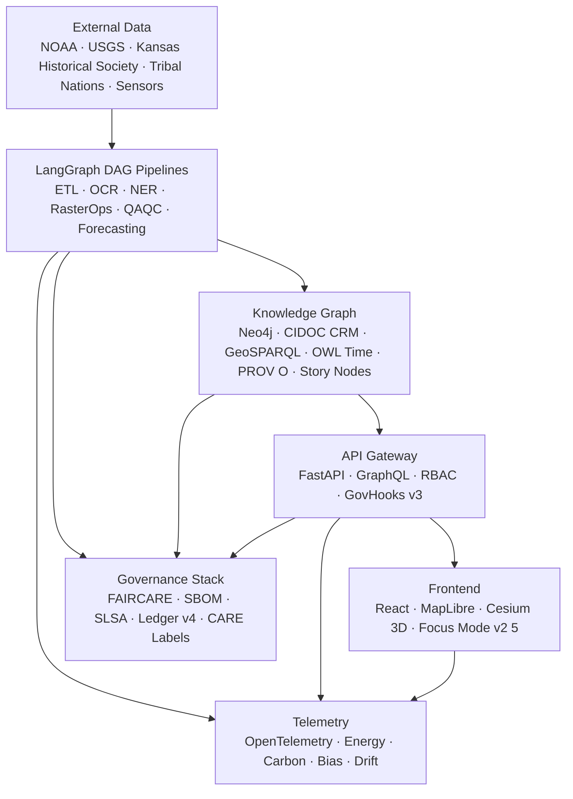
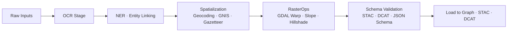
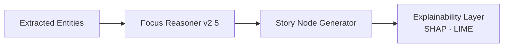
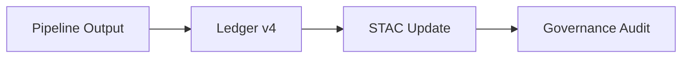
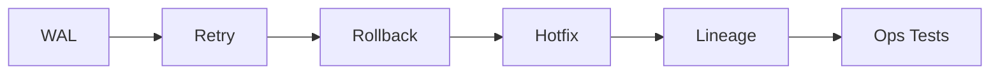
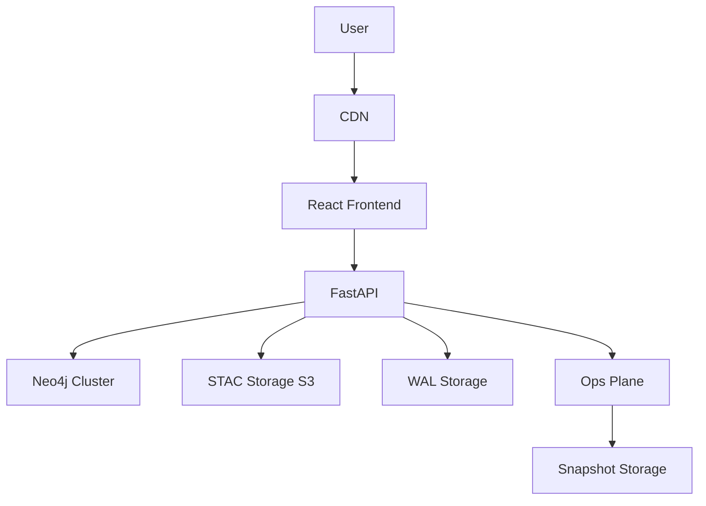
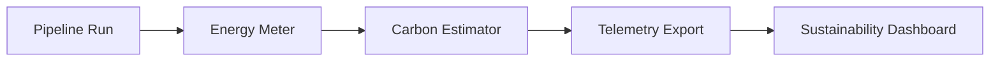

# 🏗️ **Kansas Frontier Matrix — System Architecture**  
`src/ARCHITECTURE.md`

**Purpose:**  
Define the *complete*, FAIR+CARE-governed, ontology-aligned, MCP-DL reproducible architecture of the Kansas Frontier Matrix (KFM) — including data ingestion, AI reasoning, operational safety (WAL/Retry/Rollback/Hotfix/Lineage), knowledge-graph modeling, STAC/DCAT metadata systems, 3D visualization, governance, provenance, telemetry, and sustainability pipelines.  
This is the canonical architecture reference for **v10.3.2**.

---

# 📘 Executive Summary

The **Kansas Frontier Matrix (KFM)** is a **semantic geospatial operating system** that integrates:

- Historical & cultural datasets  
- Indigenous sovereignty data  
- Climate, hydrology, ecology & hazard datasets  
- Geological & paleolandscape reconstructions  
- Sensor networks & live feeds  
- AI reasoning (Focus Mode v2.5)  
- Predictive environmental futures (2030–2100)  
- FAIR+CARE governance & ethics  
- Diamond⁹ Ω operational safety (WAL → Retry → Rollback → Hotfix → Lineage)  

KFM fuses **AI, GIS, ontology, governance, and sustainability** into a unified research infrastructure.

This architecture document is the complete specification of **how KFM v10.3.2 works internally**.

---

# 🏛️ High-Level Architecture (v10.3.2)

---

# 🔥 Architectural Objectives

### 1. **Semantic Integration**
All data flows unify via CIDOC-CRM, GeoSPARQL, OWL-Time, and PROV-O.

### 2. **Reproducibility**
Full MCP-DL lineage, WAL, retry, rollback, and checksum validation.

### 3. **FAIR+CARE**
Ethical & sovereignty-sensitive access, especially for tribal and archaeological assets.

### 4. **Sustainability**
ISO 50001 energy + ISO 14064 carbon tracking integrated into telemetry.

### 5. **Predictive Intelligence**
2030–2100 scenario modeling integrated with Focus Mode & Cesium 3D.

---

# 🧬 **Deep Layer-by-Layer Architecture**

---

# 1️⃣ Data Layer (Sources, Sensors, Archives)

### Data Domains
- **Historical:** KHS archives, manuscripts, diaries, treaties, maps, BLM patents  
- **Environmental:** NOAA climate, Daymet, PRISM  
- **Hydrology:** USGS NWIS, stream gauges, flood layers  
- **Hazards:** NOAA Storm Events, wildfire history  
- **Ecology:** GBIF, eBird, wetlands, biodiversity records  
- **Cultural:** Tribal land cessions, reservations, heritage assets (H3 masked)  
- **Geology:** KGS formations, paleomaps, DEMs  
- **Remote sensing:** NAIP, Landsat, elevation models  
- **Live sensors:** Mesonet, hydrology feeds  

### Ingestion Guarantees
- All sources fingerprinted  
- CARE labels embedded  
- Metadata normalized to STAC/DCAT  

---

# 2️⃣ ETL Layer (LangGraph DAG)

### Capabilities
- OCR (Tesseract)  
- NLP (spaCy + transformers)  
- Raster operations (GDAL Compute Engine v2)  
- Harmonization & normalization  
- Predictive ETL for climate futures  

---

# 3️⃣ AI Layer (Focus Mode v2.5)

### Features
- Narrative Story Node synthesis  
- SHAP explainability overlays  
- Bias & drift monitoring  
- Ontology-aware contextualization  
- Temporal interpolation & multi-layer reasoning  

---

# 4️⃣ Knowledge Graph Layer (Neo4j v10)

### Key Entities
- Person  
- TribalEntity  
- Document  
- Event  
- Place  
- Dataset  
- StoryNode  
- SensorStream  

### Ontology Alignment Table

| KFM Entity | CIDOC CRM | OWL-Time | GeoSPARQL | PROV-O |
|------------|-----------|----------|-----------|--------|
| Event | E5 Event | Instant/Interval | Geo relation | Activity |
| Place | E53 Place | — | Geometry | Entity |
| Document | E31 Document | — | — | Entity |
| Dataset | E73 Information Object | — | — | Entity |
| StoryNode | E29 Design/Procedure | Interval | Geometry | Activity |

---

# 5️⃣ API Layer (FastAPI + GraphQL)

### Endpoints
- `/focus` — Story Node & narrative generation  
- `/events` — GeoJSON event streaming  
- `/places` — spatial search  
- `/datasets` — STAC/DCAT catalog  
- `/graph` — GraphQL queries  
- `/ops` — WAL/rollback/retry  

### GovHooks v3
- Inject governance decisions  
- Enforce CARE labels  
- Validate lineage completeness  
- Block high-risk operations  

---

# 6️⃣ Frontend Layer (React + MapLibre + Cesium)

### Interactive Capabilities
- Time slider (historic → modern → future)  
- 3D terrain reconstruction  
- Story Node timeline  
- Layer catalog (STAC-driven)  
- H3 r7 masking for heritage sites  
- Focus Mode narrative overlays  

---

# 7️⃣ Governance Layer (Diamond⁹ Ω / Crown∞Ω)

### Required Controls
- Immutable ledger (SLSA + SBOM)  
- CARE labels  
- Sensitive site masking  
- Model bias monitoring  
- FAIR+CARE audits  
- Provenance chain validation  

---

# 8️⃣ Telemetry Layer (OpenTelemetry)

- Energy usage (Wh)  
- Carbon output (gCO₂e)  
- Model drift  
- Explainability token counts  
- Accessibility metrics  
- Focus Mode usage patterns  
- CARE-triggered events  

---

# 🔥 Operational Safety Plane (WAL → Retry → Rollback → Hotfix → Lineage)

### Guarantees
- WAL captures all mutations  
- Retry resumes only at safe checkpoints  
- Rollback restores trusted snapshots  
- Hotfix applies surgical reversible changes  
- Lineage tracks every transformation  
- Ops Tests enforce deterministic safety  

---

# 🧩 Multi-Cloud Deployment Architecture

---

# 🧠 Sustainability Architecture (ISO 50001 + 14064)

---

# 🧾 Versioning & Lifecycle Policy

### Versioning
- SemVer across all data, models, Story Nodes, and datasets.

### Release Contents
- SBOM  
- Manifest  
- Telemetry snapshot  
- FAIR/CARE audit  
- Lineage export  

### Review Cycle
- Quarterly FAIR+CARE Council  
- Continuous governance validation  

---

# 📚 Glossary

| Term | Meaning |
|------|---------|
| Story Node | Narrative unit w/ geometry + time + context |
| Focus Mode | AI reasoning engine |
| WAL | Write-Ahead Log |
| Snapshot | Rollback state |
| Lineage | Immutable derivation chain |
| STAC | SpatioTemporal Asset Catalog |
| DCAT | Dataset catalog |
| FAIR+CARE | Ethics & governance principles |

---

# 🕰️ Version History

| Version | Date | Notes |
|--------|-------|-------|
| **v10.3.2** | 2025-11-14 | Full deep rebuild; added DAGs, ontology mapping, ops safety plane, predictive futures integration, multi-cloud architecture. |
| **v10.3.1** | 2025-11-13 | Prior architecture update. |
| **v10.2.2** | 2025-11-12 | Ontology refinements, telemetry enhancements. |
| **v10.0.0** | 2025-11-09 | Original unified architecture. |

---

**© 2025 Kansas Frontier Matrix — MIT License**  
Diamond⁹ Ω / Crown∞Ω Certified · FAIR+CARE Compliant · MCP-DL v6.3  
[Back to Documentation Index](../docs/README.md) · [Governance Charter](../docs/standards/governance/ROOT-GOVERNANCE.md)

