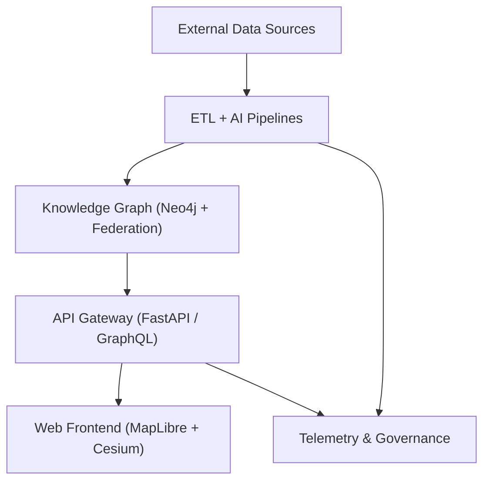

<div align="center">

# 🏗️ **Kansas Frontier Matrix — System Architecture**  
`src/ARCHITECTURE.md`

**Purpose:**  
Authoritative, reproducible blueprint of the **Kansas Frontier Matrix (KFM)** — spanning data ingress, AI/ETL enrichment, ontology-driven knowledge graph modeling, API gateways, immersive web UI, autonomous governance, and real-time telemetry — aligned with **MCP-DL v6.3** and **FAIR+CARE Council Standards**.

[](../docs/README.md)
[](../LICENSE)
[](../docs/standards/faircare.md)
[](../releases/v10.2.0/manifest.zip)

</div>

---

## 📘 Overview

**KFM** is a **containerized, semantic, FAIR+CARE-aligned data ecosystem** interlinking **historical, ecological, cultural, and geospatial knowledge** for Kansas. It employs **open standards**—**STAC 1.0**, **DCAT 3.0**, **CIDOC CRM**, **OWL-Time**, **GeoSPARQL**, **PROV-O**, and **SPDX**—within a **governance-as-code** framework enforcing provenance, ethics, and automation.

**Core Layers**
1. **Data Sources** — Archival, sensor, and open-government feeds  
2. **ETL & AI** — OCR/NLP, geocoding, summarization, entity linking, validation  
3. **Knowledge Graph** — Neo4j + federation; ontology mapping & temporal inference  
4. **API Layer** — FastAPI/GraphQL for query, Focus, search, and exports  
5. **Web Frontend** — React + MapLibre + Cesium 3D UI with timeline and Focus Mode  
6. **Governance & Telemetry** — CI/CD, FAIR+CARE audits, ledgers, dashboards

**v10.2.2 Highlights**
- **Focus v2.1**: adaptive prompts, explainability overlays (SHAP/LIME), CARE guardrails  
- **Streaming STAC Bridge**: live catalog updates; predictive ETL publishes future layers (2030–2100)  
- **Federated Graph**: cross-instance queries; resilient mirrors for institutional partners  
- **A11y & Observability**: WCAG 2.1 AA UI, expanded telemetry on bias/drift/energy

---

## 🗂️ Repository & Code Layout

```bash
src/
├─ ai/
│  ├─ focus/                 # Focus orchestration & adaptive narrative models (v2.1)
│  ├─ models/                # Transformers (NER, embeddings, summarization)
│  ├─ explainability/        # SHAP/LIME, drift, fairness telemetry
│  ├─ training/              # Reproducible configs, datasets, registries
│  └─ streaming/             # Realtime inference via Kafka/PubSub
├─ api/
│  ├─ routes/                # REST + GraphQL endpoints (events, focus, search)
│  ├─ services/              # Graph, STAC/DCAT, catalogs, storage, auth
│  ├─ models/                # Pydantic schemas / Graph types
│  └─ auth/                  # JWT/OAuth2, RBAC, scopes, rate limits
├─ graph/
│  ├─ schema/                # CIDOC CRM + OWL-Time + GeoSPARQL mappings
│  ├─ ingest/                # Entity upserts, provenance builders
│  ├─ queries/               # Cypher templates (focus, lineage, similarity)
│  └─ federation/            # Multi-graph connectors/resolvers
├─ pipelines/
│  ├─ etl/                   # NOAA/USGS/KHS/BLM/DASC ingestion modules
│  ├─ ai/                    # OCR/NLP/geocode, summarization, model inference
│  ├─ validation/            # FAIR+CARE audits, contracts, schema checks
│  └─ utils/                 # COG/GeoJSON ops, checksum, logging
├─ telemetry/
│  ├─ logs/                  # System, AI, governance logs
│  ├─ metrics/               # Drift, bias, throughput, energy, a11y
│  └─ dashboards/            # Grafana/Plotly dashboards (runtime + CI)
└─ web/
   ├─ frontend/              # React + MapLibre GL + Cesium (2D/3D temporal canvas)
   ├─ admin/                 # QA & governance review dashboards
   └─ styles/                # Design tokens, themes, accessibility assets
```

---

## 🧩 Layered Architecture

### 1️⃣ Data Sources

| Source | Examples | Format / Access |
|--------|-----------|-----------------|
| NOAA NCEI | Storm Events, Daymet, normals | CSV/JSON API, NetCDF |
| USGS | NHD, DEM/COG, LiDAR, topo | GeoTIFF/COG, Shapefile, WMS/WFS |
| KHS Archives | Manuscripts, maps, newspapers (OCR) | PDF/TIFF → text |
| BLM GLO | Land patents / PLSS | CSV, images/PDF |
| DASC Geoportal | County/state GIS layers | Feature/Map Services |
| Sensors | Hydrology/weather telemetry | Kafka / PubSub JSON |

> 💡 **Tip:** Every source has a **DCAT/STAC** manifest in `data/sources/*.json` including `license`, `spatial/temporal`, and `checksum`.

---

### 2️⃣ ETL + AI Pipelines

| Stage | Function | Output |
|------|----------|--------|
| Extract | Bulk/API/stream pulls + checksums | Raw files + SHA-256 |
| Transform | OCR → NLP (NER), geocode, normalize, enrich | GeoJSON / COG / JSON-LD |
| Load | Neo4j upsert + STAC/DCAT export | Graph nodes + STAC Items |
| Stream-Load | Continuous event ingestion | Graph deltas + logs |

**New in v10.2.2**
- **Predictive ETL** → publishes SSP-projected rasters (2030–2100) as STAC items with uncertainty bands  
- **Explainability Telemetry** → per-model drift/bias and feature importance logs under `telemetry/metrics/`

---

### 3️⃣ Knowledge Graph (Neo4j + Federation)

| Entity | Standard Mapping | Description |
|--------|------------------|-------------|
| Person | CIDOC E21 | Individuals / authors / officials |
| Place | CIDOC E53 + GeoSPARQL | GNIS/GeoNames places, polygons |
| Event | CIDOC E5 + OWL-Time | Time-bounded occurrences |
| Document | CIDOC E31 | Texts, scans, digitized records |
| Dataset | DCAT Dataset ↔ STAC Collection | Catalog linkage & assets |
| SensorStream | SOSA/SSN | Live sensor/time-series entities |

**Relations**: `OCCURRED_AT`, `MENTIONS`, `LOCATED_IN`, `CITED_BY`, `GENERATED_BY`, `FEDERATED_WITH`, `STREAMS_FROM`.

> ⚠️ **Important:** All graph mutations carry `prov:wasGeneratedBy` with pipeline commit + parameters for full provenance.

---

### 4️⃣ API Layer (FastAPI / GraphQL)

| Route | Purpose | Returns |
|-------|--------|---------|
| `GET /api/search?q=` | Full-text + semantic search | Ranked entities |
| `GET /api/focus/{id}` | Focus Mode subgraph & summary | Narrative + edges + citations |
| `GET /api/events?bbox&time=` | Spatiotemporal filter | GeoJSON FeatureCollection |
| `GET /api/map/layers` | Active STAC/DCAT layers | JSON |
| `GET /api/streams/live` | Realtime event feed | Server-sent stream |

Security: **JWT/OAuth2** with RBAC scopes (`admin`, `editor`, `public`) and rate limits.

---

### 5️⃣ Web Frontend (UI v3)

| Component | Role |
|-----------|------|
| MapView | 2D/3D MapLibre GL + Cesium layers; predictive overlays |
| TimelineView | Time slider, trend density, break-year markers |
| FocusPanel | AI narratives, relationships, explainability toggles |
| Admin Dashboard | FAIR+CARE audits, validation, approvals |
| A11y | WCAG 2.1 AA: ARIA, keyboard nav, high-contrast tokens |

---

## 🗺️ Core Data Flow



---

## 🧠 Focus Mode (AI v2.1)

| Element | Description |
|--------|-------------|
| Model | `focus_transformer_v2.1` — subgraph-conditioned summarization with intent inference |
| Pipeline | Subgraph → embeddings → adaptive prompt → narrative + citations |
| Explainability | SHAP/LIME overlays, drift alerts, sensitivity sliders |
| Ethics | CARE filter, policy summarizer, telemetry to `releases/*/focus-telemetry.json` |
| Streaming | Kafka-backed incremental updates to Focus graph cache |

---

## 🛰️ STAC ↔ DCAT Bridge

| Direction | Function | Result |
|----------|----------|--------|
| STAC → DCAT | Map Item/Collection to Dataset/Distribution | Interop catalog |
| DCAT → STAC | Enrich DCAT with STAC assets & bbox/time | Geotemporal binding |
| Streaming | Publish new Items from stream/ETL | Live discovery |

Validation via `.github/workflows/stac-validate.yml`; published JSON in `data/stac/**`.

---

## 🔐 Infrastructure & Security

| Area | Tooling | Notes |
|------|--------|-------|
| Containers | Docker/Compose | Non-root, minimal base images |
| Secrets | GitHub/OIDC | Auto-rotation; no plaintext in repo |
| Vuln Scans | CodeQL + Trivy | Block **CRITICAL** issues |
| SBOM | SPDX export | `releases/**/sbom.spdx.json` |
| Streaming | Kafka / PubSub | HA ingestion and focus refresh |
| Federation | Neo4j cluster | HA mirrors, read replicas |
| AuthZ | RBAC / OIDC | Least privilege, scoped tokens |

---

## 📡 Telemetry, Governance & FAIR+CARE

- **Telemetry**: build/runtime metrics, bias/drift, energy, a11y scores  
- **Ledgers**: `docs/reports/audit/` for models, data, CI/CD artifacts  
- **FAIR+CARE Checkpoint**:  
  - *Findable*: STAC/DCAT UUIDs + DOIs  
  - *Accessible*: Open APIs + clear licenses  
  - *Interoperable*: JSON-LD, ontologies  
  - *Reusable*: Versioning, checksums, provenance  
  - *CARE*: Council approvals, community consent, masking

> 💡 **Tip:** Run `make validate` before PRs to enforce STAC/DCAT schema and FAIR+CARE gates.

---

## 🧱 Data Contracts

| Field | Req | Purpose |
|------|-----|---------|
| id, title, description | ✅ | Dataset identity |
| type, format | ✅ | Classification & media type |
| license, provenance | ✅ | FAIR compliance & reuse |
| spatial, temporal | ✅ | BBox + ISO interval |
| checksum | ✅ | Integrity (SHA-256) |
| care.* | ⚙️ | Ethical/consent metadata |
| streaming | ⚙️ | Live feed endpoints |

Contracts live in `data/sources/*.json`; enforced by CI.

---

## 🧭 Roadmap

1. 🌎 Public STAC API with federated query + auth  
2. 🤖 Focus v3 — generative timeline & counterfactual narratives  
3. 🛰️ Federation Network — multi-institution graph connectors  
4. 🧮 Scenario Workbench — climate/agri/migration simulations  
5. 🔐 Zero-Trust CI/CD — artifact signing and verified supply chain

---

## 🕰️ Version History

| Version | Date | Author | Summary |
|--------|------|--------|---------|
| v10.2.2 | 2025-11-12 | A. Barta & FAIR+CARE Council | Align to v10.2 infra: Focus v2.1, streaming STAC, federated graph, expanded telemetry & audits. |
| v10.0.0 | 2025-11-09 | A. Barta | Predictive ETL, Focus AI v2, streaming bridge, 3D temporal UI, governance hardening. |
| v9.9.0 | 2025-11-07 | A. Barta | Streaming ingestion, multi-graph federation refinements. |
| v9.7.0 | 2025-11-01 | KFM Core Team | STAC↔DCAT bridge, telemetry governance, MCP v6.3 integration. |

---

<div align="center">

© 2025 Kansas Frontier Matrix — MIT / CC-BY 4.0  
Maintained under **Master Coder Protocol v6.3** · **FAIR+CARE Certified** · **Diamond⁹ Ω / Crown∞Ω Ultimate Certified**  
[Back to Documentation Index](../docs/README.md) · [Governance Charter](../docs/standards/governance/ROOT-GOVERNANCE.md)

</div>