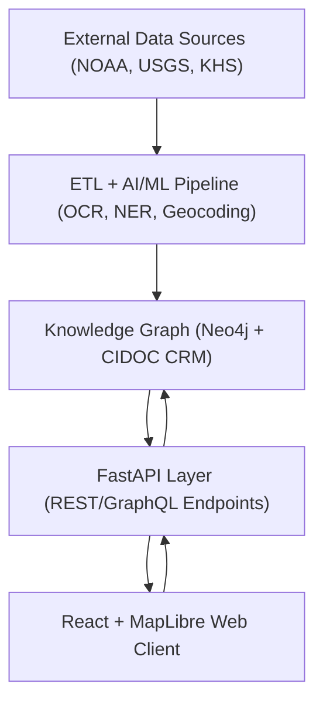

<div align="center">

# 🏗️ **Kansas Frontier Matrix — System Architecture**
`src/ARCHITECTURE.md`

**Purpose:** Define the multi-layered technical architecture, data flow, and integration framework for the Kansas Frontier Matrix (KFM) platform — connecting geospatial, historical, and AI-driven components into a unified, reproducible ecosystem.

[](../docs/README.md)
[](../LICENSE)
[](../docs/standards/faircare.md)
[](https://stacspec.org)
[]()

</div>

---

## 📚 Overview

The **Kansas Frontier Matrix (KFM)** is a **multi-tier open-source system** that integrates Kansas-focused geospatial, historical, and environmental data into an interactive timeline–map interface backed by a semantic knowledge graph.  
Its design follows the **Master Coder Protocol (MCP)** and **FAIR+CARE** principles — ensuring all workflows are reproducible, auditable, and extensible.

The system architecture consists of five primary layers:

1. **Data Source Layer** — ingest and federate diverse datasets.  
2. **ETL & AI Pipeline** — extract, transform, and enrich with NLP + ML.  
3. **Knowledge Graph Database** — semantic relationships (Neo4j/CIDOC CRM).  
4. **API Layer** — REST/GraphQL endpoints for serving graph and geospatial data.  
5. **Web Frontend** — React + MapLibre UI for timeline–map exploration.

Each layer communicates via standardized open formats (GeoJSON, STAC, DCAT, JSON-LD) and adheres to modular governance to ensure sustainable long-term maintenance.

---

## 🧩 Layered Architecture

### 1. Data Source Layer

**Purpose:** Aggregate open and archival datasets spanning environmental, cultural, and historical domains.

**Sources include:**
- **NOAA** Climate & Storm Events (CSV, NetCDF, API)
- **USGS** Hydrography, Terrain, and Geological Data (GeoTIFF/GeoJSON)
- **Kansas DASC Geoportal** for state-level GIS data
- **Kansas Historical Society Archives** and OCR text corpora
- **BLM GLO Records** for land patents and cadastral mapping

**Standards:**  
All data sources are described via `data/sources/*.json` manifests referencing provenance, licensing, bounding boxes, and temporal extent.  
Each entry aligns with **DCAT 3.0** and **STAC 1.0.0** specifications for interoperability.

---

### 2. ETL & AI/ML Pipeline

**Location:** `src/pipelines/`  

The ETL system automates ingestion, cleaning, and semantic transformation of datasets into graph-ready formats.

**Components:**
- **Extract:** Pulls data via APIs, FTP, or direct links (NOAA, USGS, KHS).  
- **Transform:** Standardizes schemas, performs OCR on scanned documents, and runs NLP (Named Entity Recognition, summarization, geocoding).  
- **Load:** Inserts structured entities (Places, People, Events) into Neo4j while maintaining STAC metadata for geospatial assets.

**AI Modules:**
- `src/ai/models/focus_transformer_v1` — AI summarization & Focus Mode entity linking.
- `src/ai/models/embeddings` — vector embeddings for semantic search.
- `src/ai/explainability` — SHAP/LIME explainability and drift detection.

**Governance:**  
Every ETL run is logged with timestamp, checksum, and JSON metadata in `data/work/logs/etl/`, following **MCP experiment logging** for reproducibility.

---

### 3. Knowledge Graph Layer

**Purpose:** Store and interlink all processed data into a semantic graph.  
**Technology:** Neo4j with optional RDF export (CIDOC CRM + OWL-Time alignment).

**Core Entities:**
- `Person`, `Place`, `Event`, `Document`, `Dataset`
- Relationships: `OCCURRED_AT`, `PARTICIPATED_IN`, `MENTIONS`, `LOCATED_IN`

**Ontology Alignment:**
- **CIDOC CRM:** for cultural heritage and provenance.
- **OWL-Time:** for temporal intervals.
- **GeoSPARQL:** for spatial reasoning.
- **PROV-O:** for lineage and data processing traceability.

**Storage:**
Each entity is assigned a persistent UUID and linked to its STAC or DCAT metadata object, ensuring every dataset is traceable through the knowledge graph.

---

### 4. API & Integration Layer

**Technology:** Python **FastAPI** service providing REST/GraphQL endpoints.

**Endpoints Examples:**
- `/api/events?start=1850&end=1900`
- `/api/focus/{entity_id}`
- `/api/map/layers`
- `/api/search?q=Cheyenne`

**Responsibilities:**
- Serve data from the graph and file system to the frontend.
- Handle spatial/temporal queries and pagination.
- Integrate with AI services (summaries, Focus Mode insights).

All responses conform to JSON or GeoJSON schemas, validated by `schemas/api/v1/*.json`.

---

### 5. Web Frontend Layer

**Technology:** React 18 + MapLibre GL JS + D3 Canvas.  
**Directory:** `web/src/`

**Key Components:**
- **TimelineView:** interactive chronological visualization.
- **MapView:** map explorer with historical layers (MapLibre).
- **LayerControls:** toggleable GIS and historical data layers.
- **Focus Mode:** AI-powered contextual exploration of entities.
- **DetailPanel:** displays entity summaries and linked data.
- **Admin Console:** for data validation and curation.

The frontend communicates exclusively through the API, using versioned endpoints for predictable upgrades.

---

## 🗺️ Data Flow Diagram



---

## 🧠 AI-Powered Focus Mode Integration

**Objective:** Center user exploration on a specific entity and dynamically filter related content.

**Mechanism:**
1. User selects an entity (e.g., Fort Larned).
2. API executes subgraph query in Neo4j to retrieve all linked nodes.
3. Frontend updates map, timeline, and side panel views.
4. AI summarizer generates narrative insights, displaying patterns and correlations.

**Technical Stack:**
- Backend: FastAPI endpoint `/api/focus/{entity}`
- AI Model: `focus_transformer_v1` fine-tuned for historical correlation detection.
- Frontend: React context `FocusProvider` synchronizes state across MapView and TimelineView.

---

## 🧮 FAIR+CARE Compliance

The architecture enforces:
- **Findability:** STAC catalog, metadata search.  
- **Accessibility:** Open APIs, open data licenses.  
- **Interoperability:** GeoJSON, DCAT, OWL-Time, CIDOC CRM alignment.  
- **Reusability:** Modular datasets, DOIs, clear provenance.

CARE (Collective Benefit, Authority to Control, Responsibility, Ethics) principles are applied to all Indigenous and cultural data layers.

---

## 🧰 Directory Layout

```
src/
├── ai/
│   ├── focus/                 # AI-powered Focus Mode
│   ├── models/                # Trained NLP + ML models
│   ├── explainability/        # SHAP/LIME visualization
│   └── training/              # Model training configs
├── api/
│   ├── routes/                # REST/GraphQL route definitions
│   ├── services/              # Data access services
│   ├── models/                # API schemas
│   └── auth/                  # Admin and user authentication
├── graph/
│   ├── schema/                # Graph ontology definitions
│   ├── queries/               # Cypher query templates
│   ├── ingest/                # Graph data loaders
│   └── utils/                 # Query helpers and validators
├── pipelines/
│   ├── etl/                   # ETL transformations
│   ├── ai/                    # AI-driven enrichments
│   ├── validation/            # FAIR+CARE data validators
│   └── utils/                 # Shared pipeline utilities
└── telemetry/
    ├── logs/                  # System logs and experiment reports
    └── metrics/               # Performance telemetry
```

---

## 🧾 Governance & Validation

All major components are bound by **MCP governance checks**:

- **Automated Validations:** GitHub Actions run `stac-validate.yml`, `faircare-validate.yml`, and `codeql.yml`.
- **SBOM & Attestations:** SPDX manifests under `/releases/v9.7.0/`.
- **Data Contracts:** JSON schemas defining interface boundaries.
- **Telemetry Reports:** System-level performance and AI drift metrics (`focus-telemetry.json`).

---

## 🧩 Future Enhancements

1. **3D Temporal Visualization** via Cesium or WebGL integration.  
2. **GraphQL Federation** for multi-graph interoperability.  
3. **Predictive Modeling Layer** (simulation of environmental–historical dynamics).  
4. **Federated Data Nodes** for distributed KFM deployments across institutions.  
5. **STAC API Deployment** for live catalog search and filtering.

---

## 🕰️ Version History

| Version | Date | Author | Summary |
|----------|------|---------|----------|
| v9.7.0 | 2025-11-05 | A. Barta | Major architecture documentation update for Focus Mode & FAIR+CARE validation. |
| v9.5.0 | 2025-10-20 | A. Barta | Integration of STAC/DCAT metadata bridge. |
| v9.3.2 | 2025-08-10 | KFM Core Team | Added ETL validation and AI governance logging. |
| v9.0.0 | 2025-06-01 | KFM Core Team | Initial release of system architecture document. |

---

<div align="center">

**© 2025 Kansas Frontier Matrix — MIT License**  
Built under the **Master Coder Protocol v6.3** · FAIR+CARE Compliant · “Diamond⁹ Ω / Crown∞Ω Certified”

</div>