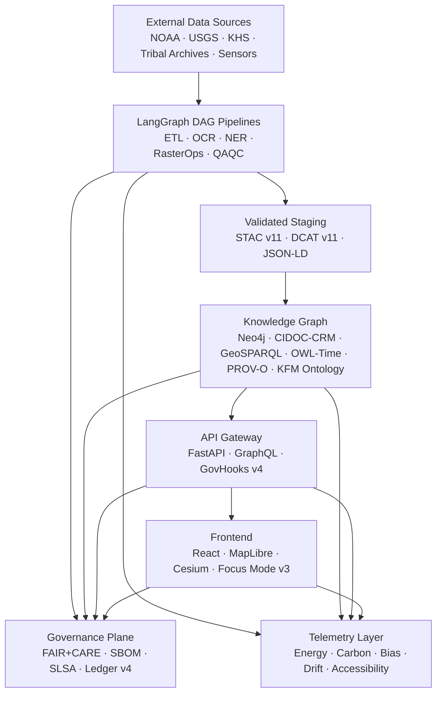
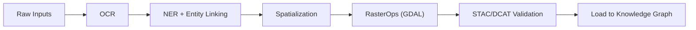
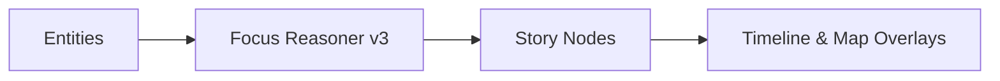
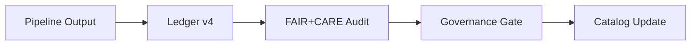
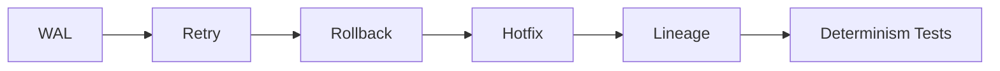

<div align="center">

# 🏗️ **Kansas Frontier Matrix**  
## **Repository Architecture & System Blueprint (v11 LTS)**  
`ARCHITECTURE.md`

[](#)
[](#)
[](#)
[](#)
[](#)
[](#)

</div>

---

# 📘 Executive Summary

The **Kansas Frontier Matrix (KFM)** is a **FAIR+CARE-governed semantic geospatial operating system**, integrating:

- Historical, cultural, environmental, hydrological, geological, and predictive datasets  
- Neo4j + CIDOC-CRM + GeoSPARQL + OWL-Time + PROV-O + KFM Ontology v11  
- LangGraph ETL DAGs with WAL/Retry/Rollback/Hotfix/Lineage  
- AI reasoning and narrative generation (Focus Mode v3)  
- Real-time hydrology, hazards, climate, and environmental feeds  
- 3D visualization (MapLibre + Cesium)  
- Sovereignty-aware governance and sensitive site masking  

This file defines the **complete v11 repository architecture**.

---

# 🏛️ 1. High-Level System Architecture



---

# 🔍 2. Data Layer

### Domains

- Historical archives, treaties, manuscripts, maps, diaries  
- Tribally-governed cultural assets (masked & sovereignty-controlled)  
- NOAA climate records  
- USGS hydrology & geological datasets  
- Remote sensing (NAIP, Landsat, DEMs)  
- Hazard layers (storms, floods, wildfire)  
- Ecology (GBIF, eBird, wetlands)  
- Live sensors (Mesonet, USGS gauges)

### Guarantees

- STAC/DCAT v11 normalization  
- CARE labels attached at ingest  
- Provenance-first ingestion  
- ISO 50001/14064 energy & carbon metrics logged  

---

# 🛠️ 3. ETL Layer (LangGraph v11 DAG Engine)



Features:

- Deterministic DAGs  
- Full reproducibility via WAL checkpoints  
- Automatic retry + rollback  
- OpenLineage v2.5 emissions  

---

# 🧠 4. AI Layer — Focus Mode v3

- Ontology-aware narrative generation  
- Story Node synthesis  
- Bias & drift detection  
- SHAP/LIME explainability  
- Multi-temporal reasoning (past ↔ present ↔ future)



---

# 🧩 5. Knowledge Graph Layer (Neo4j v5)

### Ontology Stack

- CIDOC-CRM  
- GeoSPARQL  
- OWL-Time  
- PROV-O  
- KFM Ontology v11  

### Entity Overview

| KFM Entity | CIDOC CRM | Temporal | Spatial | Provenance |
|-----------|------------|----------|---------|------------|
| Event     | E5         | Yes      | Yes     | Yes        |
| Place     | E53        | No       | Geometry| Yes        |
| Dataset   | E73        | No       | —       | Yes        |
| Document  | E31        | No       | —       | Yes        |
| StoryNode | Custom     | Yes      | Yes     | Activity   |

---

# 🧰 6. API Layer (FastAPI + GraphQL)

Endpoints include:

- `/focus`  
- `/events`  
- `/datasets`  
- `/graph`  
- `/ops`  

### GovHooks v4 enforces:

- CARE & sovereignty rules  
- Lineage-required writes  
- Risk policies  
- Sensitive data masking  

---

# 🗺️ 7. Frontend Layer (React + MapLibre + Cesium)

Features:

- STAC-driven layer catalog  
- 3D terrain  
- Story Node timeline  
- Focus Mode v3 overlays  
- H3 r7 cultural site masking  
- WCAG 2.1 AA accessibility  

---

# 🛡️ 8. Governance & Sovereignty Plane



This plane:

- Logs all promotions, retractions, and decisions  
- Ensures sensitive datasets cannot bypass masking or CARE review  

---

# 📡 9. Telemetry & Sustainability Layer

Tracks:

- Energy (Wh)  
- Carbon (gCO₂e)  
- Bias & drift indicators  
- Accessibility metrics  
- Focus Mode reasoning metrics  
- Provenance completeness  

Emits:

- JSON telemetry bundles  
- STAC/DCAT metadata about telemetry datasets  

---

# 🔁 10. Operational Safety (Reliable Pipelines v11)



Guarantees:

- Atomicity  
- Durable WAL  
- Safe recovery  
- Undo/redo  
- Immutable lineage  

---

# 🗂️ 11. Repository Layout

```text
.
├── ARCHITECTURE.md
├── README.md
├── data/
│   ├── sources/
│   └── staging/
├── docs/
│   ├── graph/
│   ├── pipelines/
│   ├── standards/
│   └── analyses/
├── schemas/
│   ├── telemetry/
│   ├── stac/
│   ├── dcat/
│   └── jsonld/
├── src/
│   ├── pipelines/
│   ├── api/
│   ├── utils/
│   └── web/
├── web/
│   ├── src/
│   ├── public/
│   └── meta/
└── .github/
    └── workflows/
```

---

# 🧾 12. Release Lifecycle

Each release includes:

- SBOM  
- Manifest  
- Telemetry snapshot  
- FAIR+CARE audit  
- Full lineage export  
- SLSA attestation  

Release validation is bound to the profiles listed in `validation_profiles`.

---

# 🕰️ 13. Version History

| Version | Date       | Notes                                                   |
|--------:|-----------:|---------------------------------------------------------|
| v11.0.0 | 2025-11-19 | Complete v11 architecture; extended metadata & runtime. |
| v10.4.x | 2025       | Pre-v11 alignment and ontology consolidation.           |

---

<div align="center">

**© 2025 Kansas Frontier Matrix — MIT License**  
🏗️ System Architecture · Diamond⁹ Ω / Crown∞Ω Certified  
FAIR+CARE Compliant · Sovereignty-Aware · MCP-DL v6.3 · KFM-MDP v11.0.0  

[Return to Root README](README.md) ·  
[Governance Charter](docs/standards/governance/ROOT-GOVERNANCE.md)

</div>
