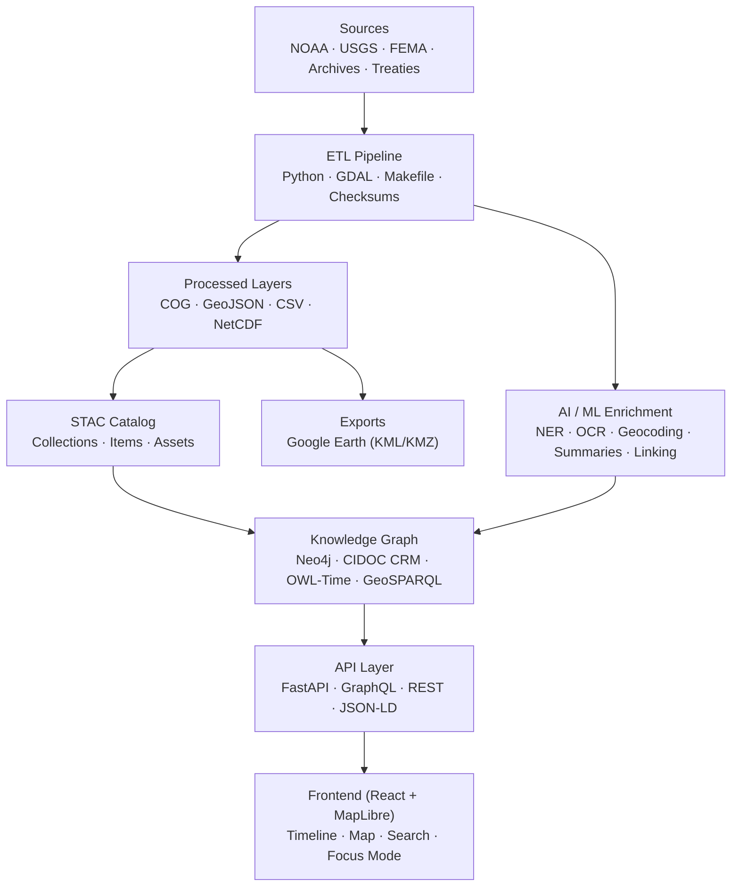

<div align="center">

# 🏗️ **Kansas Frontier Matrix — System Architecture Overview (v2.3.0 · Tier-Ω+∞ Certified)**

### *“Time · Terrain · History · Knowledge Graphs”*

[](../../.github/workflows/site.yml)
[](../../.github/workflows/stac-validate.yml)
[](../../.github/workflows/codeql.yml)
[](../../.github/workflows/trivy.yml)
[](../../.github/workflows/sbom.yml)
[](../../.github/workflows/slsa.yml)
[](../../docs/)
[](../../LICENSE)

</div>

---

<details><summary>📚 <strong>Table of Contents</strong></summary>

- [📘 Context & Scope](#-context--scope)
- [🎯 Purpose & Audience](#-purpose--audience)
- [🌾 Mission](#-mission)
- [🏛 Architectural Principles](#-architectural-principles)
- [🏗 System Diagram](#-system-diagram)
- [📦 Component Ownership Matrix](#-component-ownership-matrix)
- [⚙️ Core Layers](#️-core-layers)
- [🧭 Data & File Architecture](#-data--file-architecture)
- [🧪 AI / ML Pipeline](#-ai--ml-pipeline)
- [🌐 API & Integration](#-api--integration)
- [🗽 Web Frontend](#-web-frontend)
- [🛡 Security & Provenance](#-security--provenance)
- [📦 Supply Chain & SLSA](#-supply-chain--slsa)
- [📋 Compliance & Validation Matrix](#-compliance--validation-matrix)
- [📊 Observability & Health](#-observability--health)
- [🤖 AI Governance (Quality & Ethics)](#-ai-governance-quality--ethics)
- [🧾 Data Ethics & Cultural Safeguards](#-data-ethics--cultural-safeguards)
- [📊 Governance Telemetry Snapshot](#-governance-telemetry-snapshot)
- [📜 Linked ADRs & SOPs](#-linked-adrs--sops)
- [🧭 Environment & Quickstart](#-environment--quickstart)
- [🗄 Versioning & Governance](#-versioning--governance)
- [🧮 Risk Register](#-risk-register)
- [🧾 Change-Control Register](#-change-control-register)
- [📣 Contributor Quick-Links](#-contributor-quick-links)
- [📚 References](#-references)
- [🗓 Version History](#-version-history)

</details>

---

## 📘 Context & Scope
This document defines the **complete system architecture** of the Kansas Frontier Matrix (KFM).  
It establishes the cross-domain blueprint for ETL, AI, graph, API, and web systems under **MCP-DL v6.3.2**.

- **Scope:** Production architecture, governance, observability, ethics, and provenance.  
- **Exclusions:** Archived prototypes and experimental notebooks.  
- **Purpose:** Serve as the authoritative system map for contributors, maintainers, and auditors.

---

## 🎯 Purpose & Audience
This architecture overview serves as the **single source of truth** for:
- 🧠 **Engineers & Data Scientists:** ETL, AI, and graph contributors  
- 🌐 **Frontend Developers:** React/MapLibre integrations  
- 🔒 **Governance & Security:** Provenance, SLSA, SBOM verification  
- 📚 **Researchers & Historians:** Semantic data and FAIR re-use  
Every architectural layer must remain **documented**, **testable**, and **reproducible** across releases.

---

## 🌾 Mission
The **Kansas Frontier Matrix (KFM)** fuses **time**, **terrain**, and **history** into a **semantic, reproducible knowledge system**.  
It integrates environmental, cultural, and historical datasets into **Neo4j**, built upon **CIDOC CRM**, **OWL-Time**, and **GeoSPARQL**, surfaced through **React + MapLibre** with timeline visualization and AI-assisted Focus Mode.

---

## 🏛 Architectural Principles
| Principle | Description |
|:--|:--|
| **Docs-as-Code** | All architecture and SOPs versioned in Git with MCP metadata. |
| **Reproducibility** | Deterministic pipelines with pinned SHAs and reproducible builds. |
| **Open Standards** | STAC · DCAT · CIDOC CRM · OWL-Time · GeoSPARQL · JSON-LD. |
| **Defense-in-Depth** | CodeQL · Trivy · SBOM · SLSA · OIDC · Signed commits. |
| **Accessibility** | WCAG 2.1 AA baseline for all user-facing systems. |

---

## 🏗 System Diagram

<!-- END OF MERMAID -->

---

## 📦 Component Ownership Matrix
| Layer | Primary Owner(s) | Backup / Reviewer | Standards |
|:--|:--|:--|:--|
| ETL / Data Pipeline | @kfm-data | @kfm-security | STAC · DCAT · FAIR |
| AI / ML Enrichment | @kfm-ai | @kfm-ethics | MCP-AI Governance |
| Knowledge Graph | @kfm-architecture | @kfm-data | CIDOC CRM · OWL-Time |
| API Layer | @kfm-architecture | @kfm-web | REST · GraphQL · JSON-LD |
| Web Frontend | @kfm-web | @kfm-accessibility | WCAG 2.1 AA |
| Security & Provenance | @kfm-security | @kfm-architecture | SBOM · SLSA · OPA |

---

## ⚙️ Core Layers
### 🧬 ETL Pipeline
- Python (GDAL/Rasterio/Pandas), `make fetch|process|stac`
- Outputs: **COG**, **GeoJSON**, CSV, STAC descriptors
- CI validates JSON Schema + checksums

### 🧠 AI / ML Enrichment
- OCR (Tesseract), NLP (spaCy/Transformers)
- GeoPy geocoding, summarization (BART/T5), PROV-O lineage

### 🕸 Knowledge Graph
- Neo4j + CIDOC CRM + OWL-Time + GeoSPARQL
- Relations: `MENTIONS`, `OCCURRED_AT`, `DERIVED_FROM`
- Exports: RDF + JSON-LD

### 🔗 API Layer
- FastAPI + GraphQL  
- Endpoints: `/api/events`, `/api/entities/{id}`, `/api/search?q=`, `/api/tiles/{layer}`

### 🖥 Web Frontend
- React + Vite + MapLibre + D3 timeline  
- Focus Mode + AI panel with explainability  
- **WCAG 2.1 AA** compliance baseline

---

## 📋 Compliance & Validation Matrix
| Pillar | Verified By | Artifacts |
|:--|:--|:--|
| Documentation-First | `docs-validate.yml` | Front-matter + ADR links |
| Reproducibility | `Makefile` + DVC | build logs + checksums |
| Provenance | `slsa.yml` | `.prov.json` |
| Auditability | `policy-check.yml` | OPA/Conftest report |
| FAIR / CARE | `data/sources/*.json` | STAC metadata |
| Accessibility | `a11y-tests.yml` | a11y score ≥ 95 |
| Security | CodeQL + Trivy | SARIF + SBOM |

---

## 📊 Observability & Health
- Dashboard: [metrics.kfm.ai/architecture/system](https://metrics.kfm.ai/architecture/system)  
- Metrics: STAC pass rate, API latency, graph latency, A11y (GAI), action pinning %, artifact verification %

---

## 🤖 AI Governance (Quality & Ethics)
- Model cards (`docs/models/*`) include metrics + provenance
- Bias baselines enforced, F1/ROUGE thresholds mandatory
- Human-in-the-loop review (`@kfm-ai`)
- AI summaries always cite sources

---

## 🧾 Data Ethics & Cultural Safeguards
- STAC `data_ethics` required for all datasets
- Sensitive data redacted; consent tags validated
- Ethics ledger stored at `docs/standards/ethics/ledger/`

---

## 📊 Governance Telemetry Snapshot
>   
> _Real-time metrics for architecture, CI/CD health, and provenance audits._

---

## 📜 Linked ADRs & SOPs
| Document | Purpose | Depends On / Supersedes | Status |
|:--|:--|:--|:--|
| ADR-001 Monorepo Architecture | Unified repo layout | — | ✅ |
| ADR-010 Knowledge Graph Schema | Graph ontology policy | ADR-003 Data Ontology | ✅ |
| ADR-008 Release Governance | SemVer & release bundles | ADR-005 Versioning Conventions | ✅ |
| SOP Security Scanning | SBOM/SLSA policy enforcement | — | ✅ |
| SOP Contributor Onboarding | Environment + access setup | — | ✅ |

---

## 🧭 Environment & Quickstart
```bash
NEO4J_URI=bolt://localhost:7687
NEO4J_USER=neo4j
NEO4J_PASS=neo4j
VITE_API_URL=http://localhost:8000
VITE_MAP_STYLE_URL=/tiles/style.json

make fetch && make process && make stac
make serve
```

---

## 🗄 Versioning & Governance
```yaml
versioning:
  code: "SemVer (kfm-vX.Y.Z)"
  data: "STAC properties.version"
  docs: "MCP metadata + changelog"
  models: "Model card + hash"
  release_automation: "release-please.yml"
  doi_on_major: true
```
**Release bundle:** SBOM + SLSA + `.prov.json` attached to tags.

---

## 🧮 Risk Register
| ID | Risk | Likelihood | Impact | Owner | Mitigation |
|:--|:--|:--:|:--:|:--|:--|
| ARCH-001 | STAC schema drift | M | M | @kfm-data | CI schema gates |
| ARCH-002 | API breaking change | L | H | @kfm-web | OpenAPI diff checks |
| ARCH-003 | NER bias regression | M | M | @kfm-ai | Bias benchmarks block |
| ARCH-004 | Action unpinned | L | H | @kfm-security | SHA pin audit |

---

## 🧾 Change-Control Register
```yaml
changes:
  - date: "2025-10-20"
    change: "Expanded architecture document with purpose, ownership, compliance, validation, and contributor links."
    reviewed_by: "@kfm-architecture"
    pr: "#420"
```

---

## 📣 Contributor Quick-Links
- 🗂 [Open Issues](../../issues)
- 🚀 [Submit Feature Request](../../issues/new?template=feature_request.yml)
- 🧩 [Architecture Board](../../projects)
- 📘 [Contributing Guide](../../CONTRIBUTING.md)

---

## 📚 References
- `docs/architecture/file-architecture.md`  
- `docs/architecture/ai-automation.md`  
- `docs/standards/markdown_rules.md`  
- `docs/standards/markdown_guide.md`  
- `data/stac/` · `data/sources/`  
- `.github/workflows/` (site, stac-validate, sbom, slsa, policy, gitleaks)

---

## 🗓 Version History
| Version | Date | Author | Summary | Type |
|:--|:--|:--|:--|:--|
| **v2.3.0** | 2025-10-20 | @kfm-architecture | Added purpose, ownership, compliance, telemetry, and change control for full Tier-Ω+∞ certification. | Minor |
| v2.2.0 | 2025-10-19 | @kfm-architecture | Added context, telemetry, artifacts, ADR linkage. | Minor |
| v2.1.0 | 2025-11-14 | @kfm-architecture | Observability, supply-chain grid, risk register, ethics ledger refs. | Minor |
| v2.0.0 | 2025-10-18 | @kfm-architecture | Tier-Ω+∞ overhaul: provenance bundle, WCAG/FAIR alignment, Focus Mode governance. | Major |
| v1.0.0 | 2024-12-01 | Founding Team | Initial system architecture overview. | Major |

---

<div align="center">

### 🏛 “Document the Frontier · Reconstruct the Past · Illuminate Connections.”  
© 2025 Kansas Frontier Matrix — MIT (code) · CC-BY 4.0 (data/docs)

</div>

<!-- MCP-FOOTER-BEGIN
MCP-VERSION: v6.3.2
MCP-TIER: Ω+∞
DOC-PATH: docs/architecture/system-architecture-overview.md
DOC-HASH: sha256:system-architecture-overview-v2-3-0-xxxxxxxxxxxxxxxxxxxxxxxxxxxxxxxxxxxx
MCP-CERTIFIED: true
AUTO-DOC: true
VALIDATION-HASH: {auto.hash}
GENERATED-BY: KFM-Automation/DocsBot
AUDIT-TRAIL: enabled
DOI-MINTED: pending
LAST-VALIDATED: {build.date}
MCP-FOOTER-END -->