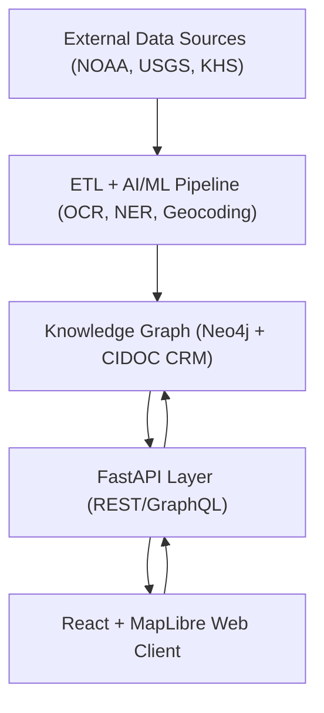

<div align="center">

# 🏗️ **Kansas Frontier Matrix — System Architecture**
`src/ARCHITECTURE.md`

**Purpose:** Define the multi-layered technical architecture, data flows, and integration framework for the Kansas Frontier Matrix (KFM) platform — unifying geospatial, historical, and AI components into a reproducible ecosystem.

[](../docs/README.md)
[](../LICENSE)
[](../docs/standards/faircare.md)
[]()

</div>

---

## 📘 Overview

The **Kansas Frontier Matrix (KFM)** is a **multi-tier open-source system** that integrates Kansas-focused geospatial, historical, and environmental data into an interactive timeline–map interface backed by a semantic knowledge graph.  
The design follows **Master Coder Protocol (MCP v6.3)** and **FAIR+CARE** principles to ensure all workflows are reproducible, auditable, and extensible.

Primary layers:

1. **Data Sources** — federate diverse datasets.  
2. **ETL & AI Pipelines** — extract, transform, and enrich with NLP/ML.  
3. **Knowledge Graph** — Neo4j with CIDOC CRM alignment.  
4. **API Layer** — REST/GraphQL for graph/geospatial access.  
5. **Web Frontend** — React + MapLibre for timeline–map exploration.

All layers communicate via open standards (GeoJSON, STAC, DCAT, JSON-LD) with modular governance for longevity.

---

## 🗂️ Directory Layout

```
src/
├── ai/
│   ├── focus/                 # AI Focus Mode
│   ├── models/                # Trained NLP/ML models
│   ├── explainability/        # SHAP/LIME visualizations
│   └── training/              # Model training configs
├── api/
│   ├── routes/                # REST/GraphQL route definitions
│   ├── services/              # Data access services
│   ├── models/                # API schemas
│   └── auth/                  # Authentication
├── graph/
│   ├── schema/                # Ontology definitions (CIDOC CRM, OWL-Time)
│   ├── queries/               # Cypher templates
│   ├── ingest/                # Graph loaders
│   └── utils/                 # Helpers and validators
├── pipelines/
│   ├── etl/                   # Extract/Transform/Load
│   ├── ai/                    # AI enrichments
│   ├── validation/            # FAIR+CARE validators
│   └── utils/                 # Shared utilities
└── telemetry/
    ├── logs/                  # Experiment & system logs
    └── metrics/               # Performance telemetry
```

---

## 🧩 Layered Architecture

### 1) Data Sources

Aggregate open and archival datasets:

- **NOAA** (climate/storm events; CSV/NetCDF/API)  
- **USGS** (hydrology/terrain; GeoTIFF/GeoJSON)  
- **Kansas DASC Geoportal** (state-level GIS)  
- **Kansas Historical Society** (OCR corpora)  
- **BLM GLO Records** (land patents)

Manifests live in `data/sources/*.json` with provenance, license, bbox, and temporal metadata aligned to **DCAT 3.0**/**STAC 1.0.0**.

---

### 2) ETL & AI Pipelines

**Home:** `src/pipelines/`

- **Extract:** APIs/HTTP/FTP fetchers (NOAA/USGS/KHS).  
- **Transform:** schema normalization, OCR, NLP (NER, summaries, geocoding).  
- **Load:** Neo4j upserts; STAC metadata persisted for geospatial artifacts.

**AI Modules:**  
`src/ai/models/focus_transformer_v1`, `src/ai/models/embeddings`, `src/ai/explainability` (SHAP/LIME, drift).

**Governance Logs:** `data/work/logs/etl/` (timestamp + checksum + JSON) under MCP.

---

### 3) Knowledge Graph

**Purpose:** Linked entities and relationships.

- Entities: `Person`, `Place`, `Event`, `Document`, `Dataset`  
- Relations: `OCCURRED_AT`, `PARTICIPATED_IN`, `MENTIONS`, `LOCATED_IN`  
- Ontologies: **CIDOC CRM**, **OWL-Time**, **GeoSPARQL**, **PROV-O**  
- Persistent UUIDs; items linked to STAC/DCAT metadata for lineage.

---

### 4) API & Integration Layer

**Stack:** Python **FastAPI** (REST/GraphQL), versioned endpoints.

**Examples:**  
`/api/events?start=1850&end=1900`, `/api/focus/{entity_id}`, `/api/search?q=Cheyenne`

**Duties:** pagination, spatial/temporal queries, AI integration (summaries, Focus Mode).  
Schemas validated under `schemas/api/v1/*.json`.

---

### 5) Web Frontend

**Stack:** React 18 + MapLibre GL JS + D3.  
**Path:** `web/src/`

**Key Components:** `TimelineView`, `MapView`, `LayerControls`, `FocusPanel`, `DetailPanel`, Admin console.  
Communicates only through API; adheres to versioned routes for stability.

---

## 🗺️ Data Flow Diagram



---

## 🧠 Focus Mode (AI)

**Goal:** Center exploration on an entity and filter related content.

**Flow:** select entity → API subgraph query → update map/timeline/panel → AI summary highlights correlations.

- **Endpoint:** `/api/focus/{entity}`  
- **Model:** `focus_transformer_v1` (historical correlation)  
- **Frontend:** React `FocusProvider` synchronizes state

---

## ⚖️ FAIR+CARE Alignment

- **Findable:** STAC catalog, searchable metadata  
- **Accessible:** Open APIs & licenses  
- **Interoperable:** GeoJSON/DCAT/OWL-Time/CIDOC CRM  
- **Reusable:** Modular datasets, DOIs, explicit provenance

CARE applied to all Indigenous/cultural layers (Authority to Control, Ethics, Responsibility, Collective Benefit).

---

## 🧾 Governance & Validation

Automated under **MCP**:

- **Workflows:** `stac-validate.yml`, `faircare-validate.yml`, `codeql.yml`  
- **SBOM:** SPDX manifests in `/releases/v9.7.0/`  
- **Data Contracts:** JSON schemas for interfaces  
- **Telemetry:** System performance & AI drift (`focus-telemetry.json`)

---

## 🧩 Roadmap

1. 3D temporal visualization (Cesium/WebGL)  
2. GraphQL federation across graphs  
3. Predictive modeling layer (env–history sims)  
4. Federated nodes across partner institutions  
5. STAC API deployment for live catalog queries

---

## 🕰️ Version History

| Version | Date | Author | Summary |
|----------|------|---------|----------|
| v9.7.0 | 2025-11-05 | A. Barta | Major update: Focus Mode, FAIR+CARE validation, telemetry refs. |
| v9.5.0 | 2025-10-20 | A. Barta | STAC/DCAT metadata bridge integration. |
| v9.3.2 | 2025-08-10 | KFM Core Team | Added ETL validation and AI governance logging. |
| v9.0.0 | 2025-06-01 | KFM Core Team | Initial architecture document. |

---

<div align="center">

**© 2025 Kansas Frontier Matrix — MIT / CC-BY 4.0**  
Maintained under **Master Coder Protocol v6.3** · FAIR+CARE Certified · Diamond⁹ Ω / Crown∞Ω Ultimate Certified  
[Back to Documentation Index](../docs/README.md) · [Governance Charter](../docs/standards/governance/ROOT-GOVERNANCE.md)

</div>
