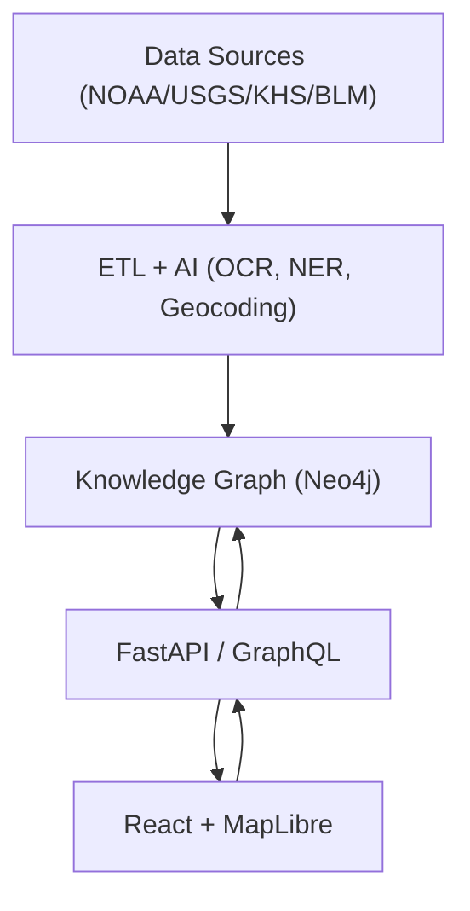

<div align="center">

# 🏗️ **Kansas Frontier Matrix — System Architecture**
`src/ARCHITECTURE.md`

**Purpose:** Provide an end-to-end, reproducible blueprint of the Kansas Frontier Matrix (KFM) — covering data ingress, ETL/AI enrichment, knowledge graph modeling, APIs, frontend experience, governance automation, and telemetry — aligned with MCP v6.3 and FAIR+CARE.

[](../docs/README.md)
[](../LICENSE)
[](../docs/standards/faircare.md)
[]()

</div>

---

## 📘 Overview

KFM is a **containerized, standards-first** platform that interlinks **historical, cultural, and environmental** sources for Kansas into a **semantic knowledge graph** and **time-aware map UI**.  
It uses **open specifications** — STAC 1.0.0, DCAT 3.0, CIDOC CRM, OWL-Time, GeoSPARQL, SPDX — and enforces **FAIR+CARE** through governance automation and telemetry.

**Primary Layers**
1. **Data Sources** → external/archival feeds and uploads  
2. **ETL & AI** → OCR/NLP, geocoding, standardization, model inference  
3. **Knowledge Graph** → Neo4j with cultural/temporal ontologies  
4. **API Layer** → FastAPI/GraphQL for search, focus, and exports  
5. **Web Frontend** → React + MapLibre timeline/map and Focus Mode  
6. **Governance & Telemetry** → CI/CD, ledgers, reports, and dashboards

---

## 🗂️ Directory Layout

```
src/
├── ai/
│   ├── focus/                 # Focus Mode orchestration (semantic context, summaries)
│   ├── models/                # NLP/ML models (NER, summarization, embeddings)
│   ├── explainability/        # SHAP/LIME insights, drift/bias checks
│   └── training/              # Reproducible training configs & scripts
├── api/
│   ├── routes/                # REST/GraphQL endpoints (events, focus, search)
│   ├── services/              # Graph, STAC/DCAT, storage services
│   ├── models/                # Pydantic/Graph schemas
│   └── auth/                  # Admin endpoints, roles, rate-limits
├── graph/
│   ├── schema/                # CIDOC CRM + OWL-Time + GeoSPARQL mapping
│   ├── ingest/                # Entity upserts, relationship builders
│   ├── queries/               # Reusable Cypher templates (focus, lineage, proximity)
│   └── utils/                 # UUIDs, schema guards, spatial helpers
├── pipelines/
│   ├── etl/                   # Ingest/transform/load (NOAA/USGS/KHS/BLM/etc.)
│   ├── ai/                    # OCR/NLP/geocode, model inference stages
│   ├── validation/            # FAIR+CARE, STAC/DCAT, schema checks
│   └── utils/                 # Common I/O, COG/GeoJSON ops, checksums
└── telemetry/
    ├── logs/                  # Experiment & system logs
    └── metrics/               # Runtime, throughput, compliance, drift
```

---

## 🧩 Layered Architecture

### 1) Data Sources (External & Archival)

| Source | Examples | Format/Access |
|--------|----------|---------------|
| **NOAA** | Storm Events, climate normals | CSV, JSON API, NetCDF |
| **USGS** | Hydrography, DEM/LiDAR, topo | GeoTIFF/COG, Shapefile, services |
| **KHS Archives** | Newspapers, letters, maps (OCR) | PDF/TIFF → text via OCR |
| **BLM GLO** | Land patents / PLSS | CSV, images, PDFs |
| **DASC Geoportal** | State/County GIS | Feature/Map services, exports |

**Manifests:** `data/sources/*.json` (license, provenance, bbox, temporal) following **DCAT 3.0** & **STAC 1.0.0** fields.

---

### 2) ETL & AI Pipelines

**Goals:** normalize heterogenous inputs; elevate to **graph-ready** entities (People, Places, Events, Documents, Datasets).

| Stage | Function | Outputs |
|------|----------|---------|
| Extract | Bulk/API/stream pulls, checksum | Raw files + SHA-256 |
| Transform | OCR, NER, geocoding, normalization | GeoJSON, COG, tabular |
| Load | Neo4j upserts, STAC/DCAT generation | Nodes/edges + STAC items |

**Key Modules**
- `pipelines/ai/` → OCR (scans), NER (People/Places/Orgs), summarization, embeddings  
- `pipelines/validation/` → FAIR+CARE, data contracts, STAC/DCAT checks  
- `ai/explainability/` → model introspection (SHAP/LIME), **drift** metrics to telemetry

---

### 3) Knowledge Graph (Neo4j, Ontology-Aligned)

| Concept | Mapping | Notes |
|--------|---------|------|
| **Entity Types** | `Person`, `Place`, `Event`, `Document`, `Dataset` | UUIDs, versioned |
| **Relations** | `OCCURRED_AT`, `MENTIONS`, `PARTICIPATED_IN`, `LOCATED_IN` | Provenance links |
| **Ontologies** | **CIDOC CRM**, **OWL-Time**, **GeoSPARQL**, **PROV-O** | Temporal & spatial reasoning |
| **STAC/DCAT Bridge** | STAC Items ↔ DCAT Datasets | Interop & catalog exports |

---

### 4) API & Integration Layer (FastAPI/GraphQL)

**Contracted Endpoints (examples)**

| Route | Purpose | Response |
|------|---------|----------|
| `GET /api/events?start=1850&end=1900&bbox=` | time/space query | GeoJSON + linked refs |
| `GET /api/focus/{entity_id}` | Focus Mode subgraph | JSON subgraph + summary |
| `GET /api/search?q=` | full-text/semantic search | ranked results |
| `GET /api/map/layers` | available layers | STAC/DCAT listings |

**Schemas:** `api/models/` (Pydantic) and `schemas/api/v1/*.json`.  
**Policies:** Rate-limits, auth for admin routes, pagination, ETags.

---

### 5) Web Frontend (React + MapLibre + D3)

| Component | Role |
|-----------|------|
| `MapView` | Base map, layers, hover/selection, a11y controls |
| `TimelineView` | Time slider, density plots, focus ranges |
| `FocusPanel` | AI summaries, related people/places/events/docs |
| `LayerControls` | STAC/DCAT toggles, opacity, styles |
| Admin | Data QA, flags, review queues |

**A11y:** WCAG 2.1 AA: keyboard nav, high contrast, alt/ARIA, reduced motion, captions.

---

## 🗺️ Core Data Flow



---

## 🧠 Focus Mode (AI) — Semantic Context

**Flow:** Select entity → Subgraph query → Summarize & rank → Update map/timeline/panel.

| Element | Implementation |
|---------|----------------|
| Endpoint | `GET /api/focus/{entity}` |
| Model | `src/ai/models/focus_transformer_v1` (summaries, link suggestions) |
| Explainability | `src/ai/explainability/` (feature attribution; drift) |
| State | React `FocusProvider` syncs Timeline/Map/Panel |

---

## 🧾 STAC ↔ DCAT Metadata Bridge

| Direction | What | Why |
|-----------|------|-----|
| STAC → DCAT | STAC Items → DCAT Datasets | Catalog interop & discovery |
| DCAT → STAC | DCAT → STAC assets | Spatial-temporal alignment |

**Validation:** `pipelines/validation/` + `.github/workflows/stac-validate.yml`  
**Publish:** `data/stac/` JSON; cross-refs in graph & UI.

---

## 🧱 Data Contracts & Schemas

All dataset manifests align with `docs/standards/data-contracts.md`:

| Field | Req | Purpose |
|------|-----|---------|
| `id`, `title`, `description` | ✅ | Identify & describe |
| `type`, `format` | ✅ | Vector/Raster/Tabular/Text |
| `license`, `provenance` | ✅ | FAIR compliance |
| `spatial`, `temporal` | ✅ | bbox, ISO dates |
| `checksum` | ✅ | Integrity (SHA-256) |
| `care.*` | ⚙️ | CARE notes / status |

---

## ⚙️ Infrastructure & Security

| Area | Tooling | Notes |
|------|--------|------|
| Containers | Docker/Compose | Minimal, non-root images |
| Secrets | GitHub Encrypted Secrets | Rotated; no plaintext in repo |
| Scans | CodeQL, Trivy | Fail on CRITICAL |
| SBOM | SPDX via release job | `releases/**/sbom.spdx.json` |
| AuthN/Z | API auth for admin ops | Role-scoped endpoints |

---

## 🧾 CI/CD — Workflow → Artifact Mapping

| Workflow | What It Validates / Builds | Primary Artifacts |
|----------|-----------------------------|-------------------|
| `stac-validate.yml` | STAC Items/Collections | `reports/self-validation/stac/_summary.json` |
| `faircare-validate.yml` | FAIR+CARE + data contracts | `reports/fair/faircare_summary.json` |
| `docs-lint.yml` | Markdown/YAML/JSON structure | `reports/self-validation/docs/lint_summary.json` |
| `build-and-deploy.yml` | Frontend build/deploy | `docs/reports/telemetry/build_metrics.json` |
| `telemetry-export.yml` | Metrics aggregation | `releases/v9.7.0/focus-telemetry.json` |

---

## 🧮 Telemetry & Governance

**Telemetry:** `releases/v9.7.0/focus-telemetry.json` (build times, success rates, FAIR+CARE scores, drift metrics).  
**Ledgers:** `docs/reports/audit/` (governance, workflows, experiments, AI models, releases).

**FAIR+CARE Checkpoints**
- **Findable:** STAC/DCAT indices + UUIDs  
- **Accessible:** Open endpoints + licenses  
- **Interoperable:** JSON-LD, ontologies  
- **Reusable:** Provenance, checksums, versioning  
- **CARE:** Council review for Indigenous/cultural data

---

## 🧩 Roadmap

1. **3D temporal** (Cesium/WebGL)  
2. **GraphQL federation** across multi-graphs  
3. **Predictive modeling** for env-history scenarios  
4. **Federated KFM nodes** (institutional mirrors)  
5. **Public STAC API** for interactive catalog search

---

## 🕰️ Version History

| Version | Date | Author | Summary |
|----------|------|---------|----------|
| v9.7.0 | 2025-11-05 | A. Barta | Rebuilt architecture: data contracts, STAC↔DCAT bridge, workflow→artifact map, telemetry governance. |
| v9.5.0 | 2025-10-20 | A. Barta | Integrated metadata bridge and explainability telemetry. |
| v9.3.2 | 2025-08-10 | KFM Core Team | Added ETL validation and AI governance logging. |
| v9.0.0 | 2025-06-01 | KFM Core Team | Initial architecture document. |

---

<div align="center">

**© 2025 Kansas Frontier Matrix — MIT / CC-BY 4.0**  
Maintained under **Master Coder Protocol v6.3** · FAIR+CARE Certified · Diamond⁹ Ω / Crown∞Ω Ultimate Certified  
[Back to Documentation Index](../docs/README.md) · [Governance Charter](../docs/standards/governance/ROOT-GOVERNANCE.md)

</div>
